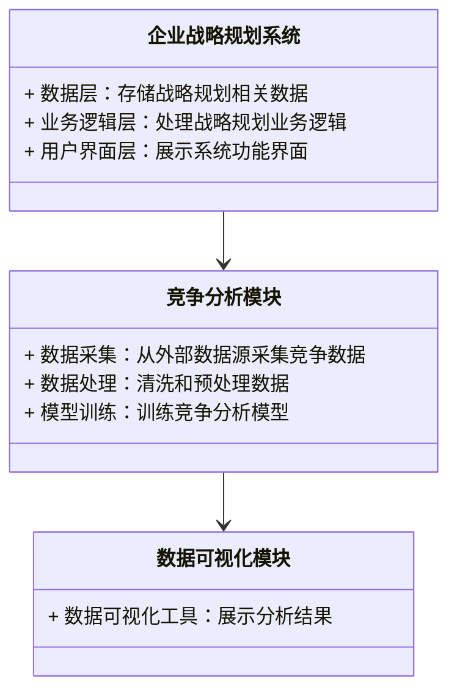
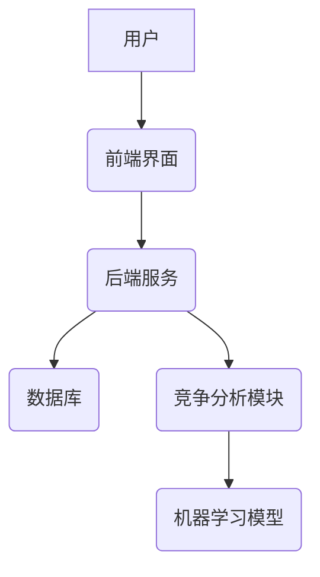
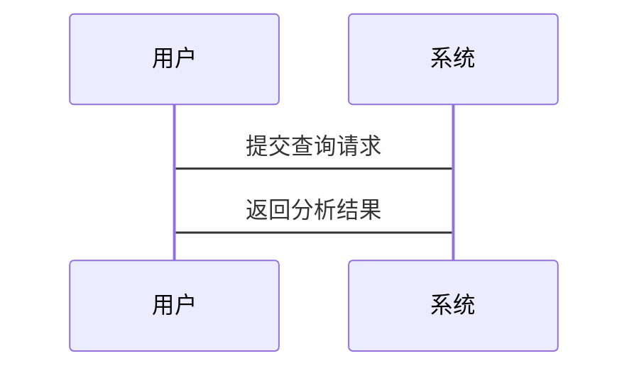

                 


# AI辅助企业战略规划与竞争分析的方法论

---

## 关键词

- 人工智能
- 企业战略
- 竞争分析
- 数据驱动
- 方法论

---

## 摘要

本文深入探讨了如何利用人工智能技术辅助企业进行战略规划与竞争分析。通过结合数据驱动的方法和先进的AI技术，企业可以更高效地制定战略、分析竞争对手和预测市场趋势。文章从AI的基本概念、企业战略规划的核心要素、竞争分析的AI工具与平台、数据驱动的战略规划方法、AI辅助竞争分析的框架与流程、系统架构设计、项目实战等多个维度展开，详细讲解了AI在企业战略规划与竞争分析中的具体应用和方法论。文章还通过实际案例和代码示例，展示了如何将AI技术落地到企业的实际业务中，为企业的数字化转型提供了有价值的参考。

---

## 第一部分: AI辅助企业战略规划与竞争分析的基础

### 第1章: AI与企业战略规划概述

#### 1.1 AI的基本概念与特点

##### 1.1.1 人工智能的定义与分类

人工智能（Artificial Intelligence，AI）是指计算机系统执行人类智能任务的能力，如视觉识别、语音识别、决策判断等。AI可以分为弱人工智能（ Narrow AI）和强人工智能（General AI）。弱人工智能专注于特定任务，如语音助手、推荐系统；强人工智能则具备人类的通用智能，能够像人类一样理解和解决各种问题。

##### 1.1.2 AI在企业中的应用现状

目前，AI已经在多个企业领域得到广泛应用，包括客户服务、市场营销、供应链管理、财务分析等。例如，企业利用AI进行客户画像分析、销售预测、风险评估等，显著提升了业务效率和决策准确性。

##### 1.1.3 企业战略规划的定义与流程

企业战略规划是指企业在一定时期内，为实现长期目标而制定的总体计划。其流程通常包括目标设定、内外部环境分析、战略制定、执行与监控等阶段。

---

#### 1.2 企业战略规划的核心要素

##### 1.2.1 企业目标设定

企业目标是战略规划的核心，包括短期目标和长期目标。例如，短期目标可能是提高销售额，长期目标可能是成为行业领导者。

##### 1.2.2 战略分析方法

常用的战略分析方法包括SWOT分析（优势、劣势、机会、威胁）、PEST分析（政治、经济、社会、技术环境）等。

##### 1.2.3 战略执行与监控

战略执行包括资源分配、任务分解和进度监控。监控通常通过KPI（关键绩效指标）来衡量战略执行的效果。

---

#### 1.3 AI辅助企业战略规划的必要性

##### 1.3.1 传统战略规划的局限性

传统战略规划依赖于人工分析，耗时且容易受主观因素影响，且难以处理大量非结构化数据。

##### 1.3.2 AI在战略规划中的优势

AI能够快速处理大量数据，发现潜在模式和趋势，提供数据支持的决策，显著提高战略规划的科学性和效率。

##### 1.3.3 企业数字化转型的趋势

随着数字化转型的推进，企业需要更高效、智能的工具来应对复杂多变的市场环境，AI成为不可或缺的技术支持。

---

### 第2章: AI在竞争分析中的应用

#### 2.1 竞争分析的基本方法

##### 2.1.1 竞争对手分析

竞争对手分析包括市场份额分析、产品分析、定价策略分析等，帮助企业了解竞争对手的优势和劣势。

##### 2.1.2 市场趋势分析

通过分析市场数据，预测市场未来的发展趋势，帮助企业提前制定应对策略。

##### 2.1.3 行业标杆分析

将企业与行业标杆进行对比，找出自身的优劣势，制定改进策略。

---

#### 2.2 AI在竞争分析中的优势

##### 2.2.1 数据处理能力

AI能够快速处理海量数据，提取关键信息，帮助企业在竞争分析中占据优势。

##### 2.2.2 智能预测能力

通过机器学习模型，AI可以预测市场趋势和竞争对手的动向，为企业提供前瞻性建议。

##### 2.2.3 自动化分析能力

AI可以自动化执行数据收集、分析和报告生成，显著降低人工成本。

---

#### 2.3 竞争分析的AI工具与平台

##### 2.3.1 常见AI工具介绍

- **Google Analytics**：用于网站流量分析。
- **SEMrush**：用于SEO和竞争对手分析。
- **Tableau**：用于数据可视化和分析。

##### 2.3.2 竞争分析平台的选择

选择平台时需要考虑数据来源、功能需求、使用成本等因素。

##### 2.3.3 工具的优缺点对比

- **优点**：高效、准确。
- **缺点**：需要一定的技术门槛，且数据质量依赖于输入。

---

## 第二部分: AI辅助企业战略规划与竞争分析的方法论

### 第3章: 数据驱动的战略规划方法

#### 3.1 数据收集与处理

##### 3.1.1 数据来源与分类

数据来源包括内部数据（如销售数据）和外部数据（如市场报告）。数据分类通常基于数据类型（结构化和非结构化）和数据用途。

##### 3.1.2 数据清洗与预处理

数据清洗包括去除重复数据、处理缺失值、标准化数据等。预处理步骤包括数据格式转换和特征提取。

##### 3.1.3 数据存储与管理

常用的数据存储方式包括关系型数据库（如MySQL）和非关系型数据库（如MongoDB）。数据管理需要考虑数据安全和访问权限。

---

#### 3.2 数据分析与洞察提取

##### 3.2.1 数据可视化方法

使用工具如Tableau或Power BI进行数据可视化，帮助识别数据中的趋势和模式。

##### 3.2.2 数据挖掘技术

常用的数据挖掘技术包括聚类分析、分类分析和关联规则挖掘。例如，聚类分析可以将客户分为不同的群体。

##### 3.2.3 数据驱动的决策支持

通过分析数据，为企业制定决策提供支持，例如优化资源配置、制定市场进入策略。

---

#### 3.3 数据驱动的战略制定

##### 3.3.1 数据驱动的目标设定

基于数据分析结果，设定可量化的战略目标，例如在未来两年内将市场份额提高10%。

##### 3.3.2 数据驱动的战略执行

通过实时数据分析，动态调整战略执行策略，确保目标的实现。

##### 3.3.3 数据驱动的监控与调整

利用数据监控工具，实时跟踪战略执行情况，并根据数据反馈进行必要的调整。

---

### 第4章: AI辅助竞争分析的框架与流程

#### 4.1 AI辅助竞争分析的框架

##### 4.1.1 数据收集与清洗

收集竞争对手的产品信息、市场份额数据等，并进行清洗和预处理。

##### 4.1.2 数据分析与建模

使用机器学习模型（如回归分析、分类模型）进行数据分析，预测市场趋势和竞争对手行为。

##### 4.1.3 结果可视化与报告生成

将分析结果可视化，并生成竞争分析报告，为企业制定应对策略提供依据。

---

#### 4.2 AI辅助竞争分析的流程

##### 4.2.1 确定分析目标

明确分析的目的，例如分析竞争对手的市场策略。

##### 4.2.2 数据收集与处理

收集相关数据，并进行清洗和预处理。

##### 4.2.3 模型构建与训练

选择合适的机器学习模型，进行训练和优化。

##### 4.2.4 结果分析与应用

根据分析结果，制定竞争策略，并实时监控策略执行效果。

---

## 第三部分: 系统架构与技术实现

### 第5章: 系统架构设计

#### 5.1 系统功能设计

##### 5.1.1 领域模型设计

使用Mermaid绘制领域模型类图，展示系统中的主要实体和它们之间的关系。



##### 5.1.2 系统架构设计

使用Mermaid绘制系统架构图，展示系统的整体架构。



##### 5.1.3 系统接口设计

系统接口设计需要考虑模块之间的通信方式，例如RESTful API。

##### 5.1.4 系统交互设计

使用Mermaid绘制系统交互序列图，展示用户与系统之间的交互过程。



---

### 第6章: 项目实战

#### 6.1 项目背景与目标

项目目标是开发一个基于AI的企业战略规划与竞争分析系统，帮助企业高效制定战略和分析竞争对手。

#### 6.2 环境安装与配置

- 安装Python和相关库（如Pandas、Scikit-learn、TensorFlow）
- 安装数据可视化工具（如Tableau）

#### 6.3 核心代码实现

##### 6.3.1 数据处理代码

```python
import pandas as pd

# 加载数据
data = pd.read_csv('market_data.csv')

# 数据清洗
data.dropna(inplace=True)
data['date'] = pd.to_datetime(data['date'])
```

##### 6.3.2 模型训练代码

```python
from sklearn.model

