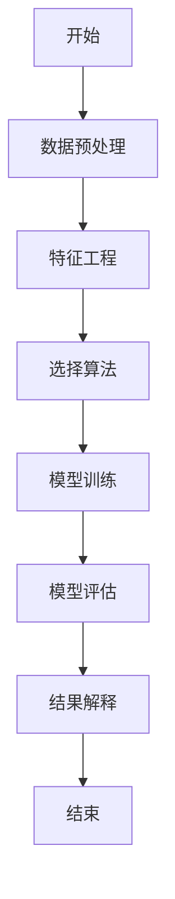
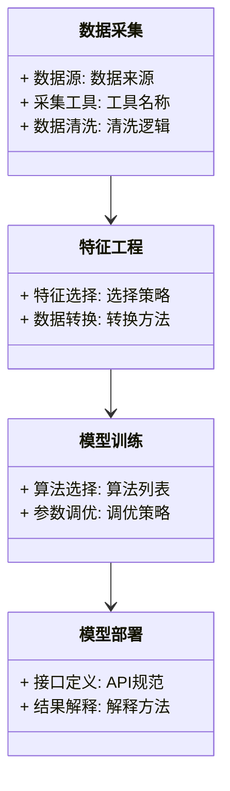
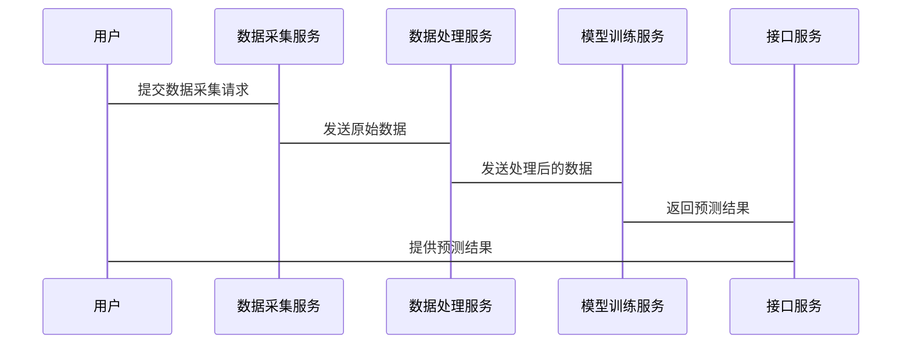

                 


# AI辅助企业战略规划：市场趋势分析与预测

## 关键词：AI技术，企业战略规划，市场趋势分析，机器学习，数据驱动决策，预测模型

## 摘要：  
随着人工智能技术的快速发展，企业战略规划的制定过程正在经历一场深刻的变革。传统的市场趋势分析与预测方法依赖于人工经验与数据直觉，而AI技术的引入为企业提供了更高效、更精准的工具。本文将从AI辅助企业战略规划的背景出发，详细探讨市场趋势分析的核心概念与算法原理，结合实际案例，展示如何通过AI技术提升企业战略规划的科学性和可操作性。

---

# 第一部分: AI辅助企业战略规划基础

## 第1章: AI辅助企业战略规划概述

### 1.1 企业战略规划的定义与重要性

#### 1.1.1 企业战略规划的定义
企业战略规划是指企业在一定时期内，为了实现长期发展目标而制定的总体行动方案。它通常包括市场定位、资源配置、发展目标等多个方面，是企业管理和决策的核心内容。

#### 1.1.2 战略规划在企业中的作用
战略规划不仅是企业发展的指南针，也是资源配置的依据。通过科学的战略规划，企业可以更好地应对市场变化，优化内部管理，提升竞争力。

#### 1.1.3 数字化时代的战略规划新趋势
在数字化时代，企业战略规划越来越依赖于数据驱动的方法。通过AI技术，企业可以实时分析市场动态，快速调整战略方向，从而在竞争中占据优势。

### 1.2 市场趋势分析与预测的重要性

#### 1.2.1 市场趋势分析的基本概念
市场趋势分析是指通过对市场数据的收集、整理和分析，预测未来市场发展的方向和趋势。它是企业制定战略规划的重要依据。

#### 1.2.2 市场趋势预测的挑战与价值
市场趋势预测的挑战主要来自于数据的复杂性和不确定性。然而，通过AI技术，企业可以显著提高预测的准确性和效率，从而为企业决策提供更有力的支持。

#### 1.2.3 AI在市场趋势分析中的应用前景
AI技术的应用前景广阔，尤其是在数据处理、模型构建和结果解释方面，为企业提供了强大的工具支持。

### 1.3 AI技术在企业战略规划中的作用

#### 1.3.1 AI技术的核心优势
AI技术的核心优势在于其强大的数据处理能力和学习能力，能够帮助企业从海量数据中提取有价值的信息，从而优化决策过程。

#### 1.3.2 AI辅助战略规划的典型场景
AI辅助战略规划的典型场景包括市场预测、竞争对手分析、风险评估等，帮助企业更好地应对市场变化。

#### 1.3.3 企业采用AI辅助规划的驱动力
企业采用AI辅助规划的驱动力主要包括提升效率、降低风险、增强竞争力等。

### 1.4 本章小结
本章从企业战略规划的定义和重要性出发，探讨了AI技术在市场趋势分析中的作用和应用前景，为后续内容奠定了基础。

---

## 第2章: AI辅助市场趋势分析的核心概念

### 2.1 数据驱动的市场趋势分析

#### 2.1.1 数据在市场分析中的作用
数据是市场趋势分析的基础。通过分析销售数据、用户行为数据等，企业可以更好地了解市场需求和趋势。

#### 2.1.2 数据的收集与处理方法
数据的收集与处理方法包括数据清洗、数据转换和数据整合等步骤，确保数据的质量和一致性。

#### 2.1.3 数据的质量与价值评估
数据质量直接影响分析结果。企业需要建立有效的数据质量评估体系，确保数据的准确性和可靠性。

### 2.2 机器学习在市场趋势预测中的应用

#### 2.2.1 机器学习的基本原理
机器学习通过训练数据模型，使模型能够从数据中学习并做出预测。其核心在于算法的学习能力。

#### 2.2.2 常见的市场趋势预测算法
常用的市场趋势预测算法包括线性回归、随机森林、LSTM等，每种算法都有其适用场景和优势。

#### 2.2.3 算法选择与优化策略
算法选择需要根据具体问题和数据特征进行，优化策略包括参数调优、模型评估等。

### 2.3 AI辅助市场趋势分析的流程与框架

#### 2.3.1 数据预处理与特征工程
数据预处理包括数据清洗、特征提取等步骤，特征工程则是为了提高模型的性能。

#### 2.3.2 模型训练与评估
模型训练需要选择合适的算法，并通过交叉验证等方法评估模型的性能。

#### 2.3.3 结果解释与决策支持
模型预测结果需要进行解释，以便企业能够根据结果调整战略规划。

### 2.4 本章小结
本章详细探讨了AI辅助市场趋势分析的核心概念和流程框架，为后续算法和系统设计提供了理论基础。

---

## 第3章: AI辅助市场趋势分析的算法原理

### 3.1 线性回归模型

#### 3.1.1 线性回归的基本原理
线性回归是一种简单而常用的回归分析方法，适用于线性关系的预测。

#### 3.1.2 线性回归的数学模型
线性回归的数学模型可以表示为：
$$ y = \beta_0 + \beta_1x + \epsilon $$
其中，$\beta_0$是截距，$\beta_1$是回归系数，$\epsilon$是误差项。

#### 3.1.3 算法流程图（Mermaid）



### 3.2 时间序列分析

#### 3.2.1 时间序列分析的基本概念
时间序列分析是研究随时间变化的数据序列，常用于预测未来趋势。

#### 3.2.2 ARIMA模型的原理与公式
ARIMA模型是一种常用的时间序列预测模型，其公式为：
$$ ARIMA(p, d, q) $$
其中，p为自回归阶数，d为差分阶数，q为移动平均阶数。

#### 3.2.3 时间序列分析的Python实现

```python
import numpy as np
import pandas as pd
from statsmodels.tsa.arima_model import ARIMA
import matplotlib.pyplot as plt

# 示例数据
data = np.random.normal(loc=0, scale=1, size=100)
plt.plot(data)
plt.show()

# 模型训练
model = ARIMA(data, order=(1, 1, 1))
model_fit = model.fit()
print(model_fit.summary())
```

### 3.3 集成学习方法

#### 3.3.1 集成学习的基本原理
集成学习通过组合多个弱模型的结果，提高整体预测性能。

#### 3.3.2 随机森林与梯度提升树的对比
随机森林和梯度提升树是两种常用的集成学习方法，各有优缺点。

#### 3.3.3 集成学习的优缺点分析
集成学习的优势在于提高模型的稳定性和准确性，但可能会增加计算复杂度。

### 3.4 神经网络与深度学习

#### 3.4.1 神经网络的基本结构
神经网络由输入层、隐藏层和输出层组成，通过权重和激活函数进行信息处理。

#### 3.4.2 LSTM在时间序列预测中的应用
LSTM（长短期记忆网络）适用于处理时间序列数据中的长距离依赖关系。

#### 3.4.3 神经网络的数学模型
神经网络的数学模型包括输入-输出关系、激活函数和损失函数等。

### 3.5 本章小结
本章详细介绍了几种常用的市场趋势预测算法，包括线性回归、时间序列分析、集成学习和神经网络，并通过代码示例展示了它们的应用。

---

## 第4章: 系统分析与架构设计

### 4.1 问题场景介绍
以消费电子产品市场为例，介绍如何通过AI技术进行市场趋势预测。

### 4.2 系统功能设计

#### 4.2.1 领域模型（Mermaid类图）



### 4.3 系统架构设计（Mermaid架构图）

```mermaid
docker-compose
    service 数据采集 {
        image 数据采集服务
        ports: "8000:8000"
    }
    service 数据处理 {
        image 数据处理服务
        ports: "8001:8001"
    }
    service 模型训练 {
        image 模型训练服务
        ports: "8002:8002"
    }
    service 接口服务 {
        image 接口服务
        ports: "8003:8003"
    }
```

### 4.4 系统交互设计（Mermaid序列图）



### 4.5 本章小结
本章通过系统分析与架构设计，展示了如何构建一个完整的AI辅助市场趋势分析系统。

---

## 第5章: 项目实战

### 5.1 环境安装与配置

#### 5.1.1 安装Python环境
使用Anaconda安装Python环境，并配置必要的库，如numpy、pandas、scikit-learn等。

#### 5.1.2 安装机器学习框架
安装TensorFlow或Keras等深度学习框架，以及statsmodels等时间序列分析工具。

### 5.2 核心实现代码

#### 5.2.1 数据预处理代码

```python
import pandas as pd
import numpy as np

# 示例数据加载
data = pd.read_csv('market_trend.csv')

# 数据清洗
data.dropna(inplace=True)
data = data[~data.isin([np.nan, np.inf, -np.inf]).any(axis=1)]
```

#### 5.2.2 特征工程代码

```python
from sklearn.preprocessing import StandardScaler

# 标准化处理
scaler = StandardScaler()
data_scaled = scaler.fit_transform(data[['feature1', 'feature2']])
```

#### 5.2.3 模型训练代码

```python
from sklearn.ensemble import RandomForestRegressor
from sklearn.metrics import mean_squared_error

# 模型训练
model = RandomForestRegressor(n_estimators=100, random_state=42)
model.fit(X_train, y_train)

# 模型评估
y_pred = model.predict(X_test)
print(mean_squared_error(y_test, y_pred))
```

### 5.3 实际案例分析与解读
以消费电子产品市场为例，展示如何通过AI技术进行市场趋势预测，并对结果进行分析和解读。

### 5.4 项目小结
本章通过实际案例，展示了AI技术在市场趋势分析中的应用，并提供了完整的代码实现。

---

## 第6章: 最佳实践与注意事项

### 6.1 最佳实践

#### 6.1.1 数据质量的重要性
数据质量直接影响模型的性能，企业需要建立数据质量评估体系。

#### 6.1.2 模型选择与优化
模型选择需要结合具体问题和数据特征，优化策略包括参数调优和模型评估。

#### 6.1.3 结果解释与决策支持
模型预测结果需要进行解释，以便企业能够根据结果调整战略规划。

### 6.2 注意事项

#### 6.2.1 数据隐私与安全
企业在处理数据时，需要关注数据隐私和安全问题。

#### 6.2.2 模型的可解释性
模型的可解释性是企业决策的重要因素，需要选择合适的模型和解释方法。

#### 6.2.3 持续优化与迭代
市场环境不断变化，企业需要持续优化模型和调整战略规划。

### 6.3 本章小结
本章总结了AI辅助企业战略规划的最佳实践和注意事项，为企业实际应用提供了指导。

---

## 第7章: 结论与展望

### 7.1 本文总结
本文系统地探讨了AI技术在企业战略规划中的应用，特别是在市场趋势分析与预测方面。

### 7.2 未来展望
随着AI技术的不断发展，其在企业战略规划中的应用前景将更加广阔，特别是在复杂场景下的预测和决策支持。

### 7.3 本章小结
本文总结了AI辅助企业战略规划的核心内容，并展望了未来的发展方向。

---

## 作者：AI天才研究院/AI Genius Institute & 禅与计算机程序设计艺术 /Zen And The Art of Computer Programming

---

通过以上结构和内容，文章详细探讨了AI辅助企业战略规划的各个方面，从理论到实践，从算法到系统设计，为企业提供了全面的指导和参考。

