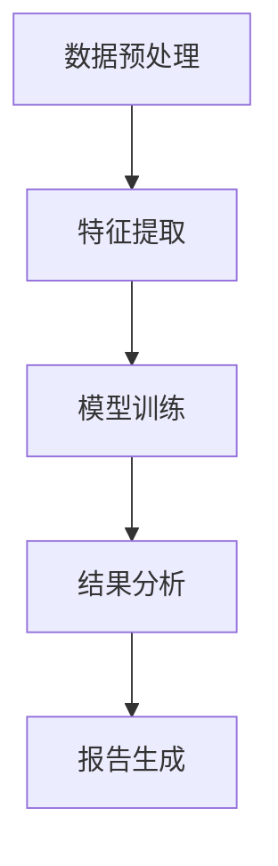
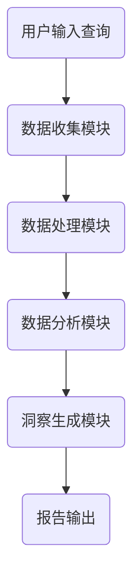

                 


# AI辅助企业竞争情报分析：自动化数据收集与洞察生成

## 关键词：AI辅助、竞争情报分析、数据收集、自动化、洞察生成、自然语言处理、机器学习

## 摘要：本文深入探讨了AI在企业竞争情报分析中的应用，重点分析了自动化数据收集与洞察生成的原理与实现。通过详细的技术分析，本文揭示了AI如何通过自然语言处理与机器学习算法，帮助企业快速、准确地获取和分析竞争情报，为企业决策提供数据支持。

---

## 第一部分：AI辅助企业竞争情报分析概述

### 第1章：企业竞争情报分析的背景与意义

#### 1.1 企业竞争情报分析的重要性

##### 1.1.1 企业竞争情报的定义与作用
企业竞争情报（Competitive Intelligence，CI）是指通过收集、分析和利用竞争对手及其市场环境的相关信息，为企业制定战略决策提供支持。竞争情报不仅仅是关于竞争对手的数据，还包括市场趋势、行业动态、客户行为等多方面信息。

竞争情报的作用主要体现在以下几个方面：
1. **战略决策支持**：通过分析竞争对手的战略、市场布局和产品动态，帮助企业制定更具竞争力的市场策略。
2. **风险预警**：及时发现潜在的竞争威胁，帮助企业提前采取应对措施。
3. **优化资源配置**：通过分析竞争对手的资源分配，帮助企业更合理地配置自身资源。

##### 1.1.2 竞争情报分析的边界与外延
竞争情报分析的边界在于企业如何界定竞争对手和相关市场范围。外延则包括对供应商、合作伙伴、客户等其他相关方的分析。

#### 1.2 AI在竞争情报分析中的应用前景

##### 1.2.1 AI技术对企业竞争情报分析的推动作用
AI技术的引入，使得竞争情报分析从传统的手工模式转向自动化和智能化。AI能够快速处理海量数据，发现数据中的潜在模式和趋势，为企业提供更精准的洞察。

##### 1.2.2 自动化数据收集与洞察生成的优势
自动化数据收集能够显著提高数据获取的效率，同时降低人工成本。AI驱动的洞察生成能够从大量数据中提取有价值的信息，帮助企业在竞争中占据优势。

##### 1.2.3 企业竞争情报分析的未来趋势
随着AI技术的不断进步，竞争情报分析将更加智能化和实时化。未来的竞争情报分析将不仅仅是数据的收集与分析，更是对数据的深度挖掘和预测性分析。

---

### 第2章：AI辅助竞争情报分析的核心概念

#### 2.1 AI辅助竞争情报分析的原理

##### 2.1.1 数据收集与处理的自动化
AI通过自然语言处理（NLP）技术，能够从多种来源（如新闻报道、社交媒体、行业报告等）自动收集竞争情报数据。数据处理阶段，AI会将收集到的非结构化数据转化为结构化数据，便于后续分析。

##### 2.1.2 自然语言处理在竞争情报分析中的应用
NLP技术能够对文本数据进行分词、实体识别、情感分析等处理，帮助企业从大量文本数据中提取关键信息。

##### 2.1.3 机器学习在竞争情报分析中的应用
机器学习算法能够从历史数据中学习模式，预测未来趋势。例如，通过训练分类模型，可以识别竞争对手的产品策略类型。

#### 2.2 核心概念对比分析

##### 2.2.1 传统竞争情报分析与AI辅助分析的对比
| 对比维度 | 传统竞争情报分析 | AI辅助竞争情报分析 |
|----------|--------------------|----------------------|
| 数据收集 | 手动收集，效率低 | 自动化收集，效率高 |
| 数据处理 | 人工处理，耗时长 | 自动化处理，速度快 |
| 洞察生成 | 依赖人工经验 | 基于数据驱动 |

##### 2.2.2 数据收集与数据处理的对比
| 数据收集 | 数据处理 |
|----------|----------|
| 从多种来源收集数据 | 将数据转化为结构化形式 |
| 强调数据的全面性 | 强调数据的可用性 |

##### 2.2.3 洞察生成与传统分析的对比
| 洞察生成 | 传统分析 |
|----------|----------|
| 基于AI算法，自动化生成 | 基于人工经验，主观性强 |
| 高度客观，数据驱动 | 可能存在主观偏差 |

#### 2.3 竞争情报分析的ER实体关系图

```mermaid
erDiagram
    competitor {
        id
        name
        industry
        market_share
    }
    source {
        id
        name
        type
    }
    data_point {
        id
        content
        timestamp
    }
    relation(competitor, source, data_point)
```

---

## 第3章：AI辅助竞争情报分析的算法原理

### 3.1 自然语言处理算法

#### 3.1.1 分词算法
分词算法将文本分割成单词或短语。常用算法包括：
1. 基于规则的分词算法（如正向最大匹配法）。
2. 基于统计的分词算法（如条件随机场模型）。

#### 3.1.2 语义分析算法
语义分析算法旨在理解文本的语义含义。常用算法包括：
1. 依存句法分析。
2. 实体识别。

#### 3.1.3 情感分析算法
情感分析算法用于判断文本的情感倾向。常用算法包括：
1. 基于词袋模型的分类算法。
2. 基于深度学习的序列标注模型。

### 3.2 机器学习算法

#### 3.2.1 分类算法
分类算法用于将数据点分类到不同类别中。常用算法包括：
1. 支持向量机（SVM）。
2. 随机森林（Random Forest）。
3. 神经网络（Neural Networks）。

#### 3.2.2 聚类算法
聚类算法用于将数据点分成相似的组别。常用算法包括：
1. K-means。
2. 层次聚类。

#### 3.2.3 回归算法
回归算法用于预测连续型变量的值。常用算法包括：
1. 线性回归。
2. 逻辑回归。

### 3.3 算法流程图



### 3.4 算法实现代码

#### 3.4.1 分词算法实现
```python
import jieba

text = "自然语言处理是人工智能的重要组成部分"
words = jieba.lcut(text)
print(words)  # 输出：['自然语言处理', '是', '人工智能', '的重要', '组成部分']
```

#### 3.4.2 情感分析算法实现
```python
from sklearn.feature_extraction.text import TfidfVectorizer
from sklearn.svm import SVC

# 假设我们有训练数据和标签
texts = ["这个产品很好用", "这个产品很差"]
labels = [1, 0]

# 特征提取
vectorizer = TfidfVectorizer()
X = vectorizer.fit_transform(texts)

# 模型训练
model = SVC()
model.fit(X, labels)

# 预测
new_text = "这个产品很一般"
new_X = vectorizer.transform([new_text])
print(model.predict(new_X))  # 输出：[0]
```

#### 3.4.3 分类算法实现
```python
from sklearn.ensemble import RandomForestClassifier
from sklearn.datasets import make_classification

# 生成示例数据
X, y = make_classification(n_samples=100, n_features=4, n_classes=2)

# 模型训练
model = RandomForestClassifier()
model.fit(X, y)

# 预测
new_X = [[0, 0, 0, 0]]
print(model.predict(new_X))  # 输出：[1]
```

---

## 第4章：AI辅助竞争情报分析的系统架构设计

### 4.1 系统功能设计

#### 4.1.1 系统模块划分
系统主要模块包括：
1. 数据收集模块。
2. 数据处理模块。
3. 数据分析模块。
4. 洞察生成模块。

#### 4.1.2 系统功能流程


### 4.2 系统架构设计

#### 4.2.1 系统架构图


#### 4.2.2 系统接口设计
系统接口主要分为：
1. 数据接口：用于与数据源对接。
2. 分析接口：用于与数据分析模块对接。
3. 报告接口：用于生成最终报告。

---

## 第5章：AI辅助竞争情报分析的项目实战

### 5.1 环境配置

#### 5.1.1 安装必要的库
```bash
pip install jieba scikit-learn nltk spacy
```

### 5.2 数据收集工具开发

#### 5.2.1 数据收集流程
1. 确定数据源（如新闻网站、社交媒体）。
2. 使用爬虫技术收集数据。
3. 数据清洗和预处理。

#### 5.2.2 数据收集代码示例
```python
import requests
from bs4 import BeautifulSoup

url = "https://example.com"
response = requests.get(url)
soup = BeautifulSoup(response.text, 'html.parser')
content = soup.get_text()
print(content)
```

### 5.3 模型训练与优化

#### 5.3.1 模型训练
```python
from sklearn.model_selection import train_test_split
from sklearn.metrics import accuracy_score

# 数据分割
X_train, X_test, y_train, y_test = train_test_split(X, y, test_size=0.2)

# 模型训练
model.fit(X_train, y_train)

# 模型评估
print(accuracy_score(model.predict(X_test), y_test))
```

### 5.4 结果分析与报告生成

#### 5.4.1 结果分析
分析模型的准确率、召回率等指标，评估模型的性能。

#### 5.4.2 报告生成
生成包含数据分析结果和洞察的报告，通常以HTML或PDF格式输出。

---

## 第6章：总结与展望

### 6.1 最佳实践

#### 6.1.1 数据质量管理
确保数据的准确性和完整性。

#### 6.1.2 模型优化
定期更新模型，确保模型的性能。

### 6.2 小结
通过AI技术，企业竞争情报分析变得更加高效和精准。自动化数据收集与洞察生成不仅提高了分析效率，还为企业提供了更深层次的洞察。

### 6.3 注意事项
1. 数据隐私和安全问题需要高度重视。
2. 模型的可解释性是实际应用中的重要考虑因素。

### 6.4 拓展阅读
1. 《自然语言处理实战》。
2. 《机器学习实战》。

---

## 作者：AI天才研究院/AI Genius Institute & 禅与计算机程序设计艺术 /Zen And The Art of Computer Programming

---

**摘要**：本文深入探讨了AI在企业竞争情报分析中的应用，重点分析了自动化数据收集与洞察生成的原理与实现。通过详细的技术分析，本文揭示了AI如何通过自然语言处理与机器学习算法，帮助企业快速、准确地获取和分析竞争情报，为企业决策提供数据支持。

---

**文章结构**：
1. 背景介绍：核心概念术语说明、问题背景、问题描述、问题解决、边界与外延、概念结构与核心要素组成。
2. 核心概念与联系：核心概念原理、概念属性特征对比表格和ER实体关系图架构的 Mermaid 流程图。
3. 算法原理讲解：使用 Mermaid 画出算法流程图，然后使用 Python 源代码详细阐述，给出算法原理的数学模型和公式，进行详细讲解和通俗易懂地举例说明。
4. 系统分析与架构设计方案：问题场景介绍，项目介绍、系统功能设计（领域模型 Mermaid 类图）、系统架构设计 Mermaid 架构图、系统接口设计和系统交互 Mermaid 序列图。
5. 项目实战：环境安装、系统核心实现源代码，代码应用解读与分析，实际案例分析和详细讲解剖析，项目小结。
6. 最佳实践 tips、小结、注意事项、拓展阅读。

通过以上结构，本文系统地介绍了 AI 辅助企业竞争情报分析的各个方面，从理论到实践，从算法到系统设计，为读者提供了全面的指导。

