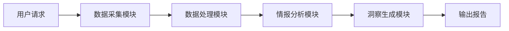

                 


# 《AI辅助企业竞争情报分析：自动化数据收集与洞察生成系统》

## 关键词：AI，竞争情报分析，数据收集，自然语言处理，机器学习，系统架构

## 摘要：  
本文详细探讨了利用人工智能技术辅助企业竞争情报分析的方法，重点介绍了自动化数据收集与洞察生成系统的构建与实现。通过自然语言处理和机器学习技术，企业能够高效地从海量数据中提取有价值的信息，从而做出更明智的商业决策。文章从背景、核心概念、系统设计到项目实战，全面解析了AI在竞争情报分析中的应用，并提供了详细的代码示例和系统架构设计。

---

# 第4章: 基于AI的洞察生成系统

## 4.1 自然语言处理模型的应用

### 4.1.1 文本挖掘与信息提取
文本挖掘是通过计算机技术从文本数据中提取有价值信息的过程。在竞争情报分析中，文本挖掘可以帮助企业从新闻、社交媒体、行业报告等非结构化数据中提取竞争对手的动态、市场趋势等信息。

#### 算法原理与代码实现
文本挖掘通常包括以下步骤：
1. 数据预处理：去除停用词、分词、去标点符号。
2. 信息提取：使用NLP模型（如TF-IDF、Word2Vec）提取关键词和主题。
3. 可视化：将提取的信息以图表形式展示。

#### 代码示例
```python
from sklearn.feature_extraction.text import TfidfVectorizer

# 示例文本数据
texts = ["Apple announced new products in 2023.", 
         "Google is planning to release updates next month."]

# 创建TF-IDF模型
vectorizer = TfidfVectorizer()
tfidf_matrix = vectorizer.fit_transform(texts)

# 提取关键词
keywords = vectorizer.get_feature_names_out()
print("提取的关键词:", keywords)
```

### 4.1.2 情感分析与市场情绪检测
情感分析可以帮助企业了解市场对竞争对手或产品的看法。通过分析社交媒体上的评论，企业可以实时监测市场情绪变化。

#### 算法原理与代码实现
常用的情感分析算法包括基于规则的方法（如VADER）和深度学习方法（如LSTM、BERT）。以下是一个使用VADER进行情感分析的示例：

```python
from vaderSentiment.vader_sentiment import SentimentIntensityAnalyzer

analyzer = SentimentIntensityAnalyzer()
text = "The new product launch was a huge success!"
scores = analyzer.polarity_scores(text)
print(scores)
```

### 4.1.3 实体识别与关系抽取
实体识别（NER）可以识别文本中的公司名称、产品名称、人名等实体，而关系抽取则可以识别这些实体之间的关系。

#### 算法原理与代码实现
使用spaCy进行实体识别和关系抽取：

```python
import spacy

# 加载预训练模型
nlp = spacy.load("en_core_web_sm")

# 示例文本
text = "Apple released a new iPhone in 2023, which competes with Google's Pixel phones."

# 文本处理
doc = nlp(text)

# 实体识别
entities = [(ent.text, ent.label_) for ent in doc.ents]
print("提取的实体:", entities)

# 关系抽取
for token in doc:
    if token.dep_ == "ROOT":
        print(f"根节点: {token.text}")
```

## 4.2 竞争情报分析的自动化流程

### 4.2.1 数据预处理与特征提取
数据预处理包括去除停用词、分词、去标点符号等。特征提取可以使用TF-IDF、Word2Vec等方法。

#### 算法原理与代码实现
使用Word2Vec进行特征提取：

```python
from gensim.models import Word2Vec

# 示例文本数据
texts = ["Apple announced new products in 2023.", 
         "Google is planning to release updates next month."]

# 训练Word2Vec模型
model = Word2Vec(sentences=texts, vector_size=100, window=5, min_count=1, workers=4)

# 查看词向量
print(model.wv['Apple'])
```

### 4.2.2 基于机器学习的分类与预测
机器学习可以用于分类竞争对手的产品、市场趋势预测等任务。

#### 算法原理与代码实现
使用SVM进行分类：

```python
from sklearn.svm import SVC
from sklearn.feature_extraction.text import TfidfVectorizer

# 示例文本数据
texts = ["Apple announced new products in 2023.", 
         "Google is planning to release updates next month.",
         "Samsung is focusing on foldable phones in 2024.",
         "Sony is entering the AI camera market this year."]

# 创建TF-IDF特征
vectorizer = TfidfVectorizer()
X = vectorizer.fit_transform(texts)

# 创建分类标签
y = [0, 0, 1, 1]  # 0代表科技公司，1代表电子产品公司

# 训练SVM分类器
model = SVC()
model.fit(X, y)

# 预测
test_text = "LG is launching a new smartphone in 2023."
test_X = vectorizer.transform([test_text])
print("预测结果:", model.predict(test_X))
```

## 4.3 系统架构与数据流

### 4.3.1 系统功能模块
1. 数据采集模块：从互联网、行业报告、社交媒体等来源收集数据。
2. 数据处理模块：清洗、结构化、预处理数据。
3. 情报分析模块：使用NLP和机器学习技术提取情报。
4. 洞察生成模块：生成竞争分析报告、市场趋势预测等。

### 4.3.2 系统交互流程
使用Mermaid图展示系统交互流程：



## 4.4 本章小结

---

# 第5章: 系统架构与实现

## 5.1 系统设计原则
1. **模块化设计**：将系统划分为数据采集、处理、分析、生成等模块。
2. **可扩展性**：支持多种数据源和多种分析方法。
3. **高效性**：确保数据处理和分析的速度。

## 5.2 系统功能设计
### 5.2.1 数据采集模块
- 从互联网、API、数据库等来源采集数据。
- 支持多种数据格式（如文本、JSON、CSV）。

### 5.2.2 数据处理模块
- 数据清洗：去除噪声数据、处理缺失值。
- 数据结构化：将非结构化数据转换为结构化数据。
- 数据增强：通过数据扩展技术提高数据质量。

### 5.2.3 情报分析模块
- 文本挖掘：提取关键词、主题。
- 情感分析：分析市场情绪。
- 实体识别与关系抽取：识别公司、产品、技术等实体及其关系。

### 5.2.4 洞察生成模块
- 生成竞争分析报告。
- 提供市场趋势预测。
- 自动生成可视化图表。

## 5.3 系统架构设计
使用Mermaid图展示系统架构：


## 5.4 系统接口设计
- 数据采集模块接口：`GET_DATA(source, start_time, end_time)`
- 数据处理模块接口：`PREPROCESS(data, method)`
- 情报分析模块接口：`ANALYZE(data, model)`
- 洞察生成模块接口：`GENERATE_REPORT(results, format)`

## 5.5 系统交互设计
使用Mermaid图展示系统交互流程：


## 5.6 本章小结

---

# 第6章: 项目实战与案例分析

## 6.1 项目背景
假设我们为一家科技公司提供竞争情报分析服务，目标是监测主要竞争对手的市场动态、产品发布信息和用户反馈。

## 6.2 项目环境配置
- 操作系统：Linux
- Python版本：3.8+
- 依赖库：scikit-learn, gensim, spacy, vaderSentiment

## 6.3 核心实现

### 6.3.1 数据采集模块
使用BeautifulSoup和requests库从新闻网站采集数据。

```python
import requests
from bs4 import BeautifulSoup

def scrape_news(url):
    response = requests.get(url)
    soup = BeautifulSoup(response.text, 'html.parser')
    articles = soup.find_all('article')
    texts = [article.text for article in articles]
    return texts

news_texts = scrape_news('https://example.com/news')
print("采集到的文章:", news_texts)
```

### 6.3.2 数据处理模块
对采集到的文本进行清洗和预处理。

```python
from sklearn.feature_extraction.text import TfidfVectorizer

def preprocess_texts(texts):
    vectorizer = TfidfVectorizer()
    X = vectorizer.fit_transform(texts)
    return X, vectorizer

tfidf_matrix, vectorizer = preprocess_texts(news_texts)
print("预处理后的特征矩阵:", tfidf_matrix)
```

### 6.3.3 情报分析模块
使用NLP技术进行文本挖掘和情感分析。

```python
from vaderSentiment.vader_sentiment import SentimentIntensityAnalyzer

def analyze_sentiment(texts):
    analyzer = SentimentIntensityAnalyzer()
    scores = []
    for text in texts:
        score = analyzer.polarity_scores(text)
        scores.append(score)
    return scores

sentiment_scores = analyze_sentiment(news_texts)
print("情感分析结果:", sentiment_scores)
```

### 6.3.4 洞察生成模块
生成竞争分析报告。

```python
def generate_report(scores, company):
    positive_count = sum([s['compound'] > 0 for s in scores])
    negative_count = sum([s['compound'] < 0 for s in scores])
    neutral_count = len(scores) - positive_count - negative_count

    print(f"{company}的市场情绪分析结果:")
    print(f"正面情绪: {positive_count}")
    print(f"负面情绪: {negative_count}")
    print(f"中性情绪: {neutral_count}")
```

generate_report(sentiment_scores, "主要竞争对手")

## 6.4 项目小结
通过上述步骤，我们可以实现一个简单的竞争情报分析系统。实际应用中，还需要考虑数据的实时性、系统的可扩展性和数据的安全性。

---

# 第7章: 总结与展望

## 7.1 核心总结
本文详细介绍了AI辅助企业竞争情报分析的系统构建与实现。通过自然语言处理和机器学习技术，企业可以高效地从海量数据中提取有价值的信息，从而做出更明智的商业决策。

## 7.2 未来展望
随着AI技术的不断发展，竞争情报分析系统将更加智能化和自动化。未来的系统可能会具备以下特点：
1. **实时监控**：实时跟踪竞争对手的动态。
2. **自适应学习**：根据市场变化自动调整分析模型。
3. **多模态分析**：结合文本、图像、视频等多种数据源进行分析。

## 7.3 注意事项
- 数据隐私和安全问题需要高度重视。
- 系统的准确性和稳定性需要通过大量测试来保证。
- 在实际应用中，需要根据具体需求调整系统架构和算法。

## 7.4 拓展阅读
1. 《自然语言处理入门》
2. 《机器学习实战》
3. 《竞争情报分析方法论》

---

# 作者：AI天才研究院/AI Genius Institute & 禅与计算机程序设计艺术 /Zen And The Art of Computer Programming

