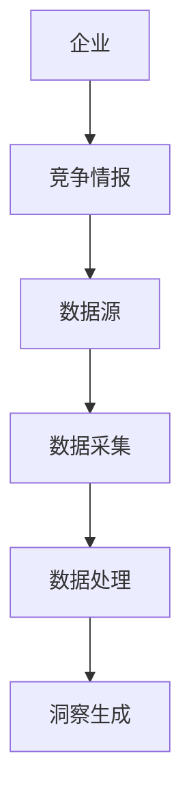
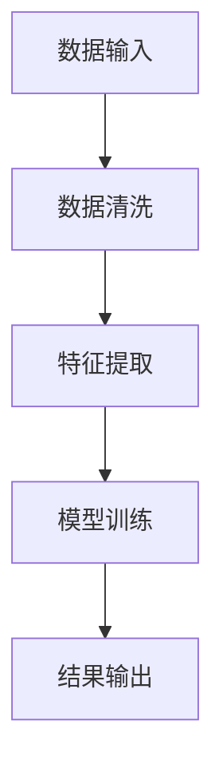
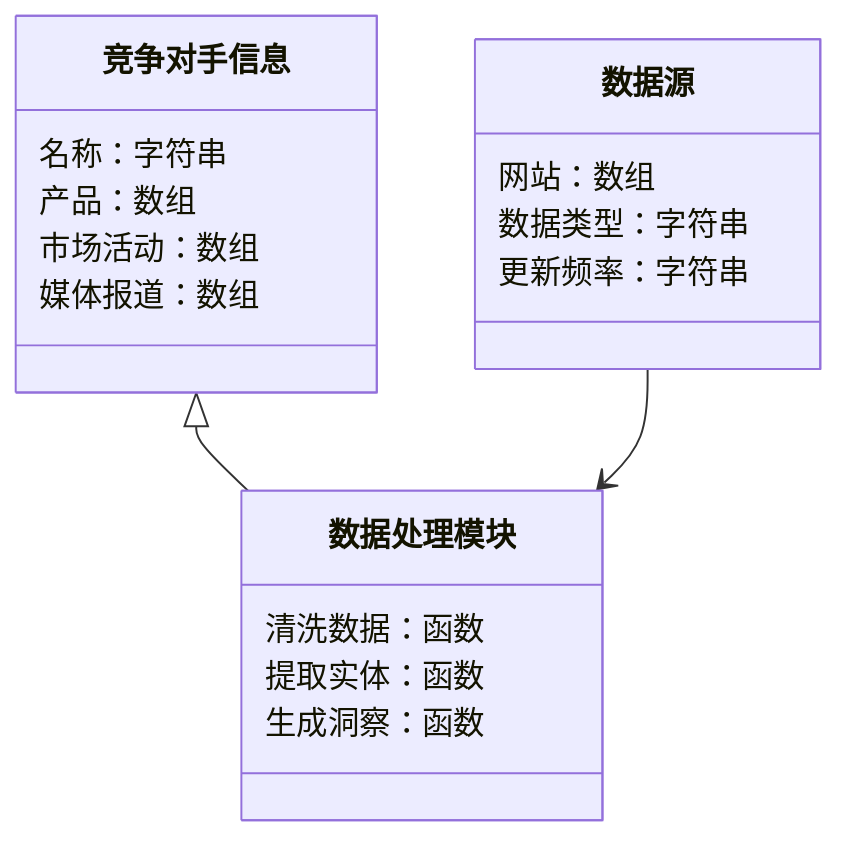
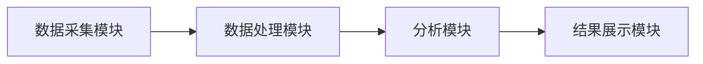
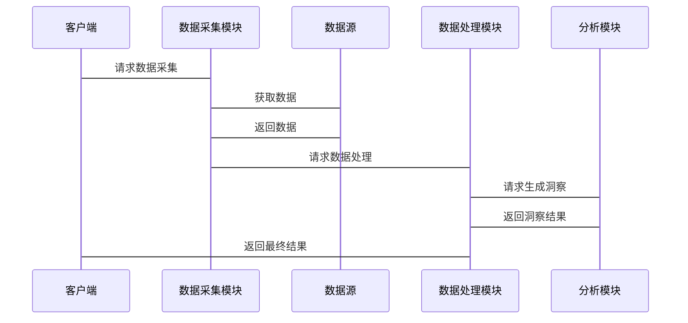

                 


# AI辅助企业竞争情报分析：自动化数据采集与洞察生成

> 关键词：AI辅助、竞争情报分析、数据采集、洞察生成、企业情报

> 摘要：本文深入探讨AI技术在企业竞争情报分析中的应用，特别是自动化数据采集和洞察生成的实现方法。通过系统化的分析和实践案例，介绍如何利用AI技术提升企业竞争情报分析的效率和准确性。

---

# 第1章: 企业竞争情报分析的背景与挑战

## 1.1 企业竞争情报分析的定义与意义
### 1.1.1 什么是企业竞争情报
企业竞争情报（Competitive Intelligence, CI）是指通过合法和系统化的方法，收集、分析和利用竞争对手及其市场的相关信息，以帮助企业制定战略决策的过程。竞争情报不仅仅是竞争对手的信息收集，还包括市场趋势、客户需求、技术发展等多方面的信息。

### 1.1.2 竞争情报分析的重要性
竞争情报分析对于企业制定战略决策至关重要。它可以帮助企业了解竞争对手的动向、市场趋势、客户偏好以及潜在机会和威胁。通过竞争情报分析，企业可以制定更有针对性的市场策略，优化资源配置，提升竞争力。

### 1.1.3 竞争情报分析的边界与外延
竞争情报分析的边界包括合法性和道德性，即竞争情报必须在法律允许的范围内进行，不能通过非法手段获取信息。外延则包括更广泛的应用场景，如全球市场分析、跨行业竞争分析等。

---

## 1.2 传统竞争情报分析的局限性
### 1.2.1 人工采集数据的低效性
传统竞争情报分析依赖人工数据采集，效率低下，且容易受到主观因素的影响。例如，人工收集竞争对手的产品信息、市场报告等，耗时且容易遗漏重要信息。

### 1.2.2 数据处理的复杂性
传统方法在处理大量异构数据时面临挑战。例如，如何整合来自不同来源（如新闻、社交媒体、行业报告等）的数据，并进行有效的清洗和预处理。

### 1.2.3 分析结果的主观性
由于依赖人工分析，结果容易受到分析师的经验和主观判断的影响，缺乏客观性和可重复性。

---

## 1.3 AI技术在竞争情报分析中的应用前景
### 1.3.1 AI技术的核心优势
AI技术可以通过自动化数据采集、自然语言处理（NLP）和机器学习等方法，显著提高竞争情报分析的效率和准确性。AI能够处理海量数据，发现隐藏的模式和趋势，提供客观的洞察。

### 1.3.2 AI辅助竞争情报分析的潜力
AI技术可以应用于竞争情报分析的各个环节，包括数据采集、清洗、分析和可视化。通过AI，企业可以实时监控竞争对手的动态，预测市场趋势，制定更具前瞻性的战略。

### 1.3.3 企业采用AI辅助的必要性
随着市场竞争的加剧，企业需要更快、更准确地获取和分析情报。AI技术的引入可以帮助企业在竞争中占据优势，提高决策的科学性和及时性。

---

# 第2章: AI辅助竞争情报分析的核心概念与联系

## 2.1 核心概念原理
### 2.1.1 数据采集的自动化
AI可以通过爬虫技术、API调用等方法实现数据的自动化采集。例如，使用网络爬虫从竞争对手的官方网站、社交媒体平台和新闻网站中提取信息。

### 2.1.2 数据处理的智能化
AI技术可以自动清洗数据、去除噪声，并通过自然语言处理技术提取文本中的实体、关系和情感信息。例如，使用NLP技术从新闻文章中提取公司名称、产品名称和事件时间。

### 2.1.3 洞察生成的高效性
通过机器学习模型，AI可以自动分析数据，生成竞争情报的洞察。例如，利用聚类分析发现市场趋势，使用分类模型预测竞争对手的市场策略。

---

## 2.2 核心概念属性对比表

| 概念       | 数据来源       | 处理方式       | 分析目标       |
|------------|----------------|----------------|----------------|
| 传统方法   | 人工采集        | 手工处理        | 专家经验驱动    |
| AI辅助方法 | 自动化采集        | 智能处理        | 数据驱动洞察    |

---

## 2.3 ER实体关系图



---

# 第3章: AI辅助竞争情报分析的算法原理

## 3.1 文本挖掘算法

### 3.1.1 基于规则的文本挖掘
基于规则的文本挖掘通过预定义的规则提取特定信息。例如，使用正则表达式从新闻文章中提取日期和公司名称。

### 3.1.2 基于统计的文本挖掘
基于统计的文本挖掘利用频率统计和模式发现提取信息。例如，使用TF-IDF（Term Frequency-Inverse Document Frequency）提取关键词。

### 3.1.3 基于深度学习的文本挖掘
基于深度学习的文本挖掘使用神经网络模型（如BERT、GPT）进行语义理解，提取上下文信息。

---

## 3.2 机器学习模型

### 3.2.1 常见的机器学习算法
- **文本分类**：用于将文本分为不同类别（如正面、负面、中性）。
- **主题建模**：用于发现文本中的主题分布（如LDA模型）。
- **实体识别**：用于识别文本中的命名实体（如公司名称、产品名称）。

### 3.2.2 文本分类与主题建模
文本分类可以通过训练好的模型（如Naive Bayes、SVM）对文本进行分类。主题建模（如LDA）可以发现文本的主题分布。

### 3.2.3 实体识别与关系抽取
实体识别通过NLP技术识别文本中的实体，关系抽取则通过模式匹配或深度学习模型提取实体之间的关系。

---

## 3.3 算法流程图



---

## 3.4 算法实现代码

### 示例代码：基于TF-IDF和朴素贝叶斯的文本分类

```python
from sklearn.feature_extraction.text import TfidfVectorizer
from sklearn.naive_bayes import MultinomialNB

# 示例数据
texts = ["This is a sample text about AI.", "AI is revolutionizing the industry."]

# 创建TF-IDF向量化
vectorizer = TfidfVectorizer()
X = vectorizer.fit_transform(texts)

# 训练朴素贝叶斯分类器
model = MultinomialNB()
model.fit(X, [0, 1])

# 预测新文本
new_text = ["AI is changing the world."]
new_X = vectorizer.transform([new_text])
predicted = model.predict(new_X)
print(predicted)
```

---

## 3.5 数学公式

### TF-IDF计算公式
$$
\text{TF}(t, d) = \frac{\text{count}(t, d)}{\text{total words in } d}
$$

$$
\text{IDF}(t) = \log\left(\frac{\text{total documents}}{\text{documents containing } t}\right)
$$

### 词嵌入（Word Embedding）
$$
\text{Word Vector} = \text{word2vec}(w)
$$

---

# 第4章: 系统分析与架构设计方案

## 4.1 问题场景介绍
本章介绍一个典型的竞争情报分析场景：某企业希望实时监控竞争对手的市场动态，包括产品发布、市场活动和媒体报道。

## 4.2 系统功能设计
### 4.2.1 领域模型


### 4.2.2 系统架构设计


### 4.2.3 接口设计
- 数据采集模块提供API接口，接收数据源配置。
- 数据处理模块提供API接口，接收原始数据并返回清洗后的数据。
- 分析模块提供API接口，接收清洗后的数据并返回洞察结果。

### 4.2.4 交互流程


---

# 第5章: 项目实战

## 5.1 环境安装
安装必要的Python库，如BeautifulSoup、requests、scikit-learn、spacy等。

## 5.2 核心实现代码

### 数据采集模块
```python
import requests
from bs4 import BeautifulSoup

def fetch_data(url):
    response = requests.get(url)
    soup = BeautifulSoup(response.text, 'html.parser')
    return soup
```

### 数据处理模块
```python
from spacy.lang.zh import Chinese

def process_data(soup):
    text = soup.get_text()
    nlp = Chinese()
    doc = nlp(text)
    entities = [ent.text for ent in doc.ents]
    return entities
```

### 分析模块
```python
from sklearn.decomposition import LatentDirichletAllocation

def generate_insight(documents):
    vectorizer = TfidfVectorizer()
    X = vectorizer.fit_transform(documents)
    lda = LatentDirichletAllocation(n_components=5)
    lda.fit(X)
    return lda.components_
```

## 5.3 实际案例分析
以某行业为例，展示如何利用上述代码进行竞争情报分析，包括数据采集、预处理和分析的详细步骤。

## 5.4 项目小结
总结项目实施过程中的经验和教训，提出改进建议。

---

# 第6章: 最佳实践、小结与注意事项

## 6.1 最佳实践
- 数据采集前明确需求，避免采集无关数据。
- 数据处理时注意数据清洗和去重。
- 分析结果需结合业务背景，避免片面解读。

## 6.2 小结
本章总结了AI辅助竞争情报分析的核心概念、算法原理和系统设计，通过项目实战展示了技术的应用。

## 6.3 注意事项
- 遵守相关法律法规，避免非法数据采集。
- 数据分析需结合企业实际需求，避免过度复杂化。

## 6.4 拓展阅读
推荐相关书籍和论文，供读者进一步学习。

---

# 作者：AI天才研究院/AI Genius Institute & 禅与计算机程序设计艺术 /Zen And The Art of Computer Programming

---

希望这篇文章能为您提供清晰的思路和系统的知识，帮助您在AI辅助企业竞争情报分析的领域中取得成功！

