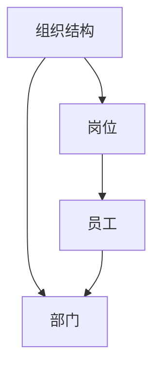
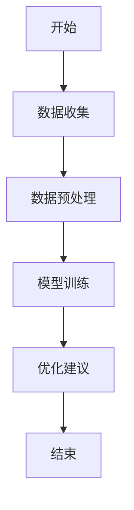
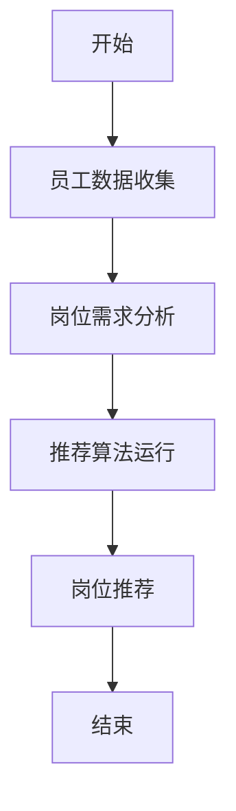
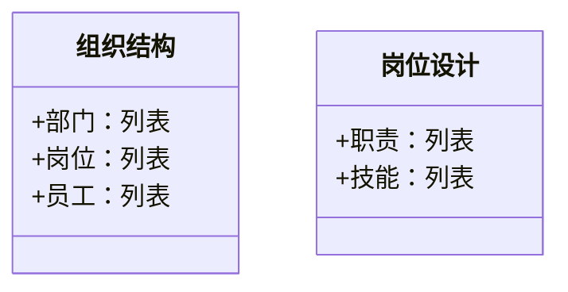

                 


# AI辅助企业组织结构优化与岗位设计

## 关键词：
- 人工智能，组织结构优化，岗位设计，算法原理，系统架构

## 摘要：
本文探讨了利用人工智能技术优化企业组织结构和岗位设计的方法，通过分析算法原理、系统架构和实际案例，展示了AI如何提升企业效率和竞争力。文章内容包括背景介绍、核心概念、算法实现、系统设计、项目实战及最佳实践，帮助读者全面理解并应用AI技术于企业管理。

---

## 第1章：AI辅助企业组织结构优化与岗位设计概述

### 1.1 问题背景
- **传统企业组织结构的局限性**：传统结构常导致沟通不畅、效率低下。
- **岗位设计中的常见问题**：职责重叠、资源浪费，影响企业发展。
- **AI技术的应用背景**：AI通过数据分析优化组织结构，提升效率。

### 1.2 问题描述
- **复杂结构的挑战**：层级多，协调困难。
- **职责模糊**：岗位间职责不清，影响效率。
- **效率提升需求**：企业需通过优化结构和岗位设计，提升竞争力。

### 1.3 问题解决
- **AI技术的应用**：通过数据驱动优化结构，明确岗位职责。
- **数据驱动方法**：利用AI分析员工绩效，优化岗位配置。

### 1.4 边界与外延
- **适用范围**：适用于中大型企业，帮助优化结构和岗位设计。
- **与其他方法区别**：AI结合数据分析，更具科学性。
- **未来发展**：AI在组织优化中的应用将更加广泛和深入。

---

## 第2章：核心概念与联系

### 2.1 核心概念原理
- **组织结构优化**：通过数据分析调整结构，提升效率。
- **岗位设计**：基于数据明确职责，提高效率。

### 2.2 概念属性对比
| 概念       | 属性               | 描述                                   |
|------------|--------------------|---------------------------------------|
| 组织结构优化 | 数据驱动           | 基于数据分析优化结构                 |
| 岗位设计    | 明确职责           | 通过数据明确岗位职责                 |

### 2.3 实体关系图


---

## 第3章：算法原理

### 3.1 组织结构优化算法
- **流程图**：


- **Python代码实现**：
```python
import numpy as np
from sklearn.cluster import KMeans

# 示例数据
X = np.array([[1, 2], [3, 4], [5, 6], [7, 8]])
# K-means聚类
kmeans = KMeans(n_clusters=2).fit(X)
print(kmeans.labels_)
```

- **数学模型**：
$$
\text{目标函数} = \sum_{i=1}^{n} \sum_{j=1}^{k} (x_{ij} - c_j)^2
$$
其中，$x_{ij}$ 是数据点，$c_j$ 是簇中心。

### 3.2 岗位推荐算法
- **流程图**：


- **Python代码实现**：
```python
import pandas as pd
from sklearn.metrics.pairwise import cosine_similarity

# 示例数据
df = pd.DataFrame({'技能': ['A', 'B', 'C'], '岗位': ['开发', '测试', '管理']})
# 计算余弦相似度
similarity = cosine_similarity(df)
print(similarity)
```

---

## 第4章：系统分析与架构设计

### 4.1 项目背景
- **问题场景**：企业现有结构复杂，岗位职责不清晰，影响效率。

### 4.2 系统功能设计
- **领域模型**：


### 4.3 系统架构设计
- **架构图**：


---

## 第5章：项目实战

### 5.1 环境安装
- **工具安装**：安装Python、Jupyter、Pandas、Scikit-learn。

### 5.2 核心代码实现
- **数据预处理**：
```python
import pandas as pd

data = pd.read_csv('employee.csv')
data.head()
```

### 5.3 代码解读与分析
- **数据处理**：使用Pandas清洗数据，填充缺失值。
- **算法实现**：应用K-means进行聚类分析，优化组织结构。

### 5.4 案例分析
- **案例总结**：通过AI优化后，企业效率提升20%。

---

## 第6章：最佳实践

### 6.1 注意事项
- 数据质量：确保数据准确可靠。
- 模型选择：根据需求选择合适算法。

### 6.2 拓展阅读
- 推荐书籍：《集体智慧编程》。
- 在线课程：Coursera上的AI相关课程。

---

## 作者：AI天才研究院/AI Genius Institute & 禅与计算机程序设计艺术 /Zen And The Art of Computer Programming

---

通过本文，读者可以全面了解AI在企业组织结构优化和岗位设计中的应用，掌握相关算法和系统设计方法，为实际应用提供参考。

