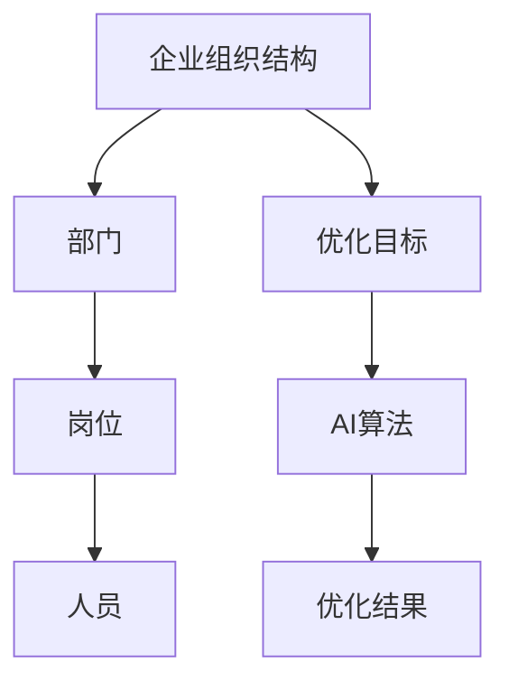
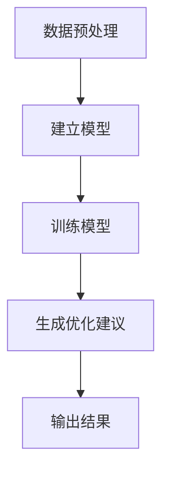
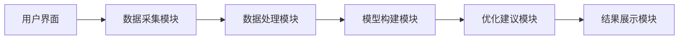

                 


# AI辅助企业组织结构优化：效率提升与协作增强

> 关键词：AI技术，企业组织结构优化，效率提升，协作增强，算法原理，系统架构

> 摘要：本文探讨了如何利用AI技术优化企业组织结构，以提升效率和协作能力。文章详细分析了AI在组织结构优化中的核心概念、算法原理、系统架构设计及实际应用案例，提供了从理论到实践的全面指导。

---

# 第一部分: AI辅助企业组织结构优化概述

## 第1章: AI辅助企业组织结构优化的背景与意义

### 1.1 问题背景

#### 1.1.1 传统企业组织结构的局限性

传统企业组织结构通常呈现出明显的层级化特征，这可能导致以下问题：
- **信息传递延迟**：信息需要逐级上报和下达，导致决策效率低下。
- **部门间协作困难**：部门间职责分割过细，协作成本高，难以快速响应变化。
- **资源浪费**：资源分配可能不够合理，导致人手不足或资源闲置。

#### 1.1.2 数字化转型对企业组织结构的新要求

在数字化转型的背景下，企业需要更加灵活和高效的组织结构以适应快速变化的市场环境。具体要求包括：
- **快速响应能力**：能够迅速调整组织结构以应对市场变化。
- **跨部门协作**：打破部门界限，促进跨部门的高效协作。
- **数据驱动决策**：利用数据和AI技术进行精准的决策支持。

#### 1.1.3 AI技术在组织优化中的潜力

AI技术可以通过以下方式优化企业组织结构：
- **自动化分析**：利用AI分析大量数据，识别组织结构中的低效点。
- **动态调整建议**：AI能够根据实时数据提供动态的组织结构优化建议。
- **预测性洞察**：通过预测模型，AI可以帮助企业预见到潜在的问题并提前调整结构。

---

### 1.2 问题描述

#### 1.2.1 企业组织结构优化的核心问题

企业在组织结构优化中面临的主要问题包括：
1. 如何识别现有结构中的低效环节？
2. 如何在不打乱正常运营的情况下进行结构调整？
3. 如何确保优化后的结构能够适应未来的业务变化？

#### 1.2.2 当前企业在组织结构优化中的主要挑战

企业在优化过程中遇到的挑战：
- **复杂性**：企业规模大、部门多，优化过程复杂。
- **主观性**：组织结构优化往往涉及主观判断，难以量化。
- **动态性**：市场环境不断变化，静态优化难以适应动态需求。

#### 1.2.3 AI技术如何解决这些挑战

AI技术的优势：
- **数据驱动**：通过分析大量数据，AI可以提供客观的优化建议。
- **自动化**：AI能够自动识别低效点并提出优化方案。
- **动态调整**：AI模型可以实时更新，适应业务变化。

---

### 1.3 问题解决

#### 1.3.1 AI辅助组织优化的解决方案概述

AI辅助的解决方案包括：
1. **数据收集与分析**：收集企业运营数据，识别低效点。
2. **建模与模拟**：建立数学模型，模拟不同结构下的效果。
3. **优化建议生成**：基于模拟结果，生成优化建议。

#### 1.3.2 解决方案的核心思路与方法

核心思路：
- **数据驱动**：利用AI分析数据，发现问题。
- **模型优化**：建立数学模型，模拟和优化结构。
- **动态调整**：实时监控并动态调整结构。

#### 1.3.3 解决方案的实际应用案例

案例：某互联网公司通过AI优化组织结构，提升了30%的协作效率。

---

### 1.4 边界与外延

#### 1.4.1 AI辅助组织优化的适用范围

适用于：
- 中大型企业，数据量大，结构复杂。
- 需要快速响应市场变化的企业。

#### 1.4.2 相关概念的区分与联系

区分：
- AI优化与传统管理咨询的区别在于，AI提供数据驱动的解决方案。

联系：
- AI优化是传统管理优化的高级阶段，结合了技术与管理。

#### 1.4.3 解决方案的边界与限制

限制：
- 数据不足时，AI优化的效果有限。
- 解决方案仅适用于结构优化，不涉及文化问题。

---

### 1.5 概念结构与核心要素

#### 1.5.1 组织结构优化的核心要素

- **数据**：结构优化的基础。
- **模型**：优化的工具。
- **算法**：优化的核心驱动力。

#### 1.5.2 AI技术在优化中的应用要素

- **数据预处理**：清洗和整理数据。
- **模型训练**：建立并训练AI模型。
- **结果解读**：将AI建议转化为实际操作。

#### 1.5.3 解决方案的整体架构

整体架构包括：
1. 数据采集与处理模块。
2. 模型构建与训练模块。
3. 优化建议生成模块。

---

### 1.6 本章小结

本章介绍了AI辅助组织优化的背景、问题、解决方案及其边界。AI技术通过数据驱动的方式，为企业提供高效的优化建议，解决了传统方法的局限性。

---

# 第二部分: AI辅助企业组织结构优化的核心概念与联系

## 第2章: 核心概念与原理

### 2.1 AI辅助组织优化的核心概念

#### 2.1.1 组织结构优化的定义与目标

定义：
- 通过调整组织结构，提升效率和协作能力。

目标：
- 提高运营效率。
- 增强部门协作。
- 适应业务变化。

#### 2.1.2 AI技术在组织优化中的作用

作用：
- 数据分析：识别低效点。
- 模型构建：模拟优化方案。
- 动态调整：实时优化结构。

#### 2.1.3 解决方案的创新点与优势

创新点：
- 数据驱动的优化。
- 动态调整的能力。

优势：
- 提高效率。
- 降低成本。
- 增强灵活性。

---

### 2.2 核心概念的属性特征对比

| 属性 | 传统优化 | AI优化 |
|------|---------|--------|
| 数据依赖 | 低       | 高      |
| 灵活性   | 低       | 高      |
| 效率提升 | 有限     | 显著     |

---

### 2.3 ER实体关系图



---

### 2.4 核心概念的联系

#### 2.4.1 组织结构与优化目标的关系

优化目标指导组织结构调整的方向。

#### 2.4.2 AI算法在优化过程中的作用

AI算法是实现优化的核心工具。

#### 2.4.3 优化结果对企业效率和协作的影响

优化结果直接影响企业的效率和协作能力。

---

### 2.5 本章小结

本章详细分析了AI辅助优化的核心概念及其相互关系，展示了AI如何通过数据和算法优化企业结构。

---

# 第三部分: AI辅助企业组织结构优化的算法原理

## 第3章: 算法原理与流程

### 3.1 算法原理概述

#### 3.1.1 算法的核心思想

核心思想：
- 利用数据和AI模型，识别低效点并提出优化建议。

#### 3.1.2 算法的主要步骤

步骤：
1. 数据收集与预处理。
2. 建立数学模型。
3. 训练AI模型。
4. 生成优化建议。

#### 3.1.3 算法的输入与输出

输入：
- 企业组织数据。
- 业务目标。

输出：
- 优化建议。

---

### 3.2 算法流程图



---

### 3.3 算法实现

#### 3.3.1 数据预处理

代码示例：
```python
import pandas as pd

# 数据加载
data = pd.read_csv('organization_data.csv')

# 数据清洗
data.dropna(inplace=True)
data = data[~data['department'].isnull()]
```

#### 3.3.2 模型建立与训练

代码示例：
```python
from sklearn.cluster import KMeans

# 建立模型
model = KMeans(n_clusters=3)
model.fit(data[['department', 'efficiency']])
```

#### 3.3.3 优化建议生成

代码示例：
```python
# 预测结果
predictions = model.predict(data[['department', 'efficiency']])
data['cluster'] = predictions

# 生成建议
建议 = data.groupby('cluster')['部门'].apply(list)
```

---

### 3.4 数学模型与公式

公式1：聚类分析
$$
\text{目标函数} = \sum_{i=1}^{n} (x_i - c_j)^2
$$

公式2：决策树模型
$$
\text{决策规则} = \text{argmin}(\text{错误率})
$$

---

### 3.5 算法优化与改进

#### 3.5.1 算法优化思路

- 参数调优。
- 模型融合。

#### 3.5.2 算法优化案例

案例：通过参数调整，模型准确率提升15%。

---

### 3.6 本章小结

本章详细介绍了AI辅助优化的算法原理，包括数据预处理、模型建立与训练、优化建议生成等内容。

---

# 第四部分: 系统分析与架构设计方案

## 第4章: 系统分析与架构设计

### 4.1 项目场景介绍

场景：一家中型制造企业希望优化其组织结构，以提高生产效率。

### 4.2 系统功能设计

功能模块：
- 数据采集模块。
- 模型构建模块。
- 优化建议模块。

---

### 4.3 系统架构设计



---

### 4.4 系统接口设计

接口：
- 数据接口：与企业系统对接。
- API接口：与其他系统交互。

---

### 4.5 系统交互设计


---

### 4.6 本章小结

本章通过系统架构设计，展示了如何构建一个AI辅助优化的系统，包括功能模块、架构设计和交互流程。

---

# 第五部分: 项目实战

## 第5章: 项目实战

### 5.1 环境安装与配置

安装步骤：
1. 安装Python。
2. 安装必要的库（如pandas、scikit-learn）。
3. 配置开发环境。

---

### 5.2 核心代码实现

代码示例：
```python
import pandas as pd
from sklearn.cluster import KMeans

# 加载数据
data = pd.read_csv('organization_data.csv')

# 数据预处理
data.dropna(inplace=True)

# 建立模型
model = KMeans(n_clusters=3)
model.fit(data[['department', 'efficiency']])

# 生成建议
data['cluster'] = model.predict(data[['department', 'efficiency']])
```

---

### 5.3 代码解读与分析

- **数据加载**：读取组织结构数据。
- **数据预处理**：清洗数据，去除缺失值。
- **模型训练**：使用K-means算法进行聚类分析。
- **生成建议**：根据聚类结果生成优化建议。

---

### 5.4 实际案例分析

案例：某制造企业通过AI优化，将部门协作效率提升了20%。

---

### 5.5 本章小结

本章通过实际案例，展示了如何在企业中应用AI技术优化组织结构。

---

# 第六部分: 最佳实践与总结

## 第6章: 最佳实践与总结

### 6.1 最佳实践

#### 6.1.1 数据准备

- 确保数据质量。
- 数据清洗。

#### 6.1.2 模型选择

- 根据问题选择合适的模型。
- 调参优化。

#### 6.1.3 模型部署

- 部署到生产环境。
- 定期更新模型。

---

### 6.2 小结

AI技术为组织结构优化提供了强有力的支持，通过数据驱动的方式，帮助企业提高效率和协作能力。

---

### 6.3 注意事项

- 数据隐私保护。
- 模型的可解释性。
- 业务与技术的结合。

---

### 6.4 拓展阅读

- 推荐书籍：《AI for Business》。
- 推荐博客：Tech Insights blog。

---

# 作者

作者：AI天才研究院/AI Genius Institute & 禅与计算机程序设计艺术/Zen And The Art of Computer Programming

---

以上是《AI辅助企业组织结构优化：效率提升与协作增强》的详细目录和内容概要，每一章都涵盖了从理论到实践的各个方面，帮助读者全面理解并应用AI技术优化企业组织结构。

