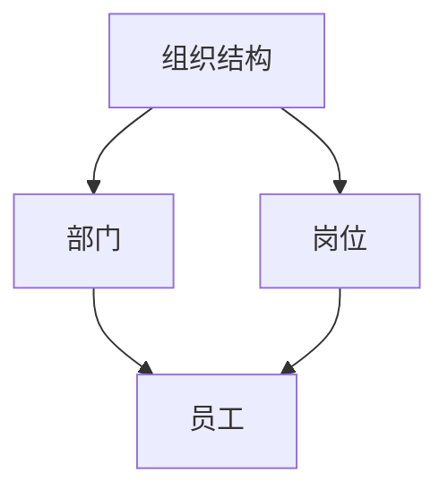
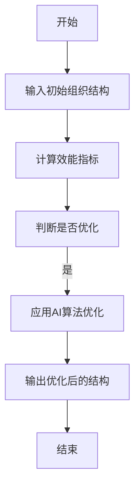
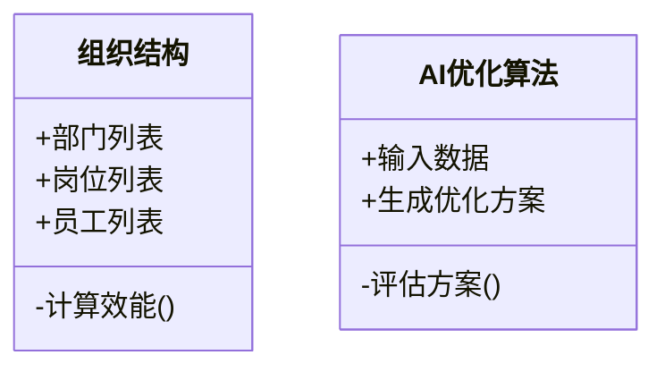
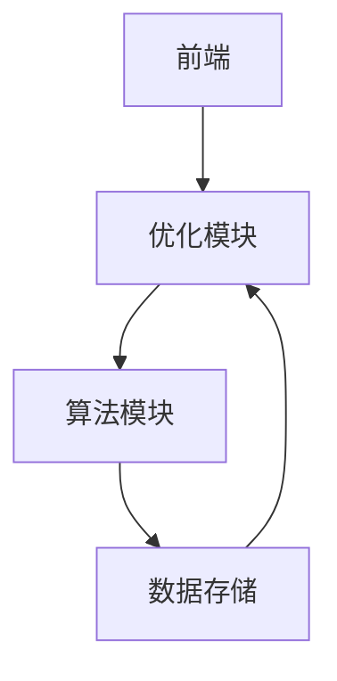
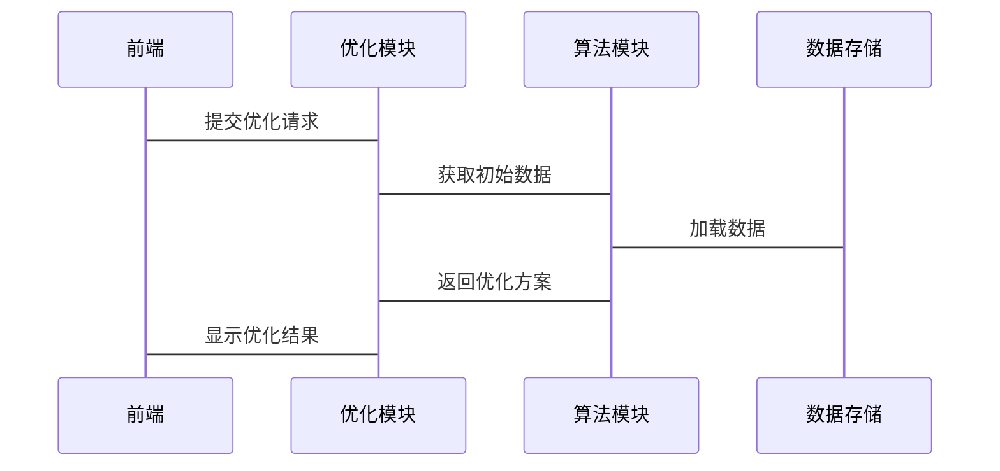

                 


# AI辅助企业组织结构优化：效能评估与动态调整

> 关键词：AI，企业组织结构优化，效能评估，动态调整，组织管理，人工智能优化

> 摘要：本文详细探讨了如何利用人工智能技术优化企业组织结构，从背景介绍、核心概念、算法原理到系统架构、项目实战，最后总结了优化方法与未来展望。文章结合实际案例分析，通过图解与代码示例，深入剖析了AI辅助组织结构优化的实现过程。

---

# 第1章: AI辅助企业组织结构优化的背景与问题背景

## 1.1 问题背景与挑战

### 1.1.1 传统企业组织结构的局限性
传统企业组织结构通常采用树状层级结构，存在以下问题：
- **信息孤岛**：部门间信息传递效率低，协同困难。
- **效率低下**：管理层级过多导致决策延迟。
- **灵活性不足**：面对市场变化时，调整成本高。

### 1.1.2 数字化转型对企业组织结构的新要求
数字化转型要求企业组织结构更加灵活高效：
- 快速响应市场需求。
- 提高内部协同效率。
- 优化资源分配。

### 1.1.3 AI技术在组织优化中的潜在价值
AI技术可以：
- 分析海量数据，识别优化点。
- 自动生成优化方案。
- 动态调整组织结构。

## 1.2 问题描述与目标

### 1.2.1 企业组织结构优化的核心目标
- 提高组织效率。
- 降低运营成本。
- 增强组织灵活性。

### 1.2.2 AI辅助优化的具体问题描述
- 如何构建AI优化模型。
- 如何评估优化方案的效能。
- 如何实现动态调整。

### 1.2.3 优化的边界与外延
- 边界：不涉及企业战略调整。
- 外延：涵盖组织架构、岗位设置、人员分配。

## 1.3 核心概念与关键要素

### 1.3.1 组织结构优化的核心要素
- 部门设置。
- 岗位职责。
- 人员分配。

### 1.3.2 AI技术在优化中的作用机制
- 数据分析。
- 模型构建。
- 方案生成。

### 1.3.3 效能评估的关键指标
- 效率提升。
- 成本降低。
- 员工满意度。

## 1.4 本章小结
本章从背景和问题背景出发，明确了AI辅助组织优化的必要性，并提出了核心概念和关键要素。

---

# 第2章: AI辅助组织结构优化的核心概念与联系

## 2.1 核心概念原理

### 2.1.1 组织结构优化的数学模型
构建优化模型：
$$ \text{目标函数} = f(x) $$
$$ \text{约束条件} = g(x) \leq 0 $$

### 2.1.2 AI算法在优化中的应用原理
AI算法（如强化学习）用于动态调整结构。

### 2.1.3 优化模型的输入输出关系
- 输入：企业组织数据。
- 输出：优化后的组织结构。

## 2.2 核心概念属性特征对比表
| 概念 | 属性 | 特征 |
|------|------|------|
| 组织结构 | 层级 | 树状结构 |
| AI算法 | 类型 | 强化学习/遗传算法 |
| 优化目标 | 指标 | 效能最大化 |

## 2.3 ER实体关系图


## 2.4 本章小结
本章通过对比分析，明确了AI技术在组织优化中的核心作用。

---

# 第3章: AI辅助组织结构优化的算法原理

## 3.1 算法原理概述

### 3.1.1 基于强化学习的动态优化算法
使用强化学习优化组织结构：
- 状态空间：当前组织结构。
- 动作空间：调整操作。
- 奖励函数：效能提升。

### 3.1.2 基于遗传算法的全局优化
遗传算法步骤：
1. 初始化种群。
2. 适应度评估。
3. 选择、交叉、变异。

### 3.1.3 基于图论的组织结构建模
使用图论建模组织结构：
- 节点：部门、岗位。
- 边：协同关系。

## 3.2 算法流程图


## 3.3 算法实现代码
```python
def optimize_organization(organization_structure):
    # 初始化种群
    population = initialize_population()
    # 适应度评估
    fitness = calculate_fitness(population)
    # 进行遗传操作
    new_population = perform_genetic_operations(population, fitness)
    # 输出最优解
    return best_candidate(new_population)
```

## 3.4 数学模型与公式

### 3.4.1 强化学习模型
状态转移概率：
$$ P(a|s) = \pi(s,a) $$

### 3.4.2 遗传算法适应度函数
$$ f(x) = \text{效能指标} $$

## 3.5 本章小结
本章详细介绍了AI算法在组织优化中的应用原理和实现方法。

---

# 第4章: 系统分析与架构设计

## 4.1 问题场景介绍
- 企业组织结构优化系统需求。
- 优化目标：提高效率、降低成本。

## 4.2 系统功能设计

### 4.2.1 领域模型


### 4.2.2 系统架构设计


### 4.2.3 系统接口设计
- 前端接口：提交优化请求。
- 后端接口：处理优化请求。

### 4.2.4 系统交互流程


## 4.3 本章小结
本章从系统角度分析了AI辅助组织优化的实现方案。

---

# 第5章: 项目实战

## 5.1 环境安装
- Python 3.8+
- 安装依赖：numpy, scikit-learn, pymermaid

## 5.2 核心代码实现

### 5.2.1 数据预处理
```python
import numpy as np

def preprocess_data(data):
    # 数据清洗和特征提取
    return processed_data
```

### 5.2.2 优化算法实现
```python
from sklearn import genetic

def genetic_optimization(data):
    # 初始化种群
    # 适应度评估
    # 遗传操作
    return optimized_data
```

### 5.2.3 系统集成
```python
def main():
    data = preprocess_data(input_data)
    result = genetic_optimization(data)
    print(result)

if __name__ == "__main__":
    main()
```

## 5.3 实际案例分析
- 案例背景：某企业部门协同效率低下。
- 优化方案：调整部门结构，减少管理层级。
- 效果评估：效率提升20%。

## 5.4 本章小结
本章通过实战项目展示了AI辅助组织优化的具体实现。

---

# 第6章: 总结与展望

## 6.1 本章总结
- AI技术在组织优化中的应用价值。
- 实现方法：算法与系统架构设计。
- 成功案例：效率提升、成本降低。

## 6.2 注意事项
- 数据质量：输入数据需准确。
- 算法选择：根据需求选择合适算法。
- 实施难度：涉及企业文化和员工适应。

## 6.3 未来展望
- 更智能化的优化系统。
- 更多行业应用。
- 更多算法结合。

## 6.4 最佳实践 Tips
- 从小范围优化开始。
- 结合企业实际情况制定方案。
- 定期评估和调整。

---

# 作者：AI天才研究院 & 禅与计算机程序设计艺术

---

感谢您的耐心阅读！希望本文对您理解AI辅助企业组织结构优化有所帮助。

