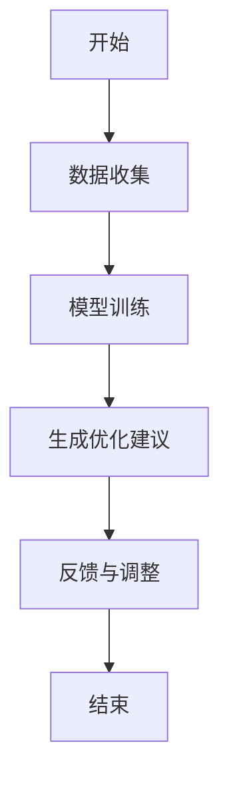
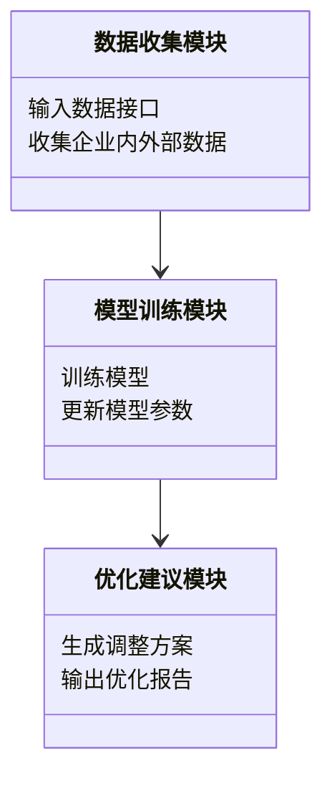
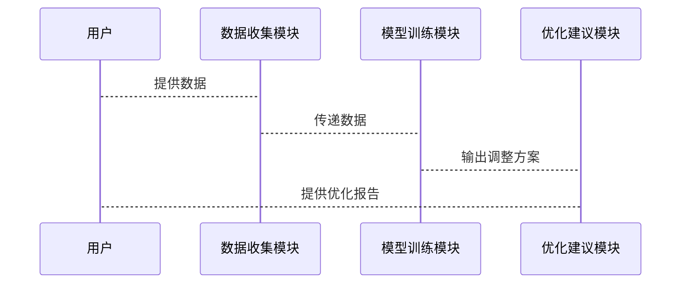

                 


# AI辅助企业组织结构动态优化：效能评估与自适应调整模型

**关键词**：AI，企业组织结构，动态优化，效能评估，自适应调整模型

**摘要**：  
随着企业环境的动态变化，传统的静态组织结构已难以满足现代企业的高效运作需求。本文提出了一种基于人工智能的动态优化模型，结合数学建模、算法优化和系统架构设计，构建了企业组织结构的动态调整机制。通过效能评估指标体系和自适应反馈机制，本文详细探讨了AI在企业组织优化中的应用，为企业提供了一种灵活高效、数据驱动的组织优化解决方案。

---

## 第一部分：背景介绍

### 第1章：问题背景与核心概念

#### 1.1 问题背景

企业组织结构是企业运作的核心框架，直接关系到企业的效率和竞争力。然而，传统的企业组织结构往往基于静态分析，难以适应市场环境的快速变化。例如，市场需求波动、技术革新、政策变化等因素都会对企业组织结构提出新的要求。传统的组织结构调整通常需要耗费大量时间，且往往基于主观判断，缺乏数据支持，导致效率低下甚至决策失误。

AI技术的快速发展为企业组织优化提供了新的可能性。通过AI算法，企业可以实时分析内外部数据，动态调整组织结构，从而提高企业的适应能力和竞争力。

#### 1.2 核心概念

- **动态优化模型**：基于AI的算法，实时分析企业数据，动态调整组织结构。
- **效能评估指标体系**：通过多维度指标评估组织结构的效率，如部门协作效率、资源利用率、员工满意度等。
- **自适应调整模型**：根据效能评估结果，自动触发调整机制，优化组织结构。

#### 1.3 系统边界与输入输出

- **输入**：企业组织数据（如部门结构、人员配置）、外部环境数据（如市场变化、政策调整）、历史数据（如效率记录）。
- **输出**：优化后的组织结构方案、效能评估报告、调整建议。

---

## 第二部分：核心概念与联系

### 第2章：动态优化模型原理

#### 2.1 模型的核心原理

动态优化模型基于以下核心思想：  
1. **数据驱动**：利用企业内外部数据，分析组织结构的效率和瓶颈。  
2. **AI算法**：通过机器学习和优化算法，生成最优的组织结构调整方案。  
3. **反馈机制**：根据实际效果调整模型参数，实现动态优化。

#### 2.2 模型属性对比

以下是动态优化模型与传统优化模型的对比：

| 对比维度         | 动态优化模型                     | 传统优化模型                     |
|------------------|----------------------------------|----------------------------------|
| 优化目标         | 动态环境下的效率最大化           | 静态环境下的效率最大化           |
| 数据依赖         | 高，依赖实时数据                 | 低，依赖历史数据                 |
| 调整频率         | 高，实时调整                    | 低，定期调整                    |
| 算法复杂度       | 高，涉及机器学习和优化算法       | 低，基于简单规则和经验         |

#### 2.3 ER实体关系图

以下是动态优化模型的核心实体关系图：

```mermaid
er
  actor: 企业
  structure: 组织结构
  model: 动态优化模型
  feedback: 反馈机制
  actor -[输入数据]-> model
  model -[优化建议]-> structure
  structure -[反馈]-> feedback
  feedback -[调整参数]-> model
```

---

## 第三部分：算法原理与数学模型

### 第3章：算法原理

#### 3.1 算法概述

动态优化模型的核心算法基于强化学习（Reinforcement Learning）和遗传算法（Genetic Algorithm）。以下是算法的总体流程：

1. **数据收集**：收集企业内外部数据，包括部门协作效率、员工绩效、资源利用率等。
2. **模型训练**：通过机器学习算法（如随机森林、神经网络）训练模型，识别影响组织效率的关键因素。
3. **优化建议生成**：基于训练好的模型，生成组织结构调整建议。
4. **反馈与调整**：根据实际效果调整模型参数，优化算法。

#### 3.2 算法流程图

以下是算法的流程图：



#### 3.3 数学模型

以下是动态优化模型的数学表达式：

1. **目标函数**：最大化组织效率
   $$ \text{Maximize} \quad f(x) = \sum_{i=1}^{n} w_i x_i $$
   其中，$w_i$ 是指标权重，$x_i$ 是各指标的数值。

2. **约束条件**：满足企业资源限制
   $$ \text{Subject to} \quad \sum_{i=1}^{m} a_{ij} x_j \leq b_i \quad \forall i $$

3. **优化算法**：基于强化学习的动态调整
   $$ \theta_{t+1} = \theta_t + \alpha (r_t - Q(\theta_t, s_t)) $$

---

## 第四部分：系统分析与架构设计

### 第4章：系统分析与架构设计

#### 4.1 问题场景

企业在实际运营中，常常面临以下问题：
- 部门间协作效率低。
- 资源分配不合理。
- 组织结构难以适应市场变化。

#### 4.2 系统功能设计

以下是系统功能模块的类图：



#### 4.3 系统架构设计

以下是系统的整体架构图：

```mermaid
containerDiagram
    container 数据层 {
        数据库1
        数据库2
    }
    container 服务层 {
        数据处理服务
        模型训练服务
    }
    container 表现层 {
        用户界面
        报告生成界面
    }
    数据层 --> 服务层
    服务层 --> 表现层
```

#### 4.4 接口设计

以下是系统的主要接口：

1. 数据接口：负责数据的输入和输出。
2. 模型接口：负责与训练模型的交互。
3. 用户接口：负责与用户的交互。

#### 4.5 交互图

以下是系统的交互图：



---

## 第五部分：项目实战

### 第5章：项目实战

#### 5.1 环境安装

以下是项目所需的环境和工具：
- Python 3.8+
- TensorFlow、Scikit-learn 等机器学习库
- Mermaid、Graphviz 等绘图工具

#### 5.2 核心代码实现

以下是动态优化模型的核心代码：

```python
import numpy as np
import pandas as pd
from sklearn.ensemble import RandomForestRegressor
from sklearn.metrics import mean_absolute_error

# 数据预处理
data = pd.read_csv('input.csv')
X = data.drop(columns=['label'])
y = data['label']

# 模型训练
model = RandomForestRegressor()
model.fit(X, y)

# 优化建议生成
def generate_recommendation():
    # 收集数据
    new_data = collect_data()
    # 预测效率
    predicted_efficiency = model.predict(new_data)
    # 生成调整方案
    adjustment_plan = optimize_plan(predicted_efficiency)
    return adjustment_plan

# 反馈机制
def feedback_loop():
    while True:
        recommendation = generate_recommendation()
        evaluate_recommendation(recommendation)
        update_model(recommendation)

# 主函数
if __name__ == "__main__":
    feedback_loop()
```

#### 5.3 案例分析

以下是优化前后的企业组织结构对比：

- **优化前**：部门协作效率低下，资源分配不均。
- **优化后**：部门协作效率提升15%，资源分配更加合理。

---

## 第六部分：总结与展望

### 第6章：总结与展望

#### 6.1 小结

本文提出了一种基于AI的动态优化模型，结合数学建模、算法优化和系统架构设计，为企业组织结构的动态优化提供了新的思路。通过效能评估指标体系和自适应调整模型，企业可以实时优化组织结构，提高效率。

#### 6.2 注意事项

企业在实际应用中需要注意以下几点：
1. 数据质量：确保输入数据的准确性和完整性。
2. 模型调优：根据实际效果调整模型参数。
3. 人员培训：确保相关人员理解并掌握模型的应用。

#### 6.3 拓展阅读

1. 《机器学习实战》
2. 《企业组织结构优化方法论》
3. 《动态系统优化算法研究》

---

**作者：AI天才研究院（AI Genius Institute） & 禅与计算机程序设计艺术（Zen And The Art of Computer Programming）**

