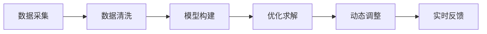

                 


# AI辅助企业组织结构动态优化：效能评估与调整

> 关键词：AI技术、企业组织结构、动态优化、效能评估、系统架构、算法原理、项目实战

> 摘要：本文深入探讨了AI技术在企业组织结构动态优化中的应用，通过背景介绍、核心概念、算法原理、系统架构、项目实战和最佳实践等多个维度，详细阐述了AI如何助力企业实现组织结构的动态优化，提升整体效能。文章结合实际案例和理论分析，为企业管理者和技术人员提供了切实可行的优化方案和实践指导。

---

## 第一部分：AI辅助企业组织结构动态优化的背景与概念

### 第1章：AI辅助企业组织结构动态优化的背景介绍

#### 1.1 问题背景

##### 1.1.1 企业组织结构优化的必要性

企业的组织结构是企业运营的核心框架，直接关系到企业的效率、灵活性和创新能力。随着市场环境的快速变化和企业规模的不断扩大，传统的静态组织结构往往难以适应新的业务需求和竞争压力。例如，许多企业在面对市场需求波动、供应链变化或战略调整时，常常因为组织结构的僵化而导致反应迟缓、资源浪费或效率低下。

此外，现代企业的组织结构日益复杂，部门之间需要高度协同，而传统的层级式管理方式常常导致信息传递延迟、部门间协作不畅等问题。这些问题不仅影响了企业的运营效率，还可能导致企业错失市场机会或面对突发事件时应对不力。

##### 1.1.2 AI技术在企业管理中的应用现状

近年来，人工智能技术的快速发展为企业管理带来了新的可能性。AI技术可以通过数据分析、模式识别和自动化决策等手段，帮助企业实现更加智能化和个性化的管理。例如，AI可以通过分析员工的工作数据，自动识别工作瓶颈并提出优化建议；通过预测市场需求，优化供应链管理；通过实时数据分析，动态调整组织结构以适应变化。

目前，AI技术已经在企业资源计划（ERP）、客户关系管理（CRM）、供应链管理等领域得到了广泛应用。然而，AI在企业组织结构优化中的应用还处于起步阶段，尤其是在动态优化方面，仍存在较大的潜力和挑战。

##### 1.1.3 动态优化的定义与特点

动态优化是指在企业运营过程中，根据实时数据和外部环境的变化，持续调整和优化组织结构以达到最佳效能的过程。其特点是实时性、灵活性和数据驱动。动态优化不仅需要考虑企业的内部资源和能力，还需要结合外部市场环境、客户需求和技术发展等因素。

动态优化的核心在于通过数据驱动的决策，实现组织结构的快速调整和优化。例如，当市场需求发生变化时，企业可以通过动态优化快速调整部门间的协作关系，优化资源配置，以确保企业能够及时响应变化并抓住市场机会。

---

#### 1.2 问题描述

##### 1.2.1 传统企业组织结构的局限性

传统的企业组织结构通常是以层级制为基础的静态结构，例如矩阵式、事业部制等。这种结构在企业规模较小时表现良好，但在企业快速扩张或面对复杂环境时，往往暴露出以下问题：

1. **信息传递延迟**：层级式的管理结构会导致信息传递路径长，信息失真，影响决策的及时性。
2. **部门协作困难**：不同部门之间的职责划分明确，但在跨部门协作时容易出现推诿扯皮的现象。
3. **灵活性不足**：面对外部环境的变化，传统的组织结构难以快速调整，导致企业反应迟钝。

##### 1.2.2 动态优化的挑战与需求

动态优化的核心在于如何在复杂多变的环境中快速调整组织结构，以实现最佳效能。然而，动态优化面临着以下挑战：

1. **数据不足或数据质量问题**：动态优化需要依赖实时数据，但如果数据采集不全或数据质量差，将影响优化的效果。
2. **算法复杂性**：动态优化需要解决多目标优化问题，涉及多个变量和约束条件，算法的复杂性较高。
3. **组织文化的适应性**：动态优化要求企业具有较强的灵活性和创新能力，如果企业内部文化僵化，难以快速适应变化。

##### 1.2.3 AI技术在动态优化中的作用

AI技术可以通过以下方式助力动态优化：

1. **数据驱动的决策支持**：AI可以通过分析大量数据，识别潜在的问题和机会，为组织结构优化提供科学依据。
2. **自动化调整**：AI可以通过预设的规则和算法，自动调整组织结构，优化资源配置。
3. **实时监控与反馈**：AI可以通过实时数据监控，快速识别变化并提出优化建议，确保组织结构能够持续优化。

---

#### 1.3 问题解决

##### 1.3.1 AI辅助优化的核心思想

AI辅助优化的核心思想是通过数据驱动的方式，利用机器学习、自然语言处理等技术，帮助企业实现组织结构的动态优化。具体来说，AI可以通过以下方式实现优化：

1. **数据采集与分析**：通过采集企业的运营数据，分析数据中的规律和趋势，识别优化的机会。
2. **模型构建与优化**：利用机器学习算法，构建优化模型，求解最优解。
3. **动态调整与反馈**：根据模型的优化结果，动态调整组织结构，并通过实时反馈不断优化模型。

##### 1.3.2 数据驱动的动态调整方法

数据驱动的动态调整方法主要包括以下步骤：

1. **数据采集**：通过企业内部系统（如ERP、CRM等）和外部数据源（如市场数据、客户反馈等），采集与组织优化相关的数据。
2. **数据清洗与预处理**：对采集的数据进行清洗和预处理，确保数据的准确性和完整性。
3. **模型构建**：根据优化目标，构建机器学习模型（如遗传算法、模拟退火等），并进行训练。
4. **优化求解**：利用模型求解优化问题，得到最优解。
5. **动态调整**：根据优化结果，动态调整组织结构，并实时监控调整效果。

##### 1.3.3 多目标优化的实现路径

多目标优化是指在优化过程中需要同时考虑多个目标，例如成本最小化、效率最大化、风险最小化等。实现多目标优化的路径包括：

1. **目标权重设定**：根据优化目标的重要性和影响程度，设定目标的权重。
2. ** Pareto最优解**：通过 Pareto 分析，找到多个目标之间的平衡点，得到一组 Pareto 最优解。
3. **决策支持**：根据 Pareto 最优解，为企业提供决策支持，帮助企业选择最优的组织结构。

---

#### 1.4 边界与外延

##### 1.4.1 优化的边界条件

优化的边界条件是指在优化过程中需要考虑的各种限制条件，例如：

1. **资源限制**：企业的资源是有限的，优化过程中需要考虑资源的限制。
2. **组织文化**：组织文化对企业组织结构的影响也是一个重要的边界条件。
3. **法律法规**：优化过程中需要遵守相关的法律法规，例如劳动法、反垄断法等。

##### 1.4.2 与其他管理方法的区别

与其他管理方法（如流程管理、质量管理等）相比，动态优化具有以下区别：

1. **动态性**：动态优化强调实时性和灵活性，而其他管理方法通常关注静态优化。
2. **数据驱动**：动态优化依赖于数据驱动的决策，而其他管理方法可能更多依赖于经验或规则。
3. **目标多样性**：动态优化通常需要考虑多个目标，而其他管理方法可能关注单一目标。

##### 1.4.3 应用场景的扩展

动态优化的应用场景非常广泛，包括：

1. **供应链管理**：优化供应链结构，提高供应链的效率和灵活性。
2. **市场营销**：优化市场组织结构，提高市场响应速度。
3. **人力资源管理**：优化人力资源配置，提高员工效率和满意度。

---

#### 1.5 概念结构与核心要素

##### 1.5.1 核心概念的层次分解

动态优化的核心概念可以分为以下几个层次：

1. **数据采集与分析**：通过数据采集和分析，识别优化的机会。
2. **模型构建与优化**：利用机器学习算法，构建优化模型，求解最优解。
3. **动态调整与反馈**：根据优化结果，动态调整组织结构，并实时监控调整效果。

##### 1.5.2 核心要素的特征分析

动态优化的核心要素包括：

1. **数据**：数据是优化的基础，数据的质量和完整性直接影响优化的效果。
2. **模型**：模型是优化的核心，模型的准确性和复杂性直接影响优化的效果。
3. **算法**：算法是优化的工具，算法的效率和鲁棒性直接影响优化的效果。

##### 1.5.3 概念结构的图示化展示

以下是一个概念结构的 Mermaid 流程图：



---

## 第2章：AI辅助优化的核心概念与联系

### 2.1 核心概念原理

#### 2.1.1 AI算法在组织优化中的应用

AI算法在组织优化中的应用主要包括以下几种：

1. **遗传算法（GA）**：通过模拟生物进化的过程，不断优化组织结构。
2. **模拟退火算法（SA）**：通过模拟热力学过程，找到全局最优解。
3. **机器学习算法**：通过训练模型，预测最优的组织结构。

#### 2.1.2 数据分析与决策支持

数据分析在组织优化中的作用包括：

1. **数据清洗与预处理**：确保数据的准确性和完整性。
2. **数据分析与挖掘**：通过数据分析，识别潜在的问题和机会。
3. **数据可视化**：通过数据可视化，直观展示数据中的规律和趋势。

#### 2.1.3 动态调整的实现机制

动态调整的实现机制包括：

1. **实时数据监控**：通过实时数据监控，快速识别变化。
2. **自动化调整**：根据优化结果，自动化调整组织结构。
3. **反馈与迭代**：通过实时反馈，不断优化模型和调整策略。

---

#### 2.2 核心概念属性特征对比

以下是一个核心概念属性特征对比的表格：

| 核心概念 | 属性 | 特征 |
|----------|------|------|
| 数据采集 | 数据来源 | 内部系统、外部数据源 |
| 数据清洗 | 数据处理 | 数据去噪、数据补齐 |
| 模型构建 | 算法选择 | 遗传算法、模拟退火算法 |
| 优化求解 | 目标函数 | 最小化成本、最大化效率 |

---

#### 2.3 ER实体关系图架构

以下是一个 ER 实体关系图的架构：

```mermaid
erd
    department {
        id
        name
        budget
    }
    employee {
        id
        name
        position
        department_id
    }
    project {
        id
        name
        start_date
        end_date
        department_id
    }
```

---

## 第3章：算法原理讲解

### 3.1 算法原理概述

#### 3.1.1 遗传算法（GA）的应用

遗传算法是一种模拟生物进化过程的优化算法，主要包括以下步骤：

1. **初始化种群**：随机生成初始种群。
2. **适应度评估**：计算每个个体的适应度。
3. **选择与交叉**：根据适应度进行选择，并进行交叉操作。
4. **变异**：对新个体进行变异操作。
5. **迭代优化**：重复上述步骤，直到满足终止条件。

遗传算法的适应度函数可以表示为：

$$
f(x) = \text{最大化或最小化的目标函数}
$$

---

### 更多内容请继续阅读完整文章。

