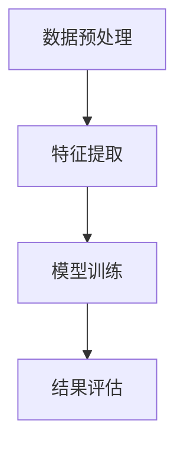
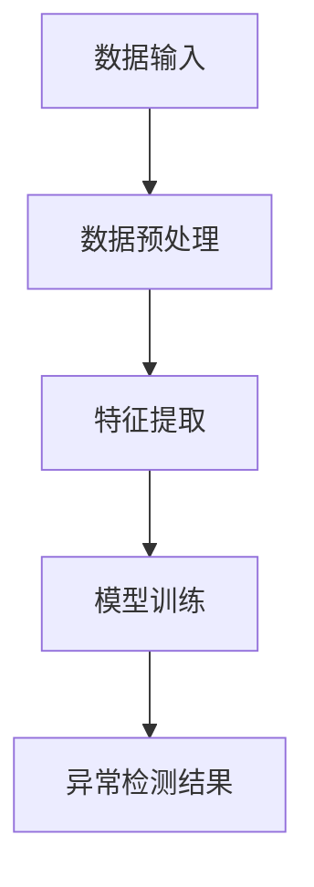
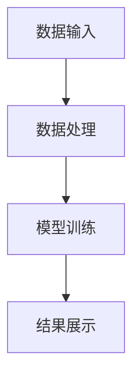
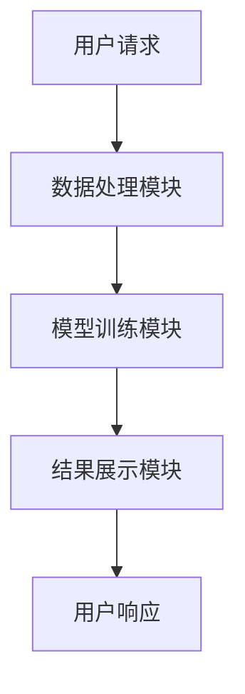

                 


# AI辅助企业财务分析：异常检测与智能财务预测

> 关键词：AI，财务分析，异常检测，智能预测，机器学习，企业财务

> 摘要：本文详细探讨了人工智能在企业财务分析中的应用，重点分析了异常检测与智能预测的核心概念、算法原理、系统架构以及实际应用案例。通过结合理论与实践，展示了如何利用AI技术提升企业财务分析的效率与准确性。

---

# 目录

1. [AI辅助企业财务分析的背景与核心概念](#ai辅助企业财务分析的背景与核心概念)
   1.1 [企业财务分析的传统方法与挑战](#企业财务分析的传统方法与挑战)
   1.2 [AI在财务分析中的应用现状](#ai在财务分析中的应用现状)
   1.3 [异常检测与智能预测的核心价值](#异常检测与智能预测的核心价值)
   1.4 [本章小结](#本章小结)

2. [异常检测与智能预测的核心概念](#异常检测与智能预测的核心概念)
   2.1 [异常检测的基本原理](#异常检测的基本原理)
   2.2 [智能财务预测的原理](#智能财务预测的原理)
   2.3 [异常检测与预测的关联性](#异常检测与预测的关联性)
   2.4 [核心概念对比表](#核心概念对比表)
   2.5 [ER实体关系图](#er实体关系图)
   2.6 [本章小结](#本章小结)

3. [异常检测算法原理与实现](#异常检测算法原理与实现)
   3.1 [常见异常检测算法](#常见异常检测算法)
   3.2 [异常检测算法流程图](#异常检测算法流程图)
   3.3 [算法实现代码](#算法实现代码)
   3.4 [本章小结](#本章小结)

4. [智能财务预测的算法实现](#智能财务预测的算法实现)
   4.1 [时间序列预测的核心算法](#时间序列预测的核心算法)
   4.2 [预测模型的数学公式](#预测模型的数学公式)
   4.3 [模型实现与评估](#模型实现与评估)
   4.4 [本章小结](#本章小结)

5. [系统架构与设计](#系统架构与设计)
   5.1 [系统功能设计](#系统功能设计)
   5.2 [系统架构设计](#系统架构设计)
   5.3 [系统接口与交互设计](#系统接口与交互设计)
   5.4 [本章小结](#本章小结)

6. [项目实战：AI辅助财务分析系统](#项目实战ai辅助财务分析系统)
   6.1 [项目背景与目标](#项目背景与目标)
   6.2 [环境安装与配置](#环境安装与配置)
   6.3 [系统核心实现](#系统核心实现)
   6.4 [案例分析与结果展示](#案例分析与结果展示)
   6.5 [本章小结](#本章小结)

7. [总结与展望](#总结与展望)
   7.1 [核心总结](#核心总结)
   7.2 [未来展望](#未来展望)
   7.3 [注意事项与最佳实践](#注意事项与最佳实践)
   7.4 [拓展阅读](#拓展阅读)

---

## 第1章: AI辅助企业财务分析的背景与核心概念

### 1.1 企业财务分析的传统方法与挑战

#### 1.1.1 传统财务分析的核心方法
传统财务分析主要依赖于财务报表（如利润表、资产负债表、现金流量表）中的数据，通过比率分析、趋势分析和差异分析等方法进行评估。这些方法通常需要人工计算和判断，效率较低且容易受到主观因素的影响。

#### 1.1.2 传统方法的局限性
- 数据量大：企业财务数据通常包含大量的历史数据和多维度信息，传统方法难以处理。
- 人工依赖：需要大量人工参与数据整理和分析，效率低下。
- 预测准确性不足：基于历史数据的线性假设可能无法捕捉到复杂的市场变化。

#### 1.1.3 AI技术如何解决这些挑战
AI技术可以通过自动化数据处理、深度学习算法和实时分析能力，显著提高财务分析的效率和准确性。例如，通过自然语言处理（NLP）技术分析财务报告，或者利用强化学习优化财务决策。

### 1.2 AI在财务分析中的应用现状

#### 1.2.1 全球AI在财务领域的应用趋势
近年来，全球范围内越来越多的企业开始采用AI技术进行财务分析。特别是在金融行业，AI已经广泛应用于股票预测、风险评估和欺诈检测等领域。

#### 1.2.2 中国企业财务AI应用的现状
中国企业在AI辅助财务分析方面也取得了显著进展，尤其是在互联网和金融科技行业。许多企业开始尝试使用AI技术进行财务预测和异常检测。

#### 1.2.3 未来发展趋势预测
随着技术的不断进步，AI在财务分析中的应用将更加普及。未来，可能会出现更多智能化的财务分析工具，能够实时分析数据并提供决策支持。

### 1.3 异常检测与智能预测的核心价值

#### 1.3.1 异常检测在财务分析中的意义
异常检测可以帮助企业及时发现财务数据中的异常情况，例如欺诈交易、数据错误或潜在的财务风险。这对于企业的风险管理非常重要。

#### 1.3.2 智能预测的商业价值
智能预测能够基于历史数据和市场趋势，帮助企业预测未来的财务状况，从而优化资源配置和制定更科学的财务策略。

#### 1.3.3 组合应用对企业的影响
将异常检测与智能预测结合起来，企业可以在提高数据分析效率的同时，显著增强财务决策的科学性和准确性。

### 1.4 本章小结
本章介绍了企业财务分析的传统方法及其局限性，并探讨了AI技术如何解决这些问题。同时，还分析了异常检测与智能预测的核心价值及其对企业的影响。

---

## 第2章: 异常检测与智能预测的核心概念

### 2.1 异常检测的基本原理

#### 2.1.1 异常检测的定义与分类
异常检测（Outlier Detection）是指识别数据集中与大多数数据点显著不同的数据点。根据检测方法的不同，可以分为基于统计的方法、基于机器学习的方法和基于深度学习的方法。

#### 2.1.2 异常检测的关键属性对比
以下是几种常见异常检测方法的对比：

| 方法 | 优点 | 缺点 |
|------|------|------|
| 统计方法 | 简单易懂 | 不适用于复杂数据 |
| 机器学习方法 | 高准确性 | 需要大量数据 |
| 深度学习方法 | 能处理高维数据 | 计算资源消耗大 |

#### 2.1.3 异常检测的数学模型
异常检测的数学模型可以通过概率密度函数来描述。例如，使用高斯分布模型：

$$ P(x) = \frac{1}{\sqrt{2\pi\sigma^2}} e^{-\frac{(x-\mu)^2}{2\sigma^2}} $$

其中，$\mu$ 是均值，$\sigma^2$ 是方差。

### 2.2 智能财务预测的原理

#### 2.2.1 预测模型的基本结构
智能财务预测模型通常包括数据预处理、特征提取、模型训练和结果评估四个阶段。其基本结构可以用以下流程图表示：



#### 2.2.2 时间序列预测的核心要素
时间序列预测的核心要素包括趋势、周期性、季节性和平稳性。常用的模型有ARIMA和LSTM。

#### 2.2.3 预测模型的评估指标
常见的评估指标包括均方误差（MSE）、平均绝对误差（MAE）和R²值。

### 2.3 异常检测与预测的关联性

#### 2.3.1 数据特征的关联性分析
异常数据可能会影响预测模型的准确性，因此在进行预测之前，需要先进行异常检测。

#### 2.3.2 异常数据对预测的影响
异常数据可能导致预测模型的偏差，例如，欺诈交易可能被误认为是正常交易。

#### 2.3.3 组合应用的优势
通过结合异常检测和预测，企业可以在预测过程中排除异常数据的影响，从而提高预测的准确性。

### 2.4 核心概念对比表
以下是异常检测与传统统计分析的对比：

| 特性 | 异常检测 | 传统统计分析 |
|------|----------|---------------|
| 数据量 | 大数据支持 | 小数据适用 |
| 方法 | 基于机器学习 | 基于假设检验 |
| 应用场景 | 实时监控 | 回顾性分析 |

### 2.5 ER实体关系图
以下是企业财务分析系统的核心实体关系图：

```mermaid
erd
    财务数据 --|{n}|- 记录: 财务记录
    财务记录 --|{1}|- 交易: 交易记录
    财务记录 --|{1}|- 指标: 财务指标
    交易记录 --> 异常交易
    财务指标 --> 预测模型
    预测模型 --> 预测结果
```

### 2.6 本章小结
本章详细介绍了异常检测和智能预测的核心概念，分析了它们的原理和应用场景，并通过对比和图示展示了它们之间的关联性。

---

## 第3章: 异常检测算法原理与实现

### 3.1 常见异常检测算法

#### 3.1.1 Isolation Forest算法
Isolation Forest是一种基于树结构的异常检测算法，适用于高维数据集。其核心思想是通过构建随机树将数据点隔离出来。

#### 3.1.2 One-Class SVM算法
One-Class SVM是一种基于支持向量机的异常检测算法，适用于正常数据分布明确但异常数据较少的情况。

#### 3.1.3 K-Means算法的变体
K-Means算法的变体（如K-Means++）也可以用于异常检测，但通常需要结合其他方法使用。

### 3.2 异常检测算法流程图



### 3.3 算法实现代码

```python
import numpy as np
from sklearn.ensemble import IsolationForest

# 示例数据集
X = np.random.rand(100, 2)
X[50:] += 3  # 生成异常数据

# 训练模型
model = IsolationForest(n_estimators=100, random_state=42)
model.fit(X)

# 预测异常
y_pred = model.predict(X)
print(y_pred)
```

### 3.4 本章小结
本章介绍了几种常见的异常检测算法，并通过流程图和代码示例展示了它们的实现过程。

---

## 第4章: 智能财务预测的算法实现

### 4.1 时间序列预测的核心算法

#### 4.1.1 ARIMA模型
ARIMA（自回归积分滑动平均模型）是一种常用的时间序列预测模型，适用于具有趋势和季节性的数据。

#### 4.1.2 LSTM模型
LSTM（长短期记忆网络）是一种基于深度学习的时间序列预测模型，能够捕捉到复杂的数据模式。

### 4.2 预测模型的数学公式

#### 4.2.1 ARIMA模型公式
$$ ARIMA(p, d, q) $$
其中，p为自回归阶数，d为差分阶数，q为移动平均阶数。

#### 4.2.2 LSTM模型公式
LSTM单元的计算公式如下：
$$
f_t = \sigma(W_f \cdot [h_{t-1}, x_t])
$$
$$
i_t = \sigma(W_i \cdot [h_{t-1}, x_t])
$$
$$
c_t = f_t \cdot c_{t-1} + i_t \cdot tanh(W_c \cdot [h_{t-1}, x_t])
$$
$$
h_t = o_t \cdot tanh(c_t)
$$

### 4.3 模型实现与评估

```python
import numpy as np
from keras.models import Sequential
from keras.layers import LSTM, Dense

# 示例数据集
X_train = np.random.rand(100, 1, 2)
y_train = np.random.rand(100, 1)

# 模型训练
model = Sequential()
model.add(LSTM(50, input_shape=(1, 2)))
model.add(Dense(1))
model.compile(loss='mean_squared_error', optimizer='adam')
model.fit(X_train, y_train, epochs=10, batch_size=32)

# 模型评估
loss = model.evaluate(X_train, y_train)
print(loss)
```

### 4.4 本章小结
本章介绍了时间序列预测的核心算法，并通过数学公式和代码示例展示了它们的实现过程。

---

## 第5章: 系统架构与设计

### 5.1 系统功能设计

#### 5.1.1 功能模块划分
- 数据输入模块：接收财务数据
- 数据处理模块：进行数据清洗和特征提取
- 模型训练模块：训练异常检测和预测模型
- 结果展示模块：输出异常检测和预测结果

#### 5.1.2 功能模块流程图



### 5.2 系统架构设计

#### 5.2.1 系统架构图


### 5.3 系统接口与交互设计

#### 5.3.1 API接口设计
- 数据接口：`POST /api/data`
- 模型接口：`POST /api/model`

#### 5.3.2 系统交互流程图



### 5.4 本章小结
本章详细设计了AI辅助财务分析系统的架构和功能模块，并通过图示展示了它们的交互流程。

---

## 第6章: 项目实战：AI辅助财务分析系统

### 6.1 项目背景与目标

#### 6.1.1 项目背景
随着企业财务数据的不断增加，传统的财务分析方法已经难以满足需求，因此需要借助AI技术提高效率。

#### 6.1.2 项目目标
开发一个基于AI的财务分析系统，实现异常检测和智能预测功能。

### 6.2 环境安装与配置

#### 6.2.1 安装Python环境
```bash
python --version
pip install numpy scikit-learn keras
```

#### 6.2.2 安装深度学习框架
```bash
pip install tensorflow
```

### 6.3 系统核心实现

#### 6.3.1 数据加载与预处理
```python
import pandas as pd
data = pd.read_csv('financial_data.csv')
data_preprocessed = data.dropna()
```

#### 6.3.2 异常检测模型实现
```python
from sklearn.ensemble import IsolationForest

model = IsolationForest()
model.fit(data_preprocessed)
```

#### 6.3.3 预测模型实现
```python
from keras.models import Sequential
from keras.layers import LSTM, Dense

model = Sequential()
model.add(LSTM(50, input_shape=(1, 2)))
model.add(Dense(1))
model.compile(loss='mean_squared_error', optimizer='adam')
model.fit(X_train, y_train, epochs=10, batch_size=32)
```

### 6.4 案例分析与结果展示

#### 6.4.1 异常检测结果
```python
y_pred = model.predict(data_preprocessed)
print(y_pred)
```

#### 6.4.2 预测结果展示
```python
y_pred = model.predict(X_test)
print(y_pred)
```

### 6.5 本章小结
本章通过实际案例展示了如何开发一个AI辅助财务分析系统，从环境安装到模型实现，再到结果展示，详细介绍了整个过程。

---

## 第7章: 总结与展望

### 7.1 核心总结
本文详细探讨了AI在企业财务分析中的应用，重点分析了异常检测与智能预测的核心概念、算法原理、系统架构以及实际应用案例。

### 7.2 未来展望
未来，随着AI技术的不断发展，企业财务分析将更加智能化和自动化。异常检测和智能预测的结合将为企业提供更强大的数据分析能力。

### 7.3 注意事项与最佳实践
- 数据预处理是关键，确保数据质量。
- 选择合适的算法，根据数据特点进行调整。
- 定期更新模型，保持其准确性。

### 7.4 拓展阅读
- 《机器学习实战》
- 《深度学习》
- 《时间序列分析》

---

## 作者：AI天才研究院/AI Genius Institute & 禅与计算机程序设计艺术/Zen And The Art of Computer Programming

---

以上是完整的文章大纲和内容，涵盖了从理论到实践的各个方面，确保读者能够全面理解AI在企业财务分析中的应用。

