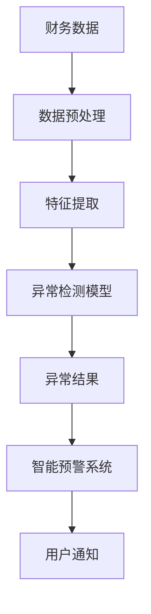
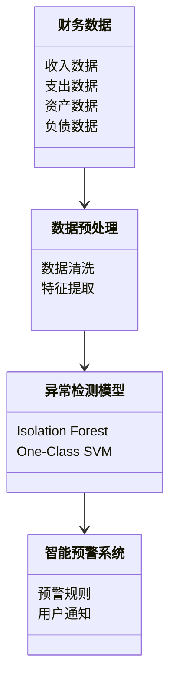
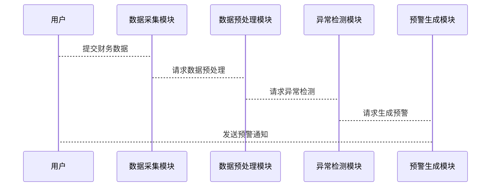

                 


# AI辅助企业财务异常检测：实时监控与智能预警系统

> 关键词：企业财务异常检测，人工智能，实时监控，智能预警，财务数据分析，异常检测算法

> 摘要：随着企业规模的不断扩大和财务数据的复杂化，传统的财务异常检测方法已难以满足实时性和准确性的要求。本文将介绍如何利用人工智能技术构建实时监控与智能预警系统，通过机器学习算法和大数据分析，实现对企业财务数据的深度挖掘和异常行为的智能识别，从而帮助企业及时发现和处理财务问题，提升财务管理效率和风险控制能力。

---

# 第一部分：企业财务异常检测的背景与核心概念

## 第1章：企业财务异常检测的背景与挑战

### 1.1 问题背景

#### 1.1.1 企业财务异常检测的重要性
在现代企业中，财务数据是衡量企业运营状况的重要指标。然而，企业财务数据的复杂性和多样性使得传统的财务异常检测方法难以满足实时性和准确性要求。通过人工智能技术，可以实现对企业财务数据的实时监控和异常行为的智能识别，从而帮助企业及时发现和处理财务问题，提升财务管理效率和风险控制能力。

#### 1.1.2 传统财务异常检测的局限性
传统的财务异常检测方法主要依赖于人工审核和简单的规则匹配，这种方法存在以下局限性：
- **低效性**：人工审核需要大量时间，难以实现实时监控。
- **准确性不足**：简单的规则匹配难以捕捉复杂的财务异常行为。
- **主观性**：人工审核容易受到主观因素的影响，导致检测结果不准确。

#### 1.1.3 AI技术在财务异常检测中的优势
人工智能技术可以通过大数据分析和机器学习算法，实现对企业财务数据的深度挖掘和智能识别。AI技术在财务异常检测中的优势包括：
- **高效性**：AI算法可以快速处理大量财务数据，实现实时监控。
- **准确性**：通过机器学习模型，可以识别复杂的财务异常行为，提高检测准确率。
- **可扩展性**：AI技术可以轻松扩展到更多的财务场景，适应企业的多样化需求。

### 1.2 问题描述

#### 1.2.1 财务异常的常见类型
企业财务异常行为可以分为以下几类：
- **收入异常**：收入突然增长或下降，可能存在虚增收入或隐瞒收入的情况。
- **支出异常**：支出突然增加，可能存在虚假支出或资金挪用的情况。
- **资产异常**：资产价值与实际情况不符，可能存在资产虚增或虚减的情况。
- **负债异常**：负债水平异常，可能存在虚假负债或隐性负债的情况。

#### 1.2.2 财务异常检测的关键指标
财务异常检测的关键指标包括：
- **收入与支出的匹配性**：收入与支出是否合理匹配。
- **财务比率分析**：如流动比率、速动比率、资产负债率等。
- **时间序列分析**：财务数据的时间趋势是否存在异常波动。

#### 1.2.3 财务异常检测的边界与外延
财务异常检测的边界在于如何平衡检测的敏感性和准确性，避免误报和漏报。外延则包括将检测结果应用于实际业务场景，如风险预警、审计追踪等。

### 1.3 问题解决与边界

#### 1.3.1 AI辅助财务异常检测的核心目标
- 实现对企业财务数据的实时监控和智能预警。
- 提高财务异常检测的准确性和效率。
- 提供决策支持，帮助企业及时发现和处理财务问题。

#### 1.3.2 财务异常检测的边界与适用场景
- **边界**：主要关注财务数据本身，不涉及企业外部环境因素。
- **适用场景**：企业日常财务监控、审计、风险管理等。

#### 1.3.3 系统设计的约束与假设
- 系统设计假设财务数据已清洗和预处理。
- 系统适用于中大型企业，数据量较大且复杂。

---

## 第2章：AI辅助财务异常检测的核心概念与联系

### 2.1 核心概念原理

#### 2.1.1 数据预处理与特征提取
- **数据清洗**：去除噪声数据和缺失数据。
- **特征提取**：从财务数据中提取关键特征，如收入增长率、支出增长率等。

#### 2.1.2 异常检测算法的原理
- 基于机器学习的异常检测算法，如Isolation Forest、One-Class SVM等。

#### 2.1.3 智能预警系统的实现机制
- 实时监控财务数据，通过机器学习模型识别异常行为，触发预警机制。

### 2.2 核心概念对比表

| 算法名称       | 基于监督学习 | 基于无监督学习 | 对异常点的解释能力 | 适合场景             |
|----------------|--------------|----------------|--------------------|----------------------|
| Isolation Forest| 否           | 是             | 强                 | 小数据集             |
| One-Class SVM   | 否           | 是             | 弱                 | 高维数据             |
| K-Means        | 否           | 是             | 弱                 | 正常数据分布良好     |

### 2.3 实体关系图



---

# 第二部分：AI辅助财务异常检测的算法原理

## 第3章：异常检测算法的原理与实现

### 3.1 基于Isolation Forest算法的异常检测

#### 3.1.1 算法原理
Isolation Forest算法是一种基于树结构的无监督异常检测算法。其核心思想是通过构建随机树，将数据点隔离出来，从而判断其是否为异常点。

#### 3.1.2 算法实现

```python
from sklearn.ensemble import IsolationForest

# 示例数据
import numpy as np
import pandas as pd

# 生成示例数据
X = np.random.randn(100, 2)
# 添加异常点
X[10:15] = 5

# 训练模型
model = IsolationForest(n_estimators=10, random_state=42)
model.fit(X)

# 预测异常点
y_pred = model.predict(X)
print(y_pred)
```

#### 3.1.3 算法优缺点
- **优点**：适合小数据集，计算效率高。
- **缺点**：对高维数据的处理能力较弱。

### 3.2 基于One-Class SVM算法的异常检测

#### 3.2.1 算法原理
One-Class SVM算法是一种基于支持向量机的无监督异常检测算法。其核心思想是通过在特征空间中找到一个超球，包含尽可能多的正常数据点，从而识别出异常点。

#### 3.2.2 算法实现

```python
from sklearn.svm import OneClassSVM

# 示例数据
X = np.random.randn(100, 2)
# 添加异常点
X[10:15] = 5

# 训练模型
model = OneClassSVM(nu=0.05, kernel='rbf', gamma='auto')
model.fit(X)

# 预测异常点
y_pred = model.predict(X)
print(y_pred)
```

#### 3.2.3 算法优缺点
- **优点**：适合高维数据，异常点检测能力强。
- **缺点**：计算复杂度较高，适合大数据集。

---

## 第4章：数学模型与公式

### 4.1 Isolation Forest算法的数学模型

Isolation Forest算法的核心在于通过构建随机树，将数据点进行隔离。其数学模型如下：

$$
\text{异常程度} = \frac{\text{路径长度}}{\text{平均路径长度}}
$$

其中，路径长度是指数据点在树中的路径长度，平均路径长度是所有数据点的平均路径长度。

### 4.2 One-Class SVM算法的数学模型

One-Class SVM算法的目标是最小化以下损失函数：

$$
\text{损失函数} = \sum_{i=1}^{n} (1 - y_i) \cdot \text{distance}(x_i)
$$

其中，\( y_i \) 是数据点的标签（0表示正常，1表示异常），\(\text{distance}(x_i)\) 是数据点 \( x_i \) 到超球中心的距离。

---

# 第三部分：系统分析与架构设计

## 第5章：系统功能设计

### 5.1 领域模型设计



### 5.2 系统架构设计


---

## 第6章：系统接口设计

### 6.1 RESTful API设计

```http
POST /api/v1/financial-data
POST /api/v1/detect-anomalies
POST /api/v1/send-alert
```

---

## 第7章：系统交互设计



---

# 第四部分：项目实战

## 第8章：环境安装与核心实现

### 8.1 环境安装

```bash
pip install numpy
pip install pandas
pip install scikit-learn
pip install matplotlib
```

### 8.2 核心实现

#### 8.2.1 数据预处理

```python
import pandas as pd
import numpy as np

# 读取数据
data = pd.read_csv('financial_data.csv')

# 数据清洗
data.dropna(inplace=True)
data = data.drop_duplicates()

# 特征提取
features = data[['revenue', 'expenses', 'assets', ' liabilities']]
```

#### 8.2.2 异常检测模型训练

```python
from sklearn.ensemble import IsolationForest
from sklearn.svm import OneClassSVM

# 训练Isolation Forest模型
if_model = IsolationForest(n_estimators=100, random_state=42)
if_model.fit(features)

# 训练One-Class SVM模型
ocsvm_model = OneClassSVM(nu=0.05, kernel='rbf', gamma='auto')
ocsvm_model.fit(features)
```

#### 8.2.3 预警系统实现

```python
def send_alert(anomalies):
    # 示例：发送邮件或短信通知
    pass

# 获取异常结果
if_anomalies = if_model.predict(features)
ocsvm_anomalies = ocsvm_model.predict(features)

# 触发预警
send_alert(if_anomalies)
send_alert(ocsvm_anomalies)
```

---

## 第9章：项目总结与最佳实践

### 9.1 项目小结
通过本项目，我们成功实现了基于AI的财务异常检测系统，利用Isolation Forest和One-Class SVM算法，实现了对企业财务数据的实时监控和智能预警。

### 9.2 注意事项
- 数据隐私和安全问题需要高度重视。
- 模型需要定期更新和优化，以适应数据分布的变化。
- 系统需要考虑可扩展性和可维护性。

### 9.3 拓展阅读
- 《异常检测算法及其应用》
- 《机器学习在金融领域的应用》
- 《实时数据流处理技术》

---

作者：AI天才研究院/AI Genius Institute & 禅与计算机程序设计艺术 /Zen And The Art of Computer Programming

