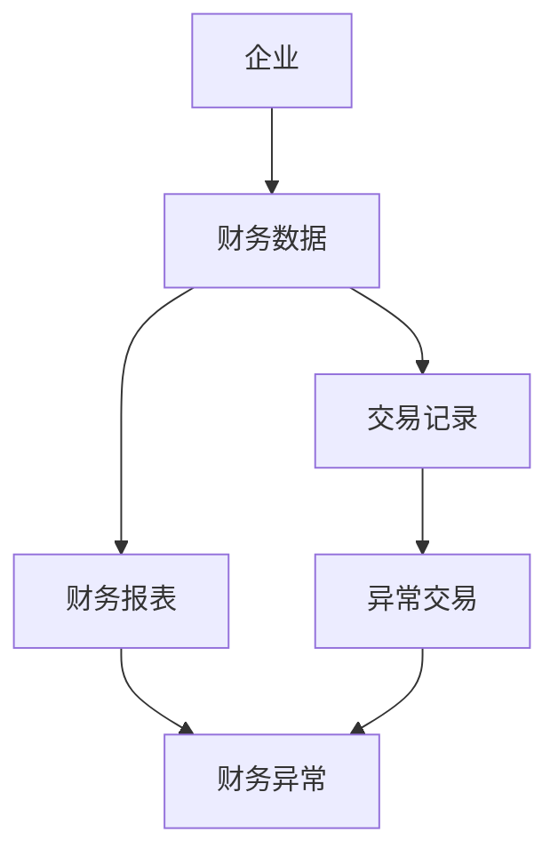
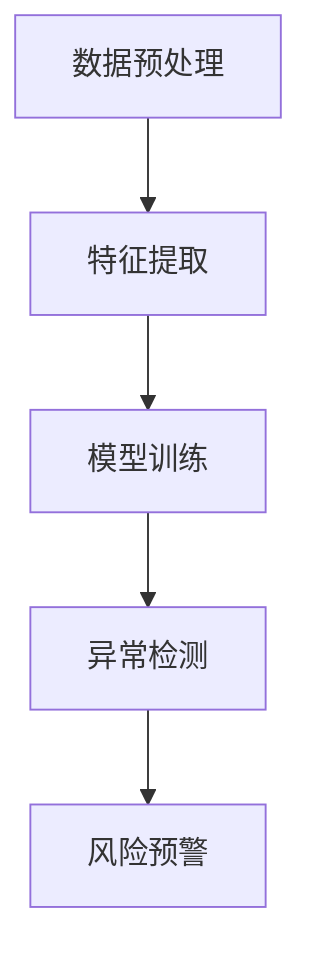
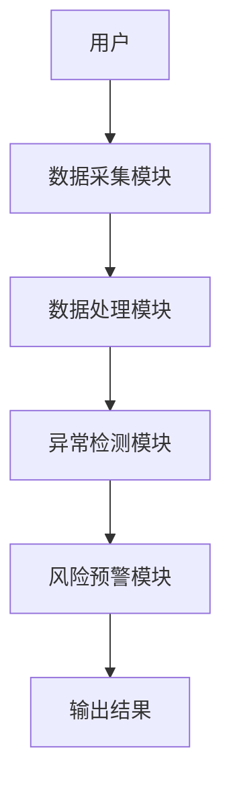
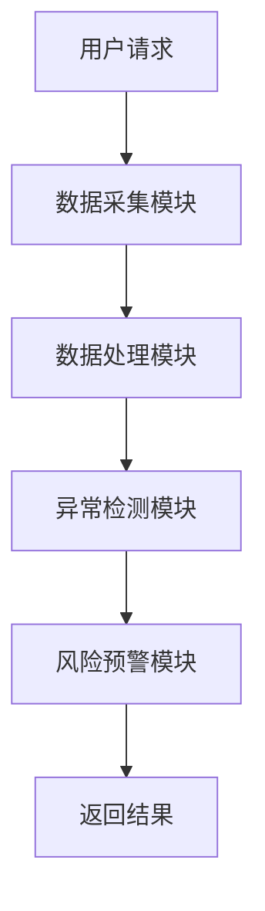

                 


# AI辅助企业财务异常检测：实时监控与风险预警

## 关键词：
AI技术、财务异常检测、实时监控、风险预警、企业财务管理、异常检测算法、财务风险管理

## 摘要：
本文详细探讨了人工智能技术在企业财务异常检测中的应用，重点分析了实时监控与风险预警的核心原理、系统架构及实际应用场景。通过介绍异常检测算法、系统设计、项目实战等多方面内容，本文旨在为企业提供一种高效、智能的财务风险管理解决方案。

---

# 目录

## 第一部分：AI辅助企业财务异常检测概述

### 第1章：财务异常检测的背景与挑战

#### 1.1 企业财务异常检测的背景
- 1.1.1 企业财务健康的重要性
- 1.1.2 财务异常检测的定义与目标
- 1.1.3 当前财务异常检测的痛点与难点

#### 1.2 AI在财务异常检测中的作用
- 1.2.1 AI技术如何提升财务异常检测效率
- 1.2.2 基于AI的实时监控优势
- 1.2.3 风险预警对企业财务管理的价值

### 第2章：财务异常检测的核心概念与联系

#### 2.1 核心概念解析
- 2.1.1 财务数据的特征与属性
- 2.1.2 异常检测的分类与方法
- 2.1.3 风险预警的定义与层次

#### 2.2 核心概念对比分析
- 2.2.1 异常检测与风险预警的对比表格
- 2.2.2 数据特征与异常检测方法的关系

#### 2.3 实体关系图（ER图）


### 第3章：AI辅助财务异常检测的算法原理

#### 3.1 常见算法概述
- 3.1.1 监督学习算法
- 3.1.2 无监督学习算法
- 3.1.3 半监督学习算法

#### 3.2 算法流程图


#### 3.3 算法实现代码
```python
import pandas as pd
from sklearn.ensemble import IsolationForest

# 数据预处理
data = pd.read_csv('financial_data.csv')

# 特征工程
features = data[['revenue', 'profit', 'expenses', 'cash_flow']]

# 模型训练
model = IsolationForest(n_estimators=100, random_state=42)
model.fit(features)

# 异常检测
outliers = model.predict(features)
outliers = pd.Series(outliers, index=features.index)
```

## 第二部分：系统分析与架构设计

### 第4章：系统分析与架构设计

#### 4.1 问题场景介绍
- 4.1.1 财务数据的实时采集与处理
- 4.1.2 异常检测模型的实时更新
- 4.1.3 风险预警的实时推送

#### 4.2 系统功能设计
- 4.2.1 数据采集模块
- 4.2.2 数据处理模块
- 4.2.3 异常检测模块
- 4.2.4 风险预警模块

#### 4.3 系统架构设计


#### 4.4 系统接口设计
- API接口定义
- 数据格式与交互流程

#### 4.5 系统交互流程图


## 第三部分：项目实战与优化

### 第5章：项目实战

#### 5.1 环境安装与配置
- 安装必要的Python库
- 数据集准备与预处理

#### 5.2 系统核心实现
```python
import pandas as pd
from sklearn.ensemble import IsolationForest
from datetime import datetime

# 数据采集模块
def collect_data():
    # 实现从数据库或API采集财务数据
    pass

# 数据处理模块
def preprocess_data(data):
    # 数据清洗与特征提取
    pass

# 异常检测模块
def detect_anomalies(features):
    model = IsolationForest(n_estimators=100, random_state=42)
    model.fit(features)
    return model.predict(features)

# 风险预警模块
def generate_warnings(anomalies):
    warnings = []
    for i, is_anomaly in enumerate(anomalies):
        if is_anomaly == -1:
            warnings.append(f"交易 {i} 可能存在异常")
    return warnings
```

#### 5.3 代码应用解读与分析
- 数据采集模块的实现细节
- 数据处理模块的特征工程方法
- 异常检测模块的模型调优
- 风险预警模块的输出格式

#### 5.4 实际案例分析
- 案例背景介绍
- 数据分析与处理
- 异常检测结果解读
- 风险预警的实际应用

### 第6章：优化与扩展

#### 6.1 系统优化建议
- 性能优化
- 可扩展性优化
- 可维护性优化

#### 6.2 拓展应用场景
- 跨行业应用
- 数据源的多样性扩展
- 模型的动态更新

#### 6.3 最佳实践 Tips
- 数据质量管理的重要性
- 模型选择与调优的注意事项
- 系统部署与运维的关键点

## 第四部分：总结与展望

### 第7章：总结与展望

#### 7.1 项目总结
- 项目目标的实现情况
- 系统设计的优缺点
- 项目实施的经验与教训

#### 7.2 未来展望
- 技术发展的趋势
- 新的算法与工具的应用前景
- 企业财务管理的智能化发展方向

---

## 作者：AI天才研究院/AI Genius Institute & 禅与计算机程序设计艺术 /Zen And The Art of Computer Programming

