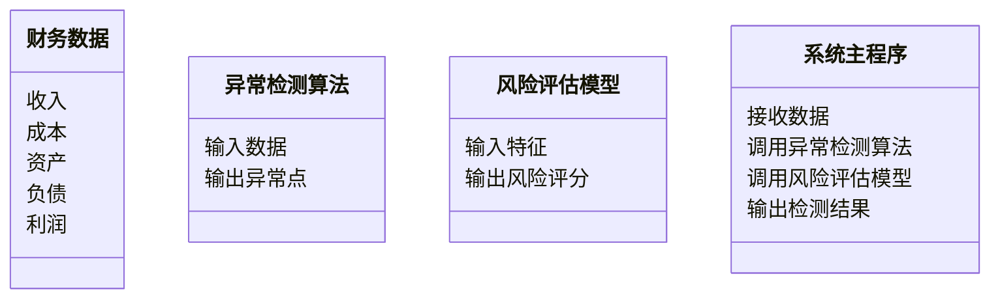
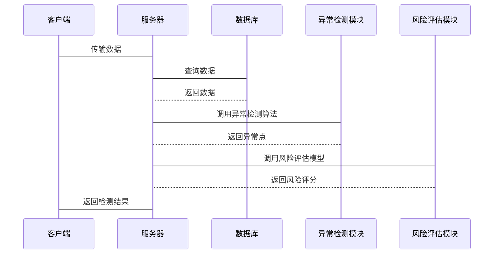

                 


# AI辅助企业财务舞弊检测：异常模式识别与风险评估

## 关键词：AI, 企业财务舞弊, 异常模式识别, 风险评估, 机器学习, 深度学习, 数据挖掘

## 摘要：  
随着企业规模的不断扩大和财务数据的复杂化，传统的财务舞弊检测方法逐渐显现出其局限性。本文将深入探讨如何利用人工智能技术，特别是异常模式识别和风险评估的方法，来提升企业财务舞弊检测的效率和准确性。通过结合监督学习和无监督学习算法，本文将详细分析如何构建高效的财务舞弊检测系统，并提供实际案例和系统设计的详细解读，为企业的财务风险管理提供有力支持。

---

## 目录

1. [背景与挑战](#背景与挑战)  
   1.1 企业财务舞弊的背景与现状  
   1.2 AI技术在财务舞弊检测中的应用前景  
   1.3 本章小结  

2. [异常模式识别与风险评估的核心概念](#异常模式识别与风险评估的核心概念)  
   2.1 异常模式识别的基本原理  
   2.2 风险评估的基本原理  
   2.3 异常模式识别与风险评估的核心要素对比  
   2.4 本章小结  

3. [异常模式识别的算法原理](#异常模式识别的算法原理)  
   3.1 监督学习与无监督学习在异常检测中的应用  
   3.2 异常检测算法原理  
   3.3 异常检测算法的数学模型与公式  
   3.4 异常检测算法的实现与代码示例  
   3.5 本章小结  

4. [风险评估的数学模型与公式](#风险评估的数学模型与公式)  
   4.1 风险评估的基本数学模型  
   4.2 异常模式识别的数学模型  
   4.3 风险评估与异常模式识别的联合模型  
   4.4 本章小结  

5. [系统设计与实现](#系统设计与实现)  
   5.1 问题场景分析  
   5.2 系统功能设计  
   5.3 系统架构设计  
   5.4 系统接口设计  
   5.5 系统交互设计  
   5.6 本章小结  

6. [项目实战：AI辅助企业财务舞弊检测系统](#项目实战ai辅助企业财务舞弊检测系统)  
   6.1 项目背景与目标  
   6.2 项目环境与工具安装  
   6.3 数据预处理与特征工程  
   6.4 模型训练与部署  
   6.5 项目总结与经验分享  
   6.6 本章小结  

7. [总结与展望](#总结与展望)  
   7.1 核心内容回顾  
   7.2 当前挑战与未来方向  
   7.3 最佳实践与注意事项  
   7.4 本章小结  

---

## 1. 背景与挑战

### 1.1 企业财务舞弊的背景与现状  
企业财务舞弊是指企业通过虚构交易、隐瞒收入、虚增成本等方式，故意 manipulate 财务报表，以达到骗取资金、逃避税收或其他非法目的。随着全球化和信息化的快速发展，企业财务舞弊手段日益复杂化和隐蔽化。传统的财务舞弊检测方法主要依赖人工审核和简单的财务指标分析，难以应对复杂的舞弊行为。

#### 1.1.1 企业财务舞弊的定义与类型  
- **定义**：企业财务舞弊是指企业通过虚构交易、隐瞒收入、虚增成本等方式，故意 manipulate 财务报表，以达到骗取资金、逃避税收或其他非法目的。  
- **类型**：  
  1. 虚增收入：通过虚构交易或重复计账虚增收入。  
  2. 虚减成本：通过少计成本或费用，虚增利润。  
  3. 隐瞒收入：通过隐匿收入或设置账外账，逃避纳税。  
  4. 虚假关联交易：通过与关联方进行虚假交易，转移资产或利润。  

#### 1.1.2 财务舞弊对企业与社会的危害  
- 对企业的影响：  
  1. 损害企业声誉，影响投资者信心。  
  2. 导致企业财务状况恶化，甚至引发破产。  
- 对社会的影响：  
  1. 损害市场经济秩序，破坏公平竞争。  
  2. 增加税务负担，影响公共财政收入。  

#### 1.1.3 传统财务舞弊检测的局限性  
传统财务舞弊检测方法主要包括以下几种：  
1. **财务报表分析**：通过分析财务报表中的各项指标，寻找异常变化。  
2. **比率分析**：通过计算各项财务比率，判断企业财务状况是否健康。  
3. **趋势分析**：通过分析财务数据的变化趋势，发现异常波动。  

然而，这些方法往往依赖人工经验，难以发现复杂的舞弊行为，且效率低下，容易受到主观因素的影响。

---

### 1.2 AI技术在财务舞弊检测中的应用前景  
随着人工智能技术的快速发展，AI在财务舞弊检测中的应用前景广阔。AI技术可以通过分析海量财务数据，发现隐藏在数据中的异常模式，从而提高财务舞弊检测的效率和准确性。

#### 1.2.1 AI技术在金融领域的应用现状  
目前，AI技术已经在金融领域得到了广泛应用，例如：  
- **智能投顾**：通过算法分析市场趋势，为投资者提供个性化投资建议。  
- **信用评估**：通过机器学习模型评估客户的信用风险。  
- **欺诈检测**：通过异常检测算法识别交易中的欺诈行为。  

#### 1.2.2 异常模式识别在财务舞弊检测中的作用  
异常模式识别是AI技术在财务舞弊检测中的核心应用之一。通过分析财务数据中的异常模式，可以发现潜在的舞弊行为。例如：  
- **销售额异常**：某段时间内销售额突然激增，但无实际业务支持。  
- **成本异常**：某项成本突然大幅增加，但无合理解释。  

#### 1.2.3 风险评估在企业财务管理中的重要性  
风险评估是企业财务管理的重要组成部分。通过评估企业的财务风险，可以帮助企业制定合理的风险管理策略，避免财务危机的发生。

---

### 1.3 本章小结  
本章从企业财务舞弊的背景与现状出发，分析了传统财务舞弊检测方法的局限性，并探讨了AI技术在财务舞弊检测中的应用前景。通过对比传统方法与AI技术的优劣，为后续章节的深入分析奠定了基础。

---

## 2. 异常模式识别与风险评估的核心概念

### 2.1 异常模式识别的基本原理  
异常模式识别是通过分析数据中的异常点，发现与正常模式不符的模式。在财务舞弊检测中，异常模式识别可以帮助发现潜在的舞弊行为。

#### 2.1.1 异常模式识别的定义与特征  
- **定义**：异常模式识别是通过分析数据中的异常点，发现与正常模式不符的模式。  
- **特征**：  
  1. 异常性：数据点与正常数据点存在显著差异。  
  2. 隐秘性：异常模式往往隐藏在大量正常数据中，难以被肉眼察觉。  
  3. 可解释性：异常模式通常具有一定的规律性，可以通过数学模型进行解释。  

#### 2.1.2 异常模式识别的关键技术  
- **监督学习**：基于标记数据进行异常检测。  
- **无监督学习**：基于未标记数据进行异常检测。  
- **半监督学习**：结合标记和未标记数据进行异常检测。  

---

#### 2.1.3 异常模式识别在财务舞弊检测中的应用  
在财务舞弊检测中，异常模式识别可以通过分析以下数据来发现潜在舞弊行为：  
1. **销售额与成本的异常匹配**：销售额突然激增，但成本没有相应增加。  
2. **应收账款与收入的异常匹配**：应收账款比例异常升高，但收入没有显著增加。  

---

### 2.2 风险评估的基本原理  
风险评估是通过分析企业财务数据，评估企业的财务风险，从而制定合理的风险管理策略。

#### 2.2.1 风险评估的定义与方法  
- **定义**：风险评估是通过分析企业财务数据，评估企业的财务风险，从而制定合理的风险管理策略。  
- **方法**：  
  1. **定量分析**：通过财务指标（如资产负债率、流动比率等）评估企业的财务风险。  
  2. **定性分析**：通过对企业内部管理、外部环境等因素进行分析，评估企业的财务风险。  

#### 2.2.2 风险评估在企业财务管理中的作用  
- **优化财务管理**：通过识别高风险领域，优化企业的财务管理策略。  
- **防范财务危机**：通过早期预警，防范潜在的财务危机。  
- **支持决策制定**：通过风险评估，为企业决策提供数据支持。  

---

#### 2.2.3 风险评估与异常模式识别的结合  
在财务舞弊检测中，风险评估与异常模式识别可以结合使用。例如：  
- 通过异常模式识别发现潜在的舞弊行为。  
- 通过风险评估分析舞弊行为对企业财务风险的影响。  

---

### 2.3 异常模式识别与风险评估的核心要素对比  

#### 2.3.1 异常模式识别的核心要素  
- **数据来源**：财务数据、业务数据等。  
- **检测方法**：监督学习、无监督学习等。  
- **检测目标**：发现异常数据点或模式。  

#### 2.3.2 风险评估的核心要素  
- **评估指标**：资产负债率、流动比率等。  
- **评估方法**：定量分析、定性分析等。  
- **评估目标**：评估企业的财务风险。  

#### 2.3.3 两者的对比分析  
| **要素**         | **异常模式识别**               | **风险评估**                  |
|-------------------|--------------------------------|-------------------------------|
| **核心目标**     | 发现异常数据或模式             | 评估企业的财务风险           |
| **主要方法**     | 监督学习、无监督学习           | 定量分析、定性分析           |
| **数据来源**     | 财务数据、业务数据             | 财务数据、市场环境数据       |
| **应用领域**     | 财务舞弊检测                   | 企业风险管理               |

---

### 2.4 本章小结  
本章详细介绍了异常模式识别和风险评估的基本原理，并通过对比分析，明确了两者在财务舞弊检测中的作用和区别。接下来的章节将深入探讨异常模式识别和风险评估的算法原理，以及如何将两者结合应用于实际的财务舞弊检测系统中。

---

## 3. 异常模式识别的算法原理  

### 3.1 监督学习与无监督学习在异常检测中的应用  

#### 3.1.1 监督学习的定义与特点  
- **定义**：监督学习是一种基于标记数据的机器学习方法。  
- **特点**：  
  1. 需要标记数据：每个数据点都有对应的标签。  
  2. 可以用于分类和回归任务。  

#### 3.1.2 无监督学习的定义与特点  
- **定义**：无监督学习是一种基于未标记数据的机器学习方法。  
- **特点**：  
  1. 不需要标记数据。  
  2. 主要用于聚类和异常检测任务。  

#### 3.1.3 监督学习与无监督学习的对比  
| **特点**         | **监督学习**                 | **无监督学习**                |
|-------------------|-------------------------------|------------------------------|
| **数据需求**     | 需要标记数据                 | 不需要标记数据               |
| **任务类型**     | 分类、回归                   | 聚类、异常检测               |
| **应用场景**     | 适用于已知类别的情况         | 适用于未知类别的情况         |

---

### 3.2 异常检测算法原理  

#### 3.2.1 基于统计的异常检测算法  
- **定义**：基于统计的异常检测算法通过分析数据的统计分布，识别异常点。  
- **方法**：  
  1. 计算数据的均值和标准差。  
  2. 根据标准差设置阈值，判断数据点是否为异常。  

#### 3.2.2 基于机器学习的异常检测算法  
- **定义**：基于机器学习的异常检测算法通过训练模型，识别异常点。  
- **方法**：  
  1. 使用无监督学习算法（如K-means）进行聚类。  
  2. 根据聚类结果识别异常点。  

#### 3.2.3 基于深度学习的异常检测算法  
- **定义**：基于深度学习的异常检测算法通过深度神经网络，识别异常点。  
- **方法**：  
  1. 使用自编码器（Autoencoder）进行特征提取。  
  2. 根据重建误差判断数据点是否为异常。  

---

### 3.3 异常检测算法的数学模型与公式  

#### 3.3.1 基于统计的异常检测模型  
- **均值-标准差模型**  
  - 均值：$\mu = \frac{1}{n}\sum_{i=1}^{n}x_i$  
  - 标准差：$\sigma = \sqrt{\frac{1}{n}\sum_{i=1}^{n}(x_i - \mu)^2}$  
  - 异常判断：$x_i$ 如果 $|x_i - \mu| > k\sigma$，则为异常点，其中 $k$ 为阈值。

#### 3.3.2 基于机器学习的异常检测模型  
- **K-means聚类模型**  
  - 输入：数据集 $X = \{x_1, x_2, ..., x_n\}$  
  - 输出：聚类中心 $C = \{c_1, c_2, ..., c_k\}$  
  - 异常判断：数据点 $x_i$ 离最近的聚类中心距离超过阈值，则为异常点。

#### 3.3.3 基于深度学习的异常检测模型  
- **自编码器模型**  
  - 输入：数据点 $x_i$  
  - 输出：重建后的数据点 $\hat{x_i}$  
  - 异常判断：重建误差 $||x_i - \hat{x_i}||$ 超过阈值，则为异常点。

---

### 3.4 异常检测算法的实现与代码示例  

#### 3.4.1 统计方法实现  
```python
import numpy as np

def detect_anomalies统计方法实现(data, threshold=3):
    mu = np.mean(data)
    sigma = np.std(data)
    anomalies = []
    for x in data:
        if np.abs(x - mu) > threshold * sigma:
            anomalies.append(x)
    return anomalies
```

#### 3.4.2 机器学习方法实现  
```python
from sklearn.cluster import KMeans

def detect_anomalies机器学习方法实现(data, n_clusters=2):
    kmeans = KMeans(n_clusters=n_clusters)
    kmeans.fit(data)
    distances = kmeans.transform(data)
    anomalies = []
    for i in range(len(data)):
        if min(distances[i]) > threshold:
            anomalies.append(data[i])
    return anomalies
```

#### 3.4.3 深度学习方法实现  
```python
from tensorflow.keras import layers

def build_autoencoder(input_dim):
    encoder = layers.Dense(64, activation='relu')(input_layer)
    decoder = layers.Dense(input_dim, activation='sigmoid')(encoder)
    autoencoder = Model(inputs=input_layer, outputs=decoder)
    return autoencoder

def detect_anomalies深度学习方法实现(data):
    autoencoder = build_autoencoder(data.shape[1])
    autoencoder.compile(optimizer='adam', loss='binary_crossentropy')
    autoencoder.fit(data, epochs=10, batch_size=32)
    reconstructed = autoencoder.predict(data)
    errors = np.mean(np.abs(reconstructed - data), axis=1)
    anomalies = data[errors > threshold]
    return anomalies
```

---

### 3.5 本章小结  
本章详细介绍了异常模式识别的算法原理，重点讲解了基于统计、机器学习和深度学习的异常检测算法，并通过代码示例展示了如何实现这些算法。接下来的章节将结合这些算法，探讨如何构建高效的财务舞弊检测系统。

---

## 4. 风险评估的数学模型与公式  

### 4.1 风险评估的基本数学模型  

#### 4.1.1 风险评估的线性回归模型  
- **模型公式**：  
  $$ y = \beta_0 + \beta_1 x_1 + \beta_2 x_2 + ... + \beta_n x_n + \epsilon $$  
  其中，$y$ 是风险评估结果，$x_i$ 是影响风险的特征变量，$\beta_i$ 是回归系数，$\epsilon$ 是误差项。  

#### 4.1.2 风险评估的贝叶斯模型  
- **贝叶斯公式**：  
  $$ P(A|B) = \frac{P(B|A) \cdot P(A)}{P(B)} $$  
  其中，$A$ 是风险事件，$B$ 是相关特征。  

#### 4.1.3 风险评估的决策树模型  
- **决策树构建**：  
  通过ID3、C4.5或CART算法，构建决策树模型，用于分类风险等级。  

---

### 4.2 异常模式识别的数学模型  

#### 4.2.1 异常模式识别的聚类模型  
- **K-means聚类模型**：  
  $$ \text{目标函数} = \sum_{i=1}^{n} \sum_{j=1}^{k} w_{ij}^2 $$  
  其中，$w_{ij}$ 是数据点 $i$ 到聚类中心 $j$ 的距离。  

#### 4.2.2 异常模式识别的分类模型  
- **随机森林分类模型**：  
  $$ y = \text{多数投票}(\text{树的预测结果}) $$  

#### 4.2.3 异常模式识别的深度学习模型  
- **卷积神经网络（CNN）模型**：  
  $$ y = \text{CNN}(x) $$  

---

### 4.3 风险评估与异常模式识别的联合模型  

#### 4.3.1 联合模型的构建  
- **输入**：企业财务数据和业务数据。  
- **输出**：风险评估结果和异常模式识别结果。  

#### 4.3.2 联合模型的实现  
```python
def联合模型的实现(data):
    # 风险评估模型
    risk_model = build_risk_model()
    risk_score = risk_model.predict(data)
    
    # 异常模式识别模型
    anomaly_model = build_anomaly_model()
    anomaly_score = anomaly_model.predict(data)
    
    # 综合评分
    combined_score = risk_score * 0.5 + anomaly_score * 0.5
    return combined_score
```

---

### 4.4 本章小结  
本章详细介绍了风险评估和异常模式识别的数学模型，并探讨了如何将两者结合，构建联合模型。接下来的章节将基于这些模型，设计实际的财务舞弊检测系统。

---

## 5. 系统设计与实现  

### 5.1 问题场景分析  
- **问题描述**：某企业需要检测财务数据中的舞弊行为，希望通过AI技术提升检测效率和准确性。  
- **目标**：构建一个基于AI的财务舞弊检测系统，实现异常模式识别和风险评估功能。  

### 5.2 系统功能设计  

#### 5.2.1 领域模型（Mermaid 类图）  


---

### 5.3 系统架构设计  

#### 5.3.1 系统架构图（Mermaid 架构图）  


---

### 5.4 系统接口设计  
- **输入接口**：接收企业的财务数据和业务数据。  
- **输出接口**：输出异常检测结果和风险评估结果。  

---

### 5.5 系统交互设计  

#### 5.5.1 系统交互流程（Mermaid 序列图）  


---

### 5.6 本章小结  
本章详细设计了财务舞弊检测系统的功能模块、架构和交互流程，为后续的系统实现奠定了基础。

---

## 6. 项目实战：AI辅助企业财务舞弊检测系统  

### 6.1 项目背景与目标  
- **项目背景**：某企业希望通过AI技术提升财务舞弊检测的效率和准确性。  
- **项目目标**：构建一个基于AI的财务舞弊检测系统，实现异常模式识别和风险评估功能。  

---

### 6.2 项目环境与工具安装  
- **环境要求**：Python 3.6+，TensorFlow 2.0+，Scikit-learn。  
- **工具安装**：  
  ```bash
  pip install numpy scikit-learn tensorflow
  ```

---

### 6.3 数据预处理与特征工程  
#### 6.3.1 数据清洗  
- **删除重复数据**：使用 pandas 的 drop_duplicates 方法。  
- **处理缺失值**：使用 fillna 方法填充缺失值。  

#### 6.3.2 特征提取  
- **财务特征**：收入、成本、利润、资产负债率等。  
- **业务特征**：交易频率、交易金额波动等。  

---

### 6.4 模型训练与部署  

#### 6.4.1 异常检测模型训练  
```python
from sklearn.ensemble import IsolationForest

def train_anomaly_detection_model(X_train):
    model = IsolationForest(n_estimators=100, random_state=42)
    model.fit(X_train)
    return model
```

#### 6.4.2 风险评估模型训练  
```python
from sklearn.linear_model import LogisticRegression

def train_risk_assessment_model(X_train, y_train):
    model = LogisticRegression(random_state=42)
    model.fit(X_train, y_train)
    return model
```

#### 6.4.3 模型部署  
```python
def deploy_model(model, input_data):
    predictions = model.predict(input_data)
    return predictions
```

---

### 6.5 项目总结与经验分享  

#### 6.5.1 项目总结  
- **成果**：成功构建了一个基于AI的财务舞弊检测系统。  
- **经验**：数据预处理和特征工程对模型性能影响较大。  

#### 6.5.2 经验分享  
- **数据质量**：确保数据的完整性和准确性。  
- **模型调优**：通过网格搜索优化模型参数。  

---

### 6.6 本章小结  
本章通过实际案例，详细讲解了AI辅助企业财务舞弊检测系统的构建过程，包括环境安装、数据预处理、模型训练和部署等内容。读者可以通过本章内容，掌握如何将理论应用于实际项目中。

---

## 7. 总结与展望  

### 7.1 核心内容回顾  
- 异常模式识别和风险评估是AI辅助企业财务舞弊检测的核心技术。  
- 通过结合监督学习和无监督学习算法，可以有效提升财务舞弊检测的效率和准确性。  

---

### 7.2 当前挑战与未来方向  
- **当前挑战**：  
  1. 数据隐私问题：如何在保护数据隐私的前提下进行异常检测。  
  2. 模型解释性问题：如何提高模型的可解释性，以便更好地理解异常模式。  

- **未来方向**：  
  1. 结合知识图谱技术，进一步提升异常检测的准确性。  
  2. 研究可解释性AI技术，提高模型的透明度。  

---

### 7.3 最佳实践与注意事项  
- **最佳实践**：  
  1. 数据预处理是关键，确保数据的完整性和准确性。  
  2. 结合多种算法，提升检测的全面性。  

- **注意事项**：  
  1. 避免过度依赖单一算法，应结合多种方法进行验证。  
  2. 定期更新模型，以应对新的舞弊手段。  

---

### 7.4 本章小结  
本章总结了全文的核心内容，并展望了AI技术在财务舞弊检测中的未来发展方向。读者可以通过本文内容，全面了解AI在财务舞弊检测中的应用，并为实际项目提供参考。

---

## 作者：AI天才研究院/AI Genius Institute & 禅与计算机程序设计艺术 /Zen And The Art of Computer Programming  

---

**感谢您的阅读！希望本文对您理解AI辅助企业财务舞弊检测有所帮助。如需进一步探讨或获取代码示例，请随时与我们联系。**

