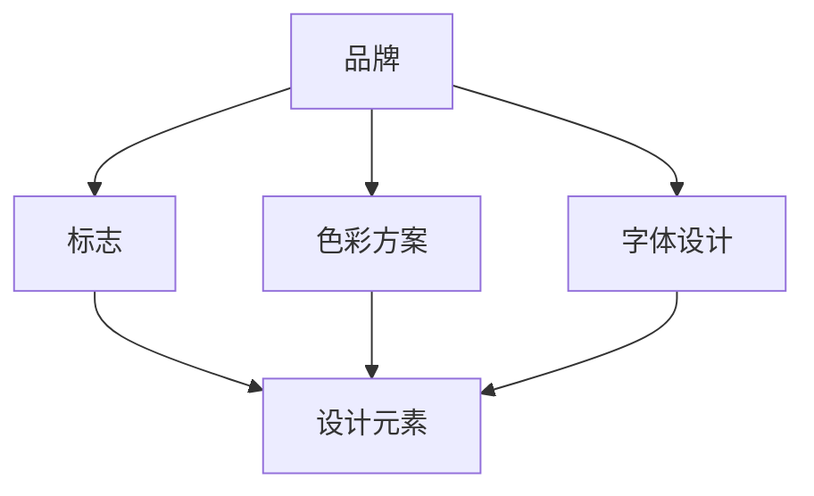
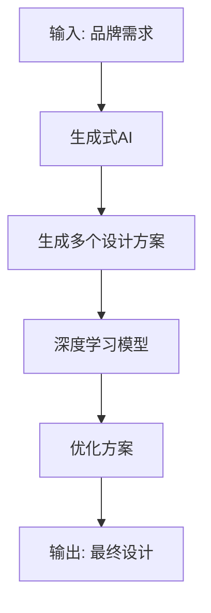
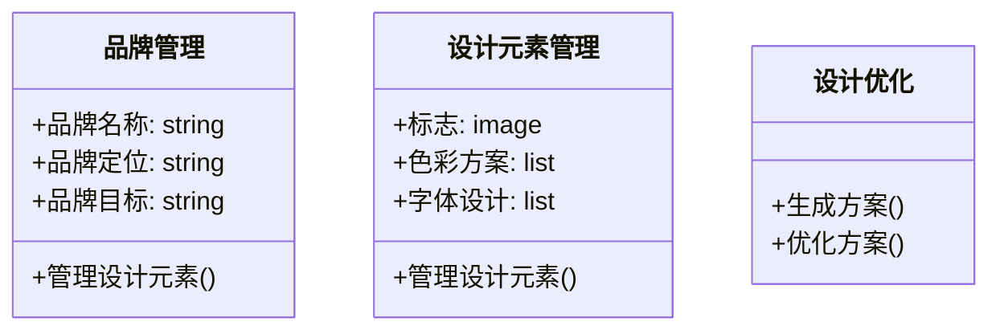
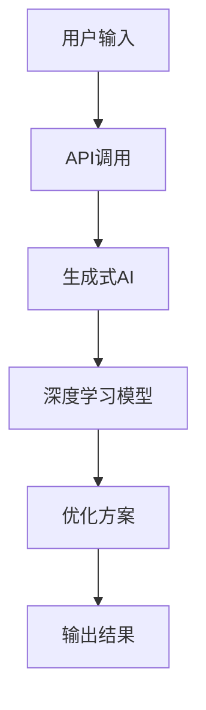
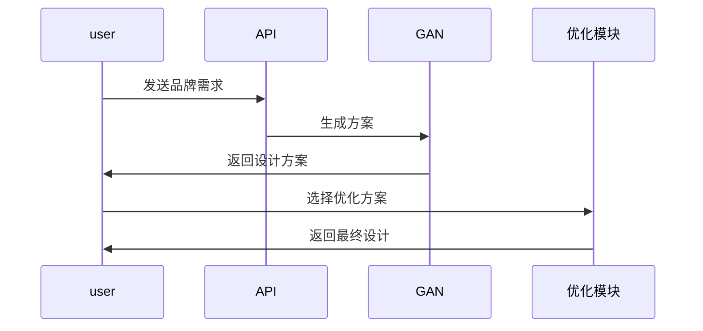

                 


# AI辅助品牌形象设计与管理的创新方法

---

## 关键词：AI辅助设计、品牌形象管理、生成式AI、深度学习、设计优化

---

## 摘要：  
随着人工智能技术的飞速发展，AI在品牌形象设计与管理领域的应用日益广泛。本文系统性地探讨了AI辅助品牌形象设计与管理的核心概念、算法原理、系统架构以及实际应用案例。通过分析AI技术在设计流程中的角色，提出了一种创新的设计与管理方法，旨在为品牌设计人员和管理者提供理论支持与实践指导。文章从问题背景出发，深入解析了AI技术的优势与挑战，并通过具体案例展示了AI在品牌形象设计中的实际应用价值。

---

# 第一部分: AI辅助品牌形象设计与管理的背景与核心概念

---

## 第1章: AI与品牌形象设计的背景与问题背景

### 1.1 AI技术的发展与应用背景

#### 1.1.1 AI技术的演进历程  
人工智能（Artificial Intelligence, AI）技术的发展经历了多个阶段，从早期的符号逻辑推理到现在的深度学习，AI已经渗透到各个领域。近年来，生成式AI（Generative AI）的突破性进展，使得AI能够生成高质量的设计方案，为品牌形象设计带来了新的可能性。

#### 1.1.2 AI在设计领域的应用现状  
AI在设计领域的应用主要集中在图像生成、色彩搭配、字体设计等方面。生成式AI工具（如MidJourney、DALL·E）能够根据用户输入的关键词生成设计灵感图，而基于深度学习的风格迁移技术则能够将一种设计风格迁移到另一种场景中。

#### 1.1.3 品牌形象设计的传统模式与局限性  
传统的品牌形象设计依赖于设计师的创造力和经验，设计过程耗时且成本较高。此外，设计结果往往受限于设计师的个人风格，难以快速满足多样化的品牌需求。

---

### 1.2 品牌形象设计的核心问题

#### 1.2.1 品牌形象设计的基本概念  
品牌形象是品牌在消费者心中形成的视觉和情感印象，包括品牌名称、标志、色彩方案、字体设计等元素。

#### 1.2.2 传统设计中的痛点与挑战  
- **痛点1**：设计周期长，效率低。  
- **痛点2**：设计师依赖个人经验，难以满足多样化的品牌需求。  
- **痛点3**：设计结果缺乏数据分析支持，难以量化评估。  

#### 1.2.3 AI技术如何解决这些问题  
AI技术能够快速生成多种设计方案，提供数据支持的决策依据，并通过自动化工具提高设计效率。

---

### 1.3 问题背景与目标设定

#### 1.3.1 问题背景的详细描述  
品牌形象设计的复杂性在于需要兼顾艺术性与商业目标。传统设计过程缺乏系统性，难以满足现代品牌的快速迭代需求。

#### 1.3.2 设定目标与边界条件  
本文的目标是通过AI技术辅助品牌形象设计与管理，实现设计过程的高效化、系统化与智能化。边界条件包括：支持多种设计风格、提供数据驱动的优化建议、适应不同品牌的需求。

#### 1.3.3 核心问题的解决思路  
通过结合生成式AI与深度学习技术，构建一个智能化的品牌形象设计与管理系统，能够根据品牌需求快速生成设计方案，并通过数据反馈不断优化设计结果。

---

### 1.4 核心概念与外延

#### 1.4.1 核心概念的定义与组成  
AI辅助品牌形象设计的核心概念包括：生成式AI、设计优化算法、数据驱动的设计决策。

#### 1.4.2 相关概念的对比分析  
| 概念 | 描述 | 与AI的结合方式 |  
|------|------|----------------|  
| 生成式AI | 基于概率模型生成内容 | 用于设计元素的自动生成 |  
| 深度学习 | 通过多层神经网络学习数据特征 | 用于风格迁移与设计优化 |  
| 迁移学习 | 将已学习的知识应用到新任务 | 用于跨领域的设计风格迁移 |  

#### 1.4.3 核心要素的结构化分析  
品牌形象设计的核心要素包括：品牌名称、标志、色彩方案、字体设计、品牌语录。AI技术可以对这些要素进行智能化处理，生成符合品牌定位的设计方案。

---

## 第2章: AI辅助品牌形象设计的核心概念与联系

### 2.1 核心概念原理

#### 2.1.1 生成式AI的基本原理  
生成式AI通过概率模型（如GAN、VAE）生成新内容。例如，生成式AI可以根据品牌关键词生成多种标志设计。

#### 2.1.2 深度学习在设计中的应用  
深度学习模型（如卷积神经网络CNN）可以用于图像识别与风格迁移，帮助设计师快速生成符合特定风格的设计方案。

#### 2.1.3 迁移学习的原理与优势  
迁移学习通过将已学习的知识应用到新任务中，能够将一种设计风格迁移到另一种场景中。

---

### 2.2 核心概念属性对比

#### 2.2.1 不同AI技术的特征对比（表格）  
| 技术 | 输入 | 输出 | 优势 |  
|------|------|------|------|  
| GAN | 品牌关键词 | 多种标志设计 | 高度多样化 |  
| VAE | 品牌需求 | 多种设计方案 | 灵活性高 |  
| CNN | 设计图像 | 风格迁移结果 | 高保真度 |  

---

### 2.3 ER实体关系图架构

#### 2.3.1 实体关系图的构建  


#### 2.3.2 关系图的分析与解释  
上述关系图表明，品牌与标志、色彩方案、字体设计等实体相关联，标志、色彩方案和字体设计共同构成了设计元素。

#### 2.3.3 实体关系图的应用价值  
通过实体关系图可以清晰地理解品牌形象设计的核心要素及其相互关系，为后续的系统设计提供依据。

---

## 第3章: AI辅助品牌形象设计的算法原理

### 3.1 生成式AI的数学模型

#### 3.1.1 概率分布与生成模型  
生成式AI通过概率模型生成内容，常用的技术包括变分自编码器（VAE）和生成对抗网络（GAN）。

#### 3.1.2 最大似然估计  
最大似然估计（Maximum Likelihood Estimation, MLE）用于训练生成模型，以最大化生成数据的概率。

#### 3.1.3 变分自编码器（VAE）  
变分自编码器通过编码器-解码器结构生成数据，其损失函数包括重构损失和正则化损失。

$$ \text{VAE损失} = \text{重构损失} + \text{正则化损失} $$

#### 3.1.4 Transformer模型  
Transformer模型通过自注意力机制生成序列数据，常用于文本生成与图像生成。

---

### 3.2 深度学习在设计优化中的应用

#### 3.2.1 图像识别与分类  
深度学习模型（如ResNet）用于图像分类任务，能够识别设计元素的类型。

#### 3.2.2 风格迁移与图像生成  
通过深度学习模型实现图像风格迁移，生成符合特定风格的设计方案。

---

### 3.3 算法流程图



---

## 第4章: AI辅助品牌形象设计的系统分析与架构设计

### 4.1 系统功能设计

#### 4.1.1 领域模型类图  


#### 4.1.2 系统架构设计  


#### 4.1.3 接口设计  
API接口用于接收品牌需求，返回生成的设计方案。

#### 4.1.4 交互流程图  


---

## 第5章: 项目实战

### 5.1 环境配置

#### 5.1.1 Python环境  
安装Python 3.8以上版本。

#### 5.1.2 依赖库安装  
安装TensorFlow、Keras、Mermaid等库。

### 5.2 核心代码实现

#### 5.2.1 生成式AI实现  
```python
import tensorflow as tf
from tensorflow.keras import layers

def build_model():
    encoder = layers.Dense(64, activation='relu')(input)
    z = layers.Dense(32, activation='relu')(encoder)
    decoder = layers.Dense(64, activation='relu')(z)
    output = layers.Dense(128, activation='sigmoid')(decoder)
    return Model(inputs=input, outputs=output)
```

#### 5.2.2 设计优化实现  
```python
import numpy as np

def optimize设计方案(设计方案, 目标):
    for i in range(100):
        优化结果 = 优化算法.运行(设计方案)
        如果优化结果接近目标:
            返回优化结果
    返回最佳结果
```

---

## 第6章: 最佳实践与小结

### 6.1 最佳实践

#### 6.1.1 数据质量的重要性  
确保训练数据的多样性和高质量，能够显著提升生成模型的效果。

#### 6.1.2 系统维护与更新  
定期更新模型参数，保持系统的高效运行。

### 6.2 小结

本文系统性地探讨了AI辅助品牌形象设计与管理的创新方法，通过理论分析与实践案例，展示了AI技术在设计领域的巨大潜力。未来，随着AI技术的不断发展，品牌形象设计将更加智能化与个性化。

---

## 作者：AI天才研究院/AI Genius Institute & 禅与计算机程序设计艺术 /Zen And The Art of Computer Programming

