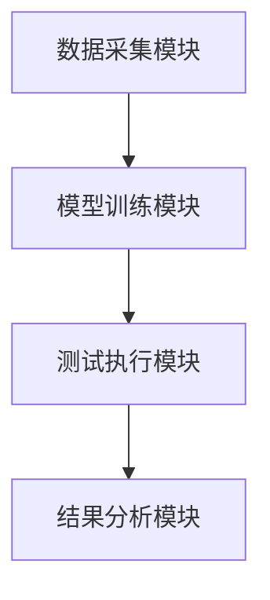

                 


# AI辅助新产品开发与市场测试的创新方法

> 关键词：AI，新产品开发，市场测试，创新方法，机器学习，NLP，系统架构

> 摘要：本文探讨了AI在新产品开发与市场测试中的创新方法，重点分析了机器学习和自然语言处理在产品设计和市场反馈分析中的应用，提出了基于AI的优化流程和系统架构设计，通过实际案例展示了AI如何提升产品开发效率和市场测试效果。

---

## 第一部分: AI辅助新产品开发与市场测试的背景与概念

### 第1章: AI辅助新产品开发与市场测试的背景与概念

#### 1.1 AI在新产品开发中的作用
##### 1.1.1 传统产品开发流程的局限性
传统的新产品开发流程通常依赖于人工经验和试错法，这种方式效率低下、成本高昂，且难以捕捉用户的真实需求。产品开发周期长，用户反馈滞后，容易导致市场错失和资源浪费。

##### 1.1.2 AI如何提升产品开发效率
AI通过机器学习和数据分析，能够快速预测用户需求、优化产品设计、减少试错成本。例如，利用监督学习模型预测市场需求，无监督学习分析用户行为数据，强化学习优化产品功能。

##### 1.1.3 AI在产品创新中的潜力
AI能够从海量数据中提取非直观的模式，帮助发现新的产品机会。例如，基于NLP分析社交媒体数据，挖掘用户未明述的需求，从而推动产品创新。

#### 1.2 市场测试的核心挑战
##### 1.2.1 用户需求分析的难点
市场测试的核心是了解用户需求，但用户反馈往往模糊、不完整，难以直接用于产品优化。

##### 1.2.2 市场反馈的不确定性
市场反馈受到多种因素影响，例如用户主观性、测试环境等，传统方法难以准确捕捉真实需求。

##### 1.2.3 AI在市场测试中的应用前景
AI能够通过数据驱动的方法，从大量反馈中提取规律，帮助产品团队更准确地理解用户需求。

#### 1.3 AI辅助新产品开发与市场测试的创新方法
##### 1.3.1 方法的核心理念
AI辅助的方法通过数据驱动、自动化分析和智能决策，提升产品开发效率和市场测试的准确性。

##### 1.3.2 方法的主要优势
- 提高开发效率
- 减少试错成本
- 增强市场洞察力

##### 1.3.3 方法的实施步骤
1. 数据采集与清洗
2. 模型训练与优化
3. 测试执行与结果分析

#### 1.4 本章小结
通过AI辅助，新产品开发和市场测试能够更加高效、精准，为产品团队提供强有力的支持。

---

## 第二部分: AI辅助新产品开发的核心概念与原理

### 第2章: AI辅助开发的关键技术

#### 2.1 机器学习在产品设计中的应用
##### 2.1.1 监督学习与产品需求预测
通过监督学习模型，预测用户对产品的潜在需求。例如，使用线性回归模型预测市场需求量：

$$ y = \beta_0 + \beta_1x + \epsilon $$

其中，$y$ 是需求量，$x$ 是影响需求的变量。

##### 2.1.2 无监督学习与用户行为分析
利用无监督学习技术，分析用户行为数据，识别用户群体的特征和行为模式。例如，使用K-means聚类算法将用户分为不同的群体。

##### 2.1.3 强化学习与产品优化
通过强化学习优化产品功能，例如动态调整产品参数以提高用户满意度。

#### 2.2 自然语言处理在市场测试中的应用
##### 2.2.1 NLP技术在用户反馈分析中的应用
通过NLP技术分析用户反馈文本，提取情感倾向和关键词。例如，使用文本情感分析模型判断用户对产品的满意度：

$$ \text{sentiment} = \text{classify}(text) $$

##### 2.2.2 基于NLP的产品描述优化
通过NLP技术生成优化的产品描述，提高用户吸引力。

##### 2.2.3 NLP在市场趋势预测中的作用
利用NLP分析社交媒体数据，预测市场趋势。

#### 2.3 数据驱动的市场测试方法
##### 2.3.1 数据采集与清洗
通过问卷调查、用户访谈等方式采集数据，并进行数据清洗和预处理。

##### 2.3.2 数据分析与建模
使用统计分析和机器学习模型分析数据，提取有价值的洞察。

##### 2.3.3 数据驱动的决策支持
基于数据分析结果，制定市场测试策略。

#### 2.4 本章小结
通过机器学习和NLP技术，AI能够显著提升新产品开发的效率和精准度。

---

## 第三部分: AI辅助市场测试的创新方法

### 第3章: 基于AI的市场测试流程优化

#### 3.1 市场测试的传统流程
##### 3.1.1 测试计划制定
传统市场测试流程通常包括测试目标设定、测试计划制定、用户招募与筛选等步骤。

##### 3.1.2 用户招募与筛选
传统方法依赖人工筛选用户，效率低下且容易引入偏差。

##### 3.1.3 数据收集与分析
传统方法依赖人工分析数据，效率低且容易出错。

#### 3.2 基于AI的市场测试优化步骤
##### 3.2.1 数据预处理与特征提取
通过AI技术自动化完成数据预处理和特征提取。

##### 3.2.2 AI模型在测试设计中的应用
利用AI模型优化测试设计，例如通过强化学习动态调整测试方案。

##### 3.2.3 测试结果的智能分析
通过AI技术自动化分析测试结果，提取有价值的洞察。

#### 3.3 AI驱动的市场测试效果提升
##### 3.3.1 基于AI的用户分群
通过AI技术将用户分为不同群体，制定针对性的测试策略。

##### 3.3.2 基于AI的测试结果预测
通过AI模型预测测试结果，帮助产品团队提前做出决策。

##### 3.3.3 基于AI的测试反馈优化
通过AI技术优化测试反馈，帮助产品团队快速迭代产品。

#### 3.4 本章小结
通过AI技术优化市场测试流程，能够显著提升测试效率和效果。

---

## 第四部分: AI辅助新产品开发与市场测试的系统架构

### 第4章: 系统架构设计

#### 4.1 系统功能模块划分
##### 4.1.1 数据采集模块
负责采集用户行为数据和市场反馈数据。

##### 4.1.2 模型训练模块
负责训练机器学习模型和NLP模型。

##### 4.1.3 测试执行模块
负责执行市场测试并收集数据。

##### 4.1.4 结果分析模块
负责分析测试结果并生成洞察报告。

#### 4.2 系统架构图


#### 4.3 系统接口设计
##### 4.3.1 数据接口规范
定义数据格式和接口协议。

##### 4.3.2 API接口设计
设计RESTful API接口，支持数据交互。

#### 4.4 系统交互流程
##### 4.4.1 用户与系统的交互流程
用户提交需求，系统生成测试方案。

##### 4.4.2 系统内部模块交互流程
数据采集模块采集数据，模型训练模块训练模型，测试执行模块执行测试，结果分析模块分析结果。

#### 4.5 本章小结
通过系统化设计，AI辅助开发和市场测试的效率和效果得到显著提升。

---

## 第五部分: 项目实战与案例分析

### 第5章: 项目实战

#### 5.1 环境安装与配置
##### 5.1.1 开发环境搭建
安装Python、Jupyter Notebook、TensorFlow等工具。

##### 5.1.2 数据集准备
收集用户行为数据和市场反馈数据。

##### 5.1.3 工具安装
安装NLP处理工具如spaCy和Gensim。

#### 5.2 系统核心实现
##### 5.2.1 数据采集与清洗
使用爬虫采集数据，并进行数据清洗和预处理。

##### 5.2.2 模型训练与优化
训练机器学习模型和NLP模型，优化模型性能。

##### 5.2.3 测试执行与结果分析
执行市场测试，分析测试结果并生成报告。

#### 5.3 代码实现
##### 5.3.1 数据采集代码
```python
import requests
from bs4 import BeautifulSoup

url = 'https://example.com'
response = requests.get(url)
data = BeautifulSoup(response.text, 'html.parser')
```

##### 5.3.2 模型训练代码
```python
import tensorflow as tf
from tensorflow.keras import layers

model = tf.keras.Sequential([
    layers.Dense(64, activation='relu'),
    layers.Dense(1, activation='sigmoid')
])
model.compile(optimizer='adam', loss='binary_crossentropy', metrics=['accuracy'])
model.fit(X_train, y_train, epochs=10, batch_size=32)
```

##### 5.3.3 结果分析代码
```python
import pandas as pd
import matplotlib.pyplot as plt

df = pd.read_csv('results.csv')
plt.plot(df['accuracy'])
plt.show()
```

#### 5.4 案例分析
##### 5.4.1 案例背景
介绍实际项目背景和目标。

##### 5.4.2 数据分析
展示数据分析结果和模型性能。

##### 5.4.3 测试结果
展示测试结果和优化建议。

#### 5.5 本章小结
通过实际案例，展示了AI辅助新产品开发与市场测试的具体应用和效果。

---

## 作者：AI天才研究院/AI Genius Institute & 禅与计算机程序设计艺术 /Zen And The Art of Computer Programming

---

本文通过详细分析AI在新产品开发与市场测试中的创新方法，结合理论与实践，展示了如何利用AI技术提升产品开发效率和市场测试效果。希望本文能够为产品开发团队和市场测试人员提供有价值的参考和启发。

