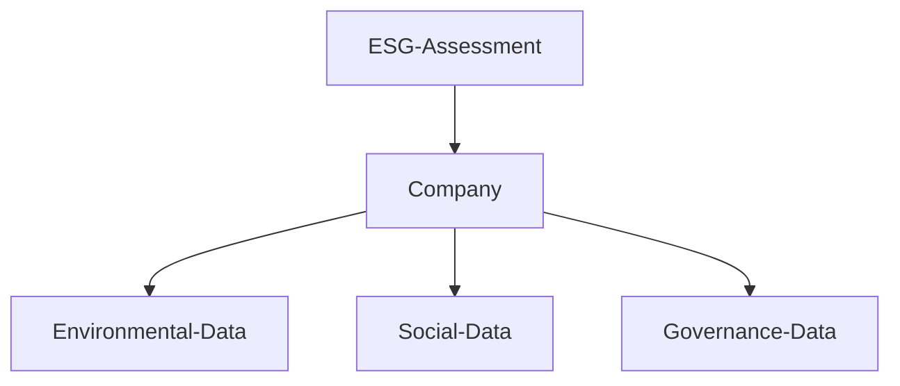
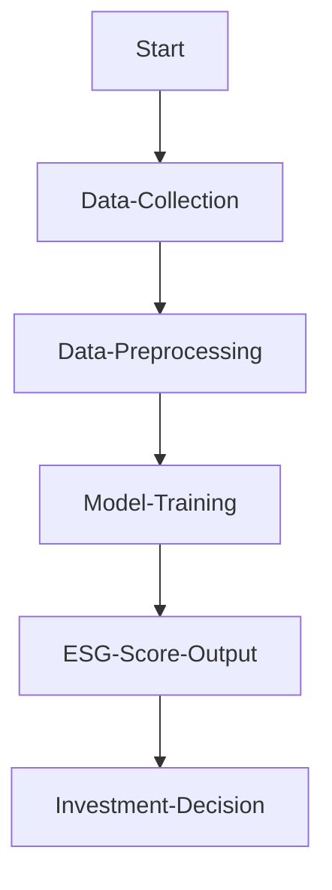
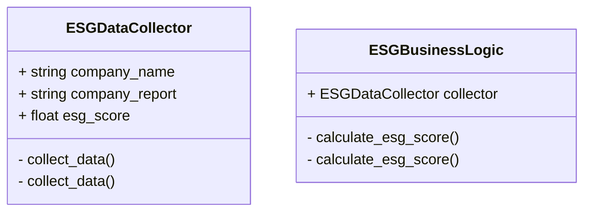
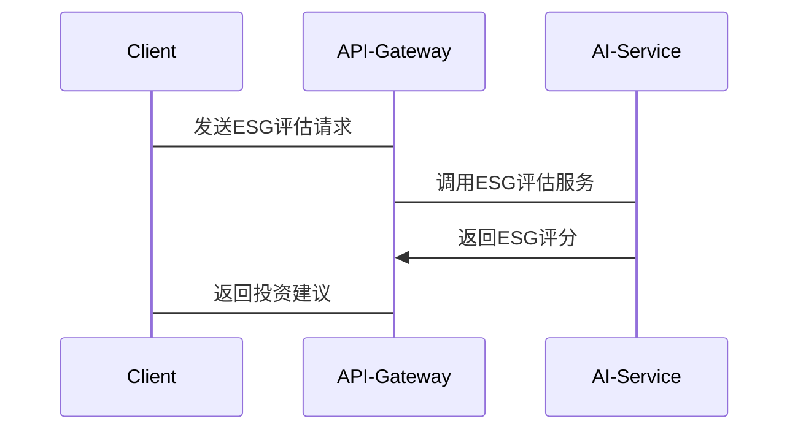

                 


# AI辅助的ESG投资影响评估

> 关键词：人工智能，ESG投资，环境社会公司治理，自然语言处理，机器学习，投资影响评估

> 摘要：本文探讨了人工智能技术在环境社会公司治理（ESG）投资影响评估中的应用。通过分析ESG评估的核心概念、AI技术的优势以及具体的算法实现，本文详细阐述了如何利用AI技术优化ESG投资决策过程。文章内容涵盖了ESG评估的背景介绍、核心概念与联系、算法原理、系统架构设计、项目实战以及总结与展望。

---

# 第一部分: AI辅助的ESG投资影响评估背景与核心概念

## 第1章: ESG投资与AI辅助评估的背景介绍

### 1.1 ESG投资的核心概念

ESG投资是一种关注环境、社会和公司治理因素的投资策略，旨在通过综合评估企业在这些方面的表现，帮助投资者做出更可持续和负责任的投资决策。以下是ESG三个维度的核心概念：

#### 1.1.1 环境（Environmental）因素
环境因素关注企业在环境保护方面的表现，包括碳排放、能源消耗、资源利用效率等。投资者通过评估这些指标，可以识别出在可持续发展方面表现良好的企业。

#### 1.1.2 社会（Social）因素
社会因素关注企业在社会责任方面的表现，包括员工权益、劳动条件、社区关系、产品安全等方面。企业是否遵守社会规范、履行社会责任是评估其社会价值的重要指标。

#### 1.1.3 公司治理（Governance）因素
公司治理因素关注企业的管理结构、董事会构成、内部控制、透明度等方面。良好的公司治理是企业长期稳定发展的基础，也是投资者关注的重点。

### 1.2 AI技术在投资领域的应用背景

随着人工智能技术的快速发展，AI在金融领域的应用日益广泛。通过自然语言处理（NLP）、机器学习和数据挖掘等技术，AI可以帮助投资者更高效地处理海量数据，发现潜在的投资机会，降低投资风险。

#### 1.2.1 AI在金融领域的应用现状
AI技术在金融领域的应用包括股票预测、风险管理、信用评估、智能投顾等。AI通过分析历史数据和市场趋势，可以提供更精准的投资建议。

#### 1.2.2 AI在ESG投资中的独特价值
ESG投资需要处理大量的非结构化数据，如新闻报道、公司年报、社会责任报告等。AI技术可以通过自然语言处理技术，从这些数据中提取关键信息，生成ESG评分。

#### 1.2.3 当前ESG投资面临的挑战
尽管ESG投资具有重要意义，但在实际操作中仍然面临一些挑战。例如，ESG数据的获取和标准化问题、ESG评分的主观性、以及如何将ESG因素与投资决策有效结合等。

### 1.3 本章小结

本章介绍了ESG投资的核心概念以及AI技术在投资领域的应用背景。通过分析环境、社会和公司治理三个维度，我们可以看到ESG投资的多维度特征。同时，AI技术在处理非结构化数据和提高投资决策效率方面的优势，使其成为ESG投资的重要辅助工具。

---

## 第2章: AI辅助ESG投资影响评估的核心概念与联系

### 2.1 核心概念原理

#### 2.1.1 ESG评估的多维度特征
ESG评估需要综合考虑环境、社会和公司治理三个维度，每个维度又包含多个具体指标。例如，环境维度可以包括碳排放、能源消耗等指标，社会维度可以包括员工权益、社区关系等指标，治理维度可以包括董事会构成、内部控制等指标。

#### 2.1.2 AI技术在数据处理中的优势
AI技术可以通过自然语言处理（NLP）技术从公司年报、新闻报道等文本数据中提取关键词和情感倾向，生成企业社会责任报告。同时，机器学习模型可以通过历史数据训练，预测企业的ESG评分。

#### 2.1.3 ESG评分与投资决策的关系
ESG评分是投资者评估企业可持续发展能力的重要依据。通过AI生成的ESG评分，投资者可以更准确地评估企业的风险和收益，制定更科学的投资策略。

### 2.2 核心概念属性特征对比表

以下表格对比了ESG评估和AI辅助评估的核心概念属性特征：

| 概念       | 属性             | 特征                                                                 |
|------------|------------------|----------------------------------------------------------------------|
| ESG评估    | 数据来源         | 公司财报、新闻报道、第三方评级报告                                   |
|            | 评估指标         | 环境、社会、公司治理三个维度的具体指标                               |
| AI辅助评估 | 方法             | 自然语言处理（NLP）、机器学习、数据挖掘                               |
|            | 数据处理能力     | 高效处理非结构化数据，提取关键信息                                   |

### 2.3 ESG评估的ER实体关系图

以下是ESG评估的ER实体关系图：



---

## 第3章: AI辅助ESG投资影响评估的算法原理

### 3.1 算法原理概述

#### 3.1.1 自然语言处理（NLP）在ESG文本数据中的应用
自然语言处理技术可以对公司的新闻报道、年报等文本数据进行情感分析，提取关键词，生成企业社会责任报告。

#### 3.1.2 机器学习模型在ESG评分预测中的作用
机器学习模型（如随机森林、神经网络）可以通过历史ESG评分和公司财务数据，预测未来的ESG评分。

#### 3.1.3 数据挖掘技术在ESG数据整合中的应用
数据挖掘技术可以对来自不同来源的ESG数据进行清洗、整合和分析，生成统一的ESG评分。

### 3.2 算法流程图

以下是AI辅助ESG投资影响评估的算法流程图：



### 3.3 算法实现代码示例

以下是使用Python实现的随机森林模型预测ESG评分的代码示例：

```python
import pandas as pd
from sklearn.ensemble import RandomForestRegressor
from sklearn.model_selection import train_test_split

# 数据预处理
data = pd.read_csv('esg_data.csv')
X = data.drop('esg_score', axis=1)
y = data['esg_score']

# 划分训练集和测试集
X_train, X_test, y_train, y_test = train_test_split(X, y, test_size=0.2, random_state=42)

# 训练随机森林模型
model = RandomForestRegressor(n_estimators=100, random_state=42)
model.fit(X_train, y_train)

# 预测测试集的ESG评分
y_pred = model.predict(X_test)

# 输出模型性能
print('模型性能：')
print('均方误差：', mean_squared_error(y_test, y_pred))
print('决定系数：', r2_score(y_test, y_pred))
```

---

# 第四部分: 系统分析与架构设计方案

## 第4章: 系统分析与架构设计

### 4.1 问题场景介绍

ESG投资影响评估系统需要处理大量的非结构化数据，如新闻报道、公司年报等。通过AI技术，我们可以从这些数据中提取关键信息，生成企业的ESG评分，辅助投资者做出更科学的投资决策。

### 4.2 项目介绍

本项目旨在开发一个AI辅助的ESG投资影响评估系统，该系统可以通过自然语言处理技术分析企业的文本数据，生成ESG评分，并提供投资建议。

### 4.3 系统功能设计

以下是系统的功能模块设计：

#### 4.3.1 领域模型（Mermaid类图）



#### 4.3.2 系统架构设计（Mermaid架构图）

```mermaid
client --> API-Gateway: API请求
API-Gateway --> AI-Service: 调用ESG评估服务
AI-Service --> ESG-Data-Collector: 收集数据
ESG-Data-Collector --> Model-Trainer: 训练模型
Model-Trainer --> ESG-Score-Generator: 生成ESG评分
ESG-Score-Generator --> Investment-Advisor: 提供投资建议
```

### 4.4 系统接口设计

系统接口设计包括以下几个部分：

- 数据收集接口：用于从公司财报、新闻报道等数据源收集数据。
- 数据预处理接口：对收集的数据进行清洗和转换。
- 模型训练接口：训练机器学习模型，生成ESG评分。
- 投资建议接口：根据ESG评分，提供投资建议。

### 4.5 系统交互流程（Mermaid序列图）



---

# 第五部分: 项目实战

## 第5章: 项目实战

### 5.1 环境安装

为了运行本项目，您需要安装以下Python库：

```bash
pip install pandas scikit-learn matplotlib
```

### 5.2 系统核心实现源代码

以下是项目的实现代码：

```python
import pandas as pd
from sklearn.ensemble import RandomForestRegressor
from sklearn.model_selection import train_test_split
from sklearn.metrics import mean_squared_error, r2_score

# 数据预处理
data = pd.read_csv('esg_data.csv')
X = data.drop('esg_score', axis=1)
y = data['esg_score']

# 划分训练集和测试集
X_train, X_test, y_train, y_test = train_test_split(X, y, test_size=0.2, random_state=42)

# 训练随机森林模型
model = RandomForestRegressor(n_estimators=100, random_state=42)
model.fit(X_train, y_train)

# 预测测试集的ESG评分
y_pred = model.predict(X_test)

# 输出模型性能
print('模型性能：')
print('均方误差：', mean_squared_error(y_test, y_pred))
print('决定系数：', r2_score(y_test, y_pred))
```

### 5.3 代码应用解读与分析

通过上述代码，我们可以看到随机森林模型在ESG评分预测中的应用。模型通过训练数据学习特征的重要性，然后对测试数据进行预测。通过均方误差和决定系数，我们可以评估模型的性能。

### 5.4 实际案例分析

以下是一个实际案例分析：

假设我们有一个公司A，其环境、社会和治理三个维度的指标如下：

- 环境：碳排放量低于行业平均水平
- 社会：员工满意度高，社区关系良好
- 治理：董事会构成合理，内部控制完善

通过AI模型的预测，我们可以得出公司A的ESG评分为85分（满分100分）。投资者可以根据这个评分，结合其他因素，做出更科学的投资决策。

### 5.5 项目小结

本章通过一个实际案例，展示了如何使用AI技术进行ESG投资影响评估。通过代码实现和案例分析，我们可以看到AI在ESG投资中的巨大潜力。

---

# 第六部分: 总结与展望

## 第6章: 总结与展望

### 6.1 本章总结

本文详细探讨了人工智能技术在ESG投资影响评估中的应用。通过分析ESG评估的核心概念、AI技术的优势以及具体的算法实现，我们展示了如何利用AI技术优化ESG投资决策过程。

### 6.2 未来展望

随着AI技术的不断发展，未来在ESG投资影响评估中将有更广泛的应用。例如，通过深度学习技术，我们可以更准确地预测企业的ESG评分；通过强化学习技术，我们可以优化投资组合，降低投资风险。

### 6.3 最佳实践Tips

- 在使用AI技术进行ESG投资影响评估时，需要注意数据的质量和来源。
- 需要结合企业的实际情况，选择合适的模型和算法。
- 定期更新模型，以适应市场变化。

### 6.4 小结

ESG投资是可持续投资的重要组成部分，AI技术在其中扮演着越来越重要的角色。通过本文的探讨，我们相信未来AI技术将在ESG投资影响评估中发挥更大的作用。

---

# 作者：AI天才研究院/AI Genius Institute & 禅与计算机程序设计艺术 /Zen And The Art of Computer Programming

