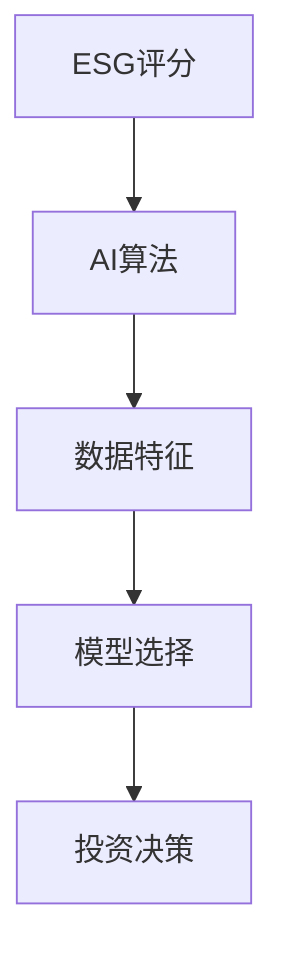
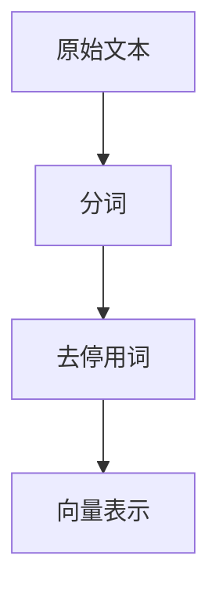
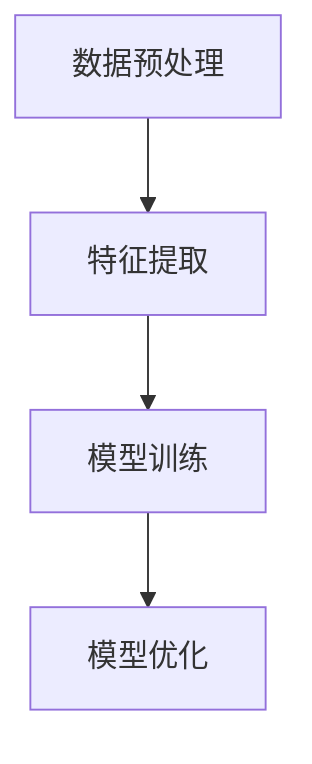
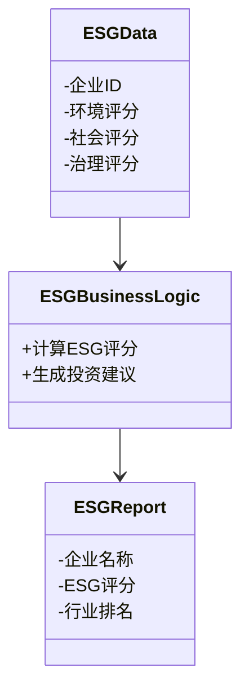
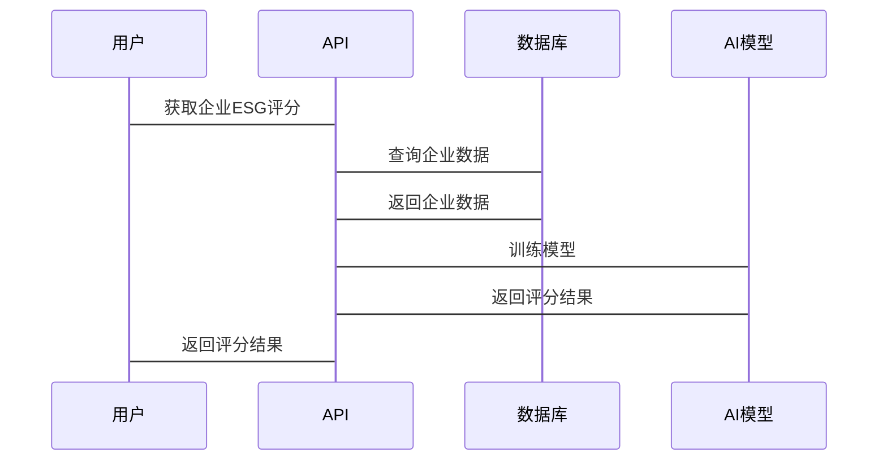

                 


# AI辅助的ESG投资筛选工具

## 关键词：AI, ESG投资, 投资筛选工具, 机器学习, 自然语言处理, 数据分析

## 摘要：  
随着全球对可持续投资的关注度不断提高，ESG（环境、社会和治理）投资已成为投资者的重要决策依据。然而，ESG数据的复杂性和多样性使得传统的人工筛选方法效率低下。本文将介绍如何利用人工智能技术构建一个高效的ESG投资筛选工具，从数据预处理、模型训练到系统架构设计，逐步分析其原理和实现方法，并通过实际案例展示其应用场景。

---

# 第1章: ESG投资与AI辅助工具概述

## 1.1 ESG投资的基本概念

### 1.1.1 环境（Environmental）因素

环境因素包括企业在环境保护方面的表现，例如碳排放、能源消耗、资源利用效率等。这些指标可以通过企业的公开报告和第三方数据源获取。

### 1.1.2 社会责任（Social）因素

社会责任因素关注企业在员工权益、劳动条件、社区贡献、人权等方面的表现。例如，企业是否遵守劳动法、是否参与社会责任项目等。

### 1.1.3 治理（Governance）因素

治理因素涉及企业的管理结构、董事会构成、透明度、内部控制等方面。例如，企业是否存在高管腐败、股东权益保护等。

## 1.2 AI辅助投资工具的必要性

### 1.2.1 ESG投资的复杂性

ESG数据通常涉及大量非结构化数据，例如企业年报、新闻报道、社会责任报告等。这些数据需要通过复杂的处理和分析才能转化为可操作的投资决策。

### 1.2.2 AI在投资决策中的优势

人工智能技术可以快速处理海量数据，发现隐藏在数据中的模式和趋势，帮助投资者更准确地评估企业的ESG表现。

### 1.2.3 ESG数据的多样性与实时性

ESG数据来源广泛，包括企业财报、新闻媒体、政府报告等。AI技术可以帮助投资者实时跟踪和分析这些数据，及时发现潜在的投资机会和风险。

## 1.3 ESG投资筛选工具的核心目标

### 1.3.1 筛选符合ESG标准的企业

通过AI算法对企业的ESG表现进行评分，帮助投资者筛选出符合ESG标准的企业。

### 1.3.2 提供ESG评分与排名

基于企业的ESG表现，提供评分和排名，帮助投资者进行横向比较。

### 1.3.3 支持投资组合优化

通过分析企业的ESG表现，帮助投资者优化投资组合，降低风险，提高收益。

## 1.4 本章小结

本章介绍了ESG投资的基本概念、AI辅助投资工具的必要性以及ESG投资筛选工具的核心目标，为后续章节的分析奠定了基础。

---

# 第2章: ESG投资筛选工具的核心概念

## 2.1 ESG评分模型

### 2.1.1 ESG评分的定义与计算方法

ESG评分是对企业在环境、社会和治理三个维度上的表现进行综合评估的结果。评分通常基于标准化的数据和模型进行计算。

### 2.1.2 不同评分机构的差异

不同的评分机构（如MSCI、Sustainalytics等）可能会采用不同的评分标准和方法，导致同一企业在不同机构中的评分存在差异。

### 2.1.3 ESG评分与投资决策的关系

ESG评分是投资者进行投资决策的重要参考依据，高评分的企业通常被视为更具可持续性和投资价值。

## 2.2 AI算法在ESG筛选中的应用

### 2.2.1 机器学习在ESG数据处理中的作用

机器学习算法可以通过对企业公开数据的分析，自动识别和提取ESG相关特征。

### 2.2.2 自然语言处理（NLP）在ESG文本分析中的应用

NLP技术可以用于分析企业的年报、社会责任报告等文本数据，提取关键信息并生成ESG评分。

### 2.2.3 时间序列分析在ESG趋势预测中的应用

通过分析企业的历史ESG表现，时间序列分析可以帮助预测未来的趋势，为投资决策提供依据。

## 2.3 数据特征与模型选择

### 2.3.1 ESG数据的特征提取

特征提取是将企业的ESG表现转化为可量化的指标，例如碳排放强度、员工满意度、董事会多样性等。

### 2.3.2 不同模型的适用场景

根据数据类型和业务需求选择合适的模型，例如使用回归模型进行评分预测，使用分类模型进行企业评级分类。

### 2.3.3 模型性能的评估指标

常用的模型评估指标包括准确率、召回率、F1分数等。

## 2.4 核心概念关系图（Mermaid）



---

# 第3章: ESG投资筛选工具的算法原理

## 3.1 文本处理与特征提取

### 3.1.1 NLP文本预处理流程



### 3.1.2 关键词提取与情感分析

使用TF-IDF算法提取关键词，并通过情感分析技术判断文本中的积极或消极情绪。

## 3.2 模型训练与优化

### 3.2.1 机器学习模型训练流程



### 3.2.2 算法实现与代码示例

```python
from sklearn.feature_extraction.text import TfidfVectorizer
from sklearn.model_selection import train_test_split
from sklearn.svm import SVC
from sklearn.metrics import accuracy_score

# 假设我们有文本数据和标签
texts = [...]  # 文本数据
labels = [...]  # 对应的标签

# 特征提取
vectorizer = TfidfVectorizer()
X = vectorizer.fit_transform(texts)

# 数据分割
X_train, X_test, y_train, y_test = train_test_split(X, labels, test_size=0.2)

# 模型训练
model = SVC()
model.fit(X_train, y_train)

# 模型评估
y_pred = model.predict(X_test)
print("准确率:", accuracy_score(y_test, y_pred))
```

## 3.3 算法原理的数学模型

### 3.3.1 TF-IDF计算公式

$$ TF-IDF = \text{TF} \times \text{IDF} $$

其中，$$\text{TF} = \frac{\text{词在文档中的出现次数}}{\text{文档总词数}}$$，$$\text{IDF} = \log\left(\frac{\text{语料库中的文档总数}}{\text{词出现的文档数}} + 1\right)$$

### 3.3.2 支持向量机（SVM）数学模型

$$ \text{目标函数: } \min_{w,b,\xi} \frac{1}{2}\|w\|^2 + C \sum_{i=1}^n \xi_i $$

$$ \text{约束条件: } y_i(w \cdot x_i + b) \geq 1 - \xi_i $$

---

# 第4章: 系统分析与架构设计方案

## 4.1 问题场景介绍

### 4.1.1 系统功能需求

ESG投资筛选工具需要实现数据采集、处理、建模、分析和结果展示等功能。

### 4.1.2 项目介绍

本项目旨在开发一个基于AI的ESG投资筛选工具，帮助投资者快速筛选出符合ESG标准的企业。

## 4.2 系统功能设计

### 4.2.1 领域模型设计（Mermaid类图）



### 4.2.2 系统架构设计（Mermaid架构图）


## 4.3 系统接口设计

### 4.3.1 API接口定义

使用RESTful API设计数据接口，例如：

- `GET /api/esg_scores?company=Apple`

- `POST /api/train_model`

## 4.4 系统交互设计（Mermaid序列图）



---

# 第5章: 项目实战

## 5.1 环境安装与配置

### 5.1.1 安装Python环境

使用Anaconda或virtualenv创建虚拟环境，并安装必要的库，例如：

- `pip install numpy pandas scikit-learn`

## 5.2 系统核心实现

### 5.2.1 数据采集与处理

```python
import pandas as pd
import requests

# 从网络获取ESG数据
url = "https://example.com/esg_data"
response = requests.get(url)
data = response.json()
df = pd.DataFrame(data)
```

### 5.2.2 模型训练与优化

```python
from sklearn.ensemble import RandomForestClassifier
from sklearn.metrics import classification_report

# 训练模型
model = RandomForestClassifier(n_estimators=100)
model.fit(X_train, y_train)

# 模型评估
y_pred = model.predict(X_test)
print(classification_report(y_test, y_pred))
```

## 5.3 实际案例分析

### 5.3.1 案例背景

假设我们有一个包含企业年报、社会责任报告和财务数据的数据库，目标是筛选出符合ESG标准的企业。

### 5.3.2 数据分析与结果展示

通过模型分析，生成企业的ESG评分和排名，并可视化展示结果。

---

# 第6章: 最佳实践、小结与展望

## 6.1 小结

本文详细介绍了AI辅助的ESG投资筛选工具的背景、核心概念、算法原理和系统设计，并通过实际案例展示了其应用。

## 6.2 注意事项

- 数据质量和完整性是模型性能的关键因素。
- 模型需要定期更新以适应市场的变化。
- 在实际应用中，需要考虑法律和合规性问题。

## 6.3 拓展阅读

- 《机器学习实战》
- 《自然语言处理入门》
- 《投资学原理》

---

# 作者：AI天才研究院/AI Genius Institute & 禅与计算机程序设计艺术 /Zen And The Art of Computer Programming

