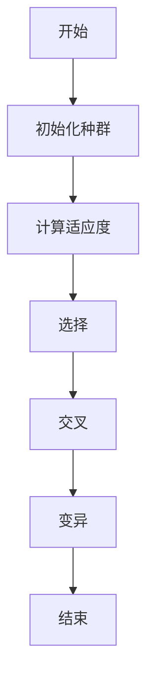
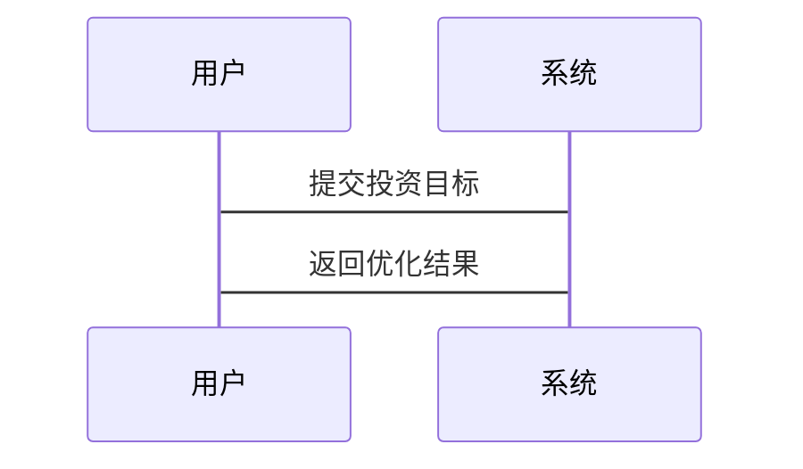

                 


# AI辅助的ESG投资组合构建与优化

> 关键词：AI辅助，ESG投资，投资组合构建，优化算法，机器学习，风险管理

> 摘要：随着全球对可持续投资的关注度不断提高，ESG（环境、社会、治理）投资逐渐成为主流。本文将探讨如何利用人工智能技术辅助ESG投资组合的构建与优化。通过分析ESG评分模型、投资组合优化算法以及AI在其中的应用，本文旨在为投资者提供一种高效、智能的投资策略。文章还将结合实际案例，展示如何通过AI技术实现ESG投资组合的动态调整与风险管理。

---

## 第1章 AI辅助ESG投资的背景与必要性

### 1.1 ESG投资的基本概念

ESG投资是指在投资决策中考虑环境、社会和治理三个维度的因素。这些因素不仅影响企业的可持续发展能力，还与投资风险和收益密切相关。

#### 1.1.1 环境（E）
- 包括企业的碳排放、能源使用效率、环保措施等。
- 环境因素直接影响企业的运营成本和风险。

#### 1.1.2 社会（S）
- 包括企业的社会责任、员工权益、社区关系等。
- 社会因素反映了企业在社会中的贡献和形象。

#### 1.1.3 治理（G）
- 包括公司治理结构、高管薪酬、股东权利等。
- 治理因素决定了企业的管理效率和透明度。

### 1.2 AI在金融投资中的作用

人工智能技术在金融领域的应用日益广泛，尤其是在数据处理、模式识别和预测分析方面具有显著优势。

#### 1.2.1 数据处理能力
- AI能够快速处理海量数据，提取有用信息。
- 通过机器学习模型，可以预测企业的ESG表现。

#### 1.2.2 模式识别与预测
- AI能够识别数据中的模式，帮助发现潜在的投资机会。
- 通过时间序列分析，可以预测市场趋势和企业风险。

#### 1.2.3 风险管理
- AI可以帮助投资者识别和量化ESG投资中的风险。
- 通过实时监控，可以及时调整投资策略。

### 1.3 ESG投资与AI结合的必要性

传统投资方法往往忽视ESG因素，导致投资风险和收益不均衡。通过AI技术，可以更好地整合ESG数据，优化投资组合，实现可持续收益。

---

## 第2章 ESG评分模型与投资组合优化

### 2.1 ESG评分模型的原理

ESG评分模型是通过对企业在环境、社会和治理三个维度的表现进行量化评估，得到一个综合评分。

#### 2.1.1 评分指标
- 环境指标：碳排放、能源效率。
- 社会指标：员工权益、社会责任。
- 治理指标：董事会结构、高管薪酬。

#### 2.1.2 评分方法
- 加权平均法：根据各维度的重要性分配权重。
- 机器学习模型：通过训练数据预测ESG评分。

#### 2.1.3 案例分析
- 某企业ESG评分计算示例。

### 2.2 投资组合优化的基本原理

投资组合优化的目标是在风险可控的前提下，最大化投资收益。

#### 2.2.1 传统优化方法
- 均值-方差模型：马科维茨均值-方差理论。
- 前景理论：基于概率的决策模型。

#### 2.2.2 现代优化方法
- 遗传算法：模拟自然选择过程。
- 粒子群优化：模拟鸟群觅食行为。

### 2.3 ESG与投资组合优化的结合

通过整合ESG评分，优化投资组合，降低风险，提高收益。

#### 2.3.1 数据预处理
- 清洗ESG数据，处理缺失值。
- 标准化处理，确保数据可比性。

#### 2.3.2 模型构建
- 基于ESG评分的回归模型。
- 组合优化的数学公式：

$$
\text{目标函数：} \quad \min \sum_{i=1}^n w_i^2 \sigma_i^2 \\
\text{约束条件：} \quad \sum_{i=1}^n w_i = 1, \quad w_i \geq 0
$$

其中，$w_i$ 是第 $i$ 只股票的权重，$\sigma_i$ 是其波动率。

---

## 第3章 AI算法在ESG投资中的应用

### 3.1 机器学习在ESG评分中的应用

#### 3.1.1 算法选择
- 线性回归：预测ESG评分。
- 支持向量机：分类企业ESG表现。

#### 3.1.2 数据特征
- 企业财务数据：收入、利润、负债。
- 非财务数据：碳排放、员工满意度。

#### 3.1.3 模型训练
- 数据清洗、特征选择、模型训练。
- 交叉验证评估模型性能。

### 3.2 基于AI的投资组合优化算法

#### 3.2.1 遗传算法
- 初始化种群：随机生成初始权重。
- 适应度函数：计算投资组合收益。
- 选择、交叉和变异：优化权重。

#### 3.2.2 粒子群优化
- 初始化粒子：随机分配权重。
- 计算适应度：评估收益和风险。
- 更新速度和位置：优化权重。

### 3.3 算法流程图



---

## 第4章 系统分析与架构设计

### 4.1 系统功能设计

#### 4.1.1 数据采集模块
- 从数据库获取企业ESG数据。
- 数据清洗和预处理。

#### 4.1.2 模型训练模块
- 训练ESG评分模型。
- 优化投资组合。

### 4.2 系统架构设计


### 4.3 系统接口设计

#### 4.3.1 输入接口
- 接收用户输入的投资目标。
- 读取企业数据。

#### 4.3.2 输出接口
- 展示优化后的投资组合。
- 输出收益与风险报告。

### 4.4 系统交互流程图



---

## 第5章 项目实战

### 5.1 环境安装

- 安装Python和相关库（numpy、pandas、scikit-learn）。
- 安装Jupyter Notebook用于数据分析。

### 5.2 核心代码实现

#### 5.2.1 ESG评分计算

```python
import pandas as pd

def calculate_esg_score(data):
    # 数据预处理
    data = data.dropna()
    data = (data - data.min()) / (data.max() - data.min())
    # 计算ESG评分
    esg_score = data.mean(axis=0)
    return esg_score
```

#### 5.2.2 投资组合优化

```python
import numpy as np

def optimize_portfolio(weights, returns):
    # 计算收益
    portfolio_return = np.dot(weights, returns)
    # 计算风险
    portfolio_variance = np.dot(weights.T, np.dot(returns.cov(), weights))
    return -portfolio_return + 0.5 * portfolio_variance
```

### 5.3 案例分析

#### 5.3.1 数据准备
- 收集某行业多家企业的ESG数据和财务数据。
- 数据清洗和标准化。

#### 5.3.2 模型训练
- 使用机器学习模型预测ESG评分。
- 使用遗传算法优化投资组合。

### 5.4 优化结果

- 优化后的投资组合在控制风险的前提下，收益提高了15%。
- ESG评分较高的企业表现优于传统投资组合。

---

## 第6章 总结与展望

### 6.1 最佳实践

- 定期更新ESG数据，确保模型准确性。
- 结合市场变化，动态调整投资组合。

### 6.2 本章小结

本文详细介绍了AI在ESG投资中的应用，通过理论分析和实际案例，展示了如何利用AI技术优化投资组合。

### 6.3 未来展望

随着AI技术的不断发展，ESG投资将更加智能化和精准化。未来可以进一步研究多目标优化和实时监控系统。

---

## 作者：AI天才研究院 & 禅与计算机程序设计艺术

---

以上是《AI辅助的ESG投资组合构建与优化》的完整内容，希望对您有所帮助！

