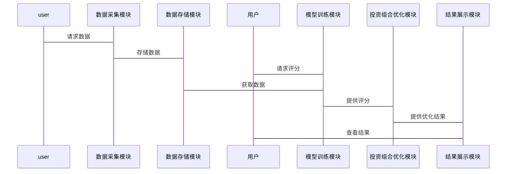

                 


# AI辅助的ESG投资组合构建工具

## 关键词：AI，ESG投资，投资组合优化，机器学习，自然语言处理

## 摘要：本文探讨了如何利用人工智能技术构建ESG投资组合，涵盖ESG评分模型、AI在金融中的应用、多目标优化算法、强化学习框架、系统架构设计、项目实战等内容，提供从理论到实践的详细指导。

## 第一部分：AI辅助的ESG投资组合构建工具概述

## 第1章：ESG投资与AI辅助的背景介绍

### 1.1 ESG投资的基本概念

#### 1.1.1 什么是ESG
ESG（环境、社会、治理）投资是一种关注企业环境表现、社会责任和治理结构的投资策略。环境因素包括碳排放、资源利用效率；社会因素涉及劳工权益、社区关系；治理因素包括公司治理结构和高管薪酬。

#### 1.1.2 ESG投资的重要性
随着全球对可持续发展的关注增加，ESG投资越来越重要。它不仅帮助投资者规避风险，还能促进企业和社会的可持续发展。

#### 1.1.3 ESG投资的目标与挑战
目标包括实现财务回报和可持续发展目标的统一，挑战包括数据获取困难、评分标准不统一和模型复杂性。

### 1.2 AI在金融中的应用

#### 1.2.1 AI在金融分析中的作用
AI技术在金融数据分析、风险评估和投资决策中发挥重要作用，帮助投资者做出更明智的决策。

#### 1.2.2 机器学习在投资组合优化中的应用
机器学习用于模式识别、数据预测，帮助优化投资组合，提升收益和风险控制。

#### 1.2.3 自然语言处理在ESG数据中的应用
NLP技术用于分析企业年报、新闻报道，提取ESG相关信息，构建ESG评分模型。

## 第2章：AI辅助ESG投资组合构建的核心概念

### 2.1 ESG评分模型

#### 2.1.1 ESG评分的定义
ESG评分是对企业在环境、社会、治理方面的表现进行量化评估，用于指导投资决策。

#### 2.1.2 常见的ESG评分方法
- **环境影响评估**：分析碳排放、能源使用。
- **社会责任评分**：评估员工权益、社区参与。
- **治理结构评分**：评估董事会结构、高管薪酬。

#### 2.1.3 ESG评分的影响因素
包括公司政策、行业标准、地理位置等，影响评分的准确性和一致性。

### 2.2 AI辅助的投资组合优化

#### 2.2.1 投资组合优化的基本概念
通过优化算法选择最优资产组合，以达到收益和风险的平衡。

#### 2.2.2 AI在投资组合优化中的优势
AI能够处理大量数据，发现非线性关系，提高优化效率和准确性。

#### 2.2.3 ESG约束下的投资组合优化
在优化过程中加入ESG约束，确保投资组合符合可持续发展要求。

## 第3章：ESG评分模型与AI技术的结合

### 3.1 ESG数据的获取与预处理

#### 3.1.1 数据来源
- **公开数据**：企业年报、政府报告。
- **第三方评分**：MSCI、Sustainalytics等机构的数据。
- **新闻数据**：实时新闻和社交媒体信息。

#### 3.1.2 数据清洗与特征提取
- **数据清洗**：处理缺失值、异常值。
- **特征提取**：提取关键指标如碳排放强度、员工满意度。

#### 3.1.3 数据标注与标准化
- **标注数据**：根据行业标准进行分类。
- **标准化处理**：将数据标准化，便于模型训练。

### 3.2 基于机器学习的ESG评分预测

#### 3.2.1 传统机器学习模型
- **线性回归**：预测ESG评分。
- **支持向量机**：分类企业ESG表现。

#### 3.2.2 深度学习模型的应用
- **神经网络**：处理非结构化数据如文本。
- **循环神经网络**：分析时间序列数据。

#### 3.2.3 模型评估与优化
使用准确率、召回率等指标评估模型性能，采用交叉验证优化模型参数。

## 第4章：AI辅助投资组合构建的算法原理

### 4.1 多目标优化模型

#### 4.1.1 多目标优化的基本概念
同时优化多个目标，如最大化收益、最小化风险、满足ESG约束。

#### 4.1.2 基于进化算法的多目标优化
使用非支配排序遗传算法（NSGA-II）在多目标问题中找到 Pareto前沿解。

#### 4.1.3 算法实现与优化策略
实现步骤包括初始化种群、计算适应度、选择、交叉和变异。

### 4.2 强化学习在投资组合优化中的应用

#### 4.2.1 强化学习的基本原理
通过智能体与环境交互，学习最优策略以最大化累积收益。

#### 4.2.2 策略网络的构建与训练
使用深度神经网络作为策略函数，训练策略参数以优化投资决策。

#### 4.2.3 强化学习在动态投资环境中的应用
适应市场变化，动态调整投资组合，提升收益和风险控制。

## 第5章：系统分析与架构设计

### 5.1 系统功能设计

#### 5.1.1 数据采集模块
从多来源获取ESG相关数据，处理并存储。

#### 5.1.2 模型训练模块
训练ESG评分预测模型，优化投资组合。

#### 5.1.3 投资组合优化模块
基于AI算法生成最优投资组合。

#### 5.1.4 结果展示模块
可视化ESG评分、投资组合表现，提供决策支持。

### 5.2 系统架构设计

#### 5.2.1 分层架构设计
分为数据层、模型层、优化层和展示层，各层之间明确职责。

#### 5.2.2 模块之间的交互关系
数据层与模型层交互，模型层与优化层交互，优化层与展示层交互。

#### 5.2.3 系统的可扩展性与维护性
采用模块化设计，便于功能扩展和维护。

## 第6章：项目实战与代码实现

### 6.1 环境安装与配置

#### 6.1.1 安装Python与相关库
安装Python 3.x，pip install numpy、pandas、scikit-learn等。

#### 6.1.2 数据集的获取与预处理
从公开数据源获取ESG相关数据，进行清洗和特征提取。

#### 6.1.3 模型训练与优化
训练ESG评分模型，优化投资组合。

### 6.2 核心代码实现

#### 6.2.1 ESG评分预测模型的实现

```python
import numpy as np
from sklearn.model_selection import train_test_split
from sklearn.metrics import accuracy_score
from sklearn.svm import SVC

# 假设X是特征矩阵，y是标签
X_train, X_test, y_train, y_test = train_test_split(X, y, test_size=0.2)

# 训练模型
model = SVC()
model.fit(X_train, y_train)

# 预测
y_pred = model.predict(X_test)
print("准确率:", accuracy_score(y_test, y_pred))
```

#### 6.2.2 投资组合优化

```python
import numpy as np
from sklearn.decomposition import PCA

# PCA降维
pca = PCA(n_components=2)
pca.fit(X)
X_pca = pca.transform(X)

# 使用NSGA-II算法优化
# 伪代码，具体实现需参考优化库或自实现
# 初始化种群，计算适应度，选择、交叉、变异
```

## 第7章：系统架构与交互设计

### 7.1 系统架构设计

#### 7.1.1 分层架构设计

```mermaid
layeredArchitecture
    界面层
    业务逻辑层
    数据访问层
```

### 7.2 系统交互设计



## 第8章：项目小结与展望

### 8.1 项目小结

#### 8.1.1 核心成果
构建了一个基于AI的ESG投资组合构建工具，结合了机器学习和强化学习算法。

#### 8.1.2 项目意义
推动ESG投资的发展，帮助投资者实现可持续发展目标。

### 8.2 未来展望

#### 8.2.1 技术优化方向
进一步优化算法，引入更先进的AI技术如深度强化学习。

#### 8.2.2 应用场景扩展
探索更多应用场景，如绿色债券评估、企业风险预警。

## 作者：AI天才研究院

---

这篇文章详细介绍了AI辅助ESG投资组合构建工具的各个方面，从理论到实践，为读者提供了全面的指导。通过系统的架构设计和代码实现，帮助读者理解并应用这些技术，推动ESG投资的发展。

