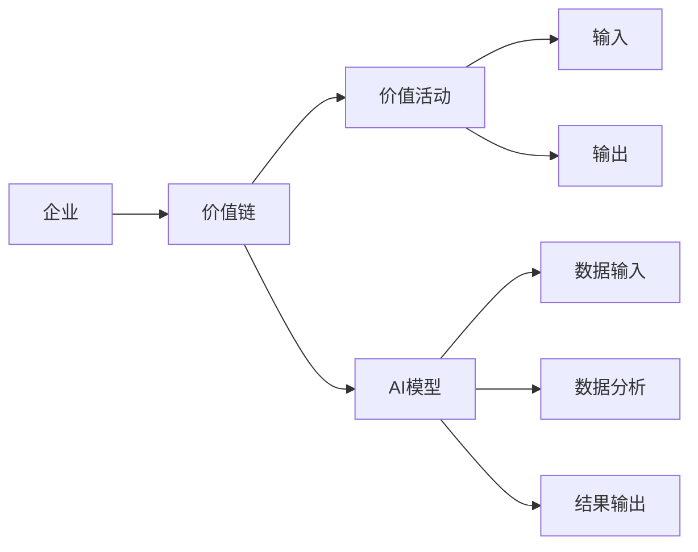
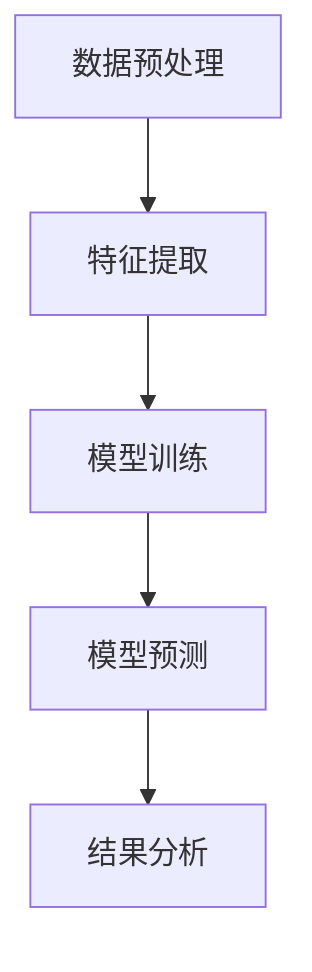
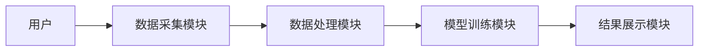

                 


# AI辅助的企业价值链分析

> 关键词：企业价值链，人工智能，数据分析，机器学习，自然语言处理，系统架构

> 摘要：本文详细探讨了AI技术在企业价值链分析中的应用，从背景介绍、核心概念、算法原理、系统架构到项目实战，再到最佳实践，全面解析了如何利用AI技术优化企业价值链分析。通过具体案例和代码实现，展示了AI在企业价值链分析中的实际应用和价值。

---

## 第一部分: AI辅助的企业价值链分析基础

### 第1章: 企业价值链与AI辅助分析概述

#### 1.1 企业价值链的基本概念
- **企业价值链的定义**：企业价值链是指企业为了实现其核心目标而进行的一系列价值创造活动的总称，包括采购、生产、销售、售后服务等环节。每个环节都通过输入资源和输出价值来体现其作用。
- **企业价值链的核心要素**：企业价值链的核心要素包括输入（原材料、资金、人力资源等）、价值活动（采购、生产、销售、售后等）、输出（产品或服务）。
- **企业价值链的结构与功能**：企业价值链通过优化各环节的效率和协同，实现整体价值的最大化。其结构通常分为前端（采购、生产）、中间（物流、销售）和后端（售后、客户支持）。

#### 1.2 AI在企业价值链分析中的作用
- **AI技术的基本概念**：人工智能（AI）是模拟人类智能的计算机系统，包括学习、推理、自我改进等功能。AI技术在数据分析、模式识别、自然语言处理等领域具有广泛的应用。
- **AI在企业价值链分析中的优势**：AI能够快速处理大量数据，发现数据中的模式和趋势，帮助企业在价值链各环节做出更明智的决策。例如，AI可以通过数据分析优化采购成本、预测销售趋势、提高客户满意度等。
- **AI辅助分析的实现方式**：AI辅助企业价值链分析主要通过数据挖掘、机器学习、自然语言处理等技术实现。例如，机器学习模型可以预测销售趋势，自然语言处理技术可以分析客户反馈，从而优化企业的销售和服务流程。

#### 1.3 企业价值链分析的背景与需求
- **传统企业价值链分析的局限性**：传统的企业价值链分析通常依赖人工数据整理和分析，效率低、成本高，且容易受到主观因素的影响。此外，传统分析方法难以处理复杂的数据关系和实时变化的市场环境。
- **AI技术对企业价值链分析的推动作用**：AI技术的引入极大地提高了企业价值链分析的效率和准确性。通过自动化数据处理和智能分析，企业能够更快地识别价值链条中的问题，并采取相应的优化措施。
- **当前企业对AI辅助分析的需求**：随着市场竞争的加剧和客户需求的多样化，企业对实时、精准的分析需求日益增加。AI技术能够满足这种需求，帮助企业快速响应市场变化，提升竞争力。

---

### 第2章: 企业价值链分析的核心概念与联系

#### 2.1 核心概念原理
- **企业价值链的构成要素**：企业价值链由输入、价值活动和输出三个主要部分构成。输入包括原材料、资金、人力资源等，价值活动是企业通过这些输入创造价值的过程，输出则是最终的产品或服务。
- **AI技术在价值链分析中的应用原理**：AI技术通过数据采集、数据分析、模型构建和结果输出四个步骤，帮助企业在价值链分析中发现潜在问题、优化流程和提升效率。例如，AI可以通过分析销售数据，发现销售瓶颈，并提出优化建议。
- **企业价值链分析与企业绩效的关系**：企业价值链分析是企业绩效管理的重要组成部分。通过分析价值链各环节的效率和效果，企业可以更好地优化资源配置，提升整体绩效。

#### 2.2 核心概念属性特征对比
- **企业价值链的属性特征**：
  - 输入多样性：企业价值链的输入包括多种资源，如原材料、资金、人力资源等。
  - 输出多样性：企业价值链的输出是多样化的，包括产品、服务、利润等。
  - 环节依赖性：价值链各环节之间相互依赖，任何一个环节的问题都可能影响整体价值的实现。
- **AI辅助分析的属性特征**：
  - 数据驱动：AI分析依赖于大量的数据输入，通过数据挖掘和分析得出结论。
  - 实时性：AI技术可以实时处理数据，提供实时分析结果。
  - 可扩展性：AI分析模型可以根据数据规模和复杂度进行扩展。
- **两者的对比分析**：企业价值链的输入和输出是多样化的，而AI辅助分析的数据输入和输出也是多样化的。两者都具有环节依赖性，但AI分析更加注重数据的处理和分析能力，能够快速发现数据中的模式和趋势。

#### 2.3 实体关系图（ER图）架构


---

### 第3章: AI辅助企业价值链分析的算法原理

#### 3.1 算法原理概述
- **机器学习算法的基本原理**：机器学习是一种人工智能技术，通过训练数据学习模型，并利用模型进行预测或分类。其基本原理包括数据预处理、特征提取、模型训练和模型预测。
- **自然语言处理（NLP）的基本原理**：NLP是人工智能的一个分支，专注于处理和分析人类语言。其基本原理包括文本预处理、词干提取、句法分析、情感分析等。
- **数据挖掘与分析的基本原理**：数据挖掘是从大量数据中提取有用信息的过程，其基本原理包括数据清洗、数据变换、数据建模和数据可视化。

#### 3.2 算法流程图


#### 3.3 算法数学模型与公式
- **机器学习模型的数学表达**：
  $$y = f(x)$$
  其中，$x$ 是输入数据，$y$ 是输出结果，$f$ 是模型函数。
- **线性回归模型**：
  $$y = \beta_0 + \beta_1x + \epsilon$$
  其中，$\beta_0$ 是截距，$\beta_1$ 是斜率，$\epsilon$ 是误差项。
- **神经网络模型**：
  $$y = \sigma(Wx + b)$$
  其中，$W$ 是权重矩阵，$x$ 是输入向量，$b$ 是偏置向量，$\sigma$ 是激活函数。

---

### 第4章: 企业价值链分析的系统架构设计

#### 4.1 系统功能设计
- **数据采集模块**：负责采集企业价值链各环节的数据，包括销售数据、客户反馈、生产数据等。
- **数据处理模块**：对采集到的数据进行清洗、转换和整合，确保数据的准确性和一致性。
- **模型训练模块**：利用机器学习算法对数据进行建模和训练，生成预测模型。
- **结果展示模块**：将模型的分析结果以可视化的方式展示，帮助企业管理者快速理解和决策。

#### 4.2 系统架构图


#### 4.3 系统接口设计
- **数据接口**：系统需要与企业的数据库、ERP系统等进行数据交互，确保数据的实时性和准确性。
- **用户接口**：提供友好的用户界面，让用户能够方便地输入数据、查看结果和进行交互操作。

---

### 第5章: 项目实战——AI辅助企业价值链分析的实现

#### 5.1 项目背景与目标
- **项目背景**：某制造企业希望利用AI技术优化其价值链分析，提升销售预测的准确性，降低生产成本。
- **项目目标**：通过AI技术分析销售数据，预测销售趋势，优化采购和生产计划。

#### 5.2 项目实施步骤
1. **数据采集**：从企业的销售数据库中采集过去三年的销售数据，包括销售额、销售时间、产品类别等。
2. **数据处理**：对数据进行清洗和转换，处理缺失值和异常值，整合不同数据源的数据。
3. **模型训练**：选择合适的机器学习算法（如线性回归、随机森林）进行模型训练，评估模型的准确性。
4. **结果展示**：将模型的预测结果以图表形式展示，帮助企业管理者进行决策。

#### 5.3 核心代码实现
```python
import pandas as pd
from sklearn.model_selection import train_test_split
from sklearn.linear_model import LinearRegression
from sklearn.metrics import mean_squared_error

# 数据加载
data = pd.read_csv('sales_data.csv')

# 数据预处理
# 假设 'date' 是日期，'sales' 是销售额
data['date'] = pd.to_datetime(data['date'])
data.set_index('date', inplace=True)

# 特征提取
features = data.columns.drop('sales')
X = data[features]
y = data['sales']

# 数据分割
X_train, X_test, y_train, y_test = train_test_split(X, y, test_size=0.2, random_state=42)

# 模型训练
model = LinearRegression()
model.fit(X_train, y_train)

# 模型预测
y_pred = model.predict(X_test)

# 模型评估
 mse = mean_squared_error(y_test, y_pred)
 print(f'Mean Squared Error: {mse}')
```

#### 5.4 实际案例分析
- **案例分析**：通过上述代码实现的模型，预测某产品的未来销售趋势。假设模型预测未来三个月的销售额分别为100万、120万、150万，企业可以根据这些预测调整采购和生产计划，避免库存积压和生产过剩。
- **结果解读**：模型预测结果帮助企业优化了采购和生产计划，降低了成本，提高了销售额。

#### 5.5 项目小结
- 通过AI技术，企业能够更准确地预测销售趋势，优化价值链各环节的资源配置，提升整体效率和竞争力。

---

## 第六章: 最佳实践与小结

### 6.1 最佳实践
- **数据质量管理**：确保数据的准确性和完整性，是AI分析成功的关键。
- **模型选择与优化**：根据具体问题选择合适的算法，并不断优化模型性能。
- **结果可视化与解释**：将复杂的分析结果以直观的方式展示，帮助企业管理者快速理解和决策。

### 6.2 小结
AI技术为企业价值链分析提供了强大的工具和方法，能够显著提升企业的分析效率和决策能力。通过合理的系统架构设计和最佳实践，企业可以充分发挥AI技术的潜力，优化价值链各环节，实现可持续发展。

### 6.3 注意事项
- AI分析结果仅供参考，需结合实际情况进行调整。
- 数据隐私和安全问题需高度重视，确保数据的合法使用和保护。

### 6.4 拓展阅读
- 《机器学习实战》
- 《深入理解自然语言处理》
- 《企业架构的艺术》

---

## 作者

作者：AI天才研究院/AI Genius Institute & 禅与计算机程序设计艺术 /Zen And The Art of Computer Programming

---

通过以上内容，您可以看到如何一步一步构建《AI辅助的企业价值链分析》的专业技术博客文章，从理论到实践，从概念到代码，全面解析AI技术在企业价值链分析中的应用与价值。

