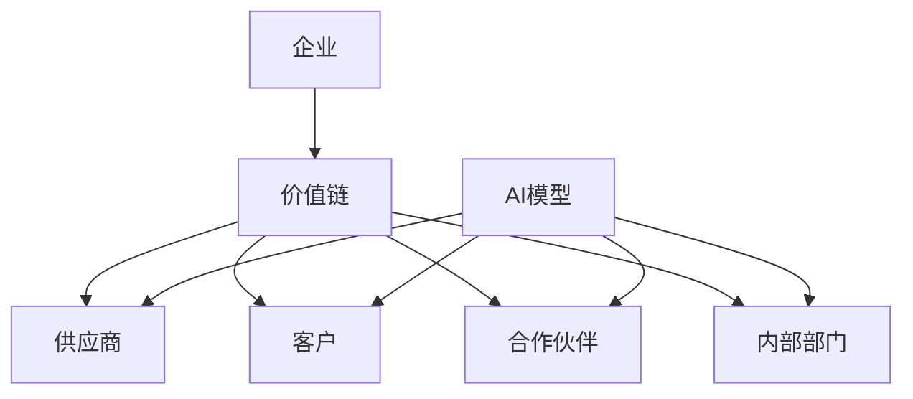
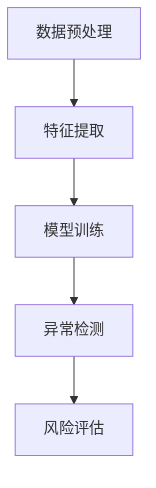
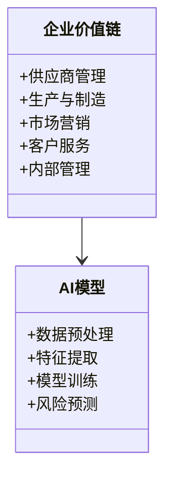
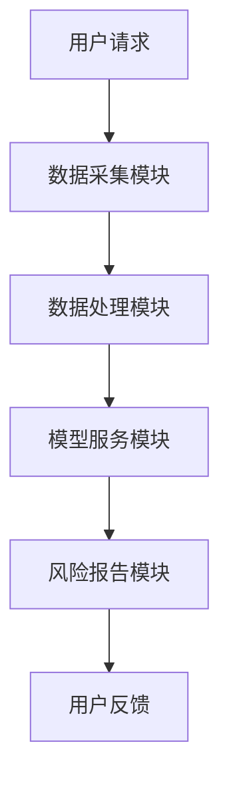

                 


# AI辅助的企业价值链风险分析

> 关键词：AI辅助，企业价值链，风险分析，人工智能，风险管理，企业运营

> 摘要：本文详细探讨了AI技术在企业价值链风险分析中的应用，从理论基础到实际案例，系统性地分析了AI如何提升企业风险管理效率和准确性。通过结合具体算法和系统架构设计，本文为读者提供了从理论到实践的完整指南。

---

# 第1章: 企业价值链与风险分析概述

## 1.1 企业价值链的基本概念

### 1.1.1 企业价值链的定义
企业价值链是指企业从原材料采购、生产加工、销售到售后服务等全过程的价值创造体系。它涵盖了企业内外部的所有关键环节，是企业实现价值最大化的核心路径。

### 1.1.2 企业价值链的结构与组成
企业价值链可以分为以下几个核心环节：
1. **供应商管理**：与供应商的合作关系和采购流程。
2. **生产与制造**：产品的生产过程和质量控制。
3. **市场营销**：市场调研、产品推广和客户获取。
4. **客户服务**：客户支持和售后服务。
5. **内部管理**：财务管理、人力资源管理和战略规划。

### 1.1.3 企业价值链的核心环节
在企业价值链中，核心环节通常是直接影响企业价值创造的关键点。例如，制造业的核心环节是生产过程，而互联网企业的核心环节是用户体验和数据处理。

---

## 1.2 风险分析的定义与方法

### 1.2.1 风险分析的基本概念
风险分析是指识别、评估和应对可能影响企业目标实现的各种风险的过程。它是企业战略管理和运营决策的重要组成部分。

### 1.2.2 传统风险分析方法
传统的风险分析方法主要包括：
1. **定量分析**：通过数据统计和模型预测来评估风险。
2. **定性分析**：通过专家经验和主观判断来识别风险。
3. **情景分析**：模拟不同情景下的风险影响。

### 1.2.3 现代风险分析技术的发展
随着大数据和人工智能技术的发展，现代风险分析方法逐渐向数据驱动和智能化方向转变。例如，利用机器学习模型进行实时风险预测和动态风险评估。

---

## 1.3 AI辅助风险分析的背景与意义

### 1.3.1 AI技术在企业价值链中的应用背景
随着企业数字化转型的推进，AI技术在企业价值链中的应用越来越广泛。AI可以通过数据分析和预测模型帮助企业优化资源配置、提高效率和降低风险。

### 1.3.2 AI辅助风险分析的优势
1. **高效性**：AI可以快速处理大量数据，显著提高风险分析的效率。
2. **准确性**：通过机器学习算法，AI能够发现数据中的隐含规律，提升风险预测的准确性。
3. **实时性**：AI可以实时监控企业价值链中的风险变化，提供即时反馈。

### 1.3.3 企业价值链风险分析的挑战与机遇
企业价值链风险分析的挑战主要体现在数据的复杂性和不确定性上。而AI技术的引入为企业提供了应对这些挑战的新思路和新工具。

---

## 1.4 本章小结
本章从企业价值链的基本概念出发，介绍了风险分析的定义与方法，并重点探讨了AI辅助风险分析的背景与意义。通过对比传统方法与AI辅助方法的特点，我们可以看到AI在企业风险管理中的巨大潜力。

---

# 第2章: AI辅助企业价值链风险分析的核心概念

## 2.1 AI辅助风险分析的原理

### 2.1.1 数据驱动的风险识别
AI通过对企业价值链中的数据进行分析，识别潜在的风险点。例如，利用自然语言处理技术分析合同文本中的法律风险。

### 2.1.2 AI算法在风险预测中的应用
AI算法（如逻辑回归、随机森林等）可以用于预测风险发生的概率和影响程度。

### 2.1.3 风险评估的自动化流程
AI可以自动化执行风险评估流程，包括数据清洗、特征提取、模型训练和结果输出。

---

## 2.2 核心概念对比分析

### 2.2.1 传统风险分析与AI辅助分析的对比
| 对比维度 | 传统风险分析 | AI辅助分析 |
|----------|---------------|-------------|
| 数据需求 | 数据量小，依赖经验 | 数据量大，依赖算法 |
| 分析效率 | 低效，耗时长 | 高效，自动化 |
| 精确度 | 依赖人工判断，精确度有限 | 依赖算法，精确度高 |

### 2.2.2 不同AI模型在风险分析中的应用特点
| AI模型 | 特点 | 适用场景 |
|--------|------|-----------|
| 逻辑回归 | 线性可解释性高 | 二分类风险预测 |
| 支持向量机 | 对小样本数据表现好 | 多分类风险识别 |
| 随机森林 | 抗过拟合能力强 | 风险特征选择 |

### 2.2.3 企业价值链各环节的风险特征对比
| 价值链环节 | 风险特征 | 风险来源 |
|------------|----------|-----------|
| 供应商管理 | 供应不稳定 | 供应商信用风险 |
| 生产与制造 | 质量波动 | 生产设备故障 |
| 市场营销 | 市场波动 | 市场需求变化 |
| 客户服务 | 客户满意度下降 | 客户投诉处理不当 |

---

## 2.3 企业价值链与AI辅助分析的实体关系图


---

## 2.4 本章小结
本章详细讲解了AI辅助企业价值链风险分析的核心概念，包括数据驱动的风险识别、AI算法的应用特点以及企业价值链各环节的风险特征。通过对比分析和实体关系图，我们明确了AI在企业风险管理中的重要作用。

---

# 第3章: AI辅助风险分析的算法原理

## 3.1 常见AI算法在风险分析中的应用

### 3.1.1 逻辑回归在风险评分中的应用
逻辑回归是一种常用的分类算法，常用于风险评分和违约预测。其核心思想是通过线性组合将输入特征映射到0到1之间的概率。

### 3.1.2 支持向量机在风险分类中的应用
支持向量机（SVM）是一种强大的分类算法，特别适用于小样本数据的分类问题。在风险分类中，SVM可以有效区分不同风险等级。

### 3.1.3 随机森林在风险特征选择中的应用
随机森林是一种基于树的集成算法，具有较强的抗过拟合能力。在风险分析中，随机森林可以用于特征重要性分析，帮助企业识别关键风险因素。

---

## 3.2 基于机器学习的异常检测算法

### 3.2.1 异常检测算法流程


### 3.2.2 异常检测算法实现
以下是基于Isolation Forest算法的异常检测代码示例：
```python
from sklearn.ensemble import IsolationForest

# 数据预处理
import pandas as pd
data = pd.read_csv('risk_data.csv')
features = data.drop('label', axis=1)
labels = data['label']

# 模型训练
model = IsolationForest(n_estimators=100, random_state=42)
model.fit(features)

# 异常检测
outliers = model.predict(features)
outliers[outliers == -1] = 1
outliers[outliers == 1] = 0
```

### 3.2.3 异常检测的数学模型
Isolation Forest算法的核心思想是通过随机选择特征和样本，构建隔离树来识别异常点。其数学模型可以表示为：
$$
I(t, x) = \log P(t \mid x)
$$
其中，$I(t, x)$ 表示样本$x$在树$t$中的隔离程度。

---

## 3.3 本章小结
本章介绍了几种常用的AI算法在风险分析中的应用，包括逻辑回归、支持向量机和随机森林。通过算法流程图和代码示例，我们详细讲解了异常检测算法的实现过程。数学模型的分析帮助读者更好地理解算法的工作原理。

---

# 第4章: 系统分析与架构设计方案

## 4.1 问题场景介绍
在企业价值链中，风险分析的典型场景包括：
1. 供应链中断风险
2. 市场需求波动风险
3. 客户流失风险

---

## 4.2 系统功能设计

### 4.2.1 领域模型设计


### 4.2.2 系统架构设计


### 4.2.3 系统接口设计
以下是系统API接口设计：
1. `/api/data/upload`：数据上传接口
2. `/api/model/train`：模型训练接口
3. `/api/risk/analyze`：风险分析接口
4. `/api/report/download`：风险报告下载接口

---

## 4.3 本章小结
本章从问题场景出发，设计了AI辅助企业价值链风险分析的系统架构和功能模块。通过领域模型和架构图的展示，我们明确了系统各部分之间的关系和协作方式。

---

# 第5章: 项目实战

## 5.1 环境安装与配置
### 5.1.1 安装Python环境
```bash
python --version
pip install --upgrade pip
```

### 5.1.2 安装依赖库
```bash
pip install numpy pandas scikit-learn
```

---

## 5.2 核心代码实现

### 5.2.1 数据预处理代码
```python
import pandas as pd
import numpy as np

data = pd.read_csv('risk_data.csv')
data.dropna(inplace=True)
data['label'] = data['label'].astype(int)
```

### 5.2.2 模型训练代码
```python
from sklearn.ensemble import RandomForestClassifier
from sklearn.metrics import accuracy_score

model = RandomForestClassifier(n_estimators=100, random_state=42)
model.fit(X_train, y_train)
y_pred = model.predict(X_test)
print("Accuracy:", accuracy_score(y_test, y_pred))
```

---

## 5.3 实际案例分析
### 5.3.1 案例背景
某制造企业面临供应链中断风险，希望通过AI技术预测潜在的供应中断风险。

### 5.3.2 数据分析与建模
通过对历史数据的分析，我们发现供应链中断的主要风险因素包括供应商信用评分、交货周期和原材料价格波动。

### 5.3.3 风险缓解策略
基于模型预测结果，企业可以采取以下措施：
1. 优化供应商选择策略
2. 建立应急库存
3. 加强与供应商的沟通与协调

---

## 5.4 项目小结
通过实际案例分析，我们展示了AI技术在企业价值链风险分析中的应用价值。从数据预处理到模型训练，再到结果解读，整个过程帮助我们识别了潜在风险，并提出了有效的风险缓解策略。

---

# 第6章: 最佳实践与总结

## 6.1 小结
本文系统性地探讨了AI技术在企业价值链风险分析中的应用，从理论到实践，为读者提供了完整的解决方案。

---

## 6.2 注意事项
1. 数据质量直接影响模型性能，需重视数据清洗和特征工程。
2. 模型解释性是企业决策的关键，需选择可解释性较强的算法。
3. 风险分析是一个动态过程，需持续监控和优化模型。

---

## 6.3 拓展阅读
1. 《机器学习实战》——学习更多AI算法的应用场景。
2. 《风险管理与控制》——深入了解企业风险管理的理论基础。
3. 《Python数据处理与分析》——提升数据处理能力。

---

# 作者
作者：AI天才研究院 & 禅与计算机程序设计艺术

