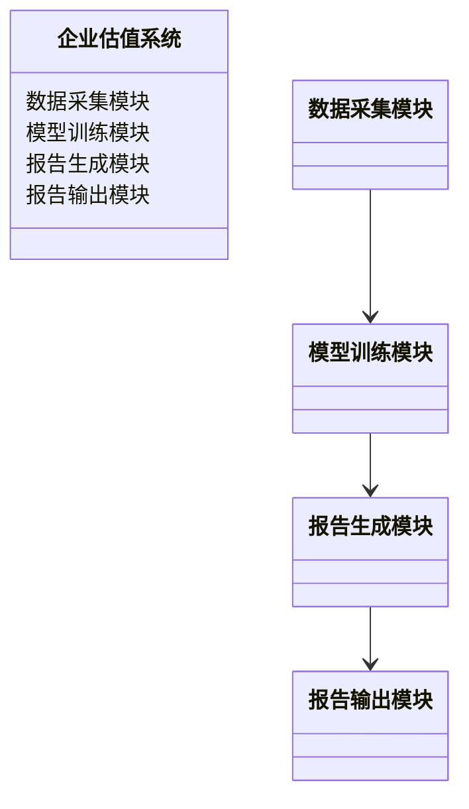
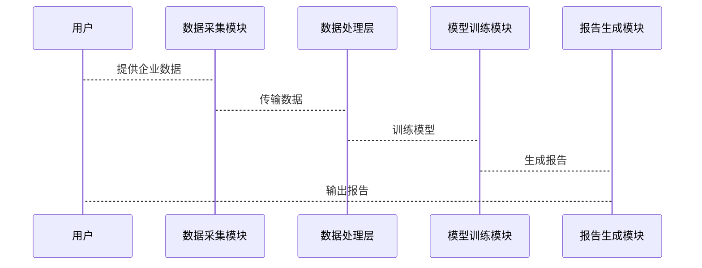

                 


# AI辅助的企业估值报告自动生成

**关键词**：企业估值，人工智能，机器学习，自动生成，数据分析，金融技术

**摘要**：随着人工智能技术的快速发展，企业估值报告的生成方式正在经历一场革命。传统的估值方法依赖于繁琐的手动分析和经验判断，而AI技术的引入极大地提高了估值的效率和准确性。本文详细探讨了AI在企业估值中的应用，从核心概念到算法原理，再到系统设计和项目实战，为读者提供了一个全面的视角，展示了如何利用AI技术实现企业估值报告的自动生成。

---

## 第1章: 企业估值与AI辅助概述

### 1.1 企业估值的定义与重要性

#### 1.1.1 企业估值的基本概念
企业估值是指通过对企业的财务状况、市场地位、管理团队、技术实力等多个因素进行综合分析，确定其市场价值的过程。准确的估值对企业并购、融资、投资决策等具有重要意义。

#### 1.1.2 企业估值在商业中的作用
- **融资决策**：帮助企业确定合理的融资规模和价格。
- **并购交易**：为企业的并购提供合理的估值依据。
- **投资决策**：帮助投资者评估企业的投资价值。
- **管理优化**：通过估值分析发现企业潜在问题，优化管理。

#### 1.1.3 AI在企业估值中的潜力
AI技术能够快速处理大量数据，发现传统方法难以察觉的模式和趋势，从而提高估值的准确性和效率。

### 1.2 AI辅助企业估值的背景与现状

#### 1.2.1 AI技术的发展与应用
人工智能技术近年来取得了显著进步，特别是在数据处理、模式识别和预测分析方面，为多个行业带来了变革。

#### 1.2.2 企业估值的传统方法与局限性
传统的企业估值方法主要包括DCF模型、可比交易分析和 precedent transactions等，但这些方法依赖于大量的人工分析，耗时且容易受到主观因素的影响。

#### 1.2.3 AI在企业估值中的应用现状
AI技术已经在企业估值的多个环节中得到应用，例如通过自然语言处理分析企业新闻，利用机器学习模型预测企业未来业绩。

---

## 第2章: 企业估值的核心要素与AI的结合

### 2.1 企业估值的关键因素

#### 2.1.1 财务指标分析
- **收入与利润**：企业的收入和利润是衡量企业价值的重要指标。
- **资产负债表**：分析企业的资产和负债情况，评估其财务健康状况。
- **现金流**：现金流是企业财务状况的重要指标，反映了企业的实际盈利能力。

#### 2.1.2 市场分析与竞争环境
- **行业分析**：了解企业在行业中的地位和竞争优势。
- **市场趋势**：分析市场的发展趋势，预测企业未来的增长潜力。
- **竞争对手分析**：通过分析竞争对手的估值情况，确定企业的相对价值。

#### 2.1.3 管理团队与企业战略
- **管理团队能力**：优秀的管理团队能够为企业创造更多的价值。
- **企业战略**：企业的长期战略目标和执行能力影响其估值。

### 2.2 AI技术在企业估值中的应用

#### 2.2.1 数据分析与模式识别
AI技术能够从大量的企业数据中提取有用的信息，识别潜在的模式和趋势。

#### 2.2.2 自然语言处理在企业信息分析中的应用
通过自然语言处理技术，AI可以分析企业新闻、公告等非结构化数据，提取关键信息用于估值。

#### 2.2.3 机器学习在预测模型中的应用
机器学习模型可以通过历史数据训练，预测企业的未来业绩和估值。

### 2.3 核心概念与联系

#### 2.3.1 企业估值要素与AI技术的对应关系
| 估值要素       | AI技术应用                     |
|----------------|-------------------------------|
| 财务数据       | 数据分析与特征工程           |
| 市场信息       | 自然语言处理与信息提取       |
| 竞争环境       | 机器学习预测与竞争分析       |
| 管理团队能力   | NLP分析领导团队背景信息     |

#### 2.3.2 企业估值模型的AI优化
通过AI技术优化传统估值模型，例如引入更多的数据源，提高模型的预测精度。

#### 2.3.3 AI在企业估值中的优势与局限性
- **优势**：提高效率，降低人为错误，发现潜在价值。
- **局限性**：数据质量依赖，模型的解释性有限。

---

## 第3章: AI辅助企业估值的核心算法与模型

### 3.1 机器学习在企业估值中的应用

#### 3.1.1 监督学习与回归模型
- **线性回归**：用于预测企业的未来收入或利润。
- **支持向量回归（SVR）**：适用于非线性关系的数据。
- **梯度提升树（如XGBoost）**：用于处理复杂的非线性关系。

#### 3.1.2 非监督学习与聚类分析
- **聚类分析**：将类似的企业分为同一类，用于比较和估值。

#### 3.1.3 深度学习与神经网络
- **卷积神经网络（CNN）**：用于处理图像数据，如财务报表中的图表信息。
- **循环神经网络（RNN）**：用于处理时间序列数据，如企业的季度财务数据。

### 3.2 常见的企业估值算法

#### 3.2.1 多元线性回归模型
$$ \text{估值} = \beta_0 + \beta_1 \times \text{收入} + \beta_2 \times \text{利润} + \beta_3 \times \text{现金流} $$

#### 3.2.2 支持向量回归
支持向量回归通过寻找最优超平面，将数据点映射到高维空间，适用于复杂的数据关系。

#### 3.2.3 随机森林与集成学习
随机森林通过集成多个决策树模型，提高预测的准确性和稳定性。

### 3.3 基于AI的企业估值模型构建

#### 3.3.1 数据预处理与特征工程
- **数据清洗**：处理缺失值、异常值。
- **特征选择**：通过特征重要性分析选择关键特征。
- **数据标准化**：对不同量纲的特征进行标准化处理。

#### 3.3.2 模型训练与调优
- **模型训练**：使用训练数据训练模型。
- **参数调优**：通过交叉验证调整模型参数，提高模型性能。

#### 3.3.3 模型评估与验证
- **验证指标**：使用均方误差（MSE）、R²值等指标评估模型性能。
- **交叉验证**：通过交叉验证评估模型的泛化能力。

### 3.4 企业估值AI模型的数学基础

#### 3.4.1 线性回归的数学公式
$$ y = \beta_0 + \beta_1 x_1 + \beta_2 x_2 + \dots + \beta_n x_n + \epsilon $$

#### 3.4.2 支持向量机的数学原理
支持向量机通过寻找最优超平面，将数据点分开，适用于分类和回归问题。

#### 3.4.3 神经网络的数学基础
神经网络通过多层感知机对数据进行非线性变换，捕捉数据中的复杂模式。

---

## 第4章: 系统分析与架构设计方案

### 4.1 问题场景介绍

#### 4.1.1 企业估值报告自动生成的需求分析
- **需求背景**：企业需要快速生成估值报告，节省时间和成本。
- **功能需求**：自动生成估值报告，支持多种估值模型。
- **用户需求**：用户希望报告内容准确、格式规范。

#### 4.1.2 系统的目标与范围
- **目标**：实现企业估值报告的自动生成。
- **范围**：包括数据采集、模型训练、报告生成和输出。

#### 4.1.3 系统的约束与假设
- **约束**：数据来源有限，模型准确性依赖于数据质量。
- **假设**：企业的财务数据和市场数据可以被有效利用。

### 4.2 系统功能设计

#### 4.2.1 系统功能模块
| 功能模块       | 描述                     |
|----------------|--------------------------|
| 数据采集       | 采集企业的财务数据和市场数据 |
| 模型训练       | 训练企业估值模型         |
| 报告生成       | 根据模型生成估值报告     |
| 报告输出       | 输出标准化的估值报告     |

#### 4.2.2 领域模型（Mermaid类图）


#### 4.2.3 系统架构设计（Mermaid架构图）


#### 4.2.4 系统接口设计
- **输入接口**：接收企业的财务数据和市场数据。
- **输出接口**：输出自动生成的估值报告。

#### 4.2.5 系统交互设计（Mermaid序列图）


---

## 第5章: 项目实战

### 5.1 环境安装

#### 5.1.1 安装Python环境
安装Python 3.8以上版本，推荐使用Anaconda。

#### 5.1.2 安装依赖库
安装以下Python库：
- `numpy`
- `pandas`
- `scikit-learn`
- `xgboost`
- `matplotlib`

### 5.2 系统核心实现源代码

#### 5.2.1 数据预处理代码
```python
import pandas as pd
import numpy as np

# 读取数据
data = pd.read_csv('企业数据.csv')

# 处理缺失值
data = data.dropna()

# 标准化处理
from sklearn.preprocessing import StandardScaler
scaler = StandardScaler()
scaled_data = scaler.fit_transform(data)
```

#### 5.2.2 模型训练代码
```python
from sklearn.ensemble import RandomForestRegressor
from sklearn.model_selection import train_test_split
from sklearn.metrics import mean_squared_error

# 划分训练集和测试集
X_train, X_test, y_train, y_test = train_test_split(scaled_data, data['估值'], test_size=0.2, random_state=42)

# 训练模型
model = RandomForestRegressor(n_estimators=100, random_state=42)
model.fit(X_train, y_train)

# 模型评估
y_pred = model.predict(X_test)
print('均方误差:', mean_squared_error(y_test, y_pred))
```

#### 5.2.3 生成报告代码
```python
import matplotlib.pyplot as plt

# 可视化预测结果
plt.scatter(y_test, y_pred)
plt.xlabel('真实估值')
plt.ylabel('预测估值')
plt.title('随机森林回归模型结果')
plt.show()
```

### 5.3 实际案例分析

#### 5.3.1 案例背景
以某科技公司为例，利用AI技术生成其估值报告。

#### 5.3.2 数据分析
分析该公司的财务数据、市场数据和竞争环境，提取关键特征。

#### 5.3.3 模型训练
使用随机森林回归模型进行训练，评估模型的准确性和稳定性。

#### 5.3.4 报告生成
根据模型预测结果生成估值报告，包括财务分析、市场分析和预测结果。

### 5.4 项目小结

---

## 第6章: 总结与展望

### 6.1 最佳实践 tips

- **数据质量**：确保数据的准确性和完整性。
- **模型选择**：根据具体问题选择合适的算法。
- **结果验证**：通过交叉验证和实际案例分析验证模型的准确性。

### 6.2 小结

通过AI技术，企业估值报告的生成变得更加高效和准确。AI不仅能够处理大量数据，还能发现传统方法难以察觉的模式和趋势，为企业决策提供有力支持。

### 6.3 注意事项

- **数据隐私**：确保数据的安全性和隐私性。
- **模型解释性**：提高模型的可解释性，便于用户理解和信任。
- **持续优化**：定期更新模型，适应市场变化。

### 6.4 拓展阅读

- 《机器学习实战》
- 《深度学习》
- 《企业估值与金融分析》

---

**作者：AI天才研究院/AI Genius Institute & 禅与计算机程序设计艺术 /Zen And The Art of Computer Programming**

---

本文详细介绍了AI在企业估值中的应用，从核心概念到算法实现，再到系统设计和项目实战，为读者提供了一个全面的视角。通过本文的学习，读者可以掌握如何利用AI技术实现企业估值报告的自动生成，为企业决策提供更高效和准确的支持。

