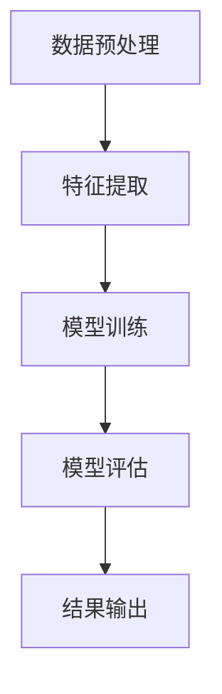

                 


# AI辅助的企业估值模型

> 关键词：AI、企业估值、机器学习、自然语言处理、数据驱动、数学建模、系统架构

> 摘要：本文系统地介绍了AI技术在企业估值中的应用，从背景知识到核心概念，从算法原理到系统架构，从项目实战到总结与展望，详细讲解了AI辅助企业估值模型的构建过程和实际应用。通过理论与实践相结合的方式，本文旨在帮助读者理解如何利用AI技术提升企业估值的效率和准确性。

---

## 第一部分：AI辅助的企业估值模型概述

### 第1章：企业估值的基本概念与传统方法

#### 1.1 企业估值的基本概念
- 1.1.1 企业估值的定义
- 1.1.2 企业估值的主要方法
- 1.1.3 企业估值的重要性和应用场景

#### 1.2 传统企业估值方法的局限性
- 1.2.1 财务指标法的局限性
- 1.2.2 可比公司法的局限性
- 1.2.3 现金流折现法的局限性

#### 1.3 AI技术在企业估值中的优势
- 1.3.1 数据处理能力的提升
- 1.3.2 模型预测的准确性增强
- 1.3.3 多维度数据的综合分析

---

## 第二部分：AI辅助企业估值的核心概念与联系

### 第2章：AI辅助企业估值的核心概念与联系

#### 2.1 AI辅助企业估值的核心概念
- 2.1.1 数据驱动的估值模型
- 2.1.2 机器学习在估值中的应用
- 2.1.3 自然语言处理在企业信息提取中的作用

#### 2.2 核心概念原理
- 2.2.1 机器学习模型的基本原理
- 2.2.2 自然语言处理技术的实现流程
- 2.2.3 数据预处理与特征提取方法

#### 2.3 核心概念对比分析
- 2.3.1 不同估值方法的对比表格
- 2.3.2 AI辅助与传统估值方法的对比分析
- 2.3.3 企业估值模型的ER实体关系图
  ```mermaid
  erDiagram
    customer[客户]
    valuation[估值]
    feature[特征]
    model[模型]
    customer <--- valuation
    valuation <--- feature
    feature <--- model
  ```

---

## 第三部分：AI辅助企业估值的算法原理

### 第3章：AI辅助企业估值的算法原理

#### 3.1 算法原理概述
- 3.1.1 机器学习算法的选择与应用
- 3.1.2 神经网络在企业估值中的应用
- 3.1.3 时间序列分析的算法实现

#### 3.2 算法实现流程
- 3.2.1 数据预处理流程
- 3.2.2 模型训练与优化
- 3.2.3 模型评估与调优

#### 3.3 算法实现的数学模型与公式
- 3.3.1 线性回归模型
  $$y = \beta_0 + \beta_1x + \epsilon$$
- 3.3.2 支持向量机模型
  $$\text{max} \frac{1}{2}||w||^2 \text{ subject to } y_i(w \cdot x_i + b) \geq 1$$
- 3.3.3 随机森林模型
  $$\text{基于决策树的集成学习模型}$$
- 3.3.4 神经网络模型的数学表达式
  $$\text{输入层} \rightarrow \text{隐藏层} \rightarrow \text{输出层}$$
  $$\text{激活函数：} f(x) = \frac{1}{1 + e^{-x}}$$

#### 3.4 算法流程图


---

## 第四部分：企业估值模型的系统分析与架构设计

### 第4章：企业估值模型的系统分析与架构设计

#### 4.1 问题场景介绍
- 4.1.1 企业估值的典型场景
- 4.1.2 数据来源的多样性与复杂性
- 4.1.3 模型的实时性和准确性要求

#### 4.2 系统功能设计
- 4.2.1 数据采集模块
- 4.2.2 数据处理模块
- 4.2.3 模型训练模块
- 4.2.4 结果展示模块

#### 4.3 系统架构设计
- 4.3.1 分层架构设计
  ```mermaid
  graph TD
    A[前端] --> B[后端]
    B --> C[数据库]
  ```
- 4.3.2 微服务架构设计
  ```mermaid
  graph TD
    A[用户] --> B[API Gateway]
    B --> C[数据采集服务]
    B --> D[数据处理服务]
    B --> E[模型训练服务]
    B --> F[结果展示服务]
  ```

---

## 第五部分：项目实战

### 第5章：AI辅助企业估值模型的实现与应用

#### 5.1 项目实战环境安装
- 5.1.1 安装Python和相关库（如pandas、scikit-learn、TensorFlow）
- 5.1.2 数据集准备与获取

#### 5.2 系统核心实现源代码
- 5.2.1 数据预处理代码
  ```python
  import pandas as pd
  data = pd.read_csv('企业数据.csv')
  data = data.dropna()
  data = pd.get_dummies(data)
  ```
- 5.2.2 模型训练代码
  ```python
  from sklearn.model_selection import train_test_split
  from sklearn.ensemble import RandomForestRegressor
  X_train, X_test, y_train, y_test = train_test_split(data.drop('估值', axis=1), data['估值'], test_size=0.2)
  model = RandomForestRegressor().fit(X_train, y_train)
  ```
- 5.2.3 模型评估代码
  ```python
  from sklearn.metrics import mean_absolute_error
  print(mean_absolute_error(y_test, model.predict(X_test)))
  ```

#### 5.3 项目实战案例分析
- 5.3.1 某行业的真实案例分析
- 5.3.2 模型在不同场景下的应用效果对比
- 5.3.3 模型优化与调参经验分享

---

## 第六部分：总结与展望

### 第6章：AI辅助企业估值模型的总结与展望

#### 6.1 项目总结
- 6.1.1 核心成果与经验总结
- 6.1.2 项目中的问题与解决方案
- 6.1.3 项目的实际应用效果

#### 6.2 未来展望
- 6.2.1 技术发展趋势
- 6.2.2 新的应用场景
- 6.2.3 进一步的研究方向

#### 6.3 最佳实践 Tips
- 6.3.1 数据预处理的关键注意事项
- 6.3.2 模型选择与调优的建议
- 6.3.3 系统架构设计的优化技巧

---

## 作者

作者：AI天才研究院/AI Genius Institute & 禅与计算机程序设计艺术 /Zen And The Art of Computer Programming

