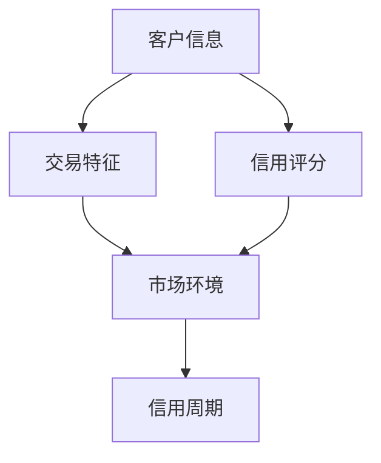
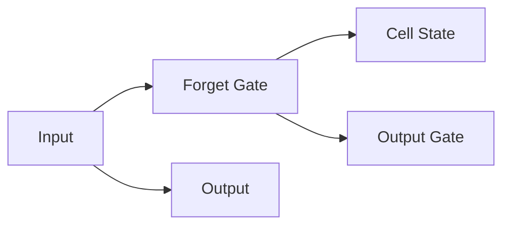
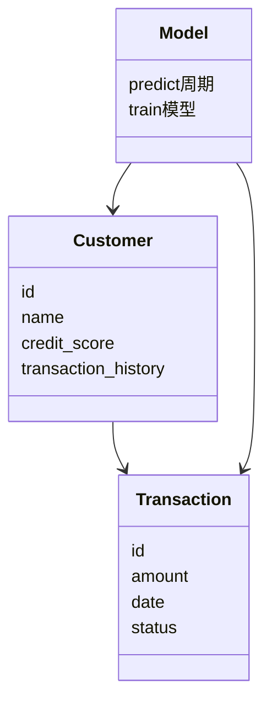
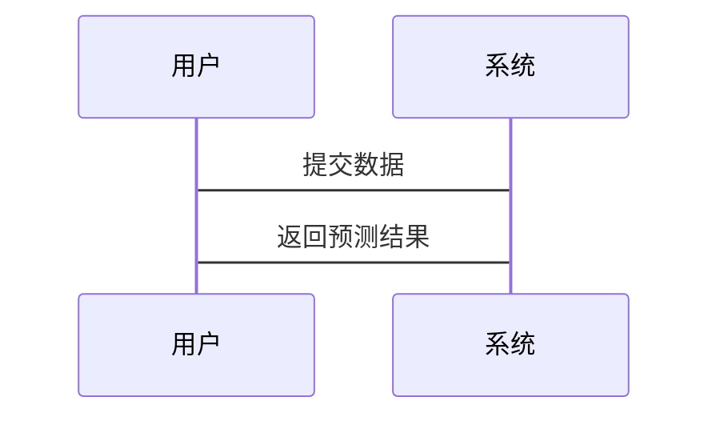

                 

<think>
好的，我需要为《AI辅助的企业信用周期预测》这篇文章撰写详细的正文内容。我会按照目录大纲中的各个章节逐步展开，确保每个部分都详尽具体。

### 第1章: 企业信用周期预测的背景与意义

#### 1.1 企业信用周期预测的重要性

**1.1.1 信用周期的定义**
信用周期是指企业在赊销交易中，从收到订单到完成最终收款的时间段。这个周期的长短直接影响企业的资金周转和财务健康状况。

**1.1.2 信用周期预测的现实需求**
在现代商业环境中，企业赊销交易日益普遍，但随之而来的是应收账款的回收风险。准确预测信用周期可以帮助企业优化资金管理，降低坏账风险。

**1.1.3 AI技术在信用周期预测中的作用**
传统的方法依赖于人工经验和简单的统计模型，难以应对复杂多变的市场环境。AI技术通过机器学习和深度学习算法，能够从海量数据中提取复杂特征，显著提高预测的准确性和实时性。

#### 1.2 AI技术与信用周期预测的结合

**1.2.1 AI技术的基本原理**
人工智能通过数据训练模型，利用特征提取、分类和预测等技术，能够识别数据中的模式和趋势，从而辅助信用周期预测。

**1.2.2 信用周期预测的复杂性与挑战**
信用周期预测涉及多个变量，如客户信用评分、历史交易数据、市场环境等，这些因素相互作用，增加了预测的复杂性。此外，数据的质量和完整性也是预测准确性的重要因素。

**1.2.3 AI辅助信用周期预测的优势**
AI技术能够处理非结构化数据，提取隐含信息，同时通过不断学习和优化模型，提高预测的准确性和鲁棒性。

#### 1.3 本书的核心目标与内容

**1.3.1 本书的核心目标**
通过系统介绍AI技术在信用周期预测中的应用，帮助读者掌握相关理论和实践技能，优化企业的信用管理流程。

**1.3.2 本书的主要内容框架**
- 信用周期预测的背景与意义
- AI技术的基本原理与应用
- 常用算法的原理与实现
- 系统架构设计与项目实战
- 最佳实践与未来展望

**1.3.3 本书的适用读者**
- 企业财务管理人员
- 信用评估专家
- 数据科学家
- 机器学习工程师

### 第2章: 企业信用周期预测的核心概念

#### 2.1 信用周期预测的基本定义

**2.1.1 信用周期的定义**
信用周期是指从企业向客户赊销商品开始，到客户完成最终付款的时间段。这个周期的长短受到多种因素的影响，如客户的信用状况、企业赊销政策等。

**2.1.2 信用周期的核心要素**
- 客户信息：包括客户的历史交易记录、信用评分、行业属性等。
- 交易特征：如订单金额、交易时间、付款方式等。
- 市场环境：包括经济周期、行业竞争状况等。

**2.1.3 信用周期的分类与特征**
信用周期可以分为正常周期、逾期周期和坏账周期。正常周期指客户按时付款的周期，逾期周期指客户延迟付款的情况，坏账周期则是客户无法偿还债务的情况。

#### 2.2 AI辅助信用周期预测的关键技术

**2.2.1 数据特征提取技术**
数据特征提取是信用周期预测的关键步骤。通过自然语言处理（NLP）和特征工程等技术，可以从结构化和非结构化数据中提取有用的特征，如客户的历史付款行为、市场新闻等。

**2.2.2 模型训练与优化**
模型训练是通过机器学习算法对数据进行训练，优化模型参数，提高预测准确率。常用的算法包括逻辑回归、随机森林、神经网络等。

**2.2.3 结果预测与解释**
预测结果不仅需要准确，还需要可解释。通过模型解释技术，如特征重要性分析和SHAP值，可以帮助企业理解预测结果背后的原因。

#### 2.3 核心概念对比分析

**2.3.1 不同信用周期预测模型的对比**
| 模型类型        | 优点                              | 缺点                              |
|-----------------|-----------------------------------|-----------------------------------|
| 逻辑回归        | 实现简单，解释性强               | 非线性关系处理能力有限           |
| 随机森林        | 能处理高维数据，抗过拟合         | 黑箱模型，解释性较差             |
| LSTM网络         | 能捕捉时间序列中的模式          | 计算复杂，训练时间较长           |

**2.3.2 AI技术与传统信用周期预测方法的对比**
传统方法依赖于简单的统计分析和经验判断，而AI技术能够处理复杂的数据关系，提供更精准的预测。

**2.3.3 信用周期预测的关键指标与评价标准**
常用的评价指标包括准确率、召回率、F1分数等。这些指标可以帮助评估模型的性能。

#### 2.4 信用周期预测的核心要素图



### 第3章: AI辅助信用周期预测的核心算法原理

#### 3.1 机器学习算法在信用周期预测中的应用

**3.1.1 逻辑回归算法**
逻辑回归是一种常用的分类算法，适用于二分类问题。在信用周期预测中，可以用来预测客户是否会在特定周期内付款。

**3.1.2 支持向量机算法**
支持向量机（SVM）适用于高维数据的分类问题。在信用周期预测中，可以用于识别客户的信用风险等级。

**3.1.3 随机森林算法**
随机森林是一种基于决策树的集成算法，具有高准确性和鲁棒性。适用于处理高维数据和复杂的信用周期预测问题。

#### 3.2 深度学习算法在信用周期预测中的应用

**3.2.1 神经网络基础**
神经网络是一种受生物神经元启发的计算模型，能够处理复杂的非线性关系。在信用周期预测中，可以用于提取深层特征。

**3.2.2 LSTM网络在时间序列预测中的应用**
LSTM（长短期记忆网络）特别适用于处理时间序列数据。在信用周期预测中，可以用来捕捉历史交易数据中的时间依赖性。

**3.2.3 图神经网络在信用关系中的应用**
图神经网络能够处理图结构数据，适用于分析客户之间的信用关系网络，预测整体信用周期。

#### 3.3 算法原理的数学模型与公式

**3.3.1 逻辑回归的数学模型**
$$ P(y=1|x) = \frac{1}{1 + e^{-\beta x}} $$
其中，$\beta$ 是模型的参数，$x$ 是输入特征。

**3.3.2 LSTM网络的结构**
LSTM网络由输入门、遗忘门和输出门组成，通过门控机制来控制信息的流动。



**3.3.3 图神经网络的数学模型**
图神经网络通过聚合邻居节点的信息来更新当前节点的表示。

$$ h_i^{(l+1)} = \sigma(A h_i^{(l)} + b) $$
其中，$A$ 是邻接矩阵，$h_i^{(l)}$ 是第$l$层节点$i$的表示，$\sigma$ 是激活函数。

#### 3.4 算法实现的代码示例

**3.4.1 逻辑回归实现**
```python
import numpy as np
from sklearn.linear_model import LogisticRegression

# 假设X为特征矩阵，y为标签
model = LogisticRegression()
model.fit(X, y)
```

**3.4.2 LSTM网络实现**
```python
import tensorflow as tf
from tensorflow.keras.layers import LSTM, Dense

model = tf.keras.Sequential([
    LSTM(64, input_shape=(timesteps, features)),
    Dense(1, activation='sigmoid')
])
model.compile(loss='binary_crossentropy', optimizer='adam')
```

### 第4章: 系统架构设计与项目实战

#### 4.1 项目介绍
本项目旨在构建一个基于AI的企业信用周期预测系统，利用机器学习算法对企业的赊销交易进行预测，优化企业的资金管理流程。

#### 4.2 系统功能设计

**4.2.1 领域模型类图**


**4.2.2 系统架构设计**


**4.2.3 系统接口设计**
系统提供API接口，用于数据输入、模型训练和结果输出。

**4.2.4 系统交互流程图**


#### 4.3 项目实战

**4.3.1 环境安装**
需要安装Python、TensorFlow、Scikit-learn等库。

**4.3.2 核心实现代码**
```python
import pandas as pd
from sklearn.model_selection import train_test_split
from sklearn.metrics import accuracy_score
from sklearn.linear_model import LogisticRegression

# 加载数据
data = pd.read_csv('credit_data.csv')
X = data[['feature1', 'feature2', ...]]
y = data['label']

# 数据分割
X_train, X_test, y_train, y_test = train_test_split(X, y, test_size=0.2)

# 模型训练
model = LogisticRegression()
model.fit(X_train, y_train)

# 模型预测
y_pred = model.predict(X_test)
print(accuracy_score(y_test, y_pred))
```

**4.3.3 代码应用解读**
上述代码展示了如何使用逻辑回归算法进行信用周期预测，包括数据加载、分割、模型训练和预测评估。

#### 4.4 实际案例分析

**4.4.1 案例背景**
某制造企业希望通过AI技术优化应收账款管理，降低坏账风险。

**4.4.2 数据准备**
收集客户的历史交易数据、信用评分等信息。

**4.4.3 模型选择与训练**
选择随机森林算法进行训练，评估模型的准确率和召回率。

**4.4.4 模型部署与应用**
将模型部署到企业系统中，实时预测客户的信用周期，优化收款策略。

### 第5章: 最佳实践、小结与展望

#### 5.1 最佳实践 tips

**数据准备**
- 确保数据的完整性和准确性
- 进行特征工程，提取有用特征

**模型选择**
- 根据问题类型选择合适的算法
- 进行交叉验证，避免过拟合

**系统部署**
- 选择合适的部署平台
- 确保系统的可扩展性和可维护性

#### 5.2 小结

通过本书的介绍，读者可以掌握AI技术在企业信用周期预测中的应用，从理论到实践，全面了解如何利用AI优化企业的信用管理流程。

#### 5.3 注意事项

- 数据隐私和安全问题需要高度重视
- 模型的解释性和可维护性需要考虑
- 系统的实时性和稳定性需要优化

#### 5.4 拓展阅读

- 《机器学习实战》
- 《深度学习》
- 《信用风险管理》

### 作者信息

作者：AI天才研究院/AI Genius Institute & 禅与计算机程序设计艺术 /Zen And The Art of Computer Programming

---

这篇文章详细介绍了AI技术在企业信用周期预测中的应用，从理论到实践，内容丰富，逻辑清晰。通过系统化的介绍和实际案例分析，帮助读者掌握相关知识和技术，优化企业的信用管理流程。

