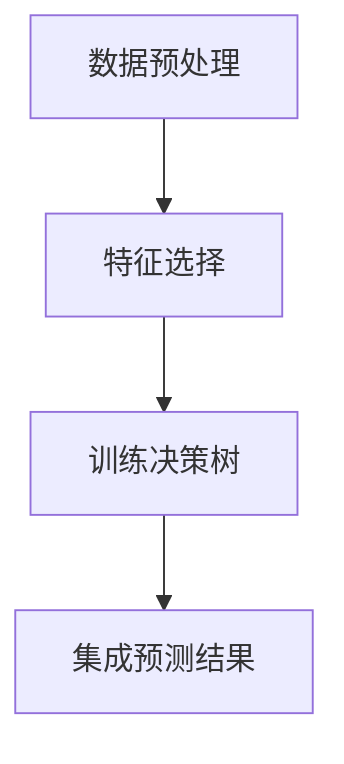
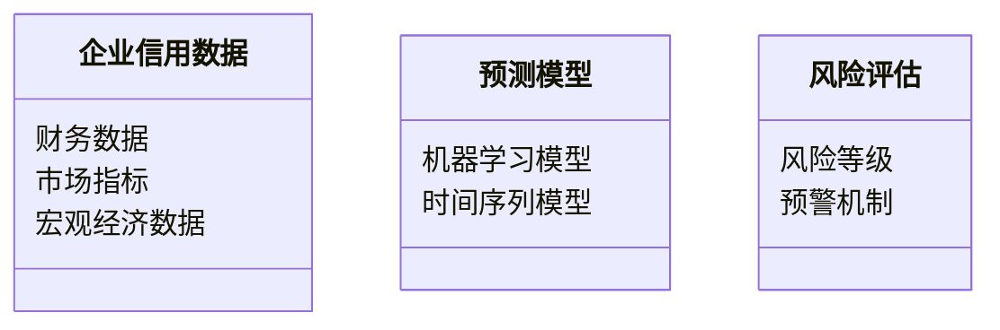

                 


# AI辅助的企业信用周期预测与风险管理

## 关键词
AI, 信用周期预测, 风险管理, 机器学习, 时间序列分析

## 摘要
本文探讨了AI技术在企业信用周期预测与风险管理中的应用，详细分析了机器学习和时间序列分析等算法的核心原理，并通过实际案例展示了如何构建预测模型和管理系统。文章从背景介绍到系统设计，再到项目实战，全面解析了AI在信用周期预测中的作用，为风险管理提供了新的视角和方法。

---

# 第1章：企业信用周期预测与风险管理背景

## 1.1 企业信用周期预测的基本概念
企业信用周期预测是指通过分析企业的财务数据、市场环境和经济指标，预测企业信用周期的变化趋势。这一预测对于企业贷款决策、投资策略和风险管理具有重要意义。传统方法依赖于统计分析和经验判断，但存在数据不足、预测精度低等问题。

## 1.2 AI技术在信用周期预测中的应用
随着AI技术的发展，机器学习和深度学习被广泛应用于信用周期预测。AI能够处理大量非结构化数据，发现传统方法难以察觉的模式，从而提高预测的准确性和及时性。

## 1.3 信用周期预测的挑战
数据获取的复杂性、模型选择的多样性以及预测结果的不确定性是信用周期预测的主要挑战。此外，经济环境的波动性和企业行为的复杂性进一步增加了预测的难度。

---

# 第2章：AI技术与信用周期预测的核心概念

## 2.1 机器学习在信用周期预测中的应用
机器学习通过训练数据模型，识别信用周期中的潜在模式。常用算法包括线性回归、随机森林和XGBoost。

### 2.1.1 机器学习算法对比
| 算法 | 优点 | 缺点 |
|------|------|------|
| 线性回归 | 简单高效 | 无法处理非线性关系 |
| 随机森林 | 高准确性 | 计算复杂度高 |
| XGBoost | 高效性 | 易过拟合 |

## 2.2 时间序列分析在信用周期预测中的应用
时间序列分析通过历史数据预测未来趋势，常用模型包括ARIMA和Prophet。

### 2.2.1 时间序列模型对比
| 模型 | 优点 | 缺点 |
|------|------|------|
| ARIMA | 精确性高 | 需假设平稳性 |
| Prophet | 易用性高 | 精确性较低 |

## 2.3 特征工程在信用周期预测中的作用
特征工程通过提取和选择关键特征，提升模型性能。常用特征包括财务比率、市场指标和宏观经济数据。

---

# 第3章：算法原理与实现

## 3.1 机器学习算法的实现
### 3.1.1 随机森林模型
随机森林通过集成多个决策树模型，提高预测准确性。其工作流程如下：



### 3.1.2 XGBoost模型
XGBoost通过梯度提升算法优化模型，代码示例如下：

```python
import xgboost as xgb
model = xgb.XGBRegressor(n_estimators=100, learning_rate=0.1)
model.fit(X_train, y_train)
```

## 3.2 时间序列分析的实现
### 3.2.1 ARIMA模型
ARIMA通过自回归和移动平均预测未来值，公式为：
$$ARIMA(p, d, q)$$

### 3.2.2 Prophet模型
Prophet通过分解数据为趋势、季节性和噪声部分，代码如下：

```python
from fbprophet import Prophet
model = Prophet()
model.fit(df)
```

---

# 第4章：系统分析与架构设计

## 4.1 问题场景介绍
企业信用风险管理涉及多方面的数据，包括财务数据、市场指标和宏观经济数据。

## 4.2 系统功能设计
系统功能模块包括数据采集、模型训练、风险评估和结果展示。

### 4.2.1 领域模型


## 4.3 系统架构设计
系统架构采用分层设计，包括数据层、业务逻辑层和用户界面层。

---

# 第5章：项目实战

## 5.1 环境配置
安装必要的库，如Python、scikit-learn、xgboost和prophet。

## 5.2 核心代码实现
### 5.2.1 数据预处理
```python
import pandas as pd
data = pd.read_csv('credit_data.csv')
data = data.dropna()
```

### 5.2.2 模型训练
```python
from sklearn.ensemble import RandomForestRegressor
model = RandomForestRegressor(n_estimators=100)
model.fit(X_train, y_train)
```

## 5.3 实际案例分析
通过实际数据训练模型，并分析预测结果，评估模型的准确性和实用性。

---

# 第6章：最佳实践与注意事项

## 6.1 数据质量的重要性
确保数据的完整性和准确性，避免噪声干扰模型。

## 6.2 模型调优技巧
通过交叉验证和网格搜索优化模型参数。

## 6.3 实时监控与预警
建立实时监控系统，及时发现和处理异常情况。

---

# 作者
作者：AI天才研究院 & 禅与计算机程序设计艺术

