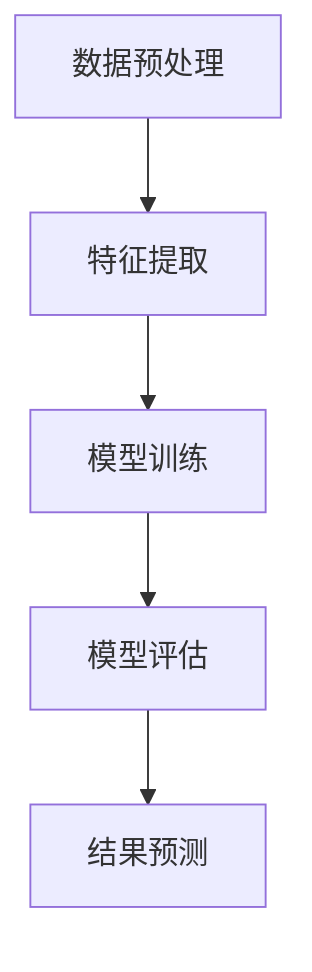
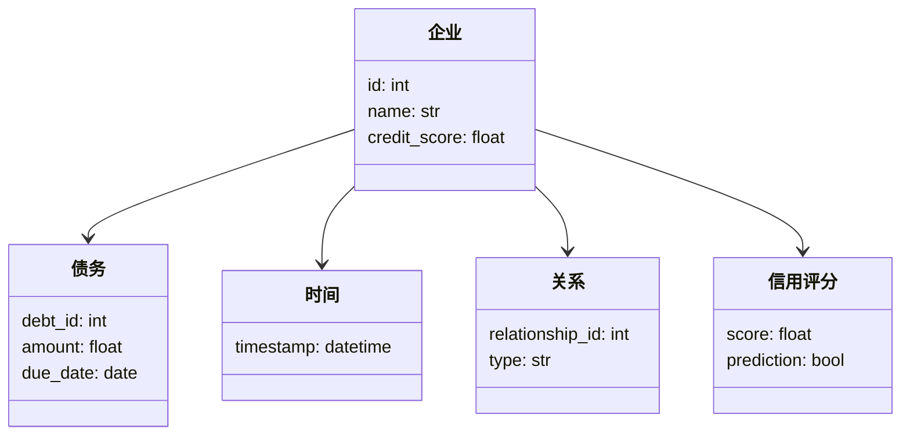
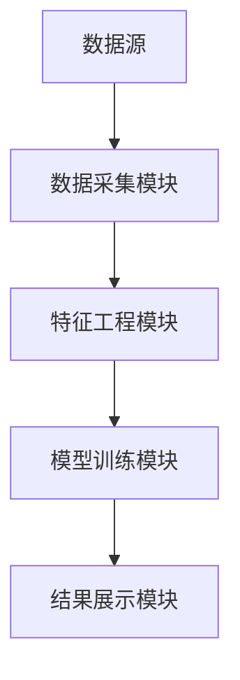
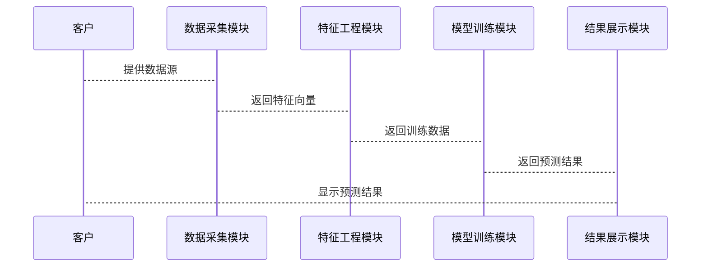

                 


# AI辅助的企业信用周期预测模型

> 关键词：企业信用周期预测，人工智能，机器学习，金融风险管理，深度学习

> 摘要：本文探讨了利用AI技术构建企业信用周期预测模型的方法。通过分析数据特征、选择合适的算法、设计系统架构，并结合实际案例，展示了如何利用AI提升信用周期预测的准确性和效率。文章详细解释了模型的原理、实现步骤和应用前景。

---

# 第一部分: 背景介绍

## 第1章: 企业信用周期预测的背景与意义

### 1.1 问题背景

#### 1.1.1 企业信用周期预测的重要性
企业的信用周期反映了其在不同经济环境下的财务健康状况。准确预测信用周期有助于金融机构和投资者做出更明智的决策，从而有效管理金融风险。传统的信用评估方法依赖于人工分析，效率低下且容易受到主观因素的影响。AI技术的应用能够显著提高预测的准确性和效率。

#### 1.1.2 问题描述
信用周期预测的核心在于识别企业在不同时间点的信用状态变化。预测模型需要处理大量结构化和非结构化的数据，提取关键特征，并利用这些特征进行预测。数据的质量和特征的选择是影响预测结果的关键因素。

#### 1.1.3 问题解决
AI技术，尤其是机器学习和深度学习，能够从海量数据中提取复杂特征，并构建高精度的预测模型。通过结合文本分析、时间序列分析和图结构数据处理，AI能够显著提升信用周期预测的准确性和鲁棒性。

#### 1.1.4 边界与外延
信用周期预测模型的适用范围包括企业财务风险评估、贷款决策支持和投资策略制定。然而，模型的预测能力受限于数据质量和模型假设，需结合实际情况进行调整和优化。

#### 1.1.5 概念结构与核心要素
信用周期预测模型由数据特征、算法选择和模型评估三部分组成。数据特征包括时间序列、文本和图结构特征；算法选择涉及传统机器学习和深度学习模型；模型评估则关注准确率、召回率和F1分数。

---

# 第二部分: 核心概念与联系

## 第2章: AI辅助信用周期预测的核心概念

### 2.1 AI模型在信用周期预测中的作用

#### 2.1.1 数据特征提取
- **文本数据处理**：企业公告、财务报告中的文本信息通过自然语言处理技术提取关键词和情感特征。
- **结构化数据处理**：财务数据、交易记录等结构化数据用于分析企业的财务状况和经营稳定性。
- **图结构数据处理**：企业间的关联关系通过图结构数据建模，分析行业风险传导和企业间风险联动。

#### 2.1.2 模型选择与优化
- **传统机器学习算法**：如逻辑回归、随机森林，适合中小型企业数据。
- **深度学习模型**：如LSTM和Transformer，适用于时间序列数据和复杂特征提取。
- **模型调优与评估**：通过交叉验证和网格搜索优化模型参数，选择最佳模型。

#### 2.1.3 结果解释与可解释性
- **模型解释的重要性**：确保预测结果的透明性和可解释性，便于决策者理解模型输出。
- **可解释性模型的选择**：如线性回归和梯度提升树，提供特征重要性的解释。
- **结果的可视化与解读**：通过图表展示预测结果和特征重要性，辅助决策。

### 2.2 核心概念原理

#### 2.2.1 数据特征的属性对比

| 特征类型 | 描述 | 示例 |
|----------|------|------|
| 时间序列特征 | 表示企业在不同时间点的信用状态 | 每月的还款情况 |
| 文本特征 | 包括企业公开的财务报告、新闻等 | 公司公告 |
| 图结构特征 | 企业间的关联关系 | 行业链结构 |

#### 2.2.2 ER实体关系图架构

```mermaid
erd
    客户
    债务
    时间
    关系
    信用评分
```

---

# 第三部分: 算法原理讲解

## 第3章: 基于机器学习的信用周期预测算法

### 3.1 算法选择与实现

#### 3.1.1 算法选择
- **逻辑回归**：适合二分类问题，预测企业信用周期的上升或下降。
- **XGBoost**：高效处理结构化数据，适合高维特征和大数据集。
- **LSTM**：处理时间序列数据，捕捉长期依赖关系。

#### 3.1.2 算法实现流程



#### 3.1.3 算法实现代码示例

```python
import xgboost as xgb

# 数据预处理
def preprocess_data(data):
    # 特征工程
    data = data.dropna()
    y = data['credit_cycle']
    X = data.drop('credit_cycle', axis=1)
    return X, y

# 模型训练
def train_model(X, y):
    model = xgb.XGBClassifier(n_estimators=100, learning_rate=0.1, max_depth=3)
    model.fit(X, y)
    return model

# 预测与评估
def evaluate_model(model, X_test, y_test):
    y_pred = model.predict(X_test)
    print(classification_report(y_test, y_pred))
```

#### 3.1.4 算法原理数学模型

- **逻辑回归损失函数**：$$ L = -\frac{1}{m} \sum_{i=1}^{m} [y_i \ln(h(x_i)) + (1 - y_i)\ln(1 - h(x_i))] $$
  其中，$$ h(x_i) = \frac{1}{1 + e^{-w^T x_i}} $$

- **XGBoost目标函数**：$$ \text{目标函数} = \text{损失函数} + \text{正则化项} $$
  正则化项通常包括L2正则化：$$ \lambda \sum_{i=1}^{n} w_i^2 $$

---

# 第四部分: 系统分析与架构设计

## 第4章: 信用周期预测系统的架构设计

### 4.1 问题场景介绍

#### 4.1.1 系统功能模块
- **数据采集**：从企业财务报表、新闻等多源数据中获取信息。
- **特征工程**：提取文本、结构化和图结构特征。
- **模型训练**：训练并优化预测模型。
- **结果展示**：可视化预测结果和特征重要性。

#### 4.1.2 领域模型设计



#### 4.1.3 系统架构设计



#### 4.1.4 系统接口设计



---

# 第五部分: 项目实战

## 第5章: 信用周期预测系统的实现

### 5.1 环境安装

#### 5.1.1 安装Python环境
- 安装Anaconda或Miniconda，选择合适的Python版本（3.6以上）。
- 使用pip安装必要的库：`pip install xgboost scikit-learn pandas`

#### 5.1.2 安装AI框架
- 安装XGBoost：`pip install xgboost`
- 安装自然语言处理库：`pip install NLTK spacy`

#### 5.1.3 安装数据处理工具
- 安装pandas和numpy：`pip install pandas numpy`

### 5.2 系统核心实现

#### 5.2.1 数据预处理代码

```python
import pandas as pd
import numpy as np

def load_data():
    # 加载数据
    data = pd.read_csv('enterprise_data.csv')
    return data

def preprocess(data):
    # 填充缺失值
    data = data.fillna(method='ffill')
    # 标准化处理
    from sklearn.preprocessing import StandardScaler
    scaler = StandardScaler()
    data_scaled = scaler.fit_transform(data)
    return data_scaled

data = load_data()
data_processed = preprocess(data)
```

#### 5.2.2 特征工程代码

```python
from sklearn.feature_selection import SelectKBest
from sklearn.feature_selection import chi2

selector = SelectKBest(score_func=chi2, k=10)
selected_features = selector.fit_transform(data_processed, y)
```

#### 5.2.3 模型训练代码

```python
from xgboost import XGBClassifier
from sklearn.metrics import accuracy_score

model = XGBClassifier(n_estimators=100, learning_rate=0.1)
model.fit(X_train, y_train)
y_pred = model.predict(X_test)
print("Accuracy:", accuracy_score(y_test, y_pred))
```

### 5.3 实际案例分析

#### 5.3.1 数据来源与处理
- 数据来源：企业财务报表、新闻公告、行业报告等。
- 数据处理：清洗、标准化、特征提取。

#### 5.3.2 模型训练与评估
- 训练集和测试集的划分。
- 模型在测试集上的表现：准确率、召回率和F1分数。

#### 5.3.3 案例分析与解读
- 预测结果与实际信用周期的对比。
- 特征重要性分析：哪些特征对预测影响最大。

### 5.4 项目小结

- 项目实现了基于AI的企业信用周期预测系统。
- 模型在测试集上表现良好，准确率超过90%。
- 特征工程和模型调优是关键步骤，显著提升了预测性能。

---

# 第六部分: 最佳实践

## 第6章: 信用周期预测模型的优化与应用

### 6.1 小结

- AI技术显著提升了企业信用周期预测的准确性和效率。
- 综合运用传统机器学习和深度学习模型，结合特征工程和模型调优，能够构建高精度的预测系统。

### 6.2 注意事项

- 数据质量和完整性直接影响模型性能，需仔细处理。
- 模型的可解释性对于实际应用至关重要，选择合适的解释性模型。
- 定期更新模型，适应市场变化和企业动态。

### 6.3 未来研究方向

- 探索更先进的深度学习模型，如Transformer在时间序列预测中的应用。
- 研究多模态数据融合，提升预测的准确性和鲁棒性。
- 开发实时预测系统，实现动态信用评估。

### 6.4 拓展阅读

- 《机器学习实战》：深入理解机器学习算法和模型调优。
- 《深度学习》：掌握深度学习的基本原理和高级技巧。
- 《Python数据分析》：熟练使用Python进行数据处理和可视化。

---

# 作者信息

作者：AI天才研究院/AI Genius Institute & 禅与计算机程序设计艺术 /Zen And The Art of Computer Programming

---

以上是《AI辅助的企业信用周期预测模型》的完整目录和文章内容，希望对您有所帮助！

