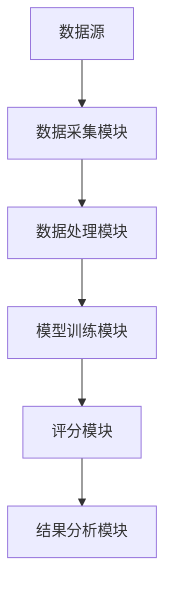

                 


# AI辅助的企业信用评分卡开发

> 关键词：企业信用评分卡、AI辅助、机器学习、信用评分模型、数据挖掘、金融风险管理

> 摘要：本文系统地探讨了AI辅助的企业信用评分卡开发的全过程，从背景介绍、核心概念、算法原理到系统架构设计和项目实战，结合实际案例深入分析了基于机器学习的信用评分模型的构建与优化。文章详细阐述了传统评分模型的局限性，以及如何通过AI技术提升评分卡的准确性和效率，帮助企业在金融风险管理中做出更明智的决策。

---

# 第一部分: 企业信用评分卡开发背景与基础

# 第1章: 企业信用评分卡的基本概念

## 1.1 信用评分卡的定义与作用

### 1.1.1 信用评分卡的定义

信用评分卡是一种用于评估企业信用状况的工具，通过收集和分析企业的财务、运营和市场数据，利用数学模型计算出一个综合评分，反映企业的信用风险等级。评分卡的结果通常用于银行、投资机构等金融机构在贷款审批、信用额度分配和风险管理中的决策参考。

### 1.1.2 信用评分卡在企业中的作用

- **信用风险评估**：帮助企业识别潜在的财务风险，避免与信用状况不佳的企业开展业务。
- **授信决策支持**：金融机构可以根据评分卡结果快速做出授信决策，提高审批效率。
- **优化资源配置**：通过评分卡，企业可以更合理地分配资源，降低风险敞口。

### 1.1.3 信用评分卡的分类与应用场景

- **企业信用评分卡**：主要用于评估企业的整体信用状况。
- **行业信用评分卡**：针对特定行业设计的评分卡，考虑行业特有的风险因素。
- **客户信用评分卡**：针对单个客户的信用评分，帮助企业筛选优质客户。

---

## 1.2 传统信用评分卡的局限性

### 1.2.1 传统评分模型的局限性

传统的企业信用评分卡通常基于简单的财务指标（如资产负债率、利润率）进行评估，存在以下问题：

- **维度单一**：仅关注财务数据，忽视了市场环境、管理能力等非财务因素。
- **模型静态**：传统评分模型缺乏动态调整能力，难以适应市场变化。
- **人工干预过多**：评分过程依赖人工经验，主观性强，效率低。

### 1.2.2 传统评分模型与AI辅助评分模型的对比

| 对比维度       | 传统评分模型                 | AI辅助评分模型               |
|----------------|------------------------------|------------------------------|
| 数据来源       | 有限的财务数据               | 财务、运营、市场多源数据       |
| 模型复杂度     | 简单线性模型                 | 高维非线性模型               |
| 决策效率       | 低效，依赖人工                | 高效，自动化决策              |
| 预测精度       | 精度较低                     | 精度高，支持复杂模式识别       |

---

## 1.3 AI辅助信用评分卡的优势

### 1.3.1 数据驱动的精准评估

AI技术能够整合企业内外部的多维度数据，包括财务数据、市场数据、行业趋势等，构建高维特征空间，提高评分的准确性。

### 1.3.2 非线性关系的捕捉

传统评分模型难以捕捉复杂的非线性关系，而AI算法（如随机森林、神经网络）能够发现数据中的隐含模式，提升评分模型的表达能力。

### 1.3.3 动态调整能力

AI模型可以实时更新，根据市场变化和企业最新数据动态调整评分结果，提供更及时的信用评估。

---

# 第2章: 企业信用评分卡的核心概念与联系

## 2.1 评分卡的构建过程

### 2.1.1 数据准备

- 数据收集：从企业财务报表、市场报告、新闻舆情等多渠道获取数据。
- 数据清洗：处理缺失值、异常值，确保数据质量。

### 2.1.2 特征选择

- 特征提取：从多维数据中提取关键特征，如企业偿债能力、盈利能力、运营效率等。
- 特征工程：通过主成分分析（PCA）等方法降维，提高模型效率。

### 2.1.3 模型训练

- 训练数据：将特征数据输入机器学习模型，训练评分卡模型。
- 模型调优：通过交叉验证优化模型参数，提高预测精度。

---

## 2.2 评分卡的评分逻辑

### 2.2.1 评分卡的评分规则

- 评分卡通常将企业信用状况划分为多个等级（如A、B、C、D、E），每个等级对应不同的信用评分范围。
- 评分规则基于模型预测结果，结合业务经验进行调整。

### 2.2.2 评分卡的解释性

- 评分卡的解释性是指模型对评分结果的可解释性，通常通过特征重要性分析实现。
- 高解释性的评分卡能够帮助业务人员理解评分结果背后的逻辑，增强决策的透明性。

---

## 2.3 评分卡的评价指标

### 2.3.1 模型性能指标

- **准确率（Accuracy）**：模型正确分类的比例。
- **召回率（Recall）**：模型正确识别阳性样本的比例。
- **F1分数（F1 Score）**：综合准确率和召回率的调和平均数。

### 2.3.2 评分卡的业务指标

- **违约率（Default Rate）**：实际违约企业占总企业的比例。
- **区分度（Discrimination）**：评分卡区分不同信用等级企业的能力。

---

# 第3章: 企业信用评分卡的算法原理

## 3.1 传统评分模型的算法基础

### 3.1.1 线性回归模型

- **线性回归**：通过最小二乘法拟合数据，预测企业的信用评分。
- **优点**：简单易懂，计算效率高。
- **缺点**：假设变量间线性关系，难以捕捉复杂模式。

### 3.1.2 逻辑回归模型

- **逻辑回归**：用于分类问题，预测企业信用等级。
- **优势**：概率输出，便于解释。

---

## 3.2 基于机器学习的评分模型

### 3.2.1 随机森林模型

- **随机森林**：通过集成学习提高模型的准确性和稳定性。
- **优势**：对异常值鲁棒，特征重要性分析直观。

### 3.2.2 神经网络模型

- **神经网络**：通过多层网络结构捕捉数据中的非线性关系。
- **优势**：表达能力强，适合高维数据。

---

## 3.3 算法选择与优化

### 3.3.1 算法选择的考虑因素

- 数据规模：样本量小选择随机森林，样本量大选择神经网络。
- 数据类型：分类任务选择逻辑回归或随机森林，回归任务选择线性回归。
- 解释性要求：业务场景需要高解释性时选择逻辑回归或随机森林。

### 3.3.2 算法优化策略

- **参数调优**：通过网格搜索（Grid Search）优化模型参数。
- **特征工程**：降维和特征选择提高模型性能。
- **模型融合**：集成学习（如投票法、加权法）提升预测精度。

---

# 第4章: 企业信用评分卡的系统分析与架构设计

## 4.1 系统功能设计

### 4.1.1 系统功能模块

- 数据采集模块：从多种数据源获取企业数据。
- 数据处理模块：清洗、转换和标准化数据。
- 模型训练模块：构建和优化评分卡模型。
- 评分模块：基于模型输出企业信用评分。
- 结果分析模块：展示评分结果并提供决策支持。

### 4.1.2 系统功能流程

1. 数据采集：获取企业财务、市场、行业等数据。
2. 数据处理：清洗和预处理数据，提取特征。
3. 模型训练：选择合适的算法，训练评分卡模型。
4. 模型部署：将模型部署到生产环境，实时评分。
5. 结果分析：分析评分结果，优化模型。

---

## 4.2 系统架构设计

### 4.2.1 系统架构图



### 4.2.2 模块交互流程

1. 数据采集模块从数据源获取数据，传递给数据处理模块。
2. 数据处理模块对数据进行清洗和预处理，提取特征后传递给模型训练模块。
3. 模型训练模块选择算法，训练评分卡模型，传递给评分模块。
4. 评分模块基于模型输出企业信用评分，传递给结果分析模块。
5. 结果分析模块分析评分结果，提供优化建议。

---

## 4.3 系统接口设计

### 4.3.1 数据接口

- 数据接口类型：RESTful API。
- 数据接口功能：提供数据采集和模型调用接口。

### 4.3.2 模型接口

- 模型接口类型：WebService。
- 模型接口功能：接收企业数据，返回信用评分。

---

# 第5章: 企业信用评分卡的项目实战

## 5.1 项目背景

### 5.1.1 项目目标

- 开发一个基于AI的信用评分卡系统，帮助企业评估客户信用风险。

### 5.1.2 项目需求

- 数据需求：获取企业的财务、市场、行业等数据。
- 功能需求：实现数据采集、处理、模型训练和评分功能。

---

## 5.2 项目环境搭建

### 5.2.1 开发工具安装

- **Python**：安装Anaconda或Miniconda。
- **机器学习库**：安装Scikit-learn、XGBoost、TensorFlow等。
- **数据处理工具**：安装Pandas、NumPy等。

### 5.2.2 数据源获取

- 数据来源：爬取企业公开数据、购买第三方数据或使用内部数据。

---

## 5.3 项目核心实现

### 5.3.1 数据预处理

```python
import pandas as pd
import numpy as np

# 数据清洗
data = pd.read_csv('enterprise_data.csv')
data = data.dropna()
data = data.replace([np.inf, -np.inf], np.nan).dropna()

# 特征工程
from sklearn.preprocessing import StandardScaler
scaler = StandardScaler()
data_scaled = scaler.fit_transform(data)
```

### 5.3.2 模型实现

```python
from sklearn.ensemble import RandomForestClassifier
from sklearn.metrics import accuracy_score

# 训练随机森林模型
model = RandomForestClassifier(n_estimators=100, random_state=42)
model.fit(X_train, y_train)

# 模型评估
y_pred = model.predict(X_test)
print("准确率:", accuracy_score(y_test, y_pred))
```

### 5.3.3 结果分析

```python
import matplotlib.pyplot as plt

# 绘制特征重要性图
feature_importance = pd.DataFrame({'feature': feature_names, 'importance': model.feature_importances_})
feature_importance = feature_importance.sort_values(by='importance', ascending=False)

plt.figure(figsize=(10, 6))
plt.barh(feature_importance['feature'], feature_importance['importance'])
plt.xlabel('特征重要性')
plt.ylabel('特征名')
plt.title('特征重要性分析')
plt.show()
```

---

## 5.4 项目总结与优化

### 5.4.1 项目总结

- 成功开发了一个基于AI的信用评分卡系统，提高了信用评估的准确性和效率。
- 系统具有良好的扩展性和可解释性，能够满足企业的实际需求。

### 5.4.2 模型优化

- 引入更多的特征，如企业社交媒体数据、供应链数据等。
- 使用更复杂的模型，如深度学习模型，进一步提升预测精度。

---

# 第6章: 企业信用评分卡的最佳实践与注意事项

## 6.1 最佳实践

### 6.1.1 数据收集与处理

- 确保数据的全面性和准确性，清洗数据，避免偏差。
- 对数据进行合理的特征工程，提升模型性能。

### 6.1.2 模型选择与调优

- 根据实际需求选择合适的算法，优化模型参数。
- 使用交叉验证评估模型性能，避免过拟合。

### 6.1.3 结果分析与解释

- 通过特征重要性分析，解释评分结果，增强业务理解。
- 定期更新模型，适应市场变化。

---

## 6.2 小结与注意事项

### 6.2.1 小结

- AI辅助的企业信用评分卡开发是一个复杂但 rewarding 的过程，需要结合技术与业务需求。
- 通过多维度数据分析和先进算法的应用，能够显著提升评分模型的准确性和效率。

### 6.2.2 注意事项

- 数据隐私与安全：确保数据处理过程中的隐私保护，遵守相关法律法规。
- 模型解释性：评分卡的高解释性对于业务决策至关重要，需要在模型设计中予以重视。
- 模型更新与维护：定期更新模型，确保评分结果的时效性。

---

# 作者

作者：AI天才研究院/AI Genius Institute & 禅与计算机程序设计艺术 /Zen And The Art of Computer Programming

