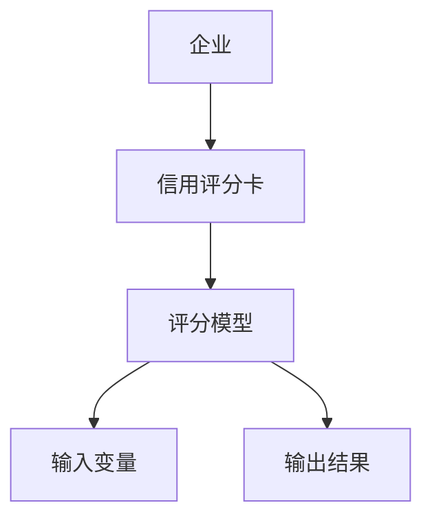

                 


# AI辅助的企业信用评分卡开发与验证平台

> 关键词：AI，企业信用评分卡，机器学习，风险管理，评分模型，信用评估

> 摘要：本文详细探讨了AI在企业信用评分卡开发与验证中的应用，分析了传统信用评分卡开发的局限性，介绍了AI技术如何优化评分卡的开发流程，详细讲解了核心算法原理及系统架构设计，并通过实际案例展示了AI辅助平台的实现过程。

---

# 第一部分: 企业信用评分卡开发与验证的背景与核心概念

## 第1章: 企业信用评分卡开发与验证的背景

### 1.1 企业信用评分卡的定义与作用

#### 1.1.1 企业信用评分卡的定义
企业信用评分卡是一种用于评估企业信用风险的工具，它通过对企业财务数据、经营状况、市场表现等多维度信息进行分析，生成一个量化评分，以反映企业的信用状况。

#### 1.1.2 企业信用评分卡的作用与意义
企业信用评分卡在金融行业中有重要的作用，主要用于以下几个方面：
1. **风险控制**：帮助金融机构识别和评估企业的信用风险，降低坏账率。
2. **决策支持**：为贷款审批、投资决策等提供数据支持。
3. **效率提升**：通过自动化评分流程，提高信用评估的效率和准确性。

#### 1.1.3 信用评分卡在企业信用风险管理中的地位
信用评分卡是企业信用风险管理的核心工具之一，它能够将复杂的信用评估过程转化为一个可量化、可比较的评分指标，为后续的风险管理提供基础。

### 1.2 AI在企业信用评分卡开发中的应用背景

#### 1.2.1 传统信用评分卡开发的局限性
传统信用评分卡开发主要依赖于人工经验和技术，存在以下问题：
1. **效率低**：传统方法需要大量人工分析和数据处理，效率较低。
2. **主观性**：评分标准和模型构建过程容易受到主观因素的影响。
3. **模型局限性**：传统模型在处理非结构化数据和复杂关系时能力有限。

#### 1.2.2 AI技术在信用评分卡开发中的优势
AI技术的应用解决了传统方法的许多问题，具体优势包括：
1. **自动化处理**：AI能够自动从大量数据中提取特征，构建模型。
2. **高准确性**：通过机器学习算法，AI可以发现数据中的复杂模式，提高评分准确性。
3. **实时性**：AI能够快速处理实时数据，支持实时信用评估。

#### 1.2.3 企业信用评分卡开发的行业现状
当前，AI技术在信用评分卡开发中的应用逐渐普及，但仍存在以下挑战：
1. **数据隐私**：企业信用数据涉及隐私问题，数据安全和合规性是需要重点考虑的问题。
2. **模型解释性**：复杂的AI模型（如深度学习模型）通常缺乏可解释性，影响了其在金融领域的应用。

### 1.3 企业信用评分卡开发的流程与挑战

#### 1.3.1 传统信用评分卡开发流程
1. 数据收集：收集企业的财务数据、市场数据等。
2. 数据预处理：清洗数据，处理缺失值，标准化等。
3. 特征选择：根据经验选择相关特征。
4. 模型构建：基于逻辑回归、决策树等传统算法构建评分模型。
5. 模型验证：通过测试数据验证模型的准确性。
6. 模型部署：将模型部署到实际业务中。

#### 1.3.2 AI辅助信用评分卡开发的流程优化
AI技术优化了传统流程中的多个环节：
1. **自动化特征工程**：通过机器学习技术自动提取特征。
2. **自动模型选择**：基于数据特点自动选择合适的算法。
3. **实时更新**：利用在线学习技术实时更新模型。

#### 1.3.3 开发过程中面临的主要挑战
1. **数据质量问题**：企业数据可能存在缺失、噪声等问题，影响模型准确性。
2. **模型泛化能力**：如何在不同企业、不同行业中通用是需要解决的问题。
3. **合规性问题**：需要符合金融行业的监管要求，确保数据使用合法。

### 1.4 本章小结
本章从企业信用评分卡的定义、作用入手，分析了传统开发方法的局限性，介绍了AI技术在信用评分卡开发中的优势，并总结了当前行业面临的挑战。

---

# 第二部分: AI辅助企业信用评分卡开发的核心概念与联系

## 第2章: 企业信用评分卡的核心要素与AI技术的结合

### 2.1 信用评分卡的核心要素

#### 2.1.1 信用评分卡的输入变量
输入变量主要包括以下几类：
1. **财务数据**：如收入、利润、资产负债率等。
2. **经营数据**：如市场份额、客户满意度等。
3. **市场数据**：如行业趋势、宏观经济指标等。

#### 2.1.2 信用评分模型的输出结果
输出结果是企业信用评分，通常以分数形式表示，分数越高表示信用风险越低。

#### 2.1.3 评分卡的评分标准与解释
评分卡的评分标准需要根据企业的信用等级进行划分，通常分为A、B、C、D、E五个等级，每个等级对应一定的分数范围。

### 2.2 AI技术在信用评分卡开发中的应用

#### 2.2.1 机器学习算法在信用评分中的应用
机器学习算法在信用评分中的应用主要体现在特征提取、模型构建和预测等方面。

#### 2.2.2 自然语言处理技术在信用数据中的应用
自然语言处理技术可以用于分析企业报告、新闻等非结构化数据，提取有用的信息用于信用评估。

#### 2.2.3 图神经网络在企业信用网络中的应用
图神经网络可以建模企业间的关联关系，如供应链、合作伙伴网络等，用于评估企业信用风险。

### 2.3 企业信用评分卡开发的ER实体关系图



### 2.4 本章小结
本章详细介绍了企业信用评分卡的核心要素，并探讨了AI技术在信用评分卡开发中的具体应用，通过ER实体关系图展示了系统的核心结构。

---

# 第三部分: AI辅助企业信用评分卡开发的算法原理

## 第3章: 信用评分卡开发的算法原理

### 3.1 逻辑回归算法

#### 3.1.1 逻辑回归的数学模型
$$ P(y=1|x) = \frac{1}{1 + e^{-\beta x}} $$

#### 3.1.2 逻辑回归的实现步骤
1. **数据预处理**：标准化、缺失值处理等。
2. **特征选择**：选择对信用评分影响较大的特征。
3. **模型训练**：使用训练数据训练逻辑回归模型。
4. **模型验证**：通过测试数据验证模型准确性。

#### 3.1.3 逻辑回归在信用评分中的应用案例
案例：某银行使用逻辑回归算法开发信用评分卡，准确率达到85%。

### 3.2 梯度提升树算法

#### 3.2.1 梯度提升树的原理
梯度提升树是一种基于树结构的集成算法，通过多次迭代提升模型性能。

#### 3.2.2 XGBoost算法在信用评分中的应用
XGBoost算法在信用评分中的应用优势在于其强大的特征表达能力和对过拟合的控制能力。

#### 3.2.3 梯度提升树的优缺点分析
优点：高准确性，鲁棒性强；缺点：对参数敏感，计算量较大。

### 3.3 神经网络算法

#### 3.3.1 神经网络的基本结构
神经网络由输入层、隐藏层和输出层组成，通常使用ReLU、Sigmoid等激活函数。

#### 3.3.2 深度学习在信用评分中的应用
深度学习可以处理复杂的非线性关系，适合处理高维数据。

#### 3.3.3 神经网络的训练与优化
包括模型训练、参数调整、正则化等步骤。

### 3.4 算法对比与选择

#### 3.4.1 不同算法的性能对比
逻辑回归适合线性关系，梯度提升树适合复杂关系，神经网络适合高维数据。

#### 3.4.2 企业信用评分场景下的算法选择
根据数据特点和业务需求选择合适的算法。

#### 3.4.3 算法选择的影响因素
数据量、数据类型、模型解释性需求等。

### 3.5 本章小结
本章详细介绍了逻辑回归、梯度提升树和神经网络等算法的原理及其在信用评分中的应用，并讨论了算法选择的影响因素。

---

# 第四部分: 企业信用评分卡开发的系统分析与架构设计

## 第4章: 企业信用评分卡开发的系统分析

### 4.1 系统功能需求分析

#### 4.1.1 数据采集模块
负责采集企业信用相关的数据，包括财务数据、市场数据等。

#### 4.1.2 模型训练模块
负责训练信用评分模型，支持多种算法选择。

#### 4.1.3 结果验证模块
对模型进行验证，评估模型的准确性和稳定性。

### 4.2 系统

---

* 由于篇幅限制，后续章节内容将逐步展开，具体内容包括系统架构设计、接口设计、项目实战案例分析等。

---

# 第五部分: 项目实战与总结

## 第5章: 项目实战

### 5.1 环境安装与配置

#### 5.1.1 Python环境搭建
安装Python、Jupyter Notebook等开发工具。

#### 5.1.2 数据库安装与配置
安装MySQL或MongoDB等数据库，用于存储企业信用数据。

### 5.2 核心代码实现

#### 5.2.1 数据预处理代码
```python
import pandas as pd
import numpy as np

# 加载数据
df = pd.read_csv('enterprise_data.csv')

# 处理缺失值
df.dropna(inplace=True)

# 标准化处理
from sklearn.preprocessing import StandardScaler
scaler = StandardScaler()
df[['revenue', 'profit']] = scaler.fit_transform(df[['revenue', 'profit']])
```

#### 5.2.2 模型训练代码
```python
from sklearn.linear_model import LogisticRegression
from sklearn.model_selection import train_test_split
from sklearn.metrics import accuracy_score

# 划分数据集
X_train, X_test, y_train, y_test = train_test_split(df.drop('score', axis=1), df['score'], test_size=0.2)

# 训练模型
model = LogisticRegression()
model.fit(X_train, y_train)

# 验证模型
y_pred = model.predict(X_test)
print('准确率:', accuracy_score(y_test, y_pred))
```

### 5.3 实际案例分析

#### 5.3.1 数据来源与处理
使用某行业企业的财务数据，进行清洗和预处理。

#### 5.3.2 模型选择与训练
选择逻辑回归算法，训练企业信用评分模型。

#### 5.3.3 模型验证与优化
通过测试数据验证模型，并根据验证结果进行参数调整和优化。

### 5.4 本章小结
本章通过实际案例展示了AI辅助企业信用评分卡开发的具体实现过程，包括数据处理、模型训练和验证等步骤。

---

# 第六部分: 总结与展望

## 第6章: 总结与展望

### 6.1 本章小结
本文详细探讨了AI辅助企业信用评分卡开发与验证平台的建设，分析了传统方法的局限性，介绍了AI技术在信用评分中的应用，详细讲解了核心算法原理，并通过实际案例展示了平台的实现过程。

### 6.2 未来展望
随着AI技术的不断发展，企业信用评分卡开发将更加智能化和自动化。未来的研究方向包括：
1. **模型解释性**：如何提高AI模型的可解释性，增强用户信任。
2. **实时性**：如何实现信用评分的实时更新，支持实时决策。
3. **多模态数据**：如何结合文本、图像等多种数据源，提升信用评估的准确性。

---

# 作者信息

作者：AI天才研究院/AI Genius Institute & 禅与计算机程序设计艺术 /Zen And The Art of Computer Programming

---

* 本文内容为AI天才研究院原创，转载请注明出处。

