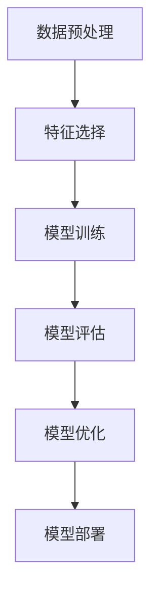
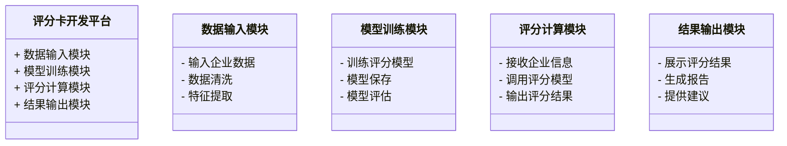
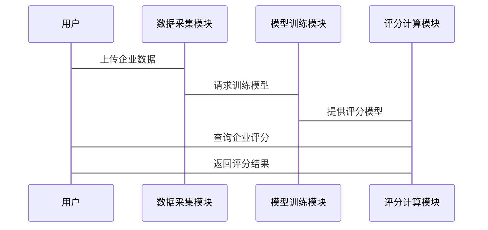

                 


# AI辅助的企业信用评分卡开发平台

## 关键词：AI技术、企业信用评分卡、机器学习、系统架构、开发平台

## 摘要：  
本文将探讨如何利用人工智能技术辅助企业信用评分卡的开发。通过分析传统信用评分卡开发的挑战，结合AI技术的核心优势，介绍AI在信用评分卡开发中的应用场景与价值。文章详细讲解了信用评分卡的核心要素、AI算法的实现原理、系统架构设计以及实际项目开发的流程，最后总结了AI辅助开发平台的最佳实践与未来发展趋势。

---

# 第一部分: 企业信用评分卡开发背景与AI辅助的必要性

# 第1章: 企业信用评分卡的背景与挑战

## 1.1 企业信用评分卡的定义与作用  
企业信用评分卡是用于评估企业信用风险的重要工具，它通过量化企业的财务状况、经营能力、偿债能力等多维度信息，生成一个综合评分，帮助企业进行信贷决策。  

### 1.1.1 信用评分卡的定义  
信用评分卡是一种基于企业信用数据构建的数学模型，通过对企业历史数据的分析，预测企业的信用风险等级。  

### 1.1.2 信用评分卡在企业中的作用  
- **风险控制**：帮助企业识别高风险客户，降低坏账率。  
- **精准营销**：通过评分结果，精准筛选潜在客户，优化资源配置。  
- **合规性**：满足金融监管要求，确保信贷决策的透明性和合规性。  

### 1.1.3 信用评分卡的分类与应用场景  
- **企业信用评分卡**：适用于企业客户的信用评估。  
- **个人信用评分卡**：适用于个人客户的信用评估。  
- **行业定制化评分卡**：针对特定行业的信用评估需求，定制化模型。  

## 1.2 传统信用评分卡开发的挑战  

### 1.2.1 数据获取与处理的难点  
- 数据来源分散，清洗难度大。  
- 数据维度复杂，特征选择困难。  
- 数据质量和完整性不足，影响模型准确性。  

### 1.2.2 模型构建与优化的复杂性  
- 传统评分卡开发依赖人工经验，效率低下。  
- 模型调优过程繁琐，需要多次迭代。  
- 模型解释性差，难以满足监管要求。  

### 1.2.3 评分卡维护与更新的困难  
- 数据更新不及时，模型过时。  
- 评分标准变更频繁，难以快速调整模型。  
- 缺乏自动化工具，维护成本高。  

## 1.3 AI技术如何辅助信用评分卡开发  

### 1.3.1 AI在信用评分卡开发中的优势  
- **自动化数据处理**：AI能够快速清洗和特征提取，提高开发效率。  
- **智能化模型构建**：AI算法能够自动优化模型参数，提升模型准确性。  
- **实时更新与维护**：AI技术支持在线学习，能够实时更新评分卡。  

### 1.3.2 AI技术的核心作用与应用场景  
- **数据预处理**：利用自然语言处理（NLP）技术提取非结构化数据。  
- **模型优化**：使用深度学习算法提升模型的预测能力。  
- **自动化维护**：通过机器学习实现评分卡的动态更新。  

### 1.3.3 未来发展趋势与潜在价值  
- AI技术将进一步提升评分卡的智能化水平。  
- 多模态数据融合将成为未来发展的趋势。  
- AI辅助开发平台将推动信用评分卡的普及与应用。  

## 1.4 本章小结  
本章从企业信用评分卡的背景、定义、作用入手，分析了传统开发中的挑战，并重点介绍了AI技术在信用评分卡开发中的必要性与优势。  

---

# 第二部分: 企业信用评分卡的核心概念与AI联系  

# 第2章: 信用评分卡的核心要素与结构  

## 2.1 信用评分卡的构成要素  

### 2.1.1 信用评分模型  
评分模型是信用评分卡的核心，常用的模型包括逻辑回归、随机森林、支持向量机（SVM）等。  

### 2.1.2 评分指标与权重  
评分指标是影响企业信用评分的关键因素，权重反映了每个指标的重要程度。  

### 2.1.3 评分标准与等级划分  
评分标准是将评分结果转化为具体信用等级的规则，通常分为A、B、C、D、E五个等级。  

## 2.2 企业信用评分卡的属性特征对比  

### 2.2.1 传统评分卡与AI评分卡的对比分析  
| 特性         | 传统评分卡       | AI评分卡         |  
|--------------|------------------|------------------|  
| 数据处理     | 人工为主         | 自动化处理       |  
| 模型构建     | 依赖经验         | 基于机器学习     |  
| 维护成本     | 高               | 低               |  

### 2.2.2 AI评分卡的核心属性特征  
- **数据驱动**：基于大量数据训练，模型具有更高的准确性。  
- **动态调整**：能够实时更新模型参数，适应市场变化。  
- **可解释性**：通过特征重要性分析，提供清晰的决策依据。  

### 2.2.3 评分卡属性的ER实体关系图  

```mermaid
er
    entity 评分卡 {
        key 评分卡ID
        attribute 评分模型
        attribute 评分指标
        attribute 评分标准
    }
    entity 企业信息 {
        key 企业ID
        attribute 企业名称
        attribute 财务数据
        attribute 经营数据
    }
    relationship 评分卡评估 {
        评分卡 -> 企业信息
    }
```

## 2.3 本章小结  
本章详细介绍了信用评分卡的核心要素，包括评分模型、评分指标和评分标准，并通过对比分析和ER图展示了传统评分卡与AI评分卡的主要区别。  

---

# 第三部分: 基于机器学习的企业信用评分卡模型  

# 第3章: 基于机器学习的企业信用评分卡模型  

## 3.1 机器学习算法的选择与实现  

### 3.1.1 常见算法的比较与选择  
- **逻辑回归**：适合二分类问题，常用于信用评分卡的开发。  
- **随机森林**：适用于高维数据，能够处理特征重要性分析。  
- **XGBoost**：在信用评分卡开发中表现优异，能够处理复杂特征。  

### 3.1.2 算法实现流程  



### 3.1.3 逻辑回归模型的数学公式  
逻辑回归模型的损失函数为：  
$$ L(\theta) = -\frac{1}{m}\sum_{i=1}^{m} [y_i \ln h(x_i) + (1-y_i)\ln(1-h(x_i))] $$  
其中，$$ h(x_i) = \frac{1}{1 + e^{-\theta^T x_i}} $$  

## 3.2 机器学习模型的优化与调优  

### 3.2.1 模型调优的常用方法  
- **网格搜索（Grid Search）**：通过遍历参数空间，找到最优参数组合。  
- **交叉验证（Cross Validation）**：用于评估模型的泛化能力。  

### 3.2.2 模型优化的代码实现  

```python
from sklearn.linear_model import LogisticRegression
from sklearn.model_selection import GridSearchCV

# 参数设置
param_grid = {
    'C': [0.1, 1, 10],
    'penalty': ['l2']
}

# 模型训练
model = GridSearchCV(LogisticRegression(), param_grid, cv=5)
model.fit(X_train, y_train)

# 最优参数
print("Best Parameters:", model.best_params_)
```

## 3.3 本章小结  
本章通过比较不同机器学习算法的优缺点，详细介绍了逻辑回归模型的实现过程，并通过网格搜索和交叉验证优化了模型性能。  

---

# 第四部分: 系统分析与架构设计方案  

# 第4章: 系统分析与架构设计方案  

## 4.1 系统功能设计  

### 4.1.1 领域模型设计  



## 4.2 系统架构设计  

### 4.2.1 系统架构图  

```mermaid
archi
    component 数据采集模块 {
        input 数据来源
        output 清洗后的数据
    }
    component 模型训练模块 {
        input 数据集
        output 评分模型
    }
    component 评分计算模块 {
        input 企业信息
        output 评分结果
    }
    component 系统交互模块 {
        input 用户请求
        output 响应结果
    }
    数据采集模块 --> 模型训练模块
    模型训练模块 --> 评分计算模块
    评分计算模块 --> 系统交互模块
```

## 4.3 系统接口设计  

### 4.3.1 API接口设计  
- **数据接口**：提供数据上传和下载的功能。  
- **模型接口**：提供模型训练和调用的功能。  
- **结果接口**：提供评分结果查询和导出的功能。  

### 4.3.2 系统交互流程  



## 4.4 本章小结  
本章从系统功能设计、架构设计和接口设计三个方面，详细介绍了AI辅助的企业信用评分卡开发平台的实现方案。  

---

# 第五部分: 项目实战与部署  

# 第5章: 项目实战与部署  

## 5.1 环境安装与配置  

### 5.1.1 安装开发环境  
- **Python版本**：建议使用Python 3.8及以上版本。  
- **依赖库安装**：使用pip安装numpy、pandas、scikit-learn等库。  

### 5.1.2 数据集准备  
- 数据集来源：可以从公开数据集或企业内部数据中获取。  
- 数据格式：建议使用CSV格式，包含企业财务数据、经营数据等。  

## 5.2 系统核心实现  

### 5.2.1 数据预处理代码  

```python
import pandas as pd
import numpy as np

# 读取数据
data = pd.read_csv('企业数据.csv')

# 数据清洗
data = data.dropna()
data = pd.get_dummies(data)

# 特征选择
selected_features = ['财务指标1', '经营指标2', '信用历史']
data = data[selected_features]

# 标签提取
labels = data['信用等级']
features = data.drop('信用等级', axis=1)
```

### 5.2.2 模型训练代码  

```python
from sklearn.linear_model import LogisticRegression
from sklearn.model_selection import train_test_split

# 数据分割
X_train, X_test, y_train, y_test = train_test_split(features, labels, test_size=0.2, random_state=42)

# 模型训练
model = LogisticRegression(max_iter=1000).fit(X_train, y_train)

# 模型评估
score = model.score(X_test, y_test)
print(f'模型准确率：{score}')
```

## 5.3 项目小结  
本章通过一个实际项目案例，详细介绍了AI辅助的企业信用评分卡开发平台的实现过程，包括环境配置、数据预处理和模型训练等内容。  

---

# 第六部分: AI辅助平台的最佳实践  

# 第6章: AI辅助平台的最佳实践  

## 6.1 开发中的注意事项  

### 6.1.1 数据质量管理  
- 确保数据的准确性和完整性。  
- 处理异常值和重复数据。  

### 6.1.2 模型调优技巧  
- 使用交叉验证评估模型性能。  
- 通过特征重要性分析优化模型。  

## 6.2 系统维护与优化  

### 6.2.1 数据更新策略  
- 定期更新模型数据，确保模型的实时性。  
- 监控数据质量，及时处理异常情况。  

### 6.2.2 模型更新策略  
- 定期重新训练模型，适应市场变化。  
- 使用在线学习技术，动态更新模型。  

## 6.3 拓展阅读与工具推荐  

### 6.3.1 拓展阅读  
- 《机器学习实战》  
- 《深入理解机器学习》  

### 6.3.2 工具推荐  
- **Python**：用于数据分析和模型训练。  
- **TensorFlow**：用于深度学习模型的开发。  
- **Scikit-learn**：用于机器学习模型的调优。  

## 6.4 本章小结  
本章总结了AI辅助的企业信用评分卡开发平台的最佳实践，包括数据质量管理、模型调优技巧和系统维护策略等内容。  

---

# 作者：AI天才研究院/AI Genius Institute & 禅与计算机程序设计艺术 /Zen And The Art of Computer Programming  

---

通过以上结构和内容，您可以撰写一篇完整且有深度的《AI辅助的企业信用评分卡开发平台》技术博客文章。

