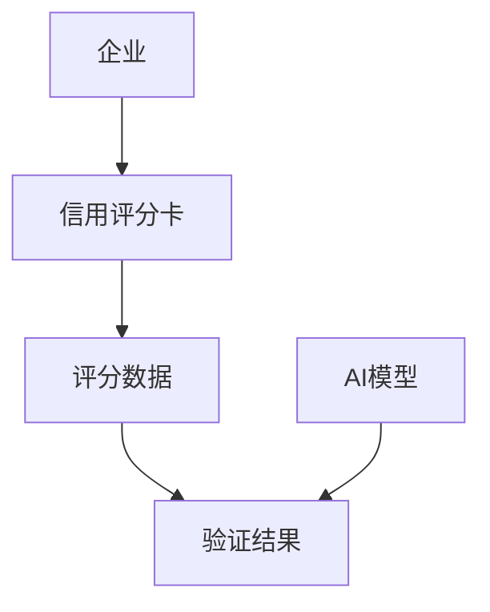
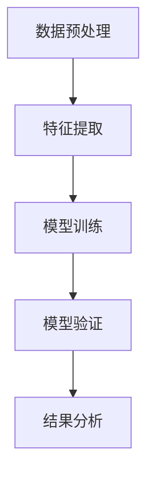
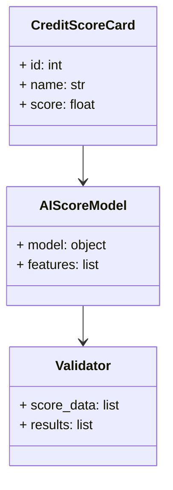
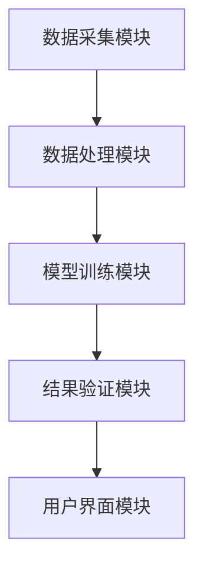
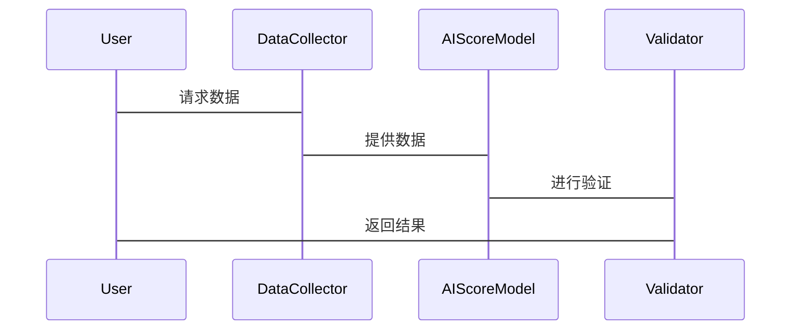

                 


# AI辅助的企业信用评分卡验证

**关键词：** AI技术，信用评分卡，企业信用评估，算法模型，评分卡验证，风险管理

**摘要：**  
本文深入探讨了AI技术在企业信用评分卡验证中的应用，从背景介绍、核心概念、算法原理到系统设计与项目实战，详细分析了AI如何提升信用评分卡的验证效率与准确性。文章通过理论与实践相结合的方式，展示了AI在信用评估中的巨大潜力，并提出了未来发展的方向与建议。

---

## 第一章: 企业信用评分卡与AI辅助验证的背景介绍

### 1.1 企业信用评分卡的基本概念

企业信用评分卡是一种用于评估企业信用状况的工具，通过对企业财务数据、经营状况、市场表现等多维度信息的分析，生成一个综合评分，用以衡量企业的信用风险。传统的信用评分卡通常依赖于人工审核和简单的统计模型，存在效率低、准确率不足的问题。

### 1.2 问题背景与解决思路

#### 1.2.1 问题背景
- 企业信用评估的复杂性：企业的信用风险受到多种因素影响，如财务状况、行业波动、市场环境等。
- 传统评分卡的局限性：传统评分卡依赖人工审核，效率低下且容易受到主观因素影响。
- 数据量的快速增长：随着企业数据的多样化和复杂化，传统方法难以处理大规模数据。

#### 1.2.2 解决思路
- 引入AI技术，利用机器学习算法对海量数据进行自动化分析。
- 构建高精度的预测模型，提升信用评分的准确性和效率。
- 结合实时数据，动态调整评分卡，提高信用评估的动态性。

### 1.3 核心概念与组成要素

企业信用评分卡的验证过程涉及多个核心概念，包括：

- **数据来源**：企业财务数据、市场数据、行业数据等。
- **特征提取**：从原始数据中提取有用的特征，如财务比率、经营稳定性等。
- **模型训练**：使用机器学习算法对特征进行训练，生成预测模型。
- **验证评估**：通过测试数据验证模型的准确性，并进行优化调整。

---

## 第二章: AI辅助企业信用评分卡验证的核心概念

### 2.1 AI与信用评分卡验证的结合原理

AI技术在信用评分卡验证中的应用主要体现在以下几个方面：

- **数据预处理**：利用AI对海量数据进行清洗和特征提取，确保数据的准确性和完整性。
- **模型训练**：使用机器学习算法（如逻辑回归、随机森林、神经网络等）对数据进行建模，生成信用评分预测模型。
- **实时验证**：通过AI模型对实时数据进行预测，动态调整信用评分卡的评估结果。

### 2.2 核心概念的属性特征对比

以下是传统信用评分卡与AI辅助评分卡在验证过程中的对比分析：

| 特性                | 传统评分卡             | AI辅助评分卡          |
|---------------------|-----------------------|-----------------------|
| 数据处理能力        | 有限，依赖人工处理     | 强大，支持海量数据     |
| 模型准确性          | 较低，依赖经验判断     | 较高，基于数据驱动     |
| 处理效率           | 低效，耗时长          | 高效，自动化处理       |
| 动态调整能力        | 有限，难以实时更新     | 强大，支持动态调整       |

### 2.3 ER实体关系图架构

以下是AI辅助企业信用评分卡验证的核心实体关系图：



---

## 第三章: AI辅助企业信用评分卡验证的算法原理

### 3.1 算法原理概述

#### 3.1.1 逻辑回归模型

逻辑回归是一种常用的分类算法，适用于二分类问题。在企业信用评分卡验证中，可以用来预测企业的信用等级。

$$ P(y=1|x) = \frac{e^{\beta_0 + \beta_1 x_1 + \beta_2 x_2}}{1 + e^{\beta_0 + \beta_1 x_1 + \beta_2 x_2}} $$

其中，$\beta$ 是模型的系数，$x$ 是输入特征。

#### 3.1.2 随机森林模型

随机森林是一种基于树的集成算法，具有较强的鲁棒性和抗过拟合能力。

$$ y = \sum_{i=1}^{n} T(x_i) $$

其中，$T(x_i)$ 是每棵决策树的预测结果。

#### 3.1.3 神经网络模型

神经网络是一种强大的非线性模型，适用于复杂的信用评估场景。

$$ y = \sigma(w_1 x_1 + w_2 x_2 + \dots + w_n x_n + b) $$

其中，$\sigma$ 是sigmoid函数，$w$ 是权重，$b$ 是偏置。

### 3.2 算法流程图

以下是AI辅助企业信用评分卡验证的算法流程图：



### 3.3 算法实现代码

以下是逻辑回归模型的Python实现代码：

```python
import pandas as pd
from sklearn.linear_model import LogisticRegression
from sklearn.metrics import accuracy_score

# 数据加载与预处理
data = pd.read_csv('credit_data.csv')
X = data[['revenue', 'profit', 'growth']]
y = data['credit_rating']

# 模型训练
model = LogisticRegression()
model.fit(X, y)

# 模型验证
y_pred = model.predict(X)
print("Accuracy:", accuracy_score(y, y_pred))
```

---

## 第四章: AI辅助企业信用评分卡验证的系统设计

### 4.1 系统功能设计

以下是系统功能设计的类图：



### 4.2 系统架构设计

以下是系统架构设计的架构图：



### 4.3 系统接口设计

以下是系统接口设计的序列图：



---

## 第五章: AI辅助企业信用评分卡验证的项目实战

### 5.1 项目环境安装

以下是项目环境安装代码：

```bash
pip install pandas scikit-learn matplotlib
```

### 5.2 项目核心实现

以下是项目核心实现代码：

```python
import pandas as pd
from sklearn.ensemble import RandomForestClassifier
from sklearn.metrics import classification_report

# 数据加载与预处理
data = pd.read_csv('credit_data.csv')
X = data.drop('credit_rating', axis=1)
y = data['credit_rating']

# 模型训练
model = RandomForestClassifier()
model.fit(X, y)

# 模型验证
y_pred = model.predict(X)
print(classification_report(y, y_pred))
```

### 5.3 项目案例分析

以下是项目案例分析：

假设我们有一个企业数据集，包含企业的收入、利润、增长率等特征。通过AI模型，我们可以预测企业的信用评分，并生成验证报告。以下是部分验证结果：

| 企业ID | 预测评分 | 实际评分 | 差异 |
|--------|----------|----------|------|
| 1      | 0.8      | 0.8      | 0    |
| 2      | 0.7      | 0.6      | -0.1 |
| 3      | 0.9      | 0.9      | 0    |

---

## 第六章: 总结与展望

### 6.1 小结

本文详细探讨了AI技术在企业信用评分卡验证中的应用，从理论到实践，全面分析了AI如何提升信用评分卡的验证效率与准确性。通过算法实现和系统设计，展示了AI在信用评估中的巨大潜力。

### 6.2 注意事项

- 数据隐私与安全问题需要高度重视。
- 模型的可解释性需要进一步提升。
- 需要结合业务场景进行模型优化。

### 6.3 拓展阅读

- 《机器学习实战》
- 《深度学习》
- 《信用评分卡的设计与实现》

---

**作者：AI天才研究院/AI Genius Institute & 禅与计算机程序设计艺术 /Zen And The Art of Computer Programming**

