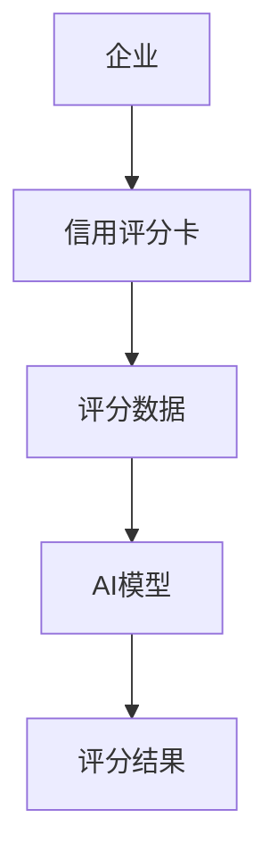
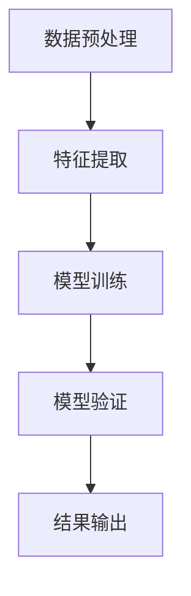
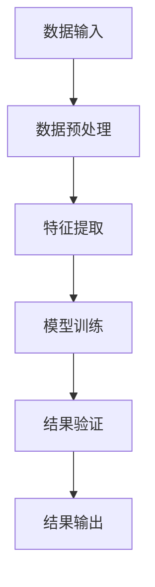
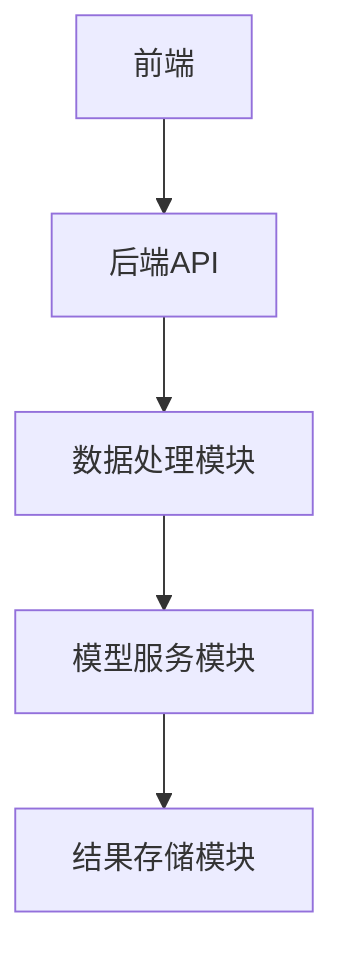
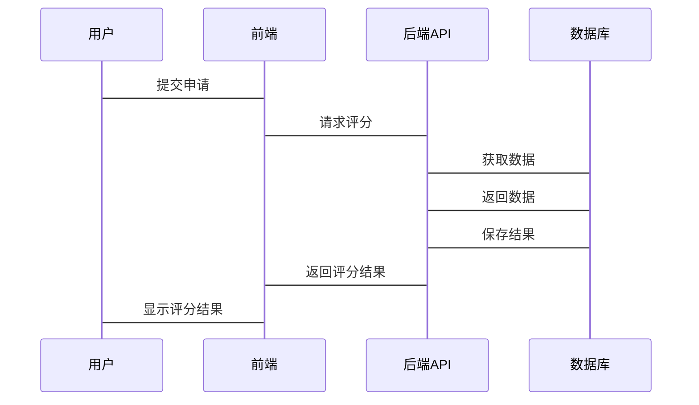

                 


# AI辅助的企业信用评分卡验证系统

---

## 关键词：企业信用评分卡，AI辅助系统，机器学习，信用风险，数据验证

---

## 摘要：本文深入探讨了AI在企业信用评分卡验证系统中的应用，从背景、核心概念到算法原理、系统架构，再到项目实战，全面解析了如何利用AI技术提升信用评分的准确性和效率。通过详细的技术分析和实例，本文为读者提供了从理论到实践的完整指南。

---

## 目录

### 第一章：企业信用评分卡与AI验证系统概述

#### 1.1 企业信用评分卡的背景与意义
- 1.1.1 信用评分卡的基本概念
- 1.1.2 AI在信用评分中的作用
- 1.1.3 企业信用评分卡的应用价值

#### 1.2 传统信用评分卡的局限性
- 1.2.1 数据处理的复杂性
- 1.2.2 模型的可解释性问题
- 1.2.3 人工审核的效率低下

#### 1.3 AI辅助信用评分卡的优势
- 1.3.1 提高评分的准确性
- 1.3.2 增强模型的可解释性
- 1.3.3 提升审核效率

### 第二章：企业信用评分卡的核心概念与联系

#### 2.1 核心概念原理
- 2.1.1 数据特征提取
- 2.1.2 模型训练与优化
- 2.1.3 结果验证与反馈

#### 2.2 核心概念属性对比表
| 属性 | 传统评分卡 | AI辅助评分卡 |
|------|------------|--------------|
| 数据来源 | 结构化数据 | 结构化+非结构化数据 |
| 模型选择 | 单一模型 | 多模型融合 |
| 可解释性 | 低 | 高 |
| 效率 | 低 | 高 |

#### 2.3 ER实体关系图


### 第三章：AI辅助信用评分卡的算法原理

#### 3.1 算法选择与流程


#### 3.2 算法实现代码
```python
import pandas as pd
from sklearn.model_selection import train_test_split
from sklearn.linear_model import LogisticRegression

# 加载数据
data = pd.read_csv('credit_data.csv')

# 数据预处理
X = data.drop('target', axis=1)
y = data['target']

# 分割数据
X_train, X_test, y_train, y_test = train_test_split(X, y, test_size=0.2)

# 模型训练
model = LogisticRegression()
model.fit(X_train, y_train)

# 验证
score = model.score(X_test, y_test)
print(f'模型准确率: {score}')
```

#### 3.3 数学模型与公式
- 模型选择：
  $$ \text{模型选择} = \argmin_{\theta} \sum_{i=1}^{n} (y_i - \hat{y}_i)^2 $$
- 评估指标：
  $$ \text{准确率} = \frac{\text{正确预测数}}{\text{总预测数}} $$

### 第四章：系统分析与架构设计

#### 4.1 系统功能设计


#### 4.2 系统架构设计


#### 4.3 系统接口设计
- 数据接口：
  ```python
  def get_data():
      # 获取数据
  ```
- 模型接口：
  ```python
  def predict_score(data):
      # 使用模型预测
  ```

#### 4.4 系统交互设计


### 第五章：项目实战

#### 5.1 环境安装
- 安装Python和必要的库：
  ```bash
  pip install pandas scikit-learn
  ```

#### 5.2 系统核心实现
- 数据预处理：
  ```python
  def preprocess_data(data):
      # 数据清洗和特征工程
  ```
- 模型训练：
  ```python
  def train_model(X_train, y_train):
      model = LogisticRegression()
      model.fit(X_train, y_train)
      return model
  ```

#### 5.3 实际案例分析
- 数据加载与处理：
  ```python
  data = pd.read_csv('credit_data.csv')
  data = preprocess_data(data)
  X_train, X_test, y_train, y_test = train_test_split(data.drop('target', axis=1), data['target'], test_size=0.2)
  model = train_model(X_train, y_train)
  print(f'模型准确率: {model.score(X_test, y_test)}')
  ```

### 第六章：总结与最佳实践

#### 6.1 总结
- AI辅助的企业信用评分卡验证系统通过提高准确性和效率，显著优化了传统方法的不足。

#### 6.2 注意事项
- 数据隐私保护
- 模型的持续维护与更新
- 结果的可解释性

#### 6.3 拓展阅读
- 《机器学习实战》
- 《Python机器学习》

---

## 作者：AI天才研究院/AI Genius Institute & 禅与计算机程序设计艺术 /Zen And The Art of Computer Programming

