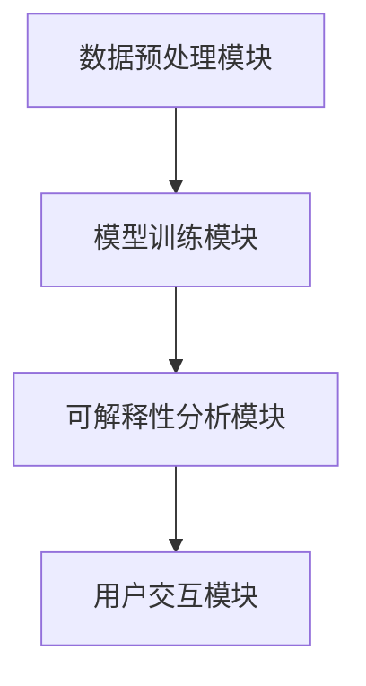

                 


# AI辅助的企业信用评级模型解释性研究

> 关键词：企业信用评级，人工智能，可解释性AI（XAI），SHAP值，LIME方法，XGBoost算法

> 摘要：本文深入探讨了AI技术在企业信用评级中的应用，重点分析了如何利用可解释性AI（XAI）技术提高信用评级模型的透明度和可解释性。文章首先介绍了企业信用评级的背景和传统方法的局限性，然后详细讲解了XAI的核心原理和算法，如SHAP值和LIME方法。接着，分析了XGBoost算法在信用评级中的数学模型和解释性方法。最后，通过一个实际案例展示了如何基于SHAP值构建和解释信用评级模型，为金融领域的AI应用提供了有益的参考。

---

# 第一部分: AI辅助的企业信用评级模型概述

## 第1章: 企业信用评级与AI辅助的背景

### 1.1 企业信用评级的定义与重要性

企业信用评级是衡量企业财务健康状况和偿债能力的重要指标，通常用于银行贷款审批、投资决策等领域。传统信用评级方法主要依赖财务报表分析和专家经验，但存在以下问题：
- 数据维度单一，难以全面反映企业风险
- 专家经验依赖性强，主观性较高
- 模型解释性差，难以向客户说明评级结果的依据

企业信用评级的核心目标是通过对企业财务状况、经营能力、偿债能力等多维度数据的分析，准确评估企业的信用风险。

### 1.2 AI技术在信用评级中的应用潜力

随着AI技术的发展，机器学习算法在信用评级中的应用越来越广泛。AI技术可以帮助解决以下问题：
- 数据维度多，需要处理结构化和非结构化数据
- 模型复杂性高，需要可解释性支持
- 需要实时更新模型以适应市场变化

### 1.3 可解释性AI（XAI）在信用评级中的重要性

可解释性AI（XAI）技术能够帮助金融从业者理解模型的决策过程，增强模型的透明性和信任度。在企业信用评级中，XAI技术可以帮助解释模型的预测结果，从而提高评级的准确性和可靠性。

---

## 第2章: 可解释性AI（XAI）的核心原理

### 2.1 XAI的基本概念与特征

XAI是一种结合了机器学习算法和可解释性技术的AI技术，其核心目标是提高模型的透明度和可解释性。XAI的主要特征包括：
- 解释性：能够为模型的输出提供直观的解释
- 透明性：模型的决策过程可以被用户理解和验证
- 可交互性：用户可以通过与模型交互来理解其决策逻辑

### 2.2 SHAP值与LIME解释方法

SHAP（Shapley Additive exPlanations）值是一种基于博弈论的解释方法，能够量化每个特征对模型预测结果的贡献。LIME（Local Interpretable Model-agnostic Explanations）是一种通过构建局部可解释模型来解释整体模型的解释方法。

SHAP值和LIME的对比分析：

| 对比维度 | SHAP值 | LIME方法 |
|----------|--------|----------|
| 解释范围 | 全局性 | 局部性 |
| 解释方式 | 基于特征重要性 | 基于局部模型 |
| 计算复杂度 | 较高 | 较低 |

### 2.3 企业信用评级中的特征重要性分析

特征重要性分析是信用评级中重要的一步。通过SHAP值可以量化每个特征对模型预测结果的影响程度。例如，在企业信用评级中，销售收入、资产负债率、净利润率等财务指标通常是最重要的特征。

---

## 第3章: XGBoost算法在信用评级中的应用

### 3.1 XGBoost算法概述

XGBoost是一种基于树的集成算法，具有以下特点：
- 高效性：采用正则化和剪枝技术优化模型
- 鲁棒性：能够处理数据中的噪声和缺失值
- 可扩展性：支持分布式训练

### 3.2 XGBoost在信用评级中的数学模型

XGBoost的损失函数为：
$$
L = \sum_{i=1}^n \left( y_i - \hat{y}_i \right)^2
$$
其中，$y_i$为真实值，$\hat{y}_i$为模型预测值。

模型的正则化项为：
$$
R = \lambda \sum_{i=1}^n \left( \theta_i - \theta_{i-1} \right)^2
$$
其中，$\theta_i$为树的分裂点参数。

### 3.3 SHAP值在信用评级中的应用

通过SHAP值可以解释XGBoost模型的预测结果。例如，在企业信用评级中，销售收入对模型预测结果的影响程度可以通过SHAP值的大小来衡量。

---

## 第4章: 系统架构设计

### 4.1 系统功能模块划分

- 数据预处理模块：负责数据清洗和特征提取
- 模型训练模块：负责模型训练和调优
- 可解释性分析模块：负责模型解释性和结果展示
- 用户交互模块：负责用户界面和交互操作

### 4.2 系统架构设计图



### 4.3 数据流与交互流程

- 数据输入：用户上传企业数据
- 数据处理：数据预处理模块清洗数据
- 模型训练：模型训练模块训练模型
- 可解释性分析：可解释性分析模块解释模型结果
- 用户交互：用户查看解释结果并进行决策

---

## 第5章: 项目实战与案例分析

### 5.1 实际案例分析

以银行贷款客户的信用评级为例，使用XGBoost算法和SHAP值进行模型训练和解释。

### 5.2 代码实现

```python
import xgboost as xgb
from interpretability import shap

# 数据预处理
X_train, X_test, y_train, y_test = train_test_split(X, y)

# 模型训练
model = xgb.XGBClassifier()
model.fit(X_train, y_train)

# SHAP值计算
explainer = shap.TreeExplainer(model)
shap_values = explainer.shap_values(X_test)
```

### 5.3 实验结果分析

通过SHAP值可以发现，销售收入和资产负债率是影响企业信用评级的主要特征。例如，销售收入越高，企业的信用评级越好。

---

## 第六部分: 总结与展望

### 6.1 总结

本文通过分析AI技术在企业信用评级中的应用，详细讲解了XAI的核心原理和算法，如SHAP值和LIME方法。同时，结合XGBoost算法和实际案例，展示了如何基于SHAP值构建和解释信用评级模型。

### 6.2 展望

未来，随着AI技术的不断发展，企业信用评级模型将更加智能化和透明化。建议进一步研究如何结合图神经网络等技术，提升模型的解释性和准确性。

---

作者：AI天才研究院/AI Genius Institute & 禅与计算机程序设计艺术 /Zen And The Art of Computer Programming

