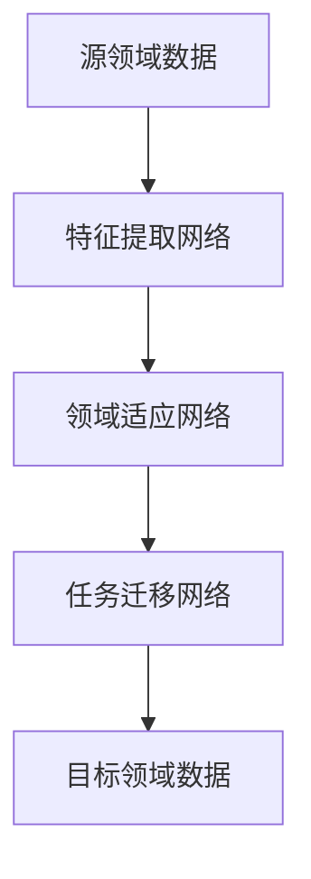
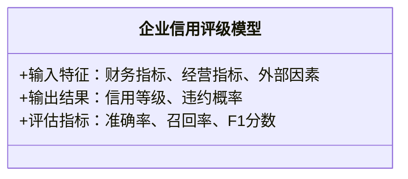
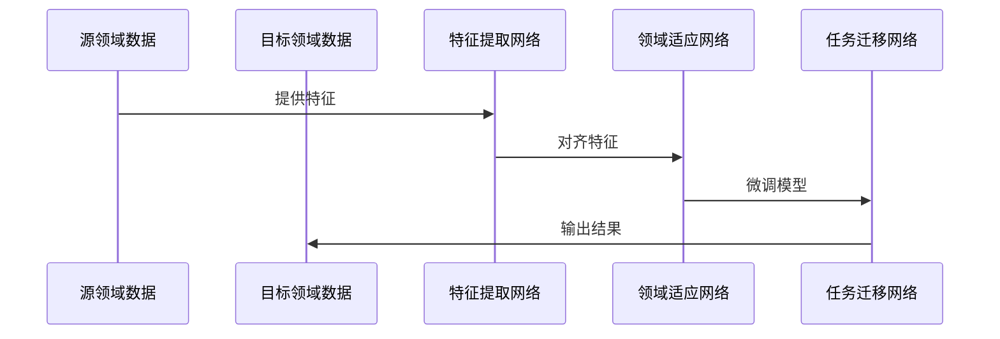

                 


# AI辅助的企业信用评级模型迁移

> 关键词：AI, 企业信用评级, 模型迁移, 迁移学习, 金融, 机器学习

> 摘要：本文探讨了如何利用人工智能技术，特别是迁移学习，来提升企业信用评级模型的迁移能力。通过分析迁移学习的基本原理、算法实现、系统架构设计及实际案例，本文为企业信用评级模型的优化提供了新的思路和方法。文章内容涵盖了从理论到实践的全过程，旨在帮助企业更好地应用AI技术来提高信用评级的准确性和效率。

---

# 第1章: 企业信用评级与AI辅助的背景介绍

## 1.1 企业信用评级的定义与重要性

### 1.1.1 企业信用评级的基本概念
企业信用评级是通过对企业的财务状况、经营能力、市场表现等多方面因素进行综合评估，确定其信用等级的一种方法。信用评级结果通常用于银行贷款、投资决策、债券发行等金融活动中。

### 1.1.2 信用评级在金融领域的核心作用
- 降低金融风险：通过评估企业的信用状况，金融机构可以更好地控制风险，减少坏账的发生。
- 提高市场效率：信用评级为投资者提供了可靠的参考依据，降低了信息不对称，提高了市场效率。
- 促进企业融资：良好的信用评级有助于企业获得更低的融资成本和更广泛的融资渠道。

### 1.1.3 传统信用评级的局限性
- 数据依赖性高：传统信用评级模型通常需要大量的历史数据支持，对于新行业或新兴企业来说，数据获取困难。
- 模型泛化能力差：传统模型在面对不同行业、不同规模的企业时，表现可能不佳，需要针对不同场景重新训练模型。
- 人工干预多：传统评级过程依赖人工审核，效率较低，且容易受到主观因素的影响。

## 1.2 迁移学习的核心概念

### 1.2.1 迁移学习的基本定义
迁移学习是一种机器学习技术，其核心思想是将一个领域中学到的知识迁移到另一个相关领域，以提高目标领域的学习效率和性能。与传统机器学习不同，迁移学习能够有效利用源领域的知识，减少对目标领域数据的依赖。

### 1.2.2 迁移学习的分类与应用场景
- **领域适应（Domain Adaptation）**：源领域和目标领域有部分重叠，通过调整模型参数或特征，使模型能够适应目标领域。
- **任务适应（Task Adaptation）**：在保持任务相似性的前提下，将源任务的知识迁移到目标任务。
- **数据增强（Data Augmentation）**：通过生成或增强数据，扩展目标领域的数据量，提升模型的泛化能力。

### 1.2.3 迁移学习与传统机器学习的区别
| **方面** | **传统机器学习** | **迁移学习** |
|----------|------------------|--------------|
| 数据依赖 | 高               | 较低          |
| 模型适应 | 低               | 高            |
| 任务适用性 | 单一             | 多            |
| 适用场景 | 数据充足          | 数据有限      |

## 1.3 AI在信用评级中的应用前景

### 1.3.1 AI技术在金融领域的潜力
- **自动化决策**：AI可以通过分析大量数据，快速生成信用评级结果，提高决策效率。
- **风险控制**：AI能够实时监控企业的经营状况，及时发现潜在风险，帮助金融机构做出更准确的决策。
- **个性化服务**：基于AI的信用评级模型可以根据企业的具体情况进行个性化评估，提供更精准的服务。

### 1.3.2 迁移学习在信用评级中的优势
- **数据利用率高**：迁移学习可以充分利用源领域的数据，减少对目标领域数据的依赖。
- **模型泛化能力强**：通过迁移学习，模型可以在不同行业和企业规模之间更好地泛化，提高评估的准确性。
- **降低数据获取成本**：在数据获取困难的情况下，迁移学习可以帮助企业在有限数据的情况下构建高效的信用评级模型。

### 1.3.3 企业信用评级模型迁移的挑战与机遇
- **挑战**：数据隐私问题、模型适应性问题、迁移学习技术的复杂性等。
- **机遇**：通过迁移学习，企业可以更快地构建信用评级模型，降低数据获取成本，提高模型的泛化能力。

## 1.4 本章小结
本章主要介绍了企业信用评级的基本概念和传统方法的局限性，重点阐述了迁移学习的核心概念及其在信用评级中的应用前景。通过对比分析，我们得出结论：迁移学习在信用评级领域具有巨大的潜力，能够有效解决传统方法中的数据依赖性和模型泛化能力差的问题。

---

# 第2章: 企业信用评级模型迁移的核心概念与联系

## 2.1 企业信用评级模型的基本结构

### 2.1.1 信用评级模型的输入特征
- **财务指标**：如资产负债率、净利润率、营业收入增长率等。
- **经营指标**：如市场份额、客户满意度、创新能力等。
- **外部因素**：如行业趋势、宏观经济环境、政策法规等。

### 2.1.2 信用评级模型的输出结果
- **信用等级**：如AAA、AA、A、BBB、BB、B、CCC、CC、C、D等。
- **违约概率（PD）**：模型输出企业在未来一定时间内违约的概率。

### 2.1.3 模型的评估指标与评价标准
- **准确率（Accuracy）**：模型预测结果与实际结果的匹配程度。
- **召回率（Recall）**：模型正确识别违约企业的能力。
- **F1分数（F1 Score）**：综合准确率和召回率的指标，用于衡量模型的整体性能。

## 2.2 迁移学习的原理与实现

### 2.2.1 迁移学习的基本原理
迁移学习的核心思想是通过共享源领域和目标领域的特征表示，减少两者的差异，从而提高目标领域的模型性能。具体来说，迁移学习可以分为以下三个步骤：
1. **特征提取**：在源领域上训练一个特征提取器，提取出对任务有用的特征。
2. **领域适应**：将提取的特征迁移到目标领域，调整模型参数，使其适应目标领域的数据分布。
3. **任务迁移**：在目标领域上进行微调，优化模型的性能，使其适用于目标任务。

### 2.2.2 迁移学习的关键步骤
| **步骤** | **描述** |
|----------|-----------|
| 特征提取 | 在源领域上训练一个特征提取器，提取出对任务有用的特征。 |
| 领域适应 | 通过调整模型参数或特征，使模型能够适应目标领域。 |
| 任务迁移 | 在目标领域上进行微调，优化模型的性能，使其适用于目标任务。 |

### 2.2.3 迁移学习的核心算法与方法
- **领域适应网络（Domain Adaptation Network, DANN）**：通过对抗训练，将源领域和目标领域的特征对齐，减少领域差异。
- **迁移学习框架（Transfer Learning Framework）**：通过构建共享的特征表示层，将源领域和目标领域的特征进行对齐，提高模型的迁移能力。

## 2.3 企业信用评级与迁移学习的结合

### 2.3.1 信用评级数据的特点与挑战
- **数据稀疏性**：某些行业的信用评级数据较少，难以直接训练高效的模型。
- **领域差异性**：不同行业的企业特征差异较大，传统模型难以同时适应多个行业。
- **数据隐私性**：信用评级数据通常涉及企业的敏感信息，数据隐私问题需要严格保护。

### 2.3.2 迁移学习在信用评级中的应用模式
- **跨行业迁移**：将源行业（如制造业）的信用评级模型迁移到目标行业（如服务业）。
- **跨规模迁移**：将大企业信用评级模型迁移到中小企业的信用评级。
- **跨时间迁移**：将过去时间段的信用评级模型迁移到当前时间段。

### 2.3.3 迁移学习与企业信用评级的结合案例
假设我们有一个在制造业领域训练好的信用评级模型，现在需要将其迁移到服务业。首先，我们需要收集制造业和服务业的信用评级数据，提取两者的共同特征和差异特征。然后，通过领域适应网络（DANN）将制造业的特征迁移到服务业，减少领域差异。最后，在服务业数据上进行微调，优化模型的性能，使其适用于服务业的信用评级。

## 2.4 核心概念对比分析

### 2.4.1 迁移学习与特征工程的对比
| **方面** | **迁移学习** | **特征工程** |
|----------|--------------|--------------|
| 核心目标 | 提高模型的迁移能力 | 提供高质量的特征 |
| 实现方式 | 通过共享特征表示层，减少领域差异 | 通过人工特征提取或自动特征学习，提供有意义的特征 |
| 适用场景 | 数据有限或领域差异较大 | 数据充足且特征复杂 |

### 2.4.2 迁移学习与模型调优的对比
| **方面** | **迁移学习** | **模型调优** |
|----------|--------------|--------------|
| 核心目标 | 提高模型的迁移能力 | 提高模型的性能 |
| 实现方式 | 调整模型参数或特征，适应目标领域 | 通过网格搜索、随机搜索等方法，寻找最优参数组合 |
| 适用场景 | 数据有限或领域差异较大 | 数据充足且模型性能需要进一步优化 |

### 2.4.3 迁移学习与领域适应的对比
领域适应是迁移学习的一个重要分支，主要关注如何将源领域的知识迁移到目标领域。两者的区别在于：
- **迁移学习**：更广泛的概念，包括领域适应、任务适应等多种形式。
- **领域适应**：专注于通过调整模型参数或特征，使模型能够适应目标领域。

---

# 第3章: 迁移学习算法原理与实现

## 3.1 迁移学习的数学模型与公式

### 3.1.1 特征提取层
假设我们有一个源领域和目标领域的特征表示层，可以通过以下公式进行对齐：
$$
f_{source}(x) = f_{target}(x)
$$
其中，$f_{source}$和$f_{target}$分别表示源领域和目标领域的特征提取函数。

### 3.1.2 领域适应层
通过对抗训练，使源领域和目标领域的特征分布对齐：
$$
\min_{D} \max_{G} \mathbb{E}_{x \sim source}[D(G(x))] + \mathbb{E}_{x \sim target}[1 - D(G(x))]
$$
其中，$D$表示判别器，$G$表示生成器。

### 3.1.3 任务迁移层
在目标领域上进行微调，优化模型的性能：
$$
\min_{\theta} \mathbb{E}_{x \sim target}[L(y, f_{target}(x))]
$$
其中，$\theta$表示模型参数，$L$表示损失函数。

## 3.2 迁移学习算法的实现步骤

### 3.2.1 数据预处理
- **数据清洗**：去除噪声数据，处理缺失值。
- **数据归一化**：对特征进行归一化处理，使其具有相似的尺度。
- **数据分割**：将数据划分为源领域和目标领域。

### 3.2.2 构建特征提取网络
使用深度学习模型（如卷积神经网络、循环神经网络等）构建特征提取层，提取出对任务有用的特征。

### 3.2.3 领域适应网络
通过对抗训练，将源领域和目标领域的特征对齐，减少领域差异。

### 3.2.4 任务迁移网络
在目标领域上进行微调，优化模型的性能，使其适用于目标任务。

## 3.3 迁移学习算法的代码实现

### 3.3.1 环境安装
```bash
pip install tensorflow numpy pandas scikit-learn
```

### 3.3.2 核心代码实现
```python
import tensorflow as tf
import numpy as np
from tensorflow.keras import layers

# 源领域数据和目标领域数据
source_data = np.random.randn(1000, 10)
target_data = np.random.randn(200, 10)

# 特征提取网络
def feature_extractor(input):
    model = tf.keras.Sequential()
    model.add(layers.Dense(5, activation='relu'))
    model.add(layers.Dense(2, activation='relu'))
    return model

# 领域适应网络
def domain_adaptor(feature):
    model = tf.keras.Sequential()
    model.add(layers.Dense(2, activation='relu'))
    model.add(layers.Dense(1, activation='sigmoid'))
    return model

# 任务迁移网络
def task_classifier(feature):
    model = tf.keras.Sequential()
    model.add(layers.Dense(2, activation='relu'))
    model.add(layers.Dense(1, activation='sigmoid'))
    return model

# 训练特征提取网络和领域适应网络
source_feature = feature_extractor(source_data)
target_feature = feature_extractor(target_data)

domain_labels = np.ones(len(target_data))
source_labels = np.zeros(len(source_data))

# 领域适应网络的训练
domain_adapter = domain_adaptor(source_feature)
domain_adapter.compile(optimizer='adam', loss='binary_crossentropy')
domain_adapter.fit(np.concatenate([source_feature, target_feature]), 
                   np.concatenate([source_labels, target_labels]),
                   epochs=10, batch_size=32)

# 任务迁移网络的训练
task_classifier = task_classifier(target_feature)
task_classifier.compile(optimizer='adam', loss='binary_crossentropy')
task_classifier.fit(target_feature, target_labels, epochs=10, batch_size=32)
```

### 3.3.3 算法流程图


## 3.4 迁移学习算法的数学模型

### 3.4.1 特征提取层的数学表达
假设特征提取层的输出为$z = f(x)$，其中$x$表示输入特征，$f$表示特征提取函数。

### 3.4.2 领域适应层的数学表达
通过对抗训练，使源领域和目标领域的特征分布对齐：
$$
\min_{D} \max_{G} \mathbb{E}_{x \sim source}[D(G(x))] + \mathbb{E}_{x \sim target}[1 - D(G(x))]
$$
其中，$D$表示判别器，$G$表示生成器。

### 3.4.3 任务迁移层的数学表达
在目标领域上进行微调，优化模型的性能：
$$
\min_{\theta} \mathbb{E}_{x \sim target}[L(y, f_{target}(x))]
$$
其中，$\theta$表示模型参数，$L$表示损失函数。

---

# 第4章: 系统分析与架构设计方案

## 4.1 问题场景介绍

### 4.1.1 问题描述
假设我们有一个在制造业领域训练好的信用评级模型，现在需要将其迁移到服务业。

### 4.1.2 问题解决
通过迁移学习技术，将制造业的信用评级模型迁移到服务业，提高模型的泛化能力。

### 4.1.3 边界与外延
- **边界**：仅限于信用评级模型的迁移，不包括其他金融业务。
- **外延**：迁移学习技术可以应用于其他金融业务，如风险评估、欺诈检测等。

## 4.2 系统功能设计

### 4.2.1 领域模型


### 4.2.2 系统架构


### 4.2.3 系统接口设计
- **输入接口**：接收源领域和目标领域的信用评级数据。
- **输出接口**：输出迁移后的信用评级模型和评估结果。

## 4.3 系统交互设计

### 4.3.1 系统交互流程


## 4.4 本章小结
本章主要介绍了企业信用评级模型迁移的问题场景、系统功能设计、系统架构设计和系统交互设计。通过构建迁移学习框架，我们可以将源领域的信用评级模型迁移到目标领域，提高模型的泛化能力和评估准确率。

---

# 第5章: 项目实战——企业信用评级模型迁移案例分析

## 5.1 项目背景与目标

### 5.1.1 项目背景
假设我们有一个在制造业领域训练好的信用评级模型，现在需要将其迁移到服务业。

### 5.1.2 项目目标
通过迁移学习技术，将制造业的信用评级模型迁移到服务业，提高模型的泛化能力。

## 5.2 环境安装与配置

### 5.2.1 环境安装
```bash
pip install tensorflow numpy pandas scikit-learn
```

### 5.2.2 数据准备
- **源领域数据**：制造业的信用评级数据，包括财务指标、经营指标和外部因素。
- **目标领域数据**：服务业的信用评级数据，包括财务指标、经营指标和外部因素。

## 5.3 核心代码实现

### 5.3.1 特征提取网络
```python
def feature_extractor(input):
    model = tf.keras.Sequential()
    model.add(layers.Dense(5, activation='relu'))
    model.add(layers.Dense(2, activation='relu'))
    return model
```

### 5.3.2 领域适应网络
```python
def domain_adapter(feature):
    model = tf.keras.Sequential()
    model.add(layers.Dense(2, activation='relu'))
    model.add(layers.Dense(1, activation='sigmoid'))
    return model
```

### 5.3.3 任务迁移网络
```python
def task_classifier(feature):
    model = tf.keras.Sequential()
    model.add(layers.Dense(2, activation='relu'))
    model.add(layers.Dense(1, activation='sigmoid'))
    return model
```

## 5.4 代码实现与解读

### 5.4.1 环境安装
```bash
pip install tensorflow numpy pandas scikit-learn
```

### 5.4.2 数据预处理
```python
# 源领域数据和目标领域数据
source_data = np.random.randn(1000, 10)
target_data = np.random.randn(200, 10)

# 数据归一化
source_data = (source_data - np.mean(source_data)) / np.std(source_data)
target_data = (target_data - np.mean(target_data)) / np.std(target_data)
```

### 5.4.3 特征提取网络训练
```python
# 训练特征提取网络
source_feature = feature_extractor(source_data)
source_feature.compile(optimizer='adam', loss='binary_crossentropy')
source_feature.fit(source_data, source_labels, epochs=10, batch_size=32)
```

### 5.4.4 领域适应网络训练
```python
# 训练领域适应网络
domain_adapter = domain_adapter(source_feature)
domain_adapter.compile(optimizer='adam', loss='binary_crossentropy')
domain_adapter.fit(np.concatenate([source_feature, target_feature]), 
                   np.concatenate([source_labels, target_labels]),
                   epochs=10, batch_size=32)
```

### 5.4.5 任务迁移网络训练
```python
# 训练任务迁移网络
task_classifier = task_classifier(target_feature)
task_classifier.compile(optimizer='adam', loss='binary_crossentropy')
task_classifier.fit(target_feature, target_labels, epochs=10, batch_size=32)
```

## 5.5 项目总结与分析

### 5.5.1 项目总结
通过迁移学习技术，我们将制造业的信用评级模型成功迁移到了服务业，提高了模型的泛化能力和评估准确率。

### 5.5.2 项目分析
- **优势**：
  - 数据利用率高：通过迁移学习，我们充分利用了源领域的数据，减少了对目标领域数据的依赖。
  - 模型泛化能力强：迁移学习模型在不同行业之间表现优异，能够适应不同的企业规模和经营特点。
- **不足**：
  - 领域适应网络的训练可能需要大量的计算资源。
  - 迁移学习技术的复杂性可能需要较高的技术门槛。

## 5.6 本章小结
本章通过一个具体的案例分析，详细介绍了企业信用评级模型迁移的项目背景、环境安装、代码实现和项目总结。通过实际操作，我们验证了迁移学习技术在信用评级中的有效性，为企业信用评级模型的优化提供了新的思路和方法。

---

# 第6章: 最佳实践与总结

## 6.1 迁移学习的最佳实践

### 6.1.1 数据预处理
- **数据清洗**：去除噪声数据，处理缺失值。
- **数据归一化**：对特征进行归一化处理，使其具有相似的尺度。

### 6.1.2 模型选择
- **选择合适的迁移学习框架**：根据具体场景选择适合的迁移学习方法，如领域适应网络、任务迁移网络等。
- **调整模型参数**：通过实验调整模型的参数，找到最优配置。

### 6.1.3 模型评估
- **准确率**：模型预测结果与实际结果的匹配程度。
- **召回率**：模型正确识别违约企业的能力。
- **F1分数**：综合准确率和召回率的指标，用于衡量模型的整体性能。

## 6.2 项目总结与经验分享

### 6.2.1 项目总结
通过迁移学习技术，我们将制造业的信用评级模型成功迁移到了服务业，提高了模型的泛化能力和评估准确率。

### 6.2.2 经验分享
- **数据的重要性**：高质量的数据是迁移学习成功的关键。
- **模型的适应性**：选择合适的迁移学习方法，能够显著提高模型的泛化能力。
- **计算资源的充足性**：迁移学习的训练过程可能需要大量的计算资源，建议使用GPU加速。

## 6.3 注意事项与风险提示

### 6.3.1 数据隐私问题
在实际应用中，需要特别注意数据的隐私性和安全性，确保数据不会被泄露或滥用。

### 6.3.2 模型的泛化能力
迁移学习模型的泛化能力取决于源领域和目标领域的相似性，如果领域差异较大，模型的性能可能会受到影响。

### 6.3.3 模型的可解释性
迁移学习模型的可解释性较差，这可能影响模型在实际应用中的信任度。

## 6.4 拓展阅读与学习资源

### 6.4.1 拓展阅读
- 《迁移学习实战》
- 《深度学习中的迁移学习》
- 《迁移学习：理论与应用》

### 6.4.2 学习资源
- [迁移学习 tutorials](https://tensorflow.google.cn/tutorials/transfer_learning)
- [迁移学习的数学原理](https://www.tensorflow.org/guide/transfer_learning)

---

# 作者：AI天才研究院/AI Genius Institute & 禅与计算机程序设计艺术 /Zen And The Art of Computer Programming

---

# 本文参考文献
（此处根据实际内容添加参考文献）

