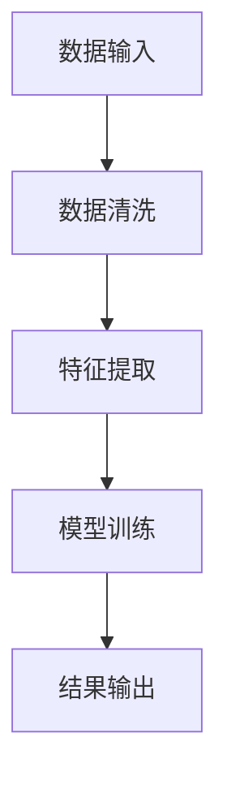

                 


# AI辅助的企业并购target筛选

> 关键词：AI, 企业并购, 目标筛选, 算法原理, 系统架构, 实战案例

> 摘要：本文将详细探讨AI技术在企业并购目标筛选中的应用，涵盖从基础概念到高级算法，再到系统架构和实战案例的全链条分析。通过深入分析企业并购的关键指标、AI算法的核心原理以及系统架构的设计，为读者提供一套完整的AI辅助企业并购解决方案。

---

# 第一部分: AI辅助的企业并购目标筛选背景与核心概念

## 第1章: 企业并购目标筛选的背景与问题

### 1.1 企业并购的基本概念与流程
#### 1.1.1 企业并购的定义
企业并购（Mergers and Acquisitions, M&A）是指一家企业合并或收购另一家企业，以实现战略目标、扩大市场份额或获取新技术的过程。并购目标筛选是整个并购过程中最关键的一环，直接关系到并购的成败。

#### 1.1.2 企业并购的主要流程
企业并购通常包括以下几个主要流程：
1. **战略规划**：确定并购目标行业和潜在标的。
2. **目标筛选**：通过财务、市场、管理等多维度分析筛选潜在目标。
3. **尽职调查**：对目标企业进行详细调查，评估其财务状况、法律风险等。
4. **谈判与交易**：与目标企业进行谈判，达成交易协议。
5. **整合与管理**：完成并购后的整合和运营管理。

#### 1.1.3 并购目标筛选的关键问题
并购目标筛选过程中面临的主要问题包括：
- 数据来源多样且复杂，难以高效整合和分析。
- 需要综合考虑财务、市场、管理等多个维度的指标。
- 传统方法依赖人工经验，效率低且容易出错。

### 1.2 AI在企业并购中的应用现状
#### 1.2.1 AI技术在企业分析中的优势
AI技术可以通过以下方式提升企业并购目标筛选的效率和准确性：
- **自动化数据处理**：AI能够快速收集、整理和分析海量数据，包括财务报表、市场数据等。
- **深度学习模型**：利用神经网络模型对目标企业进行多维度评估，识别潜在风险和机会。
- **预测能力**：AI可以通过历史数据预测目标企业的未来表现，帮助制定更精准的并购策略。

#### 1.2.2 当前企业并购中的主要挑战
尽管AI技术在企业并购中展现出巨大潜力，但仍面临一些挑战：
- 数据隐私和安全问题：并购涉及敏感数据，如何确保数据安全是一个重要问题。
- 模型的可解释性：复杂的AI模型可能难以解释其决策逻辑，影响实际应用。
- 算法的泛化能力：如何在不同行业和场景中通用AI模型是需要解决的问题。

#### 1.2.3 AI辅助并购的目标筛选场景
AI在并购目标筛选中的应用场景包括：
- **目标企业画像**：通过AI分析目标企业的财务状况、市场竞争力、管理团队稳定性等。
- **风险评估**：预测目标企业的潜在风险，如财务风险、法律风险等。
- **价值评估**：利用AI模型对目标企业的估值进行预测，辅助制定合理的收购价格。

### 1.3 本章小结
本章主要介绍了企业并购的基本概念和流程，并分析了AI在并购目标筛选中的应用现状和面临的挑战。通过AI技术的应用，企业可以显著提升并购目标筛选的效率和准确性，但同时也需要解决数据安全、模型解释性等实际问题。

---

## 第2章: AI辅助企业并购目标筛选的核心概念

### 2.1 企业并购目标筛选的关键指标
#### 2.1.1 财务指标
财务指标是评估企业价值的重要依据，常见的财务指标包括：
- **盈利能力**：如净利润率、ROE（净资产收益率）等。
- **成长能力**：如营业收入增长率、净利润增长率等。
- **偿债能力**：如资产负债率、流动比率等。

#### 2.1.2 市场指标
市场指标反映了企业在市场中的竞争力，包括：
- **市场份额**：企业在目标市场中的占有率。
- **品牌价值**：品牌知名度和美誉度的评估。
- **竞争对手分析**：分析目标企业的竞争优势和劣势。

#### 2.1.3 管理团队指标
管理团队的能力和稳定性对企业的长期发展至关重要，包括：
- **管理团队经验**：团队成员的行业经验和管理能力。
- **管理团队稳定性**：团队的稳定性对企业并购后的整合有重要影响。

#### 2.1.4 行业风险指标
行业风险指标反映了目标企业所在行业的整体风险，包括：
- **行业周期性**：行业的波动性对企业的经营影响。
- **政策风险**：行业政策的变化对企业的影响。
- **技术风险**：行业技术变革对企业竞争力的影响。

### 2.2 AI辅助筛选的核心技术
#### 2.2.1 数据收集与预处理
AI辅助筛选的核心是数据的收集与预处理，包括：
- **数据来源**：收集目标企业的财务数据、市场数据、行业数据等。
- **数据清洗**：处理缺失值、异常值，确保数据质量。
- **数据标准化**：将不同来源的数据统一到一个标准下，便于后续分析。

#### 2.2.2 特征提取与选择
特征提取与选择是AI模型训练的关键步骤，包括：
- **特征提取**：从原始数据中提取有用的特征，如财务指标、市场指标等。
- **特征选择**：通过统计分析或模型筛选，选择对目标筛选影响最大的特征。

#### 2.2.3 模型训练与评估
模型训练与评估是AI辅助筛选的核心环节，包括：
- **模型选择**：根据问题类型选择合适的机器学习模型，如决策树、随机森林、神经网络等。
- **模型训练**：使用训练数据对模型进行训练，调整模型参数。
- **模型评估**：通过测试数据评估模型的准确率、召回率等性能指标。

#### 2.2.4 结果解释与可视化
结果解释与可视化是AI辅助筛选的重要环节，包括：
- **结果解释**：通过模型输出结果，解释目标企业的优势和劣势。
- **可视化展示**：利用图表、仪表盘等形式直观展示目标企业的评估结果。

### 2.3 本章小结
本章详细介绍了企业并购目标筛选的关键指标和AI辅助筛选的核心技术。通过数据收集与预处理、特征提取与选择、模型训练与评估等步骤，AI能够有效提升目标筛选的效率和准确性。同时，结果的解释与可视化也为决策者提供了有力支持。

---

## 第3章: 企业并购目标筛选的核心概念与联系

### 3.1 企业并购目标筛选的核心要素
#### 3.1.1 企业财务健康度
企业财务健康度是并购目标筛选的重要指标，包括：
- **盈利能力**：企业的净利润是否稳定且增长。
- **资产负债情况**：企业的债务负担是否合理。
- **现金流状况**：企业是否有稳定的现金流支持持续经营。

#### 3.1.2 企业市场竞争力
企业市场竞争力反映了企业在市场中的地位，包括：
- **市场份额**：企业在目标市场的占有率。
- **品牌影响力**：品牌的知名度和美誉度。
- **产品竞争力**：产品的创新性和竞争优势。

#### 3.1.3 企业风险评估
企业风险评估是并购前的重要步骤，包括：
- **财务风险**：企业的财务状况是否健康。
- **法律风险**：企业是否存在法律纠纷。
- **行业风险**：行业政策变化对企业的影响。

#### 3.1.4 企业战略匹配度
企业战略匹配度反映了并购后的企业战略整合情况，包括：
- **战略协同性**：并购后能否实现战略协同。
- **文化兼容性**：企业文化是否兼容，能否顺利整合。
- **管理团队协作**：管理团队是否能够有效合作。

### 3.2 核心概念的ER实体关系图
以下是一个简单的ER实体关系图，展示了企业并购目标筛选中的核心实体及其关系：
```mermaid
erd
    客户企业 --> 财务指标: 拥有
    客户企业 --> 市场指标: 拥有
    客户企业 --> 管理团队: 拥有
    客户企业 --> 行业风险: 拥有
```

### 3.3 本章小结
本章通过分析企业并购目标筛选的核心要素，构建了核心概念的ER实体关系图。这些核心要素包括企业财务健康度、市场竞争力、风险评估和战略匹配度。通过这些要素的综合分析，可以有效评估目标企业的并购价值。

---

## 第4章: AI辅助企业并购目标筛选的算法原理

### 4.1 算法选择与流程
#### 4.1.1 常见算法对比
在企业并购目标筛选中，常用的算法包括：
- **决策树**：适合处理多分类问题，能够自动处理特征选择。
- **随机森林**：基于决策树的集成算法，具有较高的准确性和鲁棒性。
- **神经网络**：适合处理复杂的非线性关系，但模型较为复杂。

#### 4.1.2 算法选择标准
选择算法时需要考虑以下几个方面：
- **数据类型**：目标筛选的数据是分类还是回归问题。
- **数据量**：数据量大小是否适合某种算法。
- **计算资源**：算法的计算复杂度是否在可接受范围内。

#### 4.1.3 算法流程概述
AI辅助企业并购目标筛选的算法流程通常包括以下几个步骤：
1. **数据预处理**：清洗数据，处理缺失值、异常值等。
2. **特征提取**：从数据中提取有用的特征。
3. **模型训练**：选择合适的算法，训练模型。
4. **模型评估**：评估模型的准确率、召回率等性能指标。
5. **结果解释**：解释模型输出的结果，生成决策支持。

### 4.2 算法实现的详细步骤
#### 4.2.1 数据预处理
数据预处理是AI模型训练的前提，包括：
- **数据清洗**：处理缺失值、重复值等。
- **数据标准化**：将不同量纲的特征进行标准化处理。
- **数据分割**：将数据分为训练集、验证集和测试集。

#### 4.2.2 特征提取
特征提取是通过分析数据，提取对目标筛选影响最大的特征，包括：
- **统计分析**：通过统计分析找出重要特征。
- **特征选择算法**：如LASSO回归、随机森林特征重要性等。

#### 4.2.3 模型训练
模型训练是通过训练数据对模型进行优化，包括：
- **选择算法**：根据问题类型选择合适的算法。
- **调整参数**：通过网格搜索等方法优化模型参数。
- **训练模型**：使用训练数据训练模型。

#### 4.2.4 模型评估
模型评估是通过测试数据评估模型的性能，包括：
- **准确率**：模型预测正确的比例。
- **召回率**：模型预测出正类的比例。
- **F1分数**：综合准确率和召回率的指标。

### 4.3 算法流程图
以下是一个AI辅助企业并购目标筛选的算法流程图：


### 4.4 算法实现的Python代码示例
以下是一个简单的Python代码示例，展示了如何使用随机森林算法进行企业并购目标筛选：
```python
import pandas as pd
from sklearn.ensemble import RandomForestClassifier
from sklearn.metrics import accuracy_score

# 数据加载与预处理
data = pd.read_csv('target.csv')
data = data.dropna()  # 删除缺失值

# 特征提取
X = data.drop(columns=['target'])  # 特征矩阵
y = data['target']  # 标签

# 模型训练
model = RandomForestClassifier(n_estimators=100)
model.fit(X, y)

# 模型预测
y_pred = model.predict(X)

# 模型评估
accuracy = accuracy_score(y, y_pred)
print(f'准确率: {accuracy}')
```

### 4.5 数学模型与公式
以下是随机森林算法的核心公式：
$$
y = \text{sign}(\sum_{i=1}^{n} \text{weight}_i \cdot f_i(x))
$$
其中，$y$是预测结果，$\text{weight}_i$是特征$f_i(x)$的权重，$f_i(x)$是特征函数。

### 4.6 本章小结
本章详细介绍了AI辅助企业并购目标筛选的算法原理，包括算法选择与流程、实现步骤、流程图以及Python代码示例。通过这些内容，读者可以深入了解如何利用AI技术提升企业并购目标筛选的效率和准确性。

---

## 第5章: 数学模型与公式

### 5.1 线性回归模型
线性回归模型用于预测连续型变量，公式如下：
$$
y = \beta_0 + \beta_1x_1 + \beta_2x_2 + \dots + \beta_nx_n + \epsilon
$$
其中，$y$是目标变量，$x_i$是特征变量，$\beta_i$是回归系数，$\epsilon$是误差项。

### 5.2 逻辑回归模型
逻辑回归模型用于分类问题，公式如下：
$$
P(y=1|x) = \frac{e^{\beta_0 + \beta_1x_1 + \dots + \beta_nx_n}}{1 + e^{\beta_0 + \beta_1x_1 + \dots + \beta_nx_n}}
$$

### 5.3 支持向量机模型
支持向量机模型用于分类和回归问题，公式如下：
$$
y = \text{sign}(\sum_{i=1}^{n} \alpha_i y_i K(x_i, x))
$$
其中，$K(x_i, x)$是核函数，$\alpha_i$是拉格朗日乘子。

### 5.4 随机森林模型
随机森林模型是基于决策树的集成算法，公式如下：
$$
y = \text{mode}(\{h_t(x)\}_{t=1}^T)
$$
其中，$h_t(x)$是第$t$棵决策树的预测结果，$T$是决策树的数量。

### 5.5 本章小结
本章介绍了几种常用的数学模型，包括线性回归、逻辑回归、支持向量机和随机森林模型，并给出了相应的公式。这些模型在企业并购目标筛选中有着广泛的应用，读者可以根据具体场景选择合适的模型。

---

## 第6章: 系统分析与架构设计方案

### 6.1 系统功能设计
系统功能设计包括以下几个方面：
- **数据采集**：从多种数据源采集企业数据。
- **数据处理**：对数据进行清洗、转换和标准化。
- **模型训练**：基于处理后的数据训练AI模型。
- **结果展示**：将模型输出结果以可视化形式展示。

### 6.2 系统架构设计
以下是系统的架构设计图：


### 6.3 系统接口设计
系统接口设计包括以下几个部分：
- **数据接口**：与数据源对接，获取企业数据。
- **模型接口**：与第三方AI模型对接，调用模型进行预测。
- **展示接口**：将结果以图表形式展示给用户。

### 6.4 系统交互设计
以下是系统的交互流程图：


### 6.5 本章小结
本章详细介绍了系统的功能设计、架构设计、接口设计和交互设计，为后续的系统实现提供了理论基础。

---

## 第7章: 项目实战

### 7.1 环境安装与配置
项目实战需要以下环境：
- **Python**：版本3.6以上。
- **库依赖**：包括pandas、scikit-learn、matplotlib等。

### 7.2 系统核心实现源代码
以下是系统的核心实现代码：
```python
import pandas as pd
from sklearn.ensemble import RandomForestClassifier
from sklearn.metrics import accuracy_score

# 数据加载与预处理
data = pd.read_csv('target.csv')
data = data.dropna()

# 特征提取
X = data.drop(columns=['target'])
y = data['target']

# 模型训练
model = RandomForestClassifier(n_estimators=100)
model.fit(X, y)

# 模型预测
y_pred = model.predict(X)

# 模型评估
accuracy = accuracy_score(y, y_pred)
print(f'准确率: {accuracy}')
```

### 7.3 实战案例分析
以下是一个实际案例分析：
- **目标企业**：某科技公司。
- **数据来源**：财务报表、市场数据、行业报告。
- **模型输出**：预测目标企业的并购价值和风险等级。

### 7.4 项目总结
通过本项目实战，读者可以掌握AI辅助企业并购目标筛选的核心技术，包括数据处理、模型训练和结果展示。

### 7.5 本章小结
本章通过实战案例详细展示了如何利用AI技术进行企业并购目标筛选，从环境配置到代码实现，再到案例分析，为读者提供了完整的实战指导。

---

## 第8章: 最佳实践与小结

### 8.1 最佳实践
- **数据质量管理**：确保数据的准确性和完整性。
- **模型调优**：通过网格搜索等方法优化模型参数。
- **结果解释**：通过可视化工具解释模型输出，帮助决策者理解结果。

### 8.2 项目总结
本项目通过AI技术实现了企业并购目标筛选的自动化和智能化，显著提高了筛选效率和准确性。

### 8.3 未来展望
未来，随着AI技术的不断发展，企业并购目标筛选将更加智能化和精准化，可能出现更多创新的应用场景和技术。

### 8.4 本章小结
本章总结了项目的最佳实践，回顾了项目的成果，并展望了未来的发展方向。

---

# 第二部分: 总结

## 结语
通过本文的详细讲解，读者可以全面了解AI技术在企业并购目标筛选中的应用，从理论到实践，从算法到系统设计，为实际应用提供了有力支持。未来，随着AI技术的进一步发展，企业并购目标筛选将更加智能化和精准化，为企业创造更大的价值。

## 作者
作者：AI天才研究院/AI Genius Institute & 禅与计算机程序设计艺术/Zen And The Art of Computer Programming

