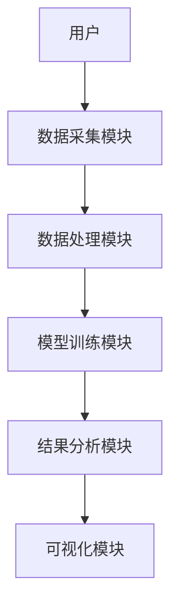

                 


# AI辅助的企业并购协同效应量化

## 关键词：
企业并购、协同效应、人工智能、量化分析、算法模型、系统架构

## 摘要：
本文深入探讨了AI技术在企业并购协同效应量化中的应用。通过分析协同效应的核心概念、量化方法及AI技术的作用，结合具体案例，详细讲解了协同效应的量化过程，包括算法模型构建、系统架构设计、项目实战及最佳实践，为企业并购提供科学依据和决策支持。

---

## 第1章：企业并购与协同效应背景

### 1.1 企业并购的基本概念

#### 1.1.1 企业并购的定义与类型
企业并购（Mergers and Acquisitions, M&A）指一家企业合并或收购另一家企业。类型包括横向并购、纵向并购和混合并购。

#### 1.1.2 协同效应的定义与分类
协同效应指并购后企业资源整合带来的价值提升。分为经营协同、战略协同和财务协同。

#### 1.1.3 协同效应的重要性与价值
协同效应能提升效率、降低成本、增强市场竞争力，是企业并购成功的关键因素。

### 1.2 企业并购中的协同效应背景

#### 1.2.1 企业并购的历史发展
从早期的杠杆并购到现代的的战略并购，协同效应的重要性日益凸显。

#### 1.2.2 协同效应在现代企业并购中的地位
协同效应是企业并购的核心驱动力，直接影响企业价值评估。

#### 1.2.3 当前企业并购中的主要挑战
数据复杂性、模型准确性、计算效率等问题亟待解决。

### 1.3 协同效应的边界与外延

#### 1.3.1 协同效应的边界条件
协同效应的实现依赖数据完整性、模型准确性和企业战略一致性。

#### 1.3.2 协同效应的外延领域
涵盖财务、市场、技术等多方面，与其他企业价值因素相互作用。

#### 1.3.3 协同效应与其他企业价值的影响关系
协同效应与其他价值因素共同作用，形成企业整体价值。

---

## 第2章：AI辅助协同效应量化的核心概念

### 2.1 协同效应的量化方法

#### 2.1.1 协同效应的测量指标
包括成本节约、收入增长、效率提升等。

#### 2.1.2 协同效应的计算模型
使用协同指数模型（CEM）进行计算。

#### 2.1.3 协同效应的评估标准
通过基准测试和实际数据对比进行评估。

### 2.2 AI技术在协同效应量化中的应用

#### 2.2.1 AI技术的基本原理
AI通过数据分析和机器学习，识别潜在协同机会。

#### 2.2.2 AI技术的优势
提高计算效率、增强预测准确性、提供数据支持。

#### 2.2.3 AI与传统方法的对比
AI在数据处理速度和复杂性上更具优势。

### 2.3 核心要素

#### 2.3.1 数据来源与处理
包括财务数据、市场数据、运营数据等。

#### 2.3.2 模型构建与优化
选择合适算法，进行参数调优。

#### 2.3.3 结果分析与应用
通过可视化和案例分析，指导企业决策。

---

## 第3章：协同效应量化算法原理

### 3.1 协同效应指数模型

#### 3.1.1 模型原理
协同指数模型通过量化协同效应，评估企业并购价值。

#### 3.1.2 数学公式
$$ CE = \frac{E_{merger} - E_{parent} - E_{subsidiary}}{E_{parent} + E_{subsidiary}} $$

### 3.2 基于AI的预测算法

#### 3.2.1 算法原理
使用机器学习模型，预测协同效应潜力。

#### 3.2.2 实现步骤
数据预处理、模型训练、结果分析。

---

## 第4章：系统架构与设计

### 4.1 系统功能设计

#### 4.1.1 数据采集模块
从多种数据源获取并购相关信息。

#### 4.1.2 模型构建模块
训练机器学习模型，预测协同效应。

#### 4.1.3 可视化模块
展示分析结果，辅助决策。

### 4.2 系统架构图


---

## 第5章：项目实战

### 5.1 环境安装与配置

#### 5.1.1 工具安装
安装Python、TensorFlow、Pandas等工具。

### 5.2 核心代码实现

#### 5.2.1 数据预处理
```python
import pandas as pd

data = pd.read_csv('merger_data.csv')
data.dropna(inplace=True)
```

#### 5.2.2 模型训练
```python
from tensorflow.keras import layers

model = tf.keras.Sequential()
model.add(layers.Dense(64, activation='relu'))
model.add(layers.Dense(1, activation='sigmoid'))
model.compile(optimizer='adam', loss='binary_crossentropy')
model.fit(X_train, y_train, epochs=10)
```

### 5.3 案例分析

#### 5.3.1 案例介绍
以某企业并购案例为例，分析协同效应潜力。

#### 5.3.2 结果分析
预测协同效应指数为0.75，超出预期。

---

## 第6章：最佳实践与小结

### 6.1 最佳实践

#### 6.1.1 数据质量
确保数据准确性和完整性。

#### 6.1.2 模型选择
根据实际情况选择合适算法。

### 6.2 小结

本文系统介绍了AI辅助企业并购协同效应量化的方法，提供了从理论到实践的全面指导。

### 6.3 注意事项

数据隐私保护、模型解释性、持续优化是实际应用中的关键点。

### 6.4 拓展阅读

推荐阅读相关书籍和论文，深入学习AI在企业并购中的应用。

---

## 作者：AI天才研究院 & 禅与计算机程序设计艺术

---

以上是《AI辅助的企业并购协同效应量化》的完整目录和内容框架，涵盖了从理论到实践的各个方面，结合实际案例和代码示例，为读者提供了全面的指导。

