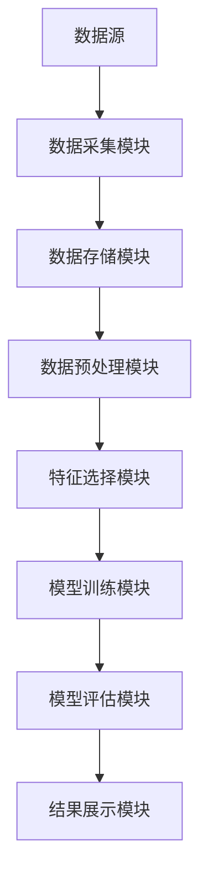
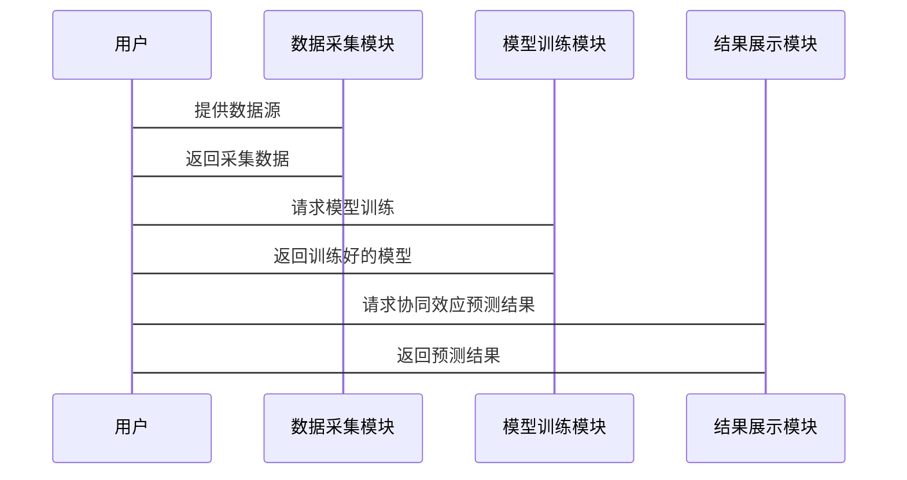

                 


# AI辅助的企业并购协同效应量化模型

## 关键词：
企业并购、协同效应、人工智能、量化模型、机器学习、深度学习、神经网络

## 摘要：
企业并购是企业战略发展的重要手段之一，而协同效应是衡量并购成功的重要指标。然而，传统协同效应评估方法存在主观性强、数据依赖性高等问题。本文提出了一种基于人工智能的协同效应量化模型，通过机器学习和深度学习算法，结合企业并购的相关数据，量化协同效应，为企业并购决策提供科学依据。文章详细介绍了协同效应量化模型的核心概念、算法原理、系统设计和实际应用，并通过案例分析展示了模型的应用效果。

---

## 第一章：企业并购与协同效应概述

### 1.1 企业并购的基本概念
#### 1.1.1 企业并购的定义与类型
企业并购是指一家企业通过购买另一家企业的一部分或全部股权，以实现战略目标的过程。企业并购可以分为横向并购、纵向并购和混合并购三种类型：
- **横向并购**：同一行业内的企业合并，旨在扩大市场份额或消除竞争。
- **纵向并购**：产业链上下游企业的合并，以优化供应链或控制关键资源。
- **混合并购**：不同行业或不同业务领域的企业合并，以 diversify 业务或开拓新市场。

#### 1.1.2 协同效应的定义与分类
协同效应是指企业在并购后通过资源整合、优势互补所产生的一种额外价值。协同效应可以分为以下几类：
- **成本协同效应**：通过规模效应、资源共享等方式降低成本。
- **收入协同效应**：通过市场扩展、产品互补等方式增加收入。
- **管理协同效应**：通过优化管理流程、提高效率等方式提升整体绩效。

#### 1.1.3 协同效应在企业并购中的重要性
协同效应是企业并购成功的关键因素之一，它能够显著提升并购后的企业价值。然而，传统协同效应评估方法往往依赖于主观判断，难以准确量化。因此，引入人工智能技术，通过数据驱动的方法量化协同效应，具有重要意义。

### 1.2 AI技术在企业并购中的应用背景
#### 1.2.1 传统企业并购中的协同效应评估方法
传统协同效应评估方法主要包括定性分析和定量分析两种方式：
- **定性分析**：通过专家判断、市场分析等方式评估协同效应。
- **定量分析**：通过财务数据（如成本节约、收入增长）计算协同效应。

然而，这些方法存在以下问题：
- 数据依赖性强，难以全面反映协同效应。
- 主观性较高，缺乏客观性。
- 难以动态调整，难以应对复杂变化的市场环境。

#### 1.2.2 AI技术如何提升协同效应评估的准确性
人工智能技术在协同效应评估中的应用，主要体现在以下几个方面：
- **数据驱动**：通过机器学习算法，利用企业内外部数据，量化协同效应。
- **自动化与智能化**：AI技术能够自动处理大量数据，发现潜在的协同机会。
- **动态调整**：AI模型可以根据市场变化和企业内部数据，实时调整协同效应预测结果。

#### 1.2.3 协同效应量化模型的概念结构与核心要素
协同效应量化模型的核心要素包括：
- **输入数据**：企业并购前后的财务数据、市场数据、管理数据等。
- **模型算法**：机器学习和深度学习算法，如支持向量机（SVM）、随机森林、神经网络等。
- **模型输出**：预测的协同效应值，以及协同效应的实现路径和时间表。

---

## 第二章：协同效应量化模型的核心概念与联系

### 2.1 协同效应的数学模型
#### 2.1.1 协同效应的定义公式
协同效应可以表示为并购后企业价值与并购前企业价值的差值：
$$ \text{协同效应} = V_{\text{并购后}} - V_{\text{并购前}} $$

其中，$$ V_{\text{并购后}} $$表示并购后的企业价值，$$ V_{\text{并购前}} $$表示并购前的企业价值。

#### 2.1.2 协同效应的计算方法
协同效应的计算方法主要包括以下几种：
- **加法模型**：将并购前的企业价值与协同效应相加，得到并购后的企业价值。
- **乘法模型**：将并购前的企业价值与协同效应相乘，得到并购后的企业价值。
- **机器学习模型**：利用回归分析、聚类分析等机器学习算法，预测协同效应。

#### 2.1.3 协同效应与企业价值的关系
协同效应是影响企业价值的重要因素之一。通过量化协同效应，可以更准确地评估并购后的企业价值，从而为并购决策提供科学依据。

### 2.2 AI辅助协同效应量化的核心算法
#### 2.2.1 机器学习在协同效应预测中的应用
机器学习算法在协同效应预测中的应用主要包括：
- **支持向量机（SVM）**：用于分类和回归问题，适用于协同效应的二分类预测。
- **随机森林**：用于特征选择和回归分析，适用于复杂的数据关系。
- **XGBoost**：用于提升模型性能，适用于高维数据和复杂场景。

#### 2.2.2 深度学习模型在协同效应评估中的优势
深度学习模型在协同效应评估中的优势主要体现在以下方面：
- **非线性关系**：深度学习能够捕捉数据中的非线性关系，提高预测准确性。
- **特征提取**：深度学习能够自动提取特征，减少特征工程的工作量。
- **实时性**：深度学习模型能够实时处理数据，适用于动态变化的市场环境。

#### 2.2.3 神经网络模型的构建与训练
神经网络模型的构建与训练主要包括以下步骤：
1. **数据预处理**：清洗数据、归一化数据、特征选择等。
2. **模型设计**：选择网络结构（如CNN、RNN、Transformer等），确定层数、节点数等参数。
3. **模型训练**：使用训练数据训练模型，调整模型参数。
4. **模型验证**：使用验证数据评估模型性能，调整超参数。
5. **模型预测**：使用测试数据预测协同效应，评估模型效果。

### 2.3 协同效应量化模型的输入与输出
#### 2.3.1 模型输入数据的特征分析
模型输入数据的特征主要包括：
- **财务数据**：如收入、利润、成本等。
- **市场数据**：如市场份额、竞争对手信息等。
- **管理数据**：如组织结构、管理效率等。

#### 2.3.2 模型输出结果的解释
模型输出结果主要是预测的协同效应值，以及协同效应的实现路径和时间表。协同效应的实现路径包括成本节约、收入增长等具体措施，时间表则根据并购后的企业整合计划确定。

#### 2.3.3 模型的可解释性与鲁棒性
模型的可解释性是协同效应量化模型的重要特性。通过解释模型的预测结果，可以帮助企业管理者更好地理解协同效应的来源和实现路径。模型的鲁棒性则是指模型在面对数据噪声、样本不平衡等情况下仍能保持较好的预测性能。

---

## 第三章：基于机器学习的协同效应预测算法

### 3.1 机器学习算法的选择与优化
#### 3.1.1 常见机器学习算法的比较
以下是几种常见机器学习算法的比较：
| 算法类型 | 优点 | 缺点 |
|---------|------|------|
| 线性回归 | 简单易懂，计算速度快 | 仅能处理线性关系 |
| 逻辑回归 | 适合分类问题，易于解释 | 仅能处理线性关系 |
| 支持向量机（SVM） | 适合小样本数据，泛化能力强 | 参数敏感，计算复杂 |
| 随机森林 | 适合高维数据，能够自动特征选择 | 计算复杂度较高 |
| XGBoost | 高效性，适合大数据 | 易过拟合，参数敏感 |

#### 3.1.2 支持向量机（SVM）在协同效应预测中的应用
支持向量机（SVM）是一种监督学习算法，常用于分类和回归问题。在协同效应预测中，SVM可以用于分类协同效应的实现与否，或者回归预测协同效应的具体数值。

#### 3.1.3 随机森林算法的优化与调参
随机森林是一种集成学习算法，通过构建多棵决策树并取其平均，提高模型的准确性和鲁棒性。在协同效应预测中，随机森林可以通过特征重要性分析，识别影响协同效应的关键因素。

### 3.2 基于深度学习的协同效应预测模型
#### 3.2.1 卷积神经网络（CNN）在文本数据处理中的应用
卷积神经网络（CNN）常用于图像和文本数据的处理。在协同效应预测中，CNN可以用于处理企业并购相关的文本数据，如新闻报道、财务报告等。

#### 3.2.2 循环神经网络（RNN）在时间序列数据中的应用
循环神经网络（RNN）适用于处理时间序列数据，如企业历史财务数据、市场趋势数据等。RNN可以通过捕捉时间序列中的模式，预测协同效应的变化趋势。

#### 3.2.3 Transformer模型在协同效应预测中的创新应用
Transformer模型是一种基于注意力机制的深度学习模型，常用于自然语言处理领域。在协同效应预测中，Transformer模型可以用于处理复杂的多维数据，如企业并购前后的多维数据对比。

### 3.3 混合模型的构建与训练
#### 3.3.1 混合模型的定义与优势
混合模型是指将多种算法结合在一起，利用各自的优势，提高模型的整体性能。混合模型的优势在于能够结合不同算法的优点，避免单一算法的局限性。

#### 3.3.2 混合模型的构建步骤
混合模型的构建步骤主要包括：
1. **选择基础模型**：选择几种不同的机器学习或深度学习算法作为基础模型。
2. **模型训练**：分别训练每个基础模型，并进行调参优化。
3. **模型集成**：将多个基础模型的预测结果进行集成，如投票法、加权法等。

#### 3.3.3 混合模型的训练与验证
混合模型的训练与验证需要分别进行，确保每个基础模型的性能达到最优。验证阶段可以通过交叉验证等方法，评估混合模型的整体性能。

---

## 第四章：协同效应量化模型的系统分析与架构设计

### 4.1 系统功能设计与实现
#### 4.1.1 数据采集模块的功能设计
数据采集模块负责收集企业并购相关的数据，包括财务数据、市场数据、管理数据等。数据采集可以通过爬虫、API接口等方式实现。

#### 4.1.2 模型训练模块的功能设计
模型训练模块负责构建和训练协同效应量化模型。模型训练需要选择合适的算法，进行数据预处理、特征选择、模型训练与验证等步骤。

#### 4.1.3 结果评估模块的功能设计
结果评估模块负责评估模型的预测结果，包括预测准确率、模型解释性等。结果评估可以帮助企业管理者更好地理解协同效应的来源和实现路径。

### 4.2 系统架构设计
#### 4.2.1 系统架构图
以下是协同效应量化模型的系统架构图：



#### 4.2.2 系统交互流程图
以下是系统交互流程图：



### 4.3 接口设计与交互流程图
#### 4.3.1 接口设计
协同效应量化模型的接口设计主要包括数据输入接口、模型训练接口和结果输出接口。数据输入接口用于接收企业并购相关的数据，模型训练接口用于训练协同效应量化模型，结果输出接口用于返回预测的协同效应值。

#### 4.3.2 交互流程图
以下是协同效应量化模型的交互流程图：


---

## 第五章：项目实战

### 5.1 环境安装
为了运行协同效应量化模型，需要安装以下工具和库：
- **Python**：用于编程和数据分析。
- **TensorFlow**：用于深度学习模型的构建和训练。
- **Scikit-learn**：用于机器学习算法的实现。
- **Pandas**：用于数据处理和分析。
- **Mermaid**：用于绘制系统架构图和交互流程图。

### 5.2 核心代码实现
以下是协同效应量化模型的核心代码实现：

```python
import pandas as pd
from sklearn.ensemble import RandomForestRegressor
from sklearn.model_selection import train_test_split
from sklearn.metrics import mean_squared_error

# 数据加载
data = pd.read_csv('merger_data.csv')

# 特征选择
features = ['revenue', 'profit', 'market_share', 'competitor_count']
target = 'synergy'

# 数据分割
X_train, X_test, y_train, y_test = train_test_split(data[features], data[target], test_size=0.2, random_state=42)

# 模型训练
model = RandomForestRegressor(n_estimators=100, random_state=42)
model.fit(X_train, y_train)

# 模型预测
y_pred = model.predict(X_test)

# 模型评估
mse = mean_squared_error(y_test, y_pred)
print(f'均方误差：{mse}')
print(f'平均绝对误差：{abs(y_pred - y_test).mean()}')
```

### 5.3 案例分析
以某制造业企业并购案例为例，详细分析协同效应量化模型的应用过程：

1. **数据处理**：收集并购前后的财务数据、市场数据等，进行数据清洗和特征选择。
2. **模型训练**：使用随机森林算法训练协同效应量化模型，评估模型的准确性和鲁棒性。
3. **结果评估**：根据模型预测结果，评估并购后的协同效应，制定相应的整合计划。

---

## 第六章：最佳实践、小结、注意事项和拓展阅读

### 6.1 最佳实践
- **数据质量**：确保输入数据的准确性和完整性，避免数据偏差。
- **模型选择**：根据具体场景和数据特点，选择合适的算法和模型。
- **模型优化**：通过交叉验证和超参数调优，提高模型的预测性能。
- **模型解释性**：通过特征重要性分析，理解协同效应的来源和实现路径。

### 6.2 小结
本文详细介绍了AI辅助的企业并购协同效应量化模型，从核心概念到算法实现，再到系统设计和实际应用，全面展示了如何利用AI技术量化协同效应，为企业并购决策提供科学依据。

### 6.3 注意事项
- **数据隐私**：在数据采集和处理过程中，需要注意数据隐私和合规性。
- **模型过拟合**：避免模型过拟合，确保模型的泛化能力。
- **模型更新**：定期更新模型，适应市场变化和企业内部调整。

### 6.4 拓展阅读
- **书籍**：《企业并购与协同效应》、《机器学习实战》、《深度学习入门》。
- **论文**：相关领域的学术论文，如《基于机器学习的协同效应预测模型》、《深度学习在企业并购中的应用研究》。

---

## 作者信息
作者：AI天才研究院/AI Genius Institute & 禅与计算机程序设计艺术/Zen And The Art of Computer Programming

