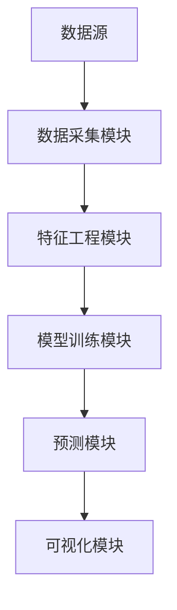
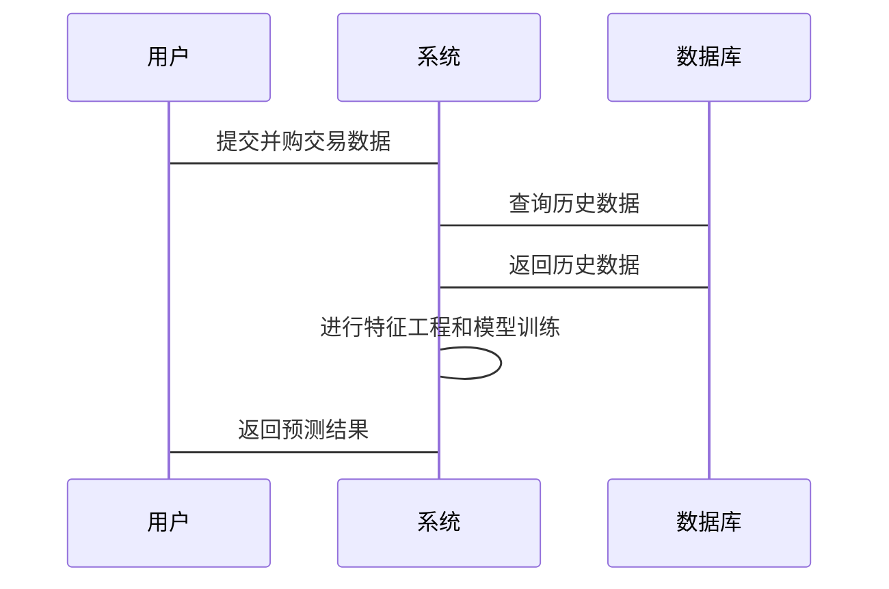

                 


# AI辅助的企业并购协同效应预测

> 关键词：企业并购、协同效应、人工智能、机器学习、预测模型

> 摘要：本文探讨了人工智能在企业并购协同效应预测中的应用，分析了协同效应的类型、AI技术的优势，详细讲解了算法原理、系统架构设计，并通过实战案例展示了AI在预测中的实际应用。

---

# 第1章: 企业并购与协同效应概述

## 1.1 企业并购的基本概念

### 1.1.1 企业并购的定义

企业并购是指一家企业购买另一家企业的一部分或全部股权，以实现战略目标或扩大业务范围。并购可以是敌意的，也可以是善意的，目标企业可能在财务、技术或市场上具有优势。

### 1.1.2 并购的类型

- **横向并购**：同一行业内的企业并购，旨在扩大市场份额或消除竞争。
- **纵向并购**：上下游产业的企业并购，以控制供应链。
- **混合并购**：跨行业并购，通常是为了 diversification。

### 1.1.3 并购的动机与目标

- **市场扩展**：进入新市场或国家。
- **成本节约**：通过规模经济降低生产成本。
- **技术获取**：获取关键技术或专利。
- **战略调整**：调整业务结构，应对竞争。

---

## 1.2 协同效应的定义与重要性

### 1.2.1 协同效应的定义

协同效应是指并购后的企业通过资源整合所产生的额外价值，超过各自独立时的总和。它通常分为财务协同、战略协同和运营协同。

### 1.2.2 协同效应的类型

- **财务协同**：如成本节约、税盾效应。
- **战略协同**：如市场扩展、技术互补。
- **运营协同**：如资源共享、流程优化。

### 1.2.3 协同效应在企业并购中的作用

协同效应是并购成功的关键因素，直接影响并购的财务回报和战略价值。准确预测协同效应可以帮助企业制定合理的并购策略，降低并购风险。

---

# 第2章: 协同效应的类型与评估方法

## 2.1 协同效应的主要类型

### 2.1.1 财务协同效应

- 成本节约：共享资源如生产设施、采购渠道。
- 税盾效应：利用目标企业的税收优惠。

### 2.1.2 战略协同效应

- 市场扩展：进入新市场或细分市场。
- 技术互补：整合技术资源，提升创新能力。

### 2.1.3 运营协同效应

- 供应链优化：整合供应链，提高效率。
- 人力资源共享：共享员工和管理资源。

---

## 2.2 协同效应的评估方法

### 2.2.1 财务指标法

- **协同效应价值**：通过财务模型计算协同效应的现值。
- **净现值法（NPV）**：评估协同效应的财务价值。

### 2.2.2 经济价值法

- **经济利润法**：通过协同效应对企业价值的影响进行评估。
- **市场价值法**：比较并购前后市场价值的变化。

### 2.2.3 专家评估法

- **德尔菲法**：邀请专家对协同效应进行评估。
- **情景分析法**：模拟不同情景下的协同效应。

---

## 2.3 协同效应的边界与外延

### 2.3.1 协同效应的边界

- **时间边界**：协同效应在短期和长期的表现不同。
- **范围边界**：协同效应可能局限于特定业务或部门。

### 2.3.2 协同效应的外延

- **间接影响**：协同效应可能引发其他机会或风险。
- **外部协同**：与供应商、客户或其他利益相关者的协同。

### 2.3.3 协同效应与其他效应的关系

- 协同效应与风险的关系：协同效应越大，潜在风险也越高。
- 协同效应与整合难度的关系：协同效应越复杂，整合难度越大。

---

## 2.4 本章小结

本章详细介绍了协同效应的类型、评估方法及其边界和外延，为后续章节中AI辅助的协同效应预测奠定了基础。

---

# 第3章: AI技术在企业并购中的应用现状

## 3.1 AI技术的基本原理

### 3.1.1 机器学习

- **监督学习**：基于标记数据进行预测。
- **无监督学习**：发现数据中的隐藏模式。
- **深度学习**：通过多层神经网络提取特征。

### 3.1.2 自然语言处理（NLP）

- **文本挖掘**：从新闻、财报中提取信息。
- **情感分析**：分析市场情绪影响并购决策。

### 3.1.3 数据挖掘

- **关联规则挖掘**：发现并购中的关联模式。
- **聚类分析**：将企业分为不同类别，便于目标筛选。

---

## 3.2 AI在企业并购中的应用场景

### 3.2.1 并购目标筛选

- **企业匹配度分析**：利用NLP和机器学习评估潜在目标的协同潜力。
- **财务健康度分析**：预测目标企业的财务风险。

### 3.2.2 并购风险评估

- **整合风险预测**：分析整合过程中的潜在问题。
- **市场风险评估**：预测市场变化对并购的影响。

### 3.2.3 协同效应预测

- **协同效应建模**：基于历史数据预测协同效应的大小和实现时间。

---

## 3.3 AI技术在协同效应预测中的优势

### 3.3.1 数据处理能力

- 处理结构化和非结构化数据，提取有价值的信息。
- 自动化数据清洗和特征工程。

### 3.3.2 模型复杂度

- 能够处理复杂的非线性关系，捕捉潜在的协同效应。
- 多模型融合，提高预测精度。

### 3.3.3 预测精度

- 基于大数据分析，提供更准确的预测结果。
- 实时更新模型，适应市场变化。

---

## 3.4 本章小结

本章探讨了AI技术在企业并购中的应用现状，特别是协同效应预测方面的优势，为后续章节的技术实现提供了理论基础。

---

# 第4章: 协同效应预测的算法原理

## 4.1 算法原理概述

### 4.1.1 机器学习算法

- **线性回归**：预测协同效应的线性关系。
- **随机森林**：通过树模型进行特征重要性分析。
- **支持向量回归（SVR）**：处理非线性关系。

### 4.1.2 深度学习算法

- **神经网络**：多层感知机（MLP）。
- **长短期记忆网络（LSTM）**：处理时间序列数据。
- **卷积神经网络（CNN）**：分析文本或图像数据。

### 4.1.3 时间序列分析

- **ARIMA模型**：预测协同效应的时间依赖性。
- **GARCH模型**：分析协同效应的波动性。

---

## 4.2 算法原理的详细讲解

### 4.2.1 线性回归模型

线性回归用于预测协同效应的线性关系，假设协同效应与若干自变量呈线性关系。

$$ y = \beta_0 + \beta_1x_1 + \beta_2x_2 + \epsilon $$

其中，$y$ 是协同效应，$x_i$ 是自变量，$\beta_i$ 是回归系数，$\epsilon$ 是误差项。

### 4.2.2 长短期记忆网络（LSTM）

LSTM适用于处理时间序列数据，能够捕捉长期依赖关系。

$$ f_t = \sigma(W_f \cdot [h_{t-1}, x_t]) $$

其中，$f_t$ 是遗忘门，$h_{t-1}$ 是前一时刻的隐藏状态，$x_t$ 是当前输入，$W_f$ 是权重矩阵，$\sigma$ 是sigmoid函数。

### 4.2.3 时间序列模型

ARIMA模型用于预测协同效应的时间序列数据，通过自回归和移动平均部分拟合数据。

$$ ARIMA(p, d, q) $$

其中，$p$ 是自回归阶数，$d$ 是差分阶数，$q$ 是移动平均阶数。

---

## 4.3 算法原理的数学模型和公式

### 4.3.1 线性回归模型

$$ \text{预测的协同效应} = \beta_0 + \beta_1 \times \text{收入增长} + \beta_2 \times \text{成本节约} $$

### 4.3.2 长短期记忆网络

$$ f_t = \sigma(W_f h_{t-1} + W_f x_t) $$
$$ i_t = \sigma(W_i h_{t-1} + W_i x_t) $$
$$ o_t = \sigma(W_o h_{t-1} + W_o x_t) $$
$$ c_t = f_t \circ c_{t-1} + i_t \circ x_t $$
$$ h_t = o_t \circ c_t $$

其中，$\circ$ 表示元素-wise乘法，$f_t$ 是遗忘门，$i_t$ 是输入门，$o_t$ 是输出门，$c_t$ 是细胞状态，$h_t$ 是隐藏状态。

### 4.3.3 GARCH模型

$$ r_t = \mu + \alpha_1 r_{t-1} + \beta_1 \sigma_{t-1}^2 + \epsilon_t $$
$$ \sigma_t^2 = \alpha_0 + \alpha_a \sigma_{t-1}^2 + \beta_1 \sigma_{t-2}^2 $$

其中，$r_t$ 是协同效应的回报，$\mu$ 是均值，$\alpha_1$ 和 $\beta_1$ 是参数，$\epsilon_t$ 是误差项，$\sigma_t^2$ 是条件方差。

---

## 4.4 算法原理的举例说明

### 4.4.1 线性回归例子

假设我们有两家企业A和B，A的收入增长为10%，成本节约为5%，预测它们的协同效应为：

$$ y = 0.5 + 0.3 \times 10\% + 0.2 \times 5\% = 0.5 + 0.3 + 0.1 = 0.9 $$

### 4.4.2 LSTM例子

考虑时间序列数据，假设协同效应的时间序列数据为$x_1, x_2, ..., x_t$，使用LSTM预测$x_{t+1}$：

$$ f_t = \sigma(W_f [h_{t-1}, x_t]) $$
$$ i_t = \sigma(W_i [h_{t-1}, x_t]) $$
$$ o_t = \sigma(W_o [h_{t-1}, x_t]) $$
$$ c_t = f_t \circ c_{t-1} + i_t \circ x_t $$
$$ h_t = o_t \circ c_t $$

---

## 4.5 本章小结

本章详细讲解了协同效应预测的算法原理，包括线性回归、LSTM和时间序列模型，并通过数学公式和实例进行了说明。

---

# 第5章: 系统架构设计与实现

## 5.1 系统架构设计

### 5.1.1 系统功能模块

- 数据采集模块：收集并购交易数据、财务数据、文本数据。
- 特征工程模块：提取特征，如收入增长率、成本节约、市场地位。
- 模型训练模块：训练机器学习模型，如随机森林、XGBoost。
- 预测模块：输入新并购交易，输出协同效应预测结果。
- 可视化模块：展示预测结果和分析报告。

### 5.1.2 系统架构图



### 5.1.3 系统接口设计

- 数据接口：与数据库交互，获取并购数据。
- API接口：提供协同效应预测服务，供其他系统调用。

### 5.1.4 系统交互流程图



---

## 5.2 系统实现

### 5.2.1 数据采集

使用Python的pandas库读取CSV文件：

```python
import pandas as pd

df = pd.read_csv('并购数据.csv')
```

### 5.2.2 特征工程

提取收入增长率、成本节约、市场占有率等特征：

```python
from sklearn.preprocessing import StandardScaler

scaler = StandardScaler()
X_scaled = scaler.fit_transform(df[['收入增长率', '成本节约', '市场占有率']])
```

### 5.2.3 模型训练

使用随机森林回归模型：

```python
from sklearn.ensemble import RandomForestRegressor

model = RandomForestRegressor(n_estimators=100, random_state=42)
model.fit(X_scaled, df['协同效应'])
```

### 5.2.4 模型预测

预测新交易的协同效应：

```python
new_transaction = [[20, 15, 30]]
scaled_new = scaler.transform(new_transaction)
预测结果 = model.predict(scaled_new)
print(预测结果)
```

---

## 5.3 系统优化与扩展

### 5.3.1 模型优化

使用超参数调优（如网格搜索）提高模型性能：

```python
from sklearn.model_selection import GridSearchCV

参数空间 = {'n_estimators': [100, 200], 'max_depth': [None, 10]}
grid_search = GridSearchCV(RandomForestRegressor(), 参数空间, cv=5)
grid_search.fit(X_scaled, df['协同效应'])
最佳模型 = grid_search.best_estimator_
```

### 5.3.2 扩展到更大数据集

使用分布式计算框架（如Spark MLlib）处理大规模数据。

---

## 5.4 本章小结

本章详细描述了协同效应预测系统的架构设计与实现过程，包括数据采集、特征工程、模型训练和预测模块，并通过代码示例展示了系统的实现细节。

---

# 第6章: 项目实战与案例分析

## 6.1 项目背景

假设我们有一家科技公司，计划并购一家软件公司。我们需要预测并购后的协同效应，以评估并购的价值。

---

## 6.2 数据准备

收集两家公司的历史数据，包括收入、成本、市场份额等。

```python
import pandas as pd

df = pd.read_csv('并购数据.csv')
df.head()
```

---

## 6.3 特征工程

提取相关特征，如收入增长率、成本节约、市场占有率。

```python
from sklearn.preprocessing import StandardScaler

features = ['收入增长率', '成本节约', '市场占有率']
X = df[features]
y = df['协同效应']

scaler = StandardScaler()
X_scaled = scaler.fit_transform(X)
```

---

## 6.4 模型训练

使用随机森林回归模型训练。

```python
from sklearn.ensemble import RandomForestRegressor

model = RandomForestRegressor(n_estimators=100, random_state=42)
model.fit(X_scaled, y)
```

---

## 6.5 模型预测

预测新交易的协同效应。

```python
new_transaction = [[20, 15, 30]]
scaled_new = scaler.transform(new_transaction)
预测结果 = model.predict(scaled_new)
print(预测结果)
```

---

## 6.6 结果分析

分析预测结果，评估模型的准确性和可靠性。

```python
from sklearn.metrics import mean_squared_error, r2_score

预测结果 = model.predict(X_scaled)
 mse = mean_squared_error(y, 预测结果)
 r2 = r2_score(y, 预测结果)

print(f"均方误差: {mse}")
print(f"R²: {r2}")
```

---

## 6.7 本章小结

本章通过一个实际案例展示了AI在协同效应预测中的应用，从数据准备到模型训练，再到结果分析，详细讲解了整个过程。

---

# 第7章: 系统优化与扩展

## 7.1 系统优化

### 7.1.1 模型优化

- 调整模型参数，如增加树的数量或改变树的深度。
- 使用集成方法，如堆叠模型或投票分类器。

### 7.1.2 数据优化

- 增加数据量，提升模型泛化能力。
- 处理数据不平衡问题，使用过采样或欠采样方法。

### 7.1.3 算法优化

- 使用更先进的算法，如梯度提升树（XGBoost、LightGBM）。
- 引入深度学习模型，如BERT进行文本分析。

---

## 7.2 系统扩展

### 7.2.1 处理更大规模的数据

- 使用分布式计算框架，如Apache Spark。
- 优化数据库查询，提升数据读取效率。

### 7.2.2 实时预测

- 部署实时预测系统，监控并购市场动态。
- 使用流数据处理技术，如Apache Kafka。

---

## 7.3 最佳实践 tips

- 数据清洗和特征工程是关键，直接影响模型性能。
- 选择合适的模型，避免过拟合或欠拟合。
- 持续监控模型性能，定期更新模型。

---

## 7.4 本章小结

本章讨论了系统优化与扩展的方法，为实际应用提供了指导。

---

# 第8章: 未来展望与总结

## 8.1 未来技术发展趋势

- **更先进的算法**：如图神经网络（Graph Neural Network）用于分析企业网络关系。
- **多模态数据融合**：结合文本、图像、视频等多种数据源。
- **自动化机器学习（AutoML）**：自动选择最佳模型和参数，降低使用门槛。

## 8.2 协同效应预测的未来方向

- **实时预测与监控**：实时分析市场变化，动态调整预测模型。
- **个性化预测**：根据不同企业的特点，定制化预测模型。
- **全球并购市场分析**：利用全球并购数据，预测跨国并购的协同效应。

---

## 8.3 总结

人工智能在企业并购协同效应预测中的应用前景广阔，随着技术的进步，AI将为企业提供更精准的预测和决策支持，提升并购成功率和价值创造能力。

---

# 作者：AI天才研究院/AI Genius Institute & 禅与计算机程序设计艺术 /Zen And The Art of Computer Programming

