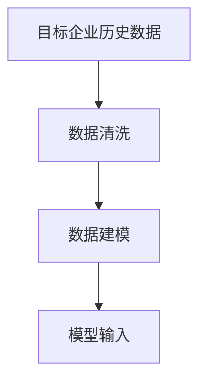
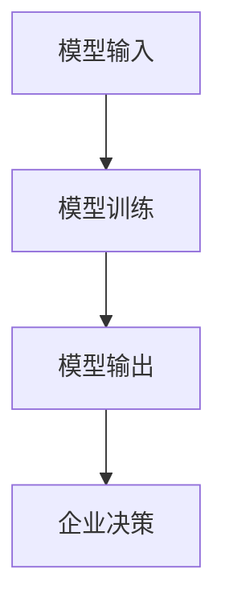
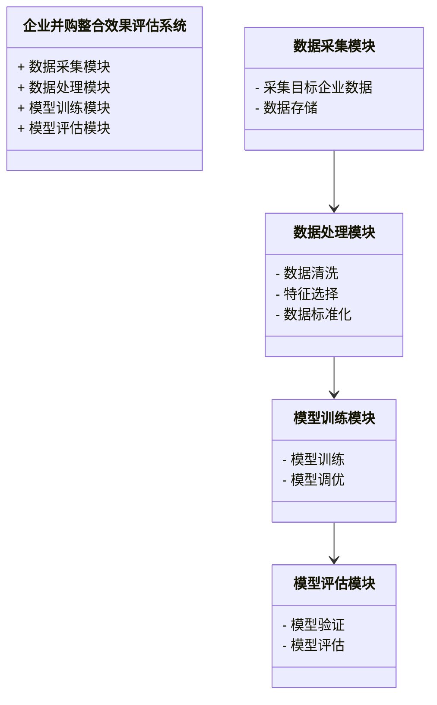
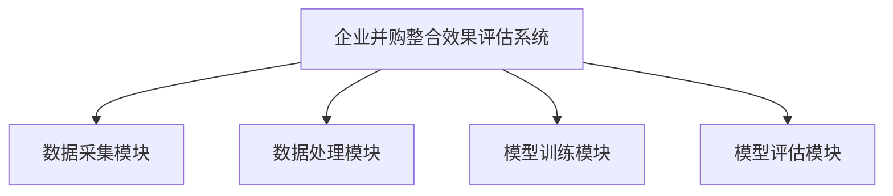
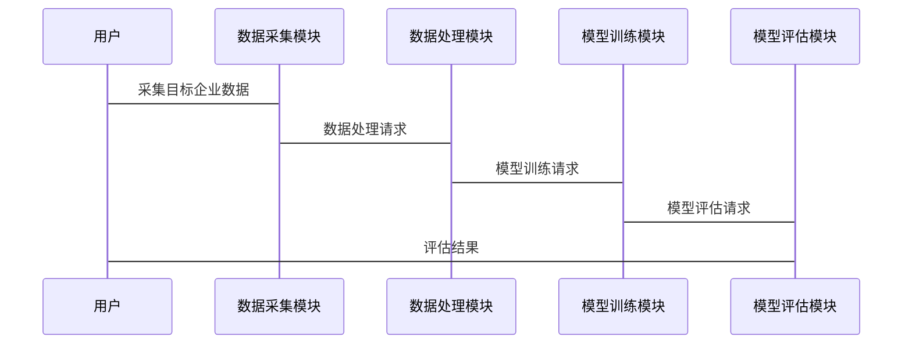

                 


# AI辅助的企业并购整合效果评估

## 关键词：AI辅助、企业并购、整合效果、机器学习、自然语言处理

## 摘要：  
企业并购是企业战略发展的重要手段之一，然而并购后的整合效果往往受到多种因素的影响，包括文化冲突、业务协同、资源优化等。传统的并购整合效果评估方法通常依赖于人工分析和经验判断，存在主观性强、效率低、精度不足等问题。本文将深入探讨如何利用人工智能技术辅助企业并购整合效果评估，从数据分析、模型构建到实际应用，全面解析AI在企业并购整合中的作用和价值。

---

## 第1章: 企业并购整合的背景与挑战

### 1.1 企业并购的基本概念

#### 1.1.1 企业并购的定义与类型
企业并购（Mergers and Acquisitions，简称M&A）是指企业之间的合并或收购行为。根据具体操作方式，企业并购可以分为以下几种类型：
- **横向并购**：同一行业内的企业并购，旨在扩大市场份额。
- **纵向并购**：产业链上下游企业的并购，以增强供应链控制能力。
- **混合并购**：不同行业或业务领域的企业并购，以实现多元化发展。

#### 1.1.2 企业并购的动机与目的
企业进行并购的主要动机包括：
- **扩大市场份额**：通过并购快速进入新市场或扩大现有市场占有率。
- **获取技术或资源**：通过并购获得关键技术、专利或优质资源。
- **优化资产结构**：通过并购整合资源，优化资产配置，降低运营成本。
- **战略防御**：通过并购抵御竞争对手的扩张。

#### 1.1.3 企业并购的流程与阶段
企业并购通常包括以下几个阶段：
1. **战略规划与决策**：确定并购目标和战略方向。
2. **目标筛选与尽职调查**：筛选潜在目标并进行详细尽职调查。
3. **估值与谈判**：对目标企业进行估值，并与目标企业进行谈判。
4. **整合规划与实施**：制定整合方案并逐步实施整合。

### 1.2 企业整合的挑战

#### 1.2.1 整合过程中的主要问题
企业在并购后整合过程中可能面临以下问题：
- **文化冲突**：不同企业有不同的企业文化，整合过程中可能出现文化冲突。
- **组织融合**：如何将两个企业的组织结构、人员、流程有效地融合在一起。
- **业务协同**：如何在整合后实现业务协同，最大化资源利用效率。

#### 1.2.2 文化冲突与组织融合的难点
文化冲突是企业整合中的主要难点之一。例如：
- 企业A强调创新和冒险，而企业B强调稳定和风险控制。
- 企业A的管理风格是扁平化的，而企业B的管理风格是层级化的。

#### 1.2.3 业务协同与资源优化的挑战
业务协同和资源优化是企业整合的核心目标之一。例如：
- 如何将两个企业的供应链整合为一个高效的供应链。
- 如何将两个企业的研发团队整合为一个高效的创新团队。

### 1.3 AI在企业并购整合中的作用

#### 1.3.1 AI技术如何辅助企业整合
人工智能技术可以通过以下方式辅助企业整合：
- **数据挖掘与分析**：利用AI技术对目标企业的历史数据进行分析，预测整合后的效果。
- **机器学习模型**：利用机器学习模型对整合过程中的风险进行预测和评估。
- **自然语言处理**：利用自然语言处理技术分析企业文档，提取关键信息。

#### 1.3.2 AI在并购评估中的优势
AI技术在并购评估中的优势包括：
- **高效性**：AI技术可以快速处理大量数据，提高评估效率。
- **准确性**：AI技术可以通过数据驱动的方式，提高评估结果的准确性。
- **预测性**：AI技术可以通过历史数据预测整合后的效果，帮助企业在整合过程中做出更明智的决策。

#### 1.3.3 AI技术对企业价值的提升
AI技术可以通过以下方式提升企业价值：
- **优化整合方案**：通过AI技术优化整合方案，提高整合效率。
- **降低整合风险**：通过AI技术预测和评估整合风险，制定相应的风险应对策略。
- **提升整合效果**：通过AI技术实现更高效的资源整合和协同效应。

### 1.4 本章小结
本章主要介绍了企业并购的基本概念、整合的挑战以及AI在企业并购整合中的作用。通过AI技术的辅助，企业可以更高效、更准确地进行整合，从而提升整合效果和企业价值。

---

## 第2章: AI辅助企业并购整合的核心概念

### 2.1 企业并购整合效果的评估指标

#### 2.1.1 财务指标：净利润、ROE等
财务指标是评估企业整合效果的重要指标之一，主要包括：
- **净利润**：整合后的净利润是否达到预期。
- **ROE（净资产收益率）**：整合后的ROE是否提高。
- **EBIT（息税折旧前利润）**：整合后的EBIT是否增加。

#### 2.1.2 经营指标：市场份额、客户满意度
经营指标是评估企业整合效果的重要指标之一，主要包括：
- **市场份额**：整合后是否提升了市场份额。
- **客户满意度**：整合后客户满意度是否提高。
- **员工满意度**：整合后员工满意度是否提高。

#### 2.1.3 战略指标：协同效应、长期增长潜力
战略指标是评估企业整合效果的重要指标之一，主要包括：
- **协同效应**：整合后是否实现了预期的协同效应。
- **长期增长潜力**：整合后企业是否具有长期增长潜力。

### 2.2 AI辅助评估的核心技术

#### 2.2.1 数据挖掘与分析
数据挖掘是AI辅助评估的核心技术之一，主要包括：
- **数据清洗**：对目标企业的历史数据进行清洗，去除噪声数据。
- **数据建模**：利用数据建模技术对目标企业进行分析和预测。
- **数据可视化**：通过数据可视化工具将数据结果以图表形式展示出来。

#### 2.2.2 机器学习模型
机器学习模型是AI辅助评估的核心技术之一，主要包括：
- **监督学习**：利用监督学习算法对目标企业进行分类或回归分析。
- **无监督学习**：利用无监督学习算法对目标企业的数据进行聚类分析。
- **深度学习**：利用深度学习算法对目标企业的数据进行特征提取和模型训练。

#### 2.2.3 自然语言处理（NLP）
自然语言处理是AI辅助评估的核心技术之一，主要包括：
- **文本分类**：对目标企业的文档进行分类，提取关键信息。
- **实体识别**：从目标企业的文档中识别出关键实体。
- **情感分析**：分析目标企业文档中的情感倾向。

### 2.3 核心概念之间的关系

#### 2.3.1 评估指标与AI技术的对应关系
评估指标与AI技术的对应关系如下表所示：

| 评估指标       | AI技术         |
|----------------|----------------|
| 财务指标（净利润、ROE） | 机器学习模型   |
| 经营指标（市场份额、客户满意度） | 数据挖掘与分析 |
| 战略指标（协同效应、长期增长潜力） | 自然语言处理 |

#### 2.3.2 数据来源与模型输入的关联
数据来源与模型输入的关联可以通过以下流程图表示：



#### 2.3.3 模型输出与企业决策的映射
模型输出与企业决策的映射可以通过以下流程图表示：



### 2.4 本章小结
本章主要介绍了AI辅助企业并购整合的核心概念，包括评估指标和核心技术。通过AI技术的辅助，企业可以更高效、更准确地进行整合效果评估。

---

## 第3章: 企业并购整合效果评估模型

### 3.1 评估模型的构建过程

#### 3.1.1 数据准备与清洗
数据准备与清洗是评估模型构建的第一步，主要包括：
- **数据收集**：收集目标企业的历史数据，包括财务数据、经营数据和战略数据。
- **数据清洗**：对收集到的数据进行清洗，去除噪声数据和异常值。

#### 3.1.2 模型训练与调优
模型训练与调优是评估模型构建的关键步骤，主要包括：
- **特征选择**：选择对评估指标影响较大的特征。
- **模型训练**：利用机器学习算法对模型进行训练。
- **模型调优**：通过交叉验证等方法对模型进行调优，提高模型的准确性和稳定性。

#### 3.1.3 模型验证与评估
模型验证与评估是评估模型构建的最后一步，主要包括：
- **模型验证**：利用验证集对模型进行验证，评估模型的泛化能力。
- **模型评估**：通过混淆矩阵、准确率、召回率等指标对模型进行评估。

### 3.2 评估模型的数学公式

#### 3.2.1 模型输入变量的定义
模型输入变量包括以下几项：
- **财务指标**：净利润、ROE等。
- **经营指标**：市场份额、客户满意度等。
- **战略指标**：协同效应、长期增长潜力等。

#### 3.2.2 模型输出的计算公式
模型输出的计算公式如下：

$$
\text{整合效果} = \alpha \times \text{财务指标} + \beta \times \text{经营指标} + \gamma \times \text{战略指标}
$$

其中，$\alpha$、$\beta$、$\gamma$ 是模型训练过程中确定的权重系数。

#### 3.2.3 模型参数的优化方法
模型参数的优化方法主要包括：
- **随机梯度下降**：通过随机梯度下降算法对模型参数进行优化。
- **网格搜索**：通过网格搜索算法对模型参数进行调优。
- **贝叶斯优化**：通过贝叶斯优化算法对模型参数进行优化。

### 3.3 模型的实现与应用

#### 3.3.1 数据预处理的Python代码示例
以下是数据预处理的Python代码示例：

```python
import pandas as pd
from sklearn.preprocessing import StandardScaler

# 读取数据
data = pd.read_csv('merger_data.csv')

# 数据清洗
data_cleaned = data.dropna().fillna(0)

# 特征选择
features = ['净利润', 'ROE', '市场份额']
data_features = data_cleaned[features]

# 标准化处理
scaler = StandardScaler()
data_features_scaled = scaler.fit_transform(data_features)
```

#### 3.3.2 模型训练的代码实现
以下是模型训练的Python代码示例：

```python
from sklearn.linear_model import LinearRegression
from sklearn.metrics import mean_squared_error

# 模型训练
model = LinearRegression()
model.fit(data_features_scaled, data_cleaned['整合效果'])

# 模型预测
y_pred = model.predict(data_features_scaled)

# 模型评估
mse = mean_squared_error(data_cleaned['整合效果'], y_pred)
print(f"均方误差：{mse}")
```

### 3.4 本章小结
本章主要介绍了企业并购整合效果评估模型的构建过程，包括数据准备、模型训练和模型评估。通过模型的构建，企业可以更准确地评估整合效果。

---

## 第4章: 系统分析与架构设计方案

### 4.1 系统分析

#### 4.1.1 问题场景介绍
企业并购整合效果评估系统需要解决以下问题：
- 如何高效地收集和处理目标企业的数据。
- 如何利用AI技术对目标企业进行整合效果评估。
- 如何将评估结果应用于企业的实际决策中。

#### 4.1.2 项目介绍
本项目旨在开发一个基于AI技术的企业并购整合效果评估系统，帮助企业更高效、更准确地进行整合效果评估。

### 4.2 系统功能设计

#### 4.2.1 领域模型（Mermaid 类图）
以下是领域模型的Mermaid类图：



### 4.3 系统架构设计

#### 4.3.1 系统架构（Mermaid 架构图）
以下是系统架构的Mermaid架构图：



### 4.4 系统接口设计

#### 4.4.1 系统接口
系统接口包括：
- 数据采集模块接口：用于采集目标企业数据。
- 数据处理模块接口：用于处理目标企业数据。
- 模型训练模块接口：用于训练评估模型。
- 模型评估模块接口：用于评估模型效果。

#### 4.4.2 系统交互（Mermaid 序列图）
以下是系统交互的Mermaid序列图：



### 4.5 本章小结
本章主要介绍了企业并购整合效果评估系统的系统分析与架构设计方案，包括系统功能设计、系统架构设计和系统接口设计。

---

## 第5章: 项目实战

### 5.1 项目环境安装

#### 5.1.1 安装Python环境
安装Python环境并配置好Python解释器。

#### 5.1.2 安装相关库
安装以下Python库：
- pandas
- numpy
- scikit-learn
- matplotlib

### 5.2 系统核心实现源代码

#### 5.2.1 数据采集模块代码
以下是数据采集模块的Python代码：

```python
import pandas as pd

def collect_data():
    # 采集目标企业数据
    data = pd.read_csv('merger_data.csv')
    return data

if __name__ == "__main__":
    collect_data()
```

#### 5.2.2 数据处理模块代码
以下是数据处理模块的Python代码：

```python
from sklearn.preprocessing import StandardScaler

def preprocess_data(data):
    # 数据清洗
    data_cleaned = data.dropna().fillna(0)
    # 特征选择
    features = ['净利润', 'ROE', '市场份额']
    data_features = data_cleaned[features]
    # 数据标准化
    scaler = StandardScaler()
    data_features_scaled = scaler.fit_transform(data_features)
    return data_features_scaled

if __name__ == "__main__":
    data = pd.read_csv('merger_data.csv')
    preprocess_data(data)
```

#### 5.2.3 模型训练模块代码
以下是模型训练模块的Python代码：

```python
from sklearn.linear_model import LinearRegression

def train_model(data_features_scaled, target):
    # 模型训练
    model = LinearRegression()
    model.fit(data_features_scaled, target)
    return model

if __name__ == "__main__":
    data = pd.read_csv('merger_data.csv')
    features = ['净利润', 'ROE', '市场份额']
    target = '整合效果'
    data_features = data[features]
    data_target = data[target]
    preprocess_data(data)
    model = train_model(preprocess_data(data), data_target)
```

#### 5.2.4 模型评估模块代码
以下是模型评估模块的Python代码：

```python
from sklearn.metrics import mean_squared_error

def evaluate_model(model, data_features_scaled, target):
    # 模型预测
    y_pred = model.predict(data_features_scaled)
    # 模型评估
    mse = mean_squared_error(target, y_pred)
    print(f"均方误差：{mse}")

if __name__ == "__main__":
    data = pd.read_csv('merger_data.csv')
    features = ['净利润', 'ROE', '市场份额']
    target = '整合效果'
    data_features = data[features]
    data_target = data[target]
    preprocess_data(data)
    model = train_model(preprocess_data(data), data_target)
    evaluate_model(model, preprocess_data(data), data_target)
```

### 5.3 代码应用解读与分析
以下是代码应用解读与分析：
- 数据采集模块：用于采集目标企业数据。
- 数据处理模块：用于对目标企业数据进行清洗和标准化处理。
- 模型训练模块：用于训练企业并购整合效果评估模型。
- 模型评估模块：用于评估模型效果。

### 5.4 案例分析与详细讲解剖析
以下是案例分析与详细讲解剖析：
- 案例背景：某企业计划并购另一家企业，需要评估整合后的效果。
- 数据准备：收集目标企业的财务数据、经营数据和战略数据。
- 模型训练：利用机器学习算法对目标企业进行整合效果评估。
- 模型评估：通过均方误差等指标评估模型效果。

### 5.5 本章小结
本章主要通过实际案例展示了企业并购整合效果评估系统的实现过程，包括环境安装、代码实现和案例分析。

---

## 第6章: 最佳实践、小结、注意事项、拓展阅读

### 6.1 最佳实践

#### 6.1.1 数据准备阶段
- 数据来源要可靠，确保数据的准确性和完整性。
- 数据清洗要彻底，去除噪声数据和异常值。

#### 6.1.2 模型训练阶段
- 特征选择要合理，选择对评估指标影响较大的特征。
- 模型调优要细致，通过交叉验证等方法优化模型参数。

#### 6.1.3 模型评估阶段
- 模型评估要全面，利用多种指标对模型效果进行评估。
- 模型应用要灵活，根据实际需求调整模型参数。

### 6.2 小结
本文详细介绍了AI辅助企业并购整合效果评估的理论与实践，从背景介绍到系统实现，全面解析了AI在企业并购整合中的应用。

### 6.3 注意事项

#### 6.3.1 数据隐私与安全
- 数据隐私与安全是企业并购整合中的重要问题，需要严格遵守相关法律法规。
- 数据处理过程中要注意保护数据隐私，防止数据泄露。

#### 6.3.2 模型局限性
- AI技术虽然可以提高企业并购整合效果评估的效率和准确性，但也存在一定的局限性。
- 模型的预测结果仅供参考，不能完全替代人工判断。

### 6.4 拓展阅读
- 《企业并购与整合管理》
- 《人工智能在金融领域的应用》
- 《机器学习算法实战》

---

## 第7章: 总结与展望

### 7.1 总结
本文从企业并购整合的背景与挑战出发，详细探讨了AI辅助企业并购整合效果评估的核心概念、模型构建、系统设计和实际应用。通过AI技术的辅助，企业可以更高效、更准确地进行整合效果评估，从而提升企业的整体竞争力。

### 7.2 展望
未来，随着AI技术的不断发展，企业并购整合效果评估将更加智能化和自动化。以下是未来的发展方向：
- **实时监测**：通过实时监测企业整合过程中的各项指标，动态调整整合策略。
- **智能决策**：利用AI技术实现整合决策的智能化和自动化。
- **数据驱动**：通过数据驱动的方式，进一步优化企业并购整合效果评估模型。

---

## 作者：AI天才研究院/AI Genius Institute & 禅与计算机程序设计艺术 /Zen And The Art of Computer Programming

