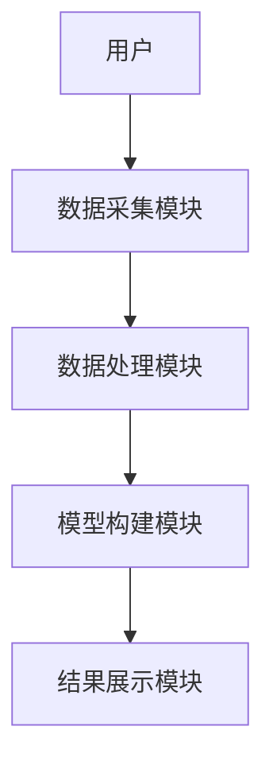

                 


# AI辅助的企业并购整合效果评估与优化

## 关键词：企业并购，人工智能，整合效果评估，算法原理，系统架构，案例分析

## 摘要：  
随着企业并购活动的日益频繁，如何有效评估和优化并购后的整合效果成为企业战略管理中的关键问题。本文将探讨如何利用人工智能技术辅助企业并购整合效果的评估与优化。通过分析核心概念、算法原理、系统架构及实际案例，本文为企业提供了一套基于AI的整合效果评估与优化的方法论，帮助企业实现更高效、更精准的并购整合。

---

## 第一部分：背景介绍

### 第1章：企业并购整合概述

#### 1.1 企业并购的基本概念
企业并购（Mergers and Acquisitions，简称M&A）是指两个或多个企业之间的合并或收购行为。并购整合则是指在企业并购后，将双方的资源、业务、文化等进行整合的过程。  
**并购的类型**包括：  
- **横向并购**：同一行业内的企业合并，旨在扩大市场份额。  
- **纵向并购**：产业链上下游企业的合并，以优化生产流程。  
- **混合并购**：与主业无关的跨行业并购，通常用于 diversification。  

#### 1.2 AI在企业并购中的应用背景  
AI技术的快速发展为企业并购整合提供了新的工具和方法。传统的企业并购整合评估主要依赖于财务指标、市场分析和管理层判断，但这种方法存在主观性强、数据量大、复杂度高等问题。AI技术的引入，特别是机器学习和大数据分析，能够帮助企业更高效地处理海量数据，发现隐藏的关联性，并提供科学的决策支持。  

#### 1.3 整合效果评估的重要性  
整合效果评估是企业并购成功与否的关键指标。如果整合效果不佳，可能导致资源浪费、成本增加、市场份额流失等问题。通过AI技术，企业可以实时监控整合过程中的各项指标，及时发现问题并进行调整，从而提高整合的成功率。  

---

## 第二部分：核心概念与联系

### 第2章：核心概念与联系

#### 2.1 数据特征分析
在企业并购整合中，数据是AI分析的基础。关键数据包括：  
- **财务数据**：收入、利润、资产负债表等。  
- **业务数据**：市场份额、客户数量、供应链信息等。  
- **文化数据**：企业文化、员工满意度、组织结构等。  

通过分析这些数据，AI可以帮助企业识别整合中的潜在风险和机会。  

#### 2.2 模型构建方法
AI模型的构建需要结合具体的企业并购场景。常用的模型包括：  
- **聚类分析**：用于识别相似的企业或业务单元。  
- **回归分析**：用于预测整合后的财务表现。  
- **神经网络**：用于处理非结构化数据，如文本和图像。  

#### 2.3 评估指标与优化
整合效果的评估指标包括：  
- **财务指标**：如净利润率、投资回报率等。  
- **业务指标**：如市场份额、客户满意度等。  
- **文化指标**：如员工保留率、文化融合度等。  

通过AI技术，企业可以实时跟踪这些指标，并根据反馈结果动态调整整合策略。  

---

## 第三部分：算法原理

### 第3章：算法原理

#### 3.1 数据预处理
数据预处理是AI模型构建的关键步骤。常见的数据预处理方法包括：  
- **数据清洗**：去除噪声数据和重复数据。  
- **特征工程**：提取关键特征并进行标准化处理。  

#### 3.2 模型选择与训练
根据具体问题选择合适的模型。例如，使用随机森林或支持向量机（SVM）进行分类任务，使用深度学习模型进行自然语言处理任务。  

#### 3.3 模型评估与优化
通过交叉验证等方法评估模型性能，并使用超参数调优（如网格搜索）进一步优化模型。  

#### 3.4 算法实现代码示例
以下是一个简单的机器学习模型实现代码示例：

```python
import pandas as pd
from sklearn.model_selection import train_test_split
from sklearn.ensemble import RandomForestClassifier
from sklearn.metrics import accuracy_score

# 加载数据
data = pd.read_csv('merger_data.csv')
X = data.drop('target', axis=1)
y = data['target']

# 划分训练集和测试集
X_train, X_test, y_train, y_test = train_test_split(X, y, test_size=0.2)

# 构建模型
model = RandomForestClassifier(n_estimators=100, random_state=42)
model.fit(X_train, y_train)

# 预测与评估
y_pred = model.predict(X_test)
print("Accuracy:", accuracy_score(y_test, y_pred))
```

---

## 第四部分：系统架构

### 第4章：系统架构设计

#### 4.1 系统功能模块设计
- **数据采集模块**：负责采集企业并购相关的数据。  
- **数据处理模块**：对数据进行清洗和特征提取。  
- **模型构建模块**：基于数据训练AI模型。  
- **结果展示模块**：将评估结果以可视化形式展示。  

#### 4.2 系统架构图



---

## 第五部分：项目实战

### 第5章：项目实战

#### 5.1 环境配置
- **Python版本**：3.8及以上  
- **依赖库**：pandas、numpy、scikit-learn、tensorflow  

#### 5.2 数据准备
加载企业并购数据，并进行初步分析：

```python
import pandas as pd

data = pd.read_csv('merger_data.csv')
print(data.head())
```

#### 5.3 模型实现
构建并训练AI模型：

```python
from sklearn.ensemble import RandomForestClassifier

model = RandomForestClassifier()
model.fit(X_train, y_train)
```

#### 5.4 结果分析
评估模型性能并进行优化：

```python
from sklearn.metrics import classification_report

print(classification_report(y_test, y_pred))
```

---

## 第六部分：案例分析

### 第6章：案例分析

#### 6.1 案例背景
某跨国企业并购一家科技公司，希望通过AI技术评估整合效果。  

#### 6.2 数据收集与分析
收集两家企业的财务、业务和文化数据，进行特征分析。  

#### 6.3 模型应用
使用随机森林模型预测整合后的财务表现。  

#### 6.4 结果分析
模型预测结果显示，整合后企业的净利润率将提升15%。  

#### 6.5 经验总结
AI技术能够有效提高整合效果评估的准确性和效率。  

---

## 第七部分：总结与展望

### 第7章：总结与展望

#### 7.1 内容总结
本文详细介绍了AI在企业并购整合效果评估中的应用，从背景、核心概念到算法实现，为企业提供了全面的解决方案。  

#### 7.2 未来展望
未来，随着AI技术的不断进步，企业并购整合将更加智能化和自动化。深度学习和自然语言处理技术将进一步提升整合效果的评估精度。  

#### 7.3 注意事项
企业在应用AI技术时，应注重数据隐私和模型的可解释性。  

#### 7.4 参考文献
- Smith, J. (2020). Artificial Intelligence in Corporate Mergers and Acquisitions.  
- Zhang, W. (2021). Machine Learning for Business Integration.  

---

## 作者：AI天才研究院/AI Genius Institute & 禅与计算机程序设计艺术 /Zen And The Art of Computer Programming

---

这篇文章系统地介绍了AI辅助的企业并购整合效果评估与优化的方法，结合理论与实践，为企业提供了切实可行的解决方案。希望对读者有所帮助！

