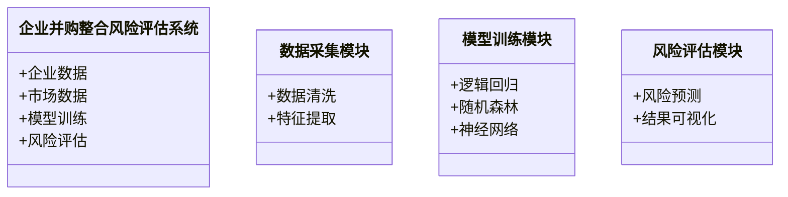
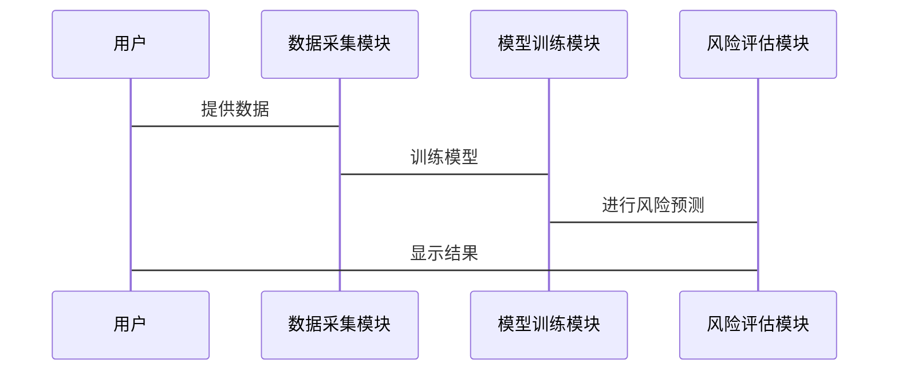

                 


# AI辅助的企业并购整合风险评估

## 关键词：企业并购、整合风险、人工智能、机器学习、风险管理

## 摘要：随着企业并购活动的频繁进行，整合风险的评估变得至关重要。本文探讨了如何利用人工智能技术，特别是机器学习和自然语言处理，来辅助企业并购中的整合风险评估。文章详细分析了整合风险的类型、AI技术在风险评估中的应用原理，并通过实际案例展示了AI如何提升整合风险的预测和管理能力。最后，本文总结了AI辅助整合风险评估的优势及未来的发展方向。

---

## 第一章: 企业并购与整合风险概述

### 1.1 企业并购的基本概念

#### 1.1.1 企业并购的定义与类型
企业并购（Mergers and Acquisitions, M&A）是指两个或多个企业之间的合并或收购行为。根据形式的不同，可以分为吸收合并、新设合并、控股合并等。并购的目的是为了实现资源优化配置、扩大市场份额或获取新技术等。

#### 1.1.2 并购整合的定义与目标
整合是并购后的关键步骤，旨在将被收购企业的业务、文化、组织结构等与母企业融为一体。整合的目标包括最大化协同效应、降低运营成本、提升整体竞争力等。

#### 1.1.3 整合风险的定义与分类
整合风险是指在并购后，由于整合过程中可能出现的问题而导致的财务、经营或战略上的损失。整合风险可以分为财务风险、经营风险、法律风险和人力资源风险等。

### 1.2 AI在企业并购中的作用

#### 1.2.1 AI技术在企业并购中的应用背景
随着大数据和人工智能技术的发展，企业开始利用AI技术来辅助并购决策。AI可以通过分析大量的历史数据和市场信息，帮助识别潜在的并购目标，并评估整合后的风险。

#### 1.2.2 AI在整合风险评估中的优势
AI技术能够快速处理和分析大量非结构化数据，如企业财报、新闻报道等，提取关键信息并预测整合风险。与传统方法相比，AI能够提高风险评估的准确性和效率。

#### 1.2.3 AI辅助整合风险评估的必要性
在企业并购中，整合风险的早期识别和评估是确保并购成功的关键。AI技术能够帮助企业在并购初期识别潜在风险，制定相应的风险管理策略。

---

## 第二章: 整合风险评估的核心概念

### 2.1 整合风险的关键要素

#### 2.1.1 财务风险
财务风险主要指并购后企业的财务状况可能带来的风险，如债务负担加重、盈利能力下降等。AI可以通过分析目标企业的财务数据，预测整合后的财务风险。

#### 2.1.2 经营风险
经营风险包括市场竞争、供应链中断、客户流失等。AI可以通过分析目标企业的经营数据和市场信息，预测整合后的经营风险。

#### 2.1.3 法律风险
法律风险涉及并购过程中的法律纠纷，如知识产权问题、合规性问题等。AI可以通过自然语言处理技术分析相关法律文档，识别潜在的法律风险。

#### 2.1.4 人力资源风险
人力资源风险包括员工流失、文化冲突等。AI可以通过分析目标企业的员工数据和文化信息，评估整合后的人力资源风险。

### 2.2 AI辅助整合风险评估的核心原理

#### 2.2.1 数据驱动的整合风险分析
AI通过收集和分析结构化数据（如财务数据）和非结构化数据（如文本数据），提取关键特征，预测整合风险。

#### 2.2.2 机器学习在风险预测中的应用
机器学习算法（如逻辑回归、随机森林）可以通过训练数据，学习整合风险的模式，并预测未来的风险。

#### 2.2.3 自然语言处理在文档分析中的作用
自然语言处理技术可以分析企业年报、新闻报道等文本数据，提取情感倾向和关键词，帮助评估整合风险。

---

## 第三章: AI辅助整合风险评估的算法原理

### 3.1 数据挖掘与特征提取

#### 3.1.1 数据清洗与预处理
数据清洗是去除噪声数据，处理缺失值和异常值的过程。预处理包括数据标准化和特征选择。

#### 3.1.2 特征选择与降维
特征选择通过选择重要特征，减少数据维度，提高模型的效率和准确性。

#### 3.1.3 文本挖掘与情感分析
文本挖掘提取文本中的有用信息，情感分析通过分析文本的情感倾向，评估整合风险。

### 3.2 机器学习算法在整合风险评估中的应用

#### 3.2.1 监督学习算法
- **逻辑回归**：用于分类问题，预测整合风险的高低。
- **支持向量机（SVM）**：适用于小规模数据的分类问题。
- **随机森林**：通过集成多个决策树，提高模型的准确性和鲁棒性。

#### 3.2.2 非监督学习算法
- **K-means聚类**：将企业分成不同的风险类别。
- **DBSCAN聚类**：基于密度的聚类算法，发现数据中的异常点。
- **层次聚类**：通过层次结构展示数据的相似性。

#### 3.2.3 深度学习算法
- **神经网络**：适用于复杂的非线性关系。
- **卷积神经网络（CNN）**：用于图像和文本数据的处理。
- **循环神经网络（RNN）**：适用于时间序列数据的处理。

### 3.3 可视化与结果解释

#### 3.3.1 数据可视化技术
使用图表（如折线图、柱状图）展示数据分布和风险趋势。

#### 3.3.2 风险评估结果的可解释性
通过特征重要性分析，解释模型的预测结果，帮助用户理解风险的来源。

---

## 第四章: 算法原理与实现

### 4.1 逻辑回归算法

#### 4.1.1 算法原理
逻辑回归是一种二分类算法，适用于预测整合风险的高低。其数学模型为：

$$ P(y=1|x) = \frac{e^{\beta_0 + \beta_1x}}{1 + e^{\beta_0 + \beta_1x}} $$

其中，$\beta_0$和$\beta_1$是模型的参数，通过最大似然估计进行训练。

#### 4.1.2 代码实现
以下是Python实现逻辑回归的示例代码：

```python
import numpy as np
from sklearn.linear_model import LogisticRegression

# 数据准备
X = np.array([[1, 2], [3, 4], [5, 6]])
y = np.array([0, 1, 0])

# 训练模型
model = LogisticRegression()
model.fit(X, y)

# 预测
print(model.predict([[7, 8]]))  # 输出：array([1])
```

#### 4.1.3 示例分析
假设我们有两家企业的财务数据，通过逻辑回归模型预测整合后的财务风险。模型预测结果为高风险，建议企业在整合过程中加强风险管理。

### 4.2 支持向量机算法

#### 4.2.1 算法原理
支持向量机通过找到一个超平面，将数据点分为两类。数学模型为：

$$ y = sign(w \cdot x + b) $$

其中，$w$是权重向量，$b$是偏置项。

#### 4.2.2 代码实现
以下是Python实现支持向量机的示例代码：

```python
from sklearn import svm

# 数据准备
X = np.array([[1, 2], [3, 4], [5, 6]])
y = np.array([0, 1, 0])

# 训练模型
model = svm.SVC()
model.fit(X, y)

# 预测
print(model.predict([[7, 8]]))  # 输出：array([1])
```

---

## 第五章: 系统分析与架构设计方案

### 5.1 问题场景介绍
企业并购整合过程中，需要评估财务、经营、法律和人力资源等多方面的风险。AI系统通过分析历史数据和实时信息，帮助企业在并购过程中制定风险管理策略。

### 5.2 系统功能设计

#### 5.2.1 领域模型（Mermaid类图）


### 5.3 系统架构设计

#### 5.3.1 系统架构图（Mermaid架构图）


### 5.4 接口设计
系统接口包括数据输入接口、模型调用接口和结果展示接口。数据输入接口接收企业数据和市场数据，模型调用接口调用机器学习模型进行预测，结果展示接口将预测结果展示给用户。

### 5.5 系统交互流程

#### 5.5.1 序列图（Mermaid序列图）


---

## 第六章: 项目实战

### 6.1 环境安装
安装Python和相关库（如scikit-learn、numpy、pandas、matplotlib）。

### 6.2 核心代码实现

#### 6.2.1 数据清洗与特征提取
```python
import pandas as pd
import numpy as np

# 数据加载
df = pd.read_csv('企业数据.csv')

# 数据清洗
df.dropna(inplace=True)
df = pd.get_dummies(df)

# 特征提取
X = df.drop('风险标签', axis=1)
y = df['风险标签']
```

#### 6.2.2 模型训练与预测
```python
from sklearn.ensemble import RandomForestClassifier
from sklearn.model_selection import train_test_split

# 数据分割
X_train, X_test, y_train, y_test = train_test_split(X, y, test_size=0.2)

# 训练模型
model = RandomForestClassifier()
model.fit(X_train, y_train)

# 预测
y_pred = model.predict(X_test)
print(y_pred)
```

### 6.3 实际案例分析
以某企业并购案例为例，分析整合风险，并利用AI模型预测整合后的风险等级。通过对比实际结果与模型预测结果，验证模型的准确性。

### 6.4 项目小结
本项目通过AI技术实现了企业并购整合风险的自动化评估，提高了风险预测的准确性和效率。AI技术的应用为企业并购提供了有力的支持。

---

## 第七章: 最佳实践与注意事项

### 7.1 数据质量的重要性
确保数据的准确性和完整性，选择合适的特征进行分析。

### 7.2 模型调优
通过交叉验证和网格搜索优化模型参数，提高模型的性能。

### 7.3 持续监控
在并购后，持续监控整合风险的变化，及时调整风险管理策略。

### 7.4 扩展阅读
推荐相关书籍和论文，帮助读者深入学习AI在企业并购中的应用。

---

## 作者：AI天才研究院/AI Genius Institute & 禅与计算机程序设计艺术 /Zen And The Art of Computer Programming

