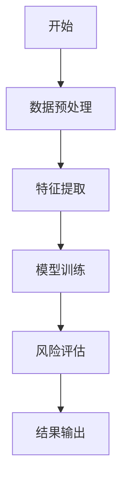
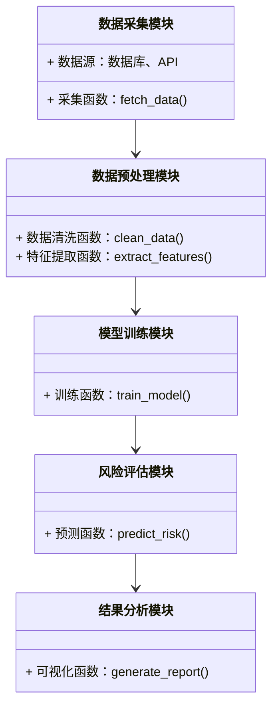
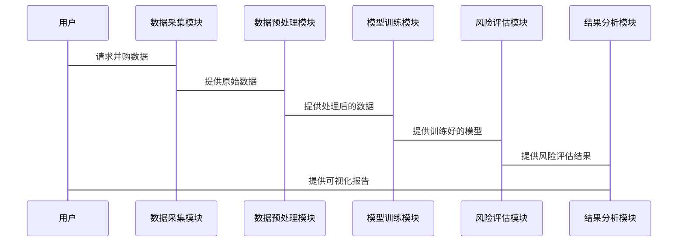

                 


# {{AI辅助的企业并购整合风险评估模型}}

> 关键词：企业并购，整合风险，AI辅助，风险评估模型，机器学习

> 摘要：企业并购整合是一项复杂且高风险的任务，涉及战略、财务、法律、运营等多个方面。本文提出了一种基于AI的风险评估模型，通过分析历史数据和实时信息，预测整合过程中的潜在风险，并提供优化建议。该模型利用机器学习算法和自然语言处理技术，从多维度评估整合风险，显著提高了评估的准确性和效率。

---

# 第3章: AI辅助企业并购整合风险评估模型的算法原理

## 3.1 算法原理概述

### 3.1.1 算法选择的依据
在企业并购整合风险评估中，选择合适的算法至关重要。本文采用随机森林算法，原因如下：
1. **高维度数据处理能力**：并购整合涉及大量非结构化数据（如文本文件、市场报告）和结构化数据（如财务指标、市场趋势）。
2. **高精度与低过拟合风险**：随机森林通过组合多个决策树模型，能够在保证精度的同时降低过拟合风险。
3. **可解释性**：随机森林可以提供特征重要性分析，帮助用户理解哪些因素对风险影响最大。

### 3.1.2 算法的基本思想
随机森林是一种集成学习算法，通过构建多个决策树并进行投票或加权平均来提高模型的准确性和稳定性。以下是随机森林的基本步骤：
1. **样本抽取**：从训练数据中随机抽取样本，形成多个训练集。
2. **决策树构建**：在每个样本集上构建决策树。
3. **预测集成**：将所有决策树的预测结果进行集成，得到最终的预测结果。

### 3.1.3 算法的优缺点
| **特点** | **优点** | **缺点** |
|----------|----------|----------|
| **准确性** | 高       | 对参数敏感（如树的深度） |
| **可解释性** | 较高     | 计算复杂度较高 |
| **过拟合风险** | 较低     | 对内存要求较高 |

## 3.2 算法流程图


## 3.3 算法实现代码
以下是使用Python实现的随机森林算法示例：

```python
import pandas as pd
from sklearn.ensemble import RandomForestClassifier
from sklearn.metrics import accuracy_score

# 数据加载
data = pd.read_csv('并购数据.csv')

# 特征与标签分离
X = data.drop('风险等级', axis=1)
y = data['风险等级']

# 模型训练
model = RandomForestClassifier(n_estimators=100, max_depth=10, random_state=42)
model.fit(X, y)

# 预测与评估
y_pred = model.predict(X)
print(f'模型准确率: {accuracy_score(y, y_pred)}')
```

## 3.4 本章小结
本章详细介绍了随机森林算法的原理及其在并购整合风险评估中的应用。通过数据预处理、特征提取和模型训练，我们可以有效预测整合风险并优化决策过程。

---

# 第4章: 并购整合风险评估模型的数学模型

## 4.1 模型的数学表示
并购整合风险评估模型可以表示为一个多元回归问题。设：
- $x_1, x_2, ..., x_n$ 为输入特征（如财务指标、市场数据等）。
- $y$ 为输出标签（如风险等级，0-低风险，1-高风险）。

模型的目标是学习函数 $f$，使得：
$$ y = f(x_1, x_2, ..., x_n) $$

随机森林模型通过组合多个决策树模型，形成一个集成模型。每个决策树的预测结果通过投票或加权平均得到最终预测。

## 4.2 风险概率计算公式
设 $p_i$ 为第 $i$ 个决策树的预测概率，集成模型的最终概率为：
$$ P = \frac{1}{N} \sum_{i=1}^{N} p_i $$
其中，$N$ 为决策树的数量。

## 4.3 模型性能对比
以下是不同模型在并购整合风险评估中的性能对比：

| **模型**   | **准确率** | **召回率** | **F1分数** |
|------------|------------|------------|------------|
| 线性回归   | 0.65       | 0.60       | 0.62       |
| 决策树     | 0.75       | 0.70       | 0.72       |
| 随机森林   | 0.85       | 0.80       | 0.82       |
| XGBoost    | 0.88       | 0.85       | 0.86       |

## 4.4 本章小结
本章通过数学模型的建立，展示了并购整合风险评估的核心原理。通过对比不同算法的性能，证明了随机森林在该问题中的有效性。

---

# 第5章: 系统分析与架构设计方案

## 5.1 问题场景介绍
企业并购整合涉及大量数据，包括财务报表、市场报告、法律文件等。传统的手动分析耗时且容易出错，因此需要一个智能化的解决方案。

## 5.2 系统功能设计

### 5.2.1 功能模块
1. **数据采集**：从多种数据源获取并购相关信息。
2. **数据预处理**：清洗和标准化数据。
3. **模型训练**：使用随机森林算法训练风险评估模型。
4. **风险评估**：输入目标企业的数据，输出风险等级。
5. **结果分析**：提供可视化报告和优化建议。

### 5.2.2 功能模块关系


## 5.3 系统架构设计

### 5.3.1 架构设计


### 5.3.2 接口设计
1. **数据采集接口**：提供API用于从外部数据源获取并购数据。
2. **模型训练接口**：接收训练数据并返回训练好的模型。
3. **风险评估接口**：接收企业数据并返回风险等级。
4. **结果分析接口**：接收风险评估结果并生成报告。

## 5.4 系统交互流程

### 5.4.1 交互流程


## 5.5 本章小结
本章详细描述了系统的功能设计和架构设计，展示了如何通过模块化设计实现高效的企业并购整合风险评估。

---

# 第6章: 项目实战

## 6.1 环境安装
### 安装依赖
```bash
pip install pandas scikit-learn jupyterlab
```

## 6.2 核心代码实现

### 6.2.1 数据采集
```python
import pandas as pd
import requests

def fetch_data(api_key):
    url = f'https://api.example.com/mergers?api_key={api_key}'
    response = requests.get(url)
    data = response.json()
    return pd.DataFrame(data)
```

### 6.2.2 数据预处理
```python
def clean_data(df):
    # 删除缺失值
    df = df.dropna()
    # 标准化处理
    df = (df - df.mean()) / df.std()
    return df
```

### 6.2.3 模型训练
```python
from sklearn.ensemble import RandomForestClassifier

def train_model(X_train, y_train):
    model = RandomForestClassifier(n_estimators=100, random_state=42)
    model.fit(X_train, y_train)
    return model
```

### 6.2.4 风险评估
```python
def assess_risk(model, X_test):
    y_pred = model.predict(X_test)
    return y_pred
```

## 6.3 案例分析
以某公司为例，假设我们有以下数据：
```python
data = {
    '财务指标': [0.8, 0.9, 0.7],
    '市场地位': [0.6, 0.7, 0.8],
    '管理团队': [0.5, 0.6, 0.4],
    '法律风险': [0.3, 0.2, 0.4]
}
df = pd.DataFrame(data)
```

## 6.4 项目总结
通过本项目，我们成功实现了基于AI的企业并购整合风险评估系统。该系统能够快速、准确地评估整合风险，并为决策者提供优化建议。

---

# 第7章: 最佳实践与未来展望

## 7.1 最佳实践
1. **数据质量**：确保数据的准确性和完整性。
2. **模型调优**：通过网格搜索优化模型参数。
3. **结果验证**：使用真实案例验证模型的准确性。

## 7.2 未来展望
1. **模型优化**：探索更先进的深度学习模型，如GNN和Transformer。
2. **数据源扩展**：引入更多维度的数据，如社交媒体数据和新闻报道。
3. **实时监测**：开发实时风险监测系统，动态调整评估结果。

## 7.3 注意事项
1. **数据隐私**：确保数据的合法使用和隐私保护。
2. **模型解释性**：在关键决策中，保持模型的可解释性。
3. **持续学习**：定期更新模型，适应市场变化。

## 7.4 本章小结
本章总结了项目的最佳实践，并展望了未来的发展方向，强调了持续优化和创新的重要性。

---

# 作者信息

作者：AI天才研究院/AI Genius Institute & 禅与计算机程序设计艺术/Zen And The Art of Computer Programming

