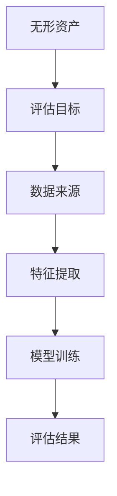
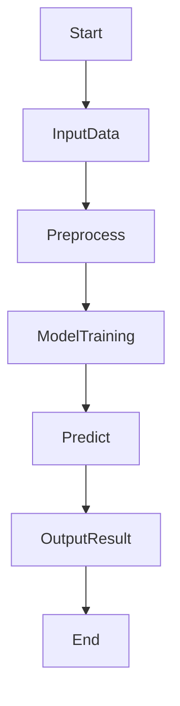
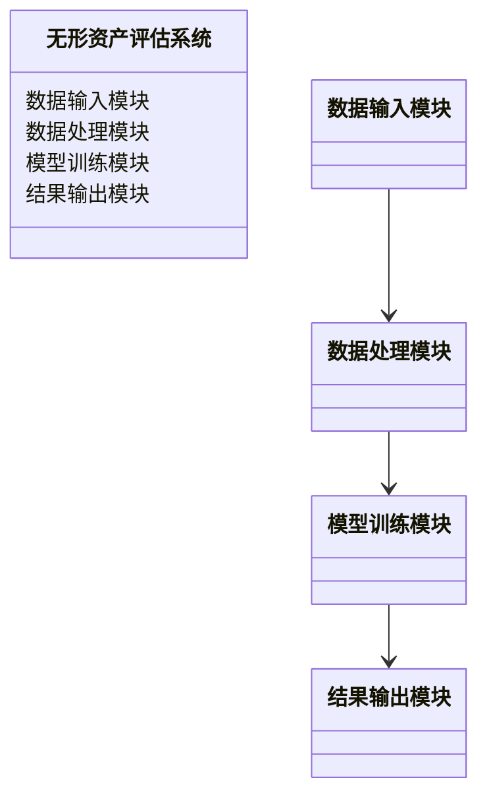
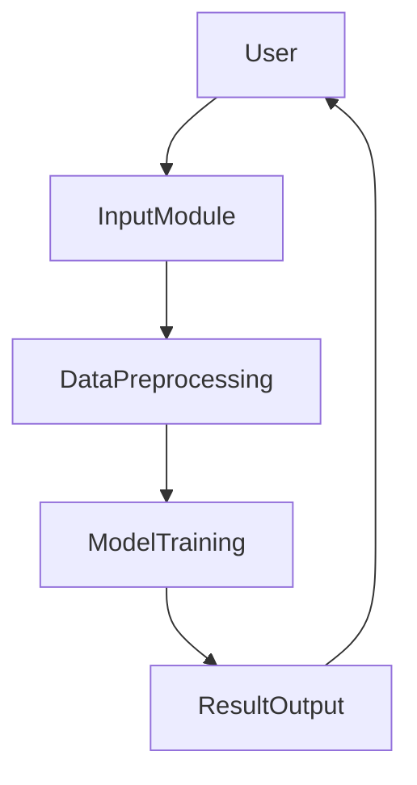

                 


# AI辅助的企业无形资产价值评估

> 关键词：AI技术，企业价值评估，无形资产评估，机器学习，深度学习，自然语言处理

> 摘要：随着人工智能技术的快速发展，企业无形资产评估的传统方法逐渐暴露出效率低、精度差等问题。本文将系统地探讨如何利用AI技术，特别是机器学习和深度学习，来辅助企业无形资产的价值评估。文章从问题背景、核心概念、算法原理到系统设计、项目实战等多方面展开，详细阐述了AI在无形资产评估中的应用价值与实现方法。

---

# 目录

## 第一部分: AI辅助的企业无形资产价值评估概述

## 第2章: 核心概念与原理

## 第3章: 算法原理与数学模型

## 第4章: 系统分析与架构设计

## 第5章: 项目实战与实现

## 第6章: 总结与展望

---

## 第一部分: AI辅助的企业无形资产价值评估概述

### 第1章: 企业无形资产价值评估的背景与问题

#### 1.1 问题背景

企业无形资产是指那些没有实物形态但能够为企业带来长期经济利益的资源，包括专利权、商标权、商誉、特许经营权等。这些资产在企业价值评估中占据重要地位，尤其是在高科技企业和创新型组织中。然而，传统的企业价值评估方法往往依赖于财务数据和人工分析，存在以下问题：

1. **数据获取困难**：无形资产的价值往往难以量化，且涉及非结构化数据（如专利文献、市场调研报告）的处理。
2. **评估效率低下**：传统方法依赖人工分析，耗时且成本高昂。
3. **主观性较强**：评估结果容易受到评估人员经验和判断的影响，缺乏客观性。

AI技术的引入为这些问题提供了潜在的解决方案。通过机器学习、自然语言处理（NLP）和深度学习等技术，可以自动化地处理大量数据，并提取有价值的信息，从而提高评估的效率和准确性。

---

#### 1.2 问题描述

无形资产评估的核心挑战包括以下几点：

1. **数据异构性**：无形资产的数据来源多样，包括文本、图像、表格等，如何统一处理这些数据是一个难题。
2. **动态变化**：市场环境和技术进步会直接影响无形资产的价值，如何实时更新评估结果是一个挑战。
3. **模型复杂性**：无形资产的评估需要考虑多种因素，构建一个准确的评估模型需要处理复杂的逻辑关系。

AI技术的优势在于其强大的数据处理能力和自适应性。通过AI，可以实现对异构数据的整合、实时数据的分析以及动态模型的构建。

---

#### 1.3 问题解决与AI的结合

AI在无形资产评估中的应用场景包括：

1. **数据清洗与预处理**：利用NLP技术处理文本数据，提取关键词和主题。
2. **特征提取**：通过深度学习模型（如BERT）提取文本中的语义特征。
3. **模型训练与优化**：基于机器学习算法（如随机森林、支持向量机）构建评估模型，并通过交叉验证优化模型性能。

AI如何提升评估效率与准确性：

1. **自动化处理**：AI可以自动处理大量数据，减少人工干预。
2. **高精度预测**：通过训练深度学习模型，可以实现对无形资产价值的高精度预测。
3. **动态调整**：AI模型可以根据最新的市场数据动态调整评估结果。

---

#### 1.4 无形资产评估的边界与外延

无形资产的定义与分类：

1. **核心无形资产**：如专利权、商标权。
2. **衍生无形资产**：如商誉、客户关系。
3. **其他无形资产**：如软件使用权、数据资产。

评估范围的界定：

1. **单项评估**：对单一无形资产进行评估。
2. **组合评估**：对多个无形资产的组合进行评估。
3. **整体评估**：对企业整体价值中的无形资产部分进行评估。

相关概念的对比与区分：

1. **无形资产与有形资产**：无形资产没有实物形态，而有形资产有具体的物理形态。
2. **单项评估与组合评估**：单项评估关注单个资产，组合评估关注资产组合的价值。

---

#### 1.5 核心概念结构与组成

评估模型的构成要素：

1. **输入数据**：包括文本数据、市场数据、财务数据。
2. **处理流程**：包括数据清洗、特征提取、模型训练。
3. **输出结果**：包括资产价值、评估报告。

数据来源与处理流程：

1. **数据来源**：专利数据库、市场报告、财务报表。
2. **数据处理**：清洗、转换、特征提取。

评估结果的呈现方式：

1. **数值结果**：资产价值的具体数值。
2. **报告形式**：包括分析结果和建议的报告。

---

## 第二部分: AI辅助评估的核心概念与联系

### 第2章: 核心概念与原理

#### 2.1 AI与无形资产评估的结合原理

机器学习在数据处理中的应用：

1. **监督学习**：用于分类和回归任务。
2. **无监督学习**：用于聚类和降维。

自然语言处理在文本分析中的作用：

1. **关键词提取**：利用TF-IDF提取文本中的关键词。
2. **情感分析**：分析文本中的情感倾向，判断市场对无形资产的评价。

深度学习在复杂模型中的优势：

1. **神经网络**：用于非线性关系建模。
2. **卷积神经网络（CNN）**：用于图像数据处理。

---

#### 2.2 核心概念对比分析

不同AI技术在评估中的作用对比：

| 技术 | 应用场景 | 优势 |
|------|----------|------|
| 机器学习 | 数据清洗、特征提取 | 高精度预测 |
| NLP | 文本分析 | 提取语义信息 |
| 深度学习 | 复杂模型构建 | 非线性关系建模 |

传统方法与AI方法的优劣势对比：

| 方法 | 优势 | 劣势 |
|------|------|------|
| 传统方法 | 简单易懂 | 低效率、低精度 |
| AI方法 | 高效率、高精度 | 需要大量数据和计算资源 |

数据特征与模型性能的对比分析：

| 特征类型 | 对模型性能的影响 |
|----------|--------------------|
| 文本特征 | 提供语义信息，提升模型准确性 |
| 数值特征 | 提供量化信息，便于模型建模 |

---

#### 2.3 实体关系图与流程图



---

## 第三部分: 算法原理与数学模型

### 第3章: 算法原理与流程

#### 3.1 算法原理

回归分析原理：

1. **线性回归**：用于预测连续型变量。
2. **逻辑回归**：用于分类任务。

神经网络模型的构建：

1. **输入层**：接收输入数据。
2. **隐藏层**：进行特征提取和非线性变换。
3. **输出层**：生成最终预测结果。

聚类分析的应用：

1. **K-means**：用于无监督学习中的聚类任务。
2. **层次聚类**：用于数据的层次化组织。

---

#### 3.2 算法流程图



---

#### 3.3 数学模型与公式

线性回归模型：

$$
y = \beta_0 + \beta_1x + \epsilon
$$

其中，$y$ 是预测值，$x$ 是输入特征，$\beta_0$ 和 $\beta_1$ 是模型参数，$\epsilon$ 是误差项。

逻辑回归模型：

$$
P(y=1|x) = \frac{e^{\beta_0 + \beta_1x}}{1 + e^{\beta_0 + \beta_1x}}
$$

---

## 第四部分: 系统分析与架构设计

### 第4章: 系统分析与架构设计

#### 4.1 问题场景介绍

系统需要实现对企业无形资产的自动评估，支持多种数据源的接入，包括文本数据、数值数据和图像数据。系统需要具备数据清洗、特征提取、模型训练和结果输出的功能。

---

#### 4.2 项目介绍

系统目标：构建一个基于AI的企业无形资产评估系统，提高评估效率和准确性。

系统功能：包括数据输入、数据处理、模型训练、结果输出四个模块。

---

#### 4.3 系统功能设计

领域模型：



---

#### 4.4 系统架构设计

系统架构：



---

#### 4.5 系统接口设计

接口设计：

1. 数据输入接口：支持多种数据格式的输入，如CSV、JSON。
2. 数据处理接口：提供数据清洗和特征提取的API。
3. 模型训练接口：提供训练模型的API。
4. 结果输出接口：返回评估结果。

---

#### 4.6 系统交互流程

交互流程：

1. 用户输入数据。
2. 系统进行数据清洗和特征提取。
3. 系统训练模型。
4. 系统输出评估结果。

---

## 第五部分: 项目实战与实现

### 第5章: 项目实战

#### 5.1 环境安装

安装Python和相关库：

```bash
pip install numpy pandas scikit-learn tensorflow transformers
```

---

#### 5.2 核心代码实现

1. 数据处理代码：

```python
import pandas as pd
import numpy as np

# 读取数据
data = pd.read_csv('asset_data.csv')

# 数据清洗
data.dropna(inplace=True)
data = data[~data.duplicated()]
```

2. 模型训练代码：

```python
from sklearn.model import LinearRegression

model = LinearRegression()
model.fit(X_train, y_train)
```

---

#### 5.3 案例分析

案例分析：

假设我们有一个专利数据集，包括专利申请日期、发明人信息、技术领域等特征。我们可以利用NLP技术提取专利文本中的关键词，并结合时间特征（如专利申请时间）进行建模，预测专利的市场价值。

---

#### 5.4 项目总结

项目总结：

1. 通过AI技术，我们可以高效地处理海量数据，提高评估效率。
2. 深度学习模型在复杂场景下表现优异，值得进一步研究。
3. 系统设计需要考虑数据安全和隐私保护。

---

## 第六部分: 总结与展望

### 第6章: 总结与展望

#### 6.1 总结

本文详细探讨了AI技术在企业无形资产评估中的应用，从背景、核心概念到算法原理、系统设计和项目实战，系统地阐述了AI辅助评估的实现过程。

---

#### 6.2 展望

未来的研究方向包括：

1. **模型优化**：研究更高效的算法，如集成学习和强化学习。
2. **数据安全**：探索数据隐私保护技术，如联邦学习。
3. **动态评估**：研究实时更新评估模型的方法。

---

作者：AI天才研究院/AI Genius Institute & 禅与计算机程序设计艺术 /Zen And The Art of Computer Programming

