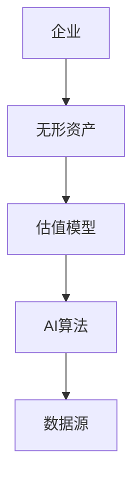
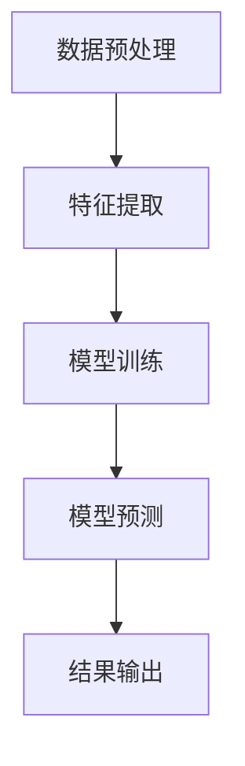
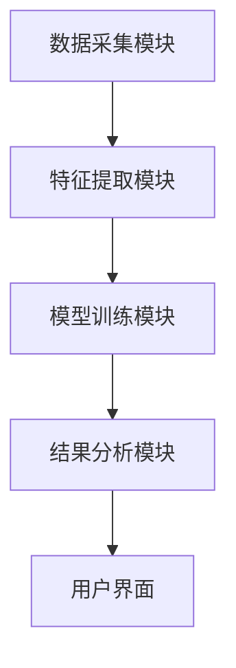

                 


```markdown
# AI辅助的企业无形资产估值

> 关键词：企业无形资产，人工智能，估值模型，机器学习，深度学习

> 摘要：本文探讨了利用人工智能技术辅助企业无形资产估值的方法，从传统估值方法的局限性出发，分析了AI技术在数据处理、模型构建和结果预测中的优势。通过详细讲解机器学习和深度学习算法的原理，结合实际案例和系统架构设计，展示了如何构建高效的AI辅助估值系统。文章最后总结了AI技术在企业无形资产估值中的应用前景和未来发展方向。

---

## 第1章: 企业无形资产与估值概述

### 1.1 企业无形资产的定义与分类
企业无形资产是指企业拥有或控制的，没有实物形态的长期资产，主要包括专利权、商标权、版权、商誉、特许经营权等。这些资产的价值往往难以直接量化，但它们对企业未来的盈利能力有着重要影响。

#### 1.1.1 无形资产的基本概念
- **定义**：无形资产是指企业拥有或控制的，能够为企业带来长期经济利益的非实物资产。
- **特征**：
  - 非实物性
  - 长期性
  - 可变性
- **分类**：
  - 知识产权类：专利权、商标权、版权
  - 商誉类：商誉、品牌价值
  - 其他类：特许经营权、客户关系

#### 1.1.2 无形资产的主要分类
- **知识产权类**：专利权、商标权、版权等，这些资产通常具有明确的法律保护，价值可以通过法律评估或市场交易确定。
- **商誉类**：商誉是企业整体价值的一部分，通常难以单独评估，但可以通过企业整体的盈利能力、市场份额等因素进行估算。
- **其他类**：如客户关系、分销网络等，这些资产的价值往往与企业的运营模式和市场拓展能力相关。

#### 1.1.3 无形资产的经济价值
无形资产的经济价值通常体现在对企业未来收益的贡献上。例如，专利权可以为企业带来技术优势，从而提高产品的市场竞争力；商标权可以增强品牌认知度，从而提升销售业绩。因此，准确评估无形资产的价值对于企业并购、融资等决策具有重要意义。

### 1.2 传统无形资产估值方法的局限性
传统无形资产估值方法主要包括成本法、市场法和收益法。然而，这些方法在实际应用中存在诸多局限性，尤其是在数据获取和处理方面。

#### 1.2.1 基于财务指标的传统估值方法
- **成本法**：基于无形资产的开发成本进行估值，这种方法忽略了资产的市场价值和未来收益潜力。
- **市场法**：通过比较类似资产的市场交易价格进行估值，这种方法需要有足够的可比交易数据，否则难以准确估算。
- **收益法**：基于资产未来预期收益的现值进行估值，这种方法需要对未来的收益进行准确预测，存在较大的不确定性。

#### 1.2.2 传统方法的局限性与不足
- **数据依赖性**：传统方法通常依赖于历史财务数据，难以充分利用企业的非结构化数据（如文本、图像等）。
- **主观性**：在缺乏可比交易的情况下，估值结果往往受到评估人员主观判断的影响。
- **动态性**：无形资产的价值往往受到市场环境、技术进步等因素的影响，传统方法难以及时反映这些变化。

#### 1.2.3 现代技术对企业估值的影响
随着大数据和人工智能技术的快速发展，企业无形资产的估值方法也在不断进步。AI技术可以通过分析海量数据，提取关键特征，构建更精确的估值模型。

### 1.3 AI辅助估值的必要性与优势
AI技术在企业无形资产估值中的应用，可以弥补传统方法的不足，提高估值的准确性和效率。

#### 1.3.1 AI技术在企业估值中的应用前景
- **数据处理能力**：AI技术可以处理大量结构化和非结构化数据，提取有用的特征，为估值提供更全面的信息。
- **模型构建能力**：通过机器学习和深度学习算法，AI可以构建复杂的估值模型，捕捉数据中的非线性关系。
- **实时性**：AI模型可以实时更新，适应市场环境的变化，提供动态估值。

#### 1.3.2 AI辅助估值的核心优势
- **数据驱动**：AI技术可以充分利用企业的历史数据和市场数据，构建数据驱动的估值模型。
- **自动化**：AI可以自动完成数据清洗、特征提取、模型训练等步骤，减少人工干预，提高效率。
- **可解释性**：通过模型的解释性，可以更好地理解无形资产的价值驱动因素。

#### 1.3.3 企业无形资产估值的未来趋势
- **智能化**：随着AI技术的不断发展，估值模型将更加智能化，能够自动适应市场变化。
- **多模态数据融合**：未来的估值模型将整合文本、图像、语音等多种数据源，提供更全面的估值结果。
- **个性化**：根据不同企业的特点，定制个性化的估值模型，提高估值的精准度。

### 1.4 本章小结
本章介绍了企业无形资产的定义、分类及其经济价值，分析了传统估值方法的局限性，提出了AI辅助估值的必要性与优势。通过AI技术，我们可以更准确地评估企业无形资产的价值，为企业决策提供有力支持。

---

## 第2章: AI技术在企业估值中的应用背景

### 2.1 人工智能技术的发展现状
人工智能技术近年来取得了长足的发展，特别是在自然语言处理、计算机视觉和机器学习领域。这些技术的应用已经渗透到企业估值的各个环节。

#### 2.1.1 人工智能技术的演进历程
- **早期阶段**：20世纪50年代至80年代，人工智能技术主要集中在专家系统和符号推理。
- **深度学习阶段**：2006年以来，深度学习技术的突破推动了AI的快速发展。
- **当前阶段**：AI技术已经广泛应用于各个领域，包括金融、医疗、教育等。

#### 2.1.2 当前主流AI技术的特点
- **数据驱动**：AI技术依赖于大量数据进行训练，模型的性能随着数据量的增加而提升。
- **算法复杂性**：深度学习算法（如神经网络、卷积神经网络等）具有较强的非线性建模能力。
- **计算能力**：高性能计算（HPC）和云计算技术的发展，为AI技术的应用提供了强大的支持。

#### 2.1.3 AI技术对企业估值的影响
- **提高效率**：AI技术可以快速处理大量数据，缩短估值周期。
- **提高准确性**：通过数据驱动的模型，AI可以更准确地预测资产价值。
- **降低成本**：自动化处理减少了人工成本，提高了企业的盈利能力。

### 2.2 企业无形资产估值的复杂性
企业无形资产的估值涉及多个方面，包括资产的法律状态、市场环境、企业战略等。这些因素使得估值过程复杂且具有挑战性。

#### 2.2.1 无形资产估值的关键挑战
- **数据获取难**：无形资产的评估往往缺乏公开的市场数据，难以获取足够的信息。
- **动态变化**：资产价值受到市场环境、技术进步等因素的影响，具有较强的动态性。
- **主观性**：估值过程中涉及较多的主观判断，尤其是在缺乏可比数据的情况下。

#### 2.2.2 数据驱动的估值需求
- **数据的重要性**：数据是AI技术的核心，高质量的数据是准确估值的基础。
- **数据的多样性**：企业需要整合多种类型的数据（如财务数据、市场数据、文本数据等）进行估值。
- **数据的实时性**：实时数据可以帮助模型更好地捕捉市场变化，提高估值的准确性。

#### 2.2.3 AI技术在数据处理中的作用
- **数据清洗**：AI技术可以自动清洗数据，去除噪声，提高数据质量。
- **特征提取**：通过自然语言处理和计算机视觉技术，AI可以从非结构化数据中提取有用特征。
- **数据融合**：AI可以将多种数据源进行融合，提供更全面的视角。

### 2.3 本章小结
本章分析了AI技术的发展现状及其在企业估值中的应用背景，探讨了企业无形资产估值的复杂性和数据驱动的需求。AI技术在数据处理和模型构建方面的优势，为解决估值问题提供了新的思路。

---

## 第3章: 企业无形资产估值的核心概念与联系

### 3.1 核心概念与原理
企业无形资产的估值涉及多个核心概念，包括资产量化指标、AI模型的特征提取、估值模型的构建逻辑等。

#### 3.1.1 无形资产的量化指标
- **收益指标**：如净利润、息税折旧前利润（EBIT）等。
- **市场指标**：如市盈率、市净率等。
- **风险指标**：如贝塔系数、标准差等。

#### 3.1.2 AI模型的特征提取
- **文本特征**：如品牌声誉、产品描述等。
- **市场特征**：如市场份额、竞争对手情况等。
- **财务特征**：如收入、利润、资产负债率等。

#### 3.1.3 估值模型的构建逻辑
- **数据准备**：收集和清洗数据，提取特征。
- **模型训练**：选择合适的算法，训练模型。
- **模型验证**：通过交叉验证等方法评估模型性能。
- **结果预测**：利用模型进行资产价值预测。

### 3.2 核心概念对比表
以下是不同估值方法的对比表：

| 估值方法 | 数据依赖性 | 主要特点 | 优点 | 局限性 |
|----------|------------|----------|------|--------|
| 成本法    | 高         | 基于历史成本 | 简单易懂 | 忽略市场价值 |
| 市场法    | 高         | 基于可比交易 | 结果较客观 | 需要有可比数据 |
| 收益法    | 中         | 基于未来收益 | 考虑时间价值 | 需要预测未来收益 |

### 3.3 实体关系图
以下是一个简单的实体关系图，展示了企业、无形资产、估值模型和AI算法之间的关系：



### 3.4 本章小结
本章详细阐述了企业无形资产估值的核心概念与原理，对比了不同估值方法的优缺点，并通过实体关系图展示了各概念之间的联系。这些内容为后续章节的分析奠定了基础。

---

## 第4章: AI辅助估值的算法原理

### 4.1 机器学习算法在估值中的应用
机器学习算法在企业无形资产估值中具有重要作用，可以用于特征提取、模型训练和结果预测。

#### 4.1.1 线性回归模型
线性回归是一种简单但有效的回归算法，适用于线性关系的场景。

- **损失函数**：
  $$ L = \sum_{i=1}^{n} (y_i - \hat{y}_i)^2 $$
  
- **优化方法**：最小二乘法。

#### 4.1.2 支持向量机模型
支持向量机（SVM）适用于小样本数据，可以处理高维数据。

- **损失函数**：支持向量机的目标是最小化间隔最大化。
- **优化方法**：使用拉格朗日乘数法。

#### 4.1.3 随机森林模型
随机森林是一种基于树的集成算法，适用于非线性关系的场景。

- **优势**：抗过拟合，适合高维数据。
- **实现**：通过集成多个决策树进行投票或平均。

### 4.2 深度学习算法在估值中的应用
深度学习算法在处理非结构化数据（如文本、图像）方面具有明显优势。

#### 4.2.1 神经网络模型
神经网络模型通过多层非线性变换，可以捕捉复杂的数据特征。

- **模型结构**：输入层、隐藏层、输出层。
- **激活函数**：如ReLU、sigmoid等。

#### 4.2.2 卷积神经网络模型
卷积神经网络（CNN）适用于图像数据的处理。

- **卷积层**：提取局部特征。
- **池化层**：降低维度，减少计算量。

#### 4.2.3 循环神经网络模型
循环神经网络（RNN）适用于序列数据的处理。

- **循环层**：处理时间序列数据。
- **长短时记忆网络（LSTM）**：解决梯度消失问题。

### 4.3 算法流程图
以下是一个典型的AI辅助估值算法流程图：



### 4.4 本章小结
本章详细介绍了机器学习和深度学习算法在企业无形资产估值中的应用，包括线性回归、支持向量机、随机森林、神经网络等算法的原理和实现。通过流程图展示了AI辅助估值的整体流程。

---

## 第5章: 估值模型的数学基础

### 5.1 回归模型的数学基础
回归模型是企业无形资产估值中常用的数学模型。

#### 5.1.1 线性回归
- **单变量线性回归**：
  $$ y = \beta_0 + \beta_1 x + \epsilon $$
  
- **多元线性回归**：
  $$ y = \beta_0 + \beta_1 x_1 + \beta_2 x_2 + \cdots + \beta_n x_n + \epsilon $$

#### 5.1.2 逻辑回归
逻辑回归适用于二分类问题。

- **sigmoid函数**：
  $$ P(y=1|x) = \frac{1}{1 + e^{- (\beta_0 + \beta_1 x)}} $$
  
- **损失函数**：
  $$ L = -\sum_{i=1}^{n} [y_i \ln(p_i) + (1 - y_i) \ln(1 - p_i)] $$

### 5.2 分类模型的数学基础
分类模型可以用于企业无形资产的分类估值。

#### 5.2.1 支持向量机
- **线性可分情况**：
  $$ y_i (w \cdot x_i + b) \geq 1 $$
  
- **软-margin情况**：
  $$ \xi_i = \max(0, 1 - y_i (w \cdot x_i + b)) $$

#### 5.2.2 随机森林
- **决策树**：每个决策树进行投票或平均。
- **袋装法**：通过 Bootstrap 样本来生成不同的树。

### 5.3 本章小结
本章通过数学公式详细介绍了回归模型和分类模型的数学基础，包括线性回归、逻辑回归、支持向量机和随机森林的原理和实现。这些模型为AI辅助估值提供了理论基础。

---

## 第6章: 系统架构设计与实现

### 6.1 系统设计背景与目标
本系统旨在利用AI技术辅助企业无形资产估值，提高估值的准确性和效率。

#### 6.1.1 系统功能需求
- 数据采集：收集企业财务数据、市场数据等。
- 特征提取：从数据中提取有用的特征。
- 模型训练：训练AI模型进行估值。
- 结果分析：输出估值结果并进行分析。

#### 6.1.2 系统设计目标
- 实现数据驱动的估值模型。
- 提供用户友好的界面。
- 支持多种数据源的接入。

### 6.2 系统架构设计
系统架构采用模块化设计，主要包括数据采集模块、特征提取模块、模型训练模块和结果分析模块。

#### 6.2.1 数据采集模块
- **功能**：从数据库、API等来源获取数据。
- **流程**：数据清洗、数据预处理。

#### 6.2.2 特征提取模块
- **功能**：从数据中提取特征。
- **流程**：文本特征提取、图像特征提取。

#### 6.2.3 模型训练模块
- **功能**：训练AI模型。
- **流程**：选择算法、调整参数、训练模型。

#### 6.2.4 结果分析模块
- **功能**：输出估值结果并进行分析。
- **流程**：结果可视化、结果解释。

### 6.3 系统架构图
以下是一个系统的架构图：



### 6.4 本章小结
本章详细描述了系统的设计背景与目标，提出了模块化的系统架构，并通过流程图展示了系统的整体结构。这些设计为后续的实现提供了指导。

---

## 第7章: 项目实战与案例分析

### 7.1 项目环境安装
- **Python**：安装Python 3.8及以上版本。
- **库的安装**：使用pip安装numpy、pandas、scikit-learn、tensorflow等库。

### 7.2 核心实现代码
以下是一个简单的AI辅助估值的Python代码示例：

```python
import numpy as np
from sklearn.linear_model import LinearRegression

# 示例数据
X = np.array([[1], [2], [3], [4]])
y = np.array([2, 4, 6, 8])

# 训练模型
model = LinearRegression()
model.fit(X, y)

# 预测
new_X = np.array([[5]])
predicted_y = model.predict(new_X)
print(predicted_y)  # 输出：[[10]]
```

### 7.3 代码实现与解读
- **数据预处理**：清洗和转换数据，提取特征。
- **模型训练**：选择合适的算法，训练模型。
- **结果预测**：利用模型进行估值。

### 7.4 案例分析
以某科技公司为例，分析其无形资产的估值过程。

- **数据收集**：收集公司的专利数量、品牌价值等数据。
- **特征提取**：提取关键特征，如专利数量、市场份额。
- **模型训练**：训练线性回归模型。
- **结果预测**：预测公司的无形资产价值。

### 7.5 本章小结
本章通过实际案例展示了AI辅助估值的实现过程，从环境安装到代码实现，再到案例分析，详细指导读者如何利用AI技术进行无形资产估值。

---

## 第8章: 最佳实践与未来展望

### 8.1 最佳实践
- **数据质量**：确保数据的准确性和完整性。
- **模型选择**：根据具体问题选择合适的算法。
- **结果解释**：通过模型的解释性，理解估值结果的驱动因素。

### 8.2 小结
AI辅助企业无形资产估值是一项具有挑战性的任务，需要结合企业的实际情况，选择合适的算法和模型。通过不断的优化和调整，可以提高估值的准确性和效率。

### 8.3 注意事项
- **数据隐私**：注意数据的安全和隐私保护。
- **模型更新**：定期更新模型，适应市场变化。
- **团队协作**：AI估值需要跨学科团队的协作。

### 8.4 拓展阅读
- **书籍推荐**：《Python机器学习》、《深度学习》。
- **论文推荐**：相关领域的最新研究论文。

### 8.5 本章小结
本章总结了AI辅助企业无形资产估值的最佳实践，提出了注意事项，并展望了未来的研究方向。通过不断的研究和实践，我们可以进一步提高AI在企业估值中的应用效果。

---

## 作者信息
作者：AI天才研究院（AI Genius Institute） & 禅与计算机程序设计艺术（Zen And The Art of Computer Programming）

---

**本文由AI天才研究院精心撰写，转载请注明出处。**
```

