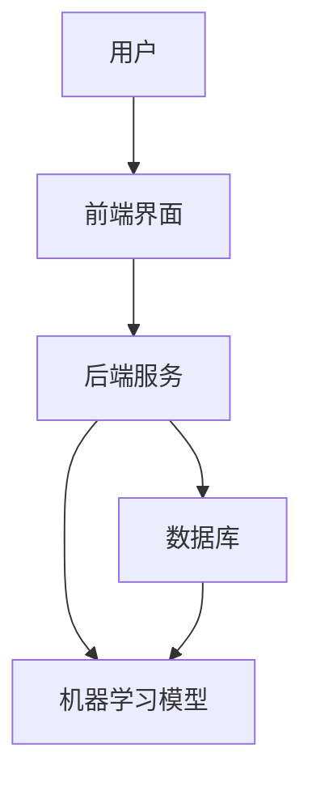

                 


# AI辅助的企业无形资产估值与管理

## 关键词：AI, 企业, 无形资产, 估值, 管理, 机器学习

## 摘要：本文探讨了AI在企业无形资产估值与管理中的应用，分析了传统方法的局限性，并介绍了基于机器学习的解决方案，涵盖数据处理、特征提取、模型构建及系统设计等关键步骤。

---

# 第一部分: 企业无形资产估值的背景与概述

## 第1章: 无形资产的基本概念与重要性

### 1.1 无形资产的定义与分类

#### 1.1.1 无形资产的定义
无形资产是指企业拥有或控制的没有实物形态的长期资产，主要包括专利权、商标权、商誉、特许经营权、客户关系等。

#### 1.1.2 无形资产的分类
1. **知识产权类**：如专利、商标、版权等。
2. **商誉类**：如企业并购形成的商誉。
3. **客户关系类**：如客户数据库、客户忠诚度等。
4. **技术类**：如技术诀窍、研发成果等。

### 1.2 无形资产在企业中的重要性

#### 1.2.1 无形资产对企业价值的影响
- 无形资产是企业核心竞争力的重要组成部分。
- 无形资产的价值往往决定了企业的市场地位和盈利能力。

#### 1.2.2 无形资产在企业融资与并购中的作用
- 无形资产是企业融资的重要依据。
- 无形资产在企业并购中占据重要地位，直接影响企业估值。

### 1.3 无形资产评估的挑战

#### 1.3.1 无形资产的不确定性
- 无形资产的价值受到市场、技术、法律等多方面因素的影响。
- 无形资产的评估结果具有较高的主观性。

#### 1.3.2 传统评估方法的局限性
- 传统评估方法依赖于财务数据和市场分析，难以全面反映无形资产的内在价值。
- 传统方法对数据的依赖性强，难以应对复杂多变的市场环境。

---

## 第2章: AI技术在企业无形资产估值中的应用

### 2.1 AI技术的基本概念

#### 2.1.1 人工智能的定义
人工智能是指计算机系统模拟人类智能的能力，包括学习、推理、自我改进等。

#### 2.1.2 AI在企业管理中的应用领域
- 数据分析与决策支持
- 供应链优化
- 客户关系管理
- 无形资产估值与管理

### 2.2 AI技术在无形资产估值中的优势

#### 2.2.1 数据处理能力
- AI能够处理大量非结构化数据，如文本、图像、视频等。
- AI可以提取数据中的隐藏信息，帮助评估无形资产的价值。

#### 2.2.2 模型构建能力
- AI可以通过机器学习算法构建预测模型，帮助评估无形资产的未来价值。
- AI可以实时更新模型，适应市场变化。

#### 2.2.3 高效性与准确性
- AI技术可以快速处理大量数据，提高评估效率。
- AI技术可以通过多次训练和优化，提高评估结果的准确性。

---

# 第二部分: 企业无形资产估值的核心概念与方法

## 第3章: 无形资产评估的框架与流程

### 3.1 无形资产评估的基本流程

#### 3.1.1 确定评估目标
- 明确评估的目的，如企业并购中的估值、融资中的资产价值评估等。

#### 3.1.2 数据收集与准备
- 收集与无形资产相关的数据，包括财务数据、市场数据、法律文件等。
- 数据清洗与预处理，确保数据的准确性和完整性。

#### 3.1.3 选择评估方法
- 根据评估目标和数据特点，选择合适的评估方法，如收益法、市场法、成本法等。

#### 3.1.4 评估与验证
- 进行评估计算，得出初步结果。
- 对评估结果进行验证，确保结果的合理性和准确性。

### 3.2 AI辅助无形资产评估的核心步骤

#### 3.2.1 数据采集与处理
- 通过多种渠道采集与无形资产相关的数据，如专利数据库、市场报告、竞争对手信息等。
- 使用自然语言处理（NLP）技术处理文本数据，提取关键词和主题。

#### 3.2.2 特征提取与分析
- 将数据转化为可计算的特征，如专利的数量、质量、技术领域分布等。
- 使用统计分析和机器学习方法，提取特征的重要性。

#### 3.2.3 模型构建与验证
- 基于机器学习算法构建评估模型，如随机森林、支持向量机（SVM）、神经网络等。
- 对模型进行训练和验证，确保模型的准确性和稳定性。

---

## 第4章: 基于机器学习的无形资产评估模型

### 4.1 机器学习在无形资产评估中的应用

#### 4.1.1 监督学习与非监督学习
- 监督学习：基于有标签的数据进行训练，如回归和分类任务。
- 非监督学习：基于无标签的数据进行聚类分析。

#### 4.1.2 常见机器学习算法的适用场景
- 线性回归：适用于简单的线性关系建模。
- 支持向量机（SVM）：适用于分类任务，尤其是高维数据。
- 随机森林：适用于特征重要性分析和非线性关系建模。

#### 4.1.3 深度学习在复杂场景中的应用
- 神经网络：适用于复杂非线性关系建模。
- 长短期记忆网络（LSTM）：适用于时间序列数据的建模。

### 4.2 基于神经网络的无形资产评估模型

#### 4.2.1 神经网络的基本原理
- 神经网络由多个层次构成，包括输入层、隐藏层和输出层。
- 神经网络通过反向传播算法进行训练，优化权重和偏置。

#### 4.2.2 LSTM网络在时间序列数据中的应用
- LSTM网络能够有效处理时间序列数据中的长距离依赖关系。
- LSTM网络在专利时间序列分析中表现优异。

#### 4.2.3 图神经网络在复杂关系中的应用
- 图神经网络能够处理复杂的网络关系，如专利之间的引用关系。
- 图神经网络在评估技术相关性方面具有优势。

---

## 第5章: 无形资产管理系统的设计与实现

### 5.1 系统设计的基本原则

#### 5.1.1 系统目标
- 提供一个智能化的无形资产管理平台，实现资产的全生命周期管理。
- 提供实时的资产评估和预测功能。

#### 5.1.2 系统功能模块
- 数据采集与管理模块：负责采集和存储无形资产相关数据。
- 特征提取与分析模块：对数据进行特征提取和分析，生成评估报告。
- 模型构建与评估模块：基于机器学习算法构建评估模型，进行实时评估。

### 5.2 系统架构设计

#### 5.2.1 系统架构图


#### 5.2.2 功能模块设计
- 用户可以通过前端界面提交评估请求。
- 后端服务接收请求，调用机器学习模型进行评估。
- 评估结果存储在数据库中，供后续查询和分析。

### 5.3 系统实现与优化

#### 5.3.1 环境配置
- 安装Python、TensorFlow、Keras等开发工具。
- 配置数据库环境，如MySQL或MongoDB。

#### 5.3.2 核心代码实现
```python
import numpy as np
from tensorflow.keras import layers

# 构建LSTM模型
model = Sequential()
model.add(layers.LSTM(64, input_shape=(timesteps, features)))
model.add(layers.Dense(1))
model.compile(optimizer='adam', loss='mean_squared_error')

# 训练模型
model.fit(X_train, y_train, epochs=100, batch_size=32)
```

#### 5.3.3 实验结果与分析
- 对比传统评估方法与AI辅助方法的评估结果，验证AI方法的优越性。
- 分析模型的准确性和稳定性，提出优化建议。

---

## 第6章: 项目实战与案例分析

### 6.1 项目背景介绍

#### 6.1.1 项目目标
- 开发一个基于AI的无形资产估值系统，应用于企业并购和融资。

#### 6.1.2 数据来源
- 数据来自公开的企业并购案例和专利数据库。

### 6.2 系统实现与代码解读

#### 6.2.1 环境配置
```bash
pip install numpy
pip install pandas
pip install tensorflow
pip install matplotlib
```

#### 6.2.2 核心代码实现
```python
import pandas as pd
from sklearn.ensemble import RandomForestRegressor

# 数据加载与预处理
data = pd.read_csv('intangible_assets.csv')
X = data.drop('value', axis=1)
y = data['value']

# 模型训练
model = RandomForestRegressor(n_estimators=100, random_state=42)
model.fit(X, y)

# 模型预测
new_assets = pd.read_csv('new_assets.csv')
predictions = model.predict(new_assets)
print("Predicted Values:", predictions)
```

#### 6.2.3 实验结果与分析
- 对比不同算法的评估结果，选择最优模型。
- 分析模型的准确性和稳定性，提出改进建议。

---

## 第7章: 总结与展望

### 7.1 总结

#### 7.1.1 本文的主要工作
- 探讨了AI技术在企业无形资产估值与管理中的应用。
- 提出了基于机器学习的评估模型和管理系统。

#### 7.1.2 本文的创新点
- 提出了结合机器学习和传统方法的混合评估模型。
- 构建了一个智能化的无形资产管理平台。

### 7.2 展望

#### 7.2.1 未来研究方向
- 探讨更先进的AI技术，如深度学习和强化学习在无形资产评估中的应用。
- 研究多模态数据的融合与分析，提升评估的准确性和全面性。

#### 7.2.2 实际应用中的注意事项
- 注意数据隐私和安全问题。
- 定期更新模型，适应市场变化。

---

# 结语

通过本文的探讨，我们看到AI技术在企业无形资产估值与管理中的巨大潜力。未来，随着AI技术的不断发展，相信在企业管理和决策中将发挥越来越重要的作用。

---

# 作者：AI天才研究院/AI Genius Institute & 禅与计算机程序设计艺术 /Zen And The Art of Computer Programming

