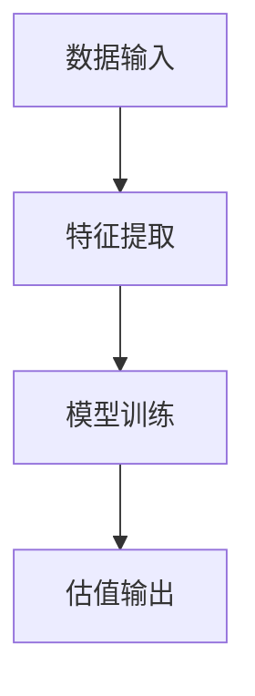
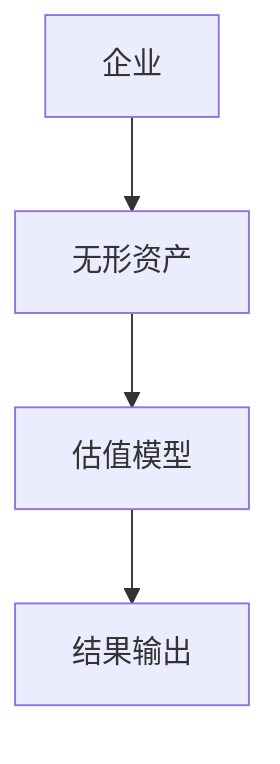
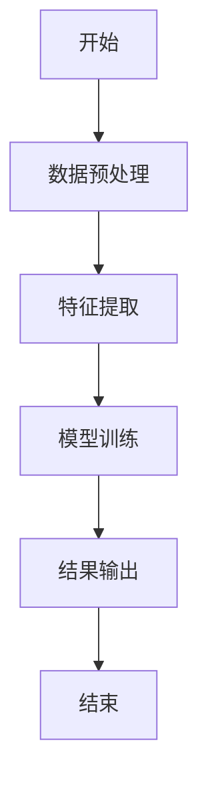
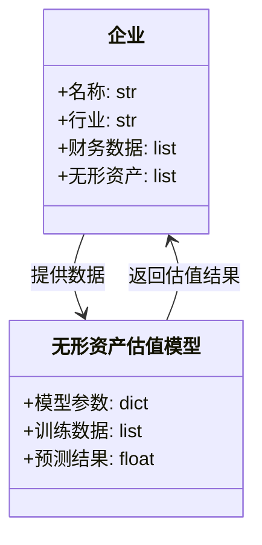
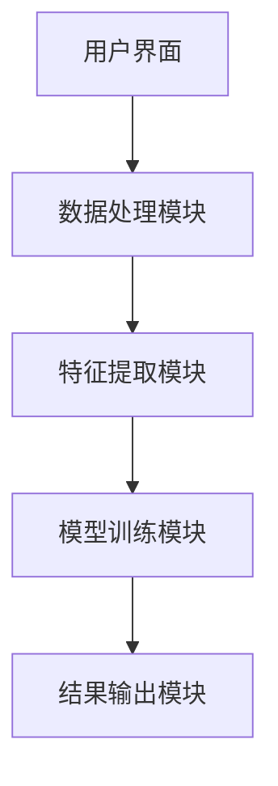
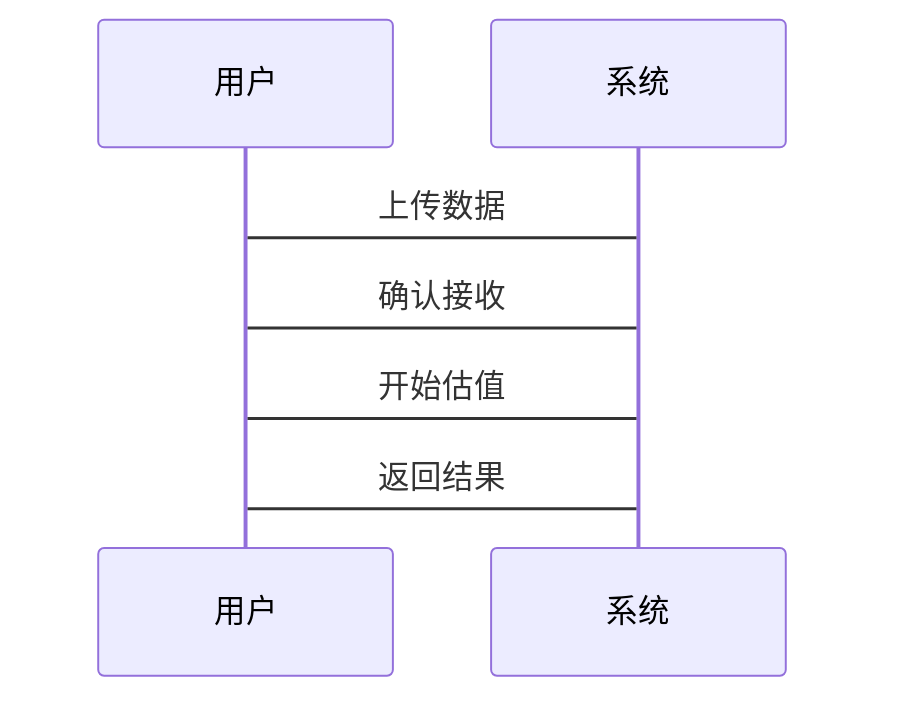

                 


# AI辅助的企业无形资产估值模型

## 关键词：AI、企业、无形资产、估值模型、机器学习、数据分析、企业价值

## 摘要：本文深入探讨了AI技术在企业无形资产估值中的应用，结合实际案例分析，详细讲解了从数据预处理、特征提取、模型训练到结果输出的完整流程。通过数学公式、mermaid图和Python代码的详细解读，帮助读者理解AI辅助企业无形资产估值的核心原理和实际应用。

---

# 第1章：企业无形资产估值的背景与挑战

## 1.1 无形资产的定义与特点
### 1.1.1 无形资产的定义
企业无形资产是指企业拥有或控制的没有实物形态的长期资产，主要包括专利权、商标权、商誉、特许经营权、著作权等。这些资产的价值往往难以直接量化，但对企业整体价值具有重要影响。

### 1.1.2 无形资产的主要特点
- **虚拟性**：无形资产没有实物形态，依赖于企业的声誉、技术或品牌。
- **依附性**：无形资产的价值往往依附于企业的运营能力和市场环境。
- **时间性**：无形资产的价值会随着时间推移而变化，受市场波动和技术进步的影响较大。

### 1.1.3 无形资产对企业价值的影响
无形资产是企业核心竞争力的重要组成部分，尤其是在高科技企业和创新型行业中，无形资产的价值占比通常超过有形资产。例如，苹果公司的品牌价值远超其硬件设备的制造成本。

## 1.2 传统无形资产估值方法的局限性
### 1.2.1 市场法的局限性
市场法基于类似资产的市场交易价格进行估值，但无形资产的交易数据往往稀缺，难以找到可比案例。

### 1.2.2 收益法的局限性
收益法依赖于未来现金流的预测，但无形资产的收益预测受市场环境和企业战略的影响较大，导致预测结果的不确定性较高。

### 1.2.3 成本法的局限性
成本法基于重置成本或历史成本进行估值，但无形资产的成本往往难以准确计量，且无法反映其未来经济价值。

## 1.3 AI技术在无形资产估值中的应用前景
### 1.3.1 AI技术的基本原理
人工智能通过机器学习算法，从大量数据中提取特征，建立数学模型，实现对无形资产价值的自动化评估。

### 1.3.2 AI技术在估值中的优势
- **数据驱动**：AI能够处理海量数据，发现传统方法难以捕捉的隐性关联。
- **动态调整**：AI模型可以实时更新，适应市场环境的变化。
- **高精度**：通过深度学习算法，AI能够显著提高估值的准确性。

### 1.3.3 未来发展趋势
随着AI技术的不断进步，企业无形资产估值将更加智能化、自动化和精准化，尤其是在大数据和云计算的支持下，AI将为企业价值评估提供更强大的工具。

---

# 第2章：AI辅助企业无形资产估值的核心概念与联系

## 2.1 核心概念的定义与属性
### 2.1.1 数据特征
- **特征提取**：从企业财务数据、市场数据、行业数据中提取关键特征，如收入增长率、利润率、研发投入占比等。
- **数据清洗**：去除噪声数据，确保数据的准确性和完整性。

### 2.1.2 模型特征
- **模型结构**：选择适合的机器学习模型，如随机森林、支持向量机（SVM）或神经网络。
- **模型参数**：调整模型参数，优化模型性能。

### 2.1.3 估值特征
- **估值范围**：确定估值的上下限，提供区间范围。
- **估值精度**：通过交叉验证，评估模型的预测精度。

## 2.2 核心概念的联系与对比
### 2.2.1 数据与模型的关系
数据是模型的输入，模型通过数据提取特征，输出估值结果。两者相辅相成，共同决定估值的准确性。

### 2.2.2 模型与估值的关系
模型是实现估值的核心工具，估值结果是模型输出的最终目标。

### 2.2.3 数据、模型与估值的对比表格

| 特征 | 数据 | 模型 | 估值 |
|------|------|------|------|
| 类型 | 数值型、文本型 | 算法、结构 | 数值型 |
| 作用 | 提供输入 | 实现预测 | 输出结果 |
| 关系 | 数据驱动 | 模型处理 | 结果呈现 |

## 2.3 模型架构与ER实体关系图
### 2.3.1 模型架构图


### 2.3.2 实体关系图


---

# 第3章：AI辅助企业无形资产估值的算法原理

## 3.1 算法原理概述
### 3.1.1 算法的基本原理
AI辅助估值的核心是通过机器学习算法，从企业历史数据中学习特征，建立预测模型，输出估值结果。

### 3.1.2 算法的核心思想
- **特征提取**：通过主成分分析（PCA）或Lasso回归，从数据中提取关键特征。
- **模型训练**：使用监督学习算法（如随机森林、梯度提升树）进行模型训练。
- **结果预测**：基于训练好的模型，输入新的数据，输出估值结果。

### 3.1.3 算法的实现步骤
1. 数据预处理：清洗数据，处理缺失值，标准化特征。
2. 特征提取：选择关键特征，降低维度。
3. 模型训练：使用训练数据，训练模型。
4. 模型评估：通过交叉验证，评估模型性能。
5. 结果预测：输入新数据，输出估值结果。

## 3.2 算法流程图


## 3.3 算法实现代码
```python
import pandas as pd
from sklearn.ensemble import RandomForestRegressor
from sklearn.model_selection import train_test_split
from sklearn.metrics import mean_squared_error

# 数据预处理
data = pd.read_csv('enterprise_data.csv')
data = data.dropna()  # 删除缺失值
data = (data - data.mean()) / data.std()  # 标准化

# 特征提取
features = data.columns[:-1]
target = data.columns[-1]

# 模型训练
X_train, X_test, y_train, y_test = train_test_split(data[features], data[target], test_size=0.2)

model = RandomForestRegressor(n_estimators=100, random_state=42)
model.fit(X_train, y_train)

# 模型评估
y_pred = model.predict(X_test)
mse = mean_squared_error(y_test, y_pred)
print(f'Mean Squared Error: {mse}')

# 结果预测
new_data = pd.DataFrame([X_test.iloc[0]])
print(f'预测结果: {model.predict(new_data)}')
```

---

# 第4章：系统分析与架构设计方案

## 4.1 问题场景介绍
我们设计一个AI辅助企业无形资产估值系统，旨在通过机器学习算法，帮助企业快速、准确地评估无形资产价值。

## 4.2 项目介绍
系统包括数据输入、特征提取、模型训练和结果输出四个模块，支持用户上传数据，选择模型，查看估值结果。

## 4.3 系统功能设计
### 4.3.1 领域模型


### 4.3.2 系统架构设计


### 4.3.3 系统接口设计
- **输入接口**：支持CSV格式数据上传。
- **输出接口**：提供JSON格式的估值结果。

### 4.3.4 系统交互


---

# 第5章：项目实战

## 5.1 环境安装
- 安装Python和必要的库（如pandas、scikit-learn）。
- 安装Jupyter Notebook用于代码实现。

## 5.2 核心代码实现
```python
import pandas as pd
from sklearn.ensemble import RandomForestRegressor
from sklearn.model_selection import train_test_split
from sklearn.metrics import mean_squared_error

# 数据预处理
data = pd.read_csv('enterprise_data.csv')
data = data.dropna()  # 删除缺失值
data = (data - data.mean()) / data.std()  # 标准化

# 特征提取
features = data.columns[:-1]
target = data.columns[-1]

# 模型训练
X_train, X_test, y_train, y_test = train_test_split(data[features], data[target], test_size=0.2)

model = RandomForestRegressor(n_estimators=100, random_state=42)
model.fit(X_train, y_train)

# 模型评估
y_pred = model.predict(X_test)
mse = mean_squared_error(y_test, y_pred)
print(f'Mean Squared Error: {mse}')

# 结果预测
new_data = pd.DataFrame([X_test.iloc[0]])
print(f'预测结果: {model.predict(new_data)}')
```

## 5.3 案例分析
以某科技公司为例，输入其财务数据和市场数据，通过模型预测其无形资产价值。

---

# 第6章：最佳实践与总结

## 6.1 最佳实践
- **数据质量**：确保数据的准确性和完整性，避免噪声干扰。
- **模型选择**：根据数据特征选择合适的算法，避免过拟合。
- **结果验证**：通过交叉验证和实际案例验证模型的准确性。

## 6.2 小结
本文详细介绍了AI技术在企业无形资产估值中的应用，从数据预处理、特征提取、模型训练到结果输出，完整展示了AI辅助估值的核心流程。

## 6.3 注意事项
- 无形资产的估值结果仅供参考，实际操作中需结合企业具体情况。
- 模型的性能受数据质量和算法选择的影响，需持续优化。

## 6.4 拓展阅读
- 《机器学习实战》
- 《Python机器学习》
- 《企业价值评估》

---

# 作者：AI天才研究院 & 禅与计算机程序设计艺术

