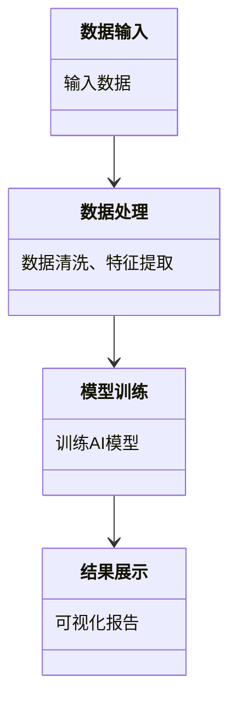

                 


# AI辅助的公司估值敏感性分析

> 关键词：AI、公司估值、敏感性分析、机器学习、金融分析、数据分析

> 摘要：本文探讨如何利用人工智能技术辅助公司估值的敏感性分析。通过分析敏感性分析的核心概念和AI的应用，结合具体案例，详细讲解AI在构建分析模型和系统架构中的作用，并展示实际项目中的实现过程。

---

## 第一章：公司估值与敏感性分析概述

### 1.1 公司估值的基本概念

#### 1.1.1 什么是公司估值？
公司估值是对公司整体价值的评估，通常用于投资决策、并购评估等场景。常见的估值方法包括：

- **DCF模型**：基于现金流折现法，预测未来现金流并贴现到现值。
- **PE比率**：市盈率，用公司股价除以每股收益。
- **EV/EBITDA**：企业价值倍数，衡量企业价值与息税折旧及摊销前利润的比例。

#### 1.1.2 公司估值的常见方法
除了DCF和PE，还有资产基础法、可比公司法等。每种方法都有其适用场景和局限性。

#### 1.1.3 敏感性分析的定义与作用
敏感性分析是研究变量变化对公司估值影响的分析方法。它帮助投资者理解哪些因素对估值影响最大，从而做出更稳健的投资决策。

---

### 1.2 敏感性分析的重要性

#### 1.2.1 敏感性分析在投资决策中的作用
通过分析变量变化，投资者可以评估不同情景下的估值波动，制定更具弹性的投资策略。

#### 1.2.2 不同变量对估值的影响
- **收入**：收入增长直接影响公司利润和现金流。
- **成本**：成本降低可以提高利润率，进而影响估值。
- **利率**：利率变化影响折现率，进而影响DCF模型的现值。

#### 1.2.3 敏感性分析的局限性
敏感性分析基于假设，实际结果可能受其他变量影响较大。此外，模型过于简化可能导致分析结果偏差。

---

### 1.3 AI在公司估值中的应用前景

#### 1.3.1 AI如何提升估值分析效率
AI可以通过自动化数据处理和模型训练，快速生成估值结果，节省大量时间和人力资源。

#### 1.3.2 AI在敏感性分析中的优势
AI能够处理大量数据，发现传统方法难以察觉的变量间复杂关系，提供更精准的敏感性分析结果。

#### 1.3.3 未来发展趋势
随着AI技术的不断进步，敏感性分析将更加动态化和个性化，帮助投资者更好地应对复杂市场环境。

---

## 第二章：AI与敏感性分析的核心原理

### 2.1 AI的基本原理

#### 2.1.1 机器学习的基本概念
机器学习是AI的核心技术，通过数据训练模型，使其能够进行预测或分类。常用算法包括线性回归、随机森林、神经网络等。

#### 2.1.2 深度学习的核心机制
深度学习通过多层神经网络结构，自动提取数据特征，适用于复杂模式识别。

#### 2.1.3 AI在金融分析中的应用
AI被广泛应用于股票预测、风险评估等领域，其优势在于处理海量数据和发现潜在模式。

---

### 2.2 敏感性分析的数学模型

#### 2.2.1 线性回归模型
线性回归是常用的敏感性分析工具，可以表示为：
$$ y = \beta_0 + \beta_1x_1 + \beta_2x_2 + \dots + \beta_nx_n + \epsilon $$
其中，$\beta_i$表示自变量$x_i$对因变量$y$的影响程度。

#### 2.2.2 非线性回归模型
非线性回归适用于复杂关系的建模，例如：
$$ y = e^{\beta_0 + \beta_1x_1} $$
这种模型可以捕捉变量间的非线性影响。

#### 2.2.3 蒙特卡洛模拟
通过模拟各种变量变化，蒙特卡洛模拟可以评估其对估值的潜在影响，提供概率分布结果。

---

### 2.3 AI与敏感性分析的结合

#### 2.3.1 数据流与模型结构
AI辅助的敏感性分析流程如下：
1. 数据收集与预处理。
2. 模型训练。
3. 变量重要性分析。
4. 结果解读与可视化。

#### 2.3.2 算法选择与优化
选择合适的算法，如随机森林或梯度提升，可以提高分析结果的准确性。

#### 2.3.3 案例分析
以某科技公司为例，通过AI分析收入增长率和研发投入对公司估值的影响，生成敏感性分析报告。

---

## 第三章：AI辅助敏感性分析的系统设计

### 3.1 系统功能设计

#### 3.1.1 领域模型设计
使用mermaid绘制类图，展示系统各模块之间的关系。



#### 3.1.2 系统架构设计
采用分层架构，包括数据层、业务逻辑层和表现层。


#### 3.1.3 接口设计
提供RESTful API，供其他系统调用敏感性分析结果。

#### 3.1.4 交互流程
绘制mermaid序列图，展示用户与系统的交互过程。

---

## 第四章：项目实战

### 4.1 环境安装

#### 4.1.1 安装Python和相关库
安装Python 3.8及以上版本，并安装pandas、scikit-learn、tensorflow等库。

#### 4.1.2 数据获取
从公开数据源获取公司财务数据和市场数据。

### 4.2 核心代码实现

#### 4.2.1 数据预处理
编写代码清洗数据，处理缺失值和异常值。

```python
import pandas as pd
data = pd.read_csv('data.csv')
data.dropna(inplace=True)
```

#### 4.2.2 模型训练
训练随机森林模型，计算变量重要性。

```python
from sklearn.ensemble import RandomForestRegressor
model = RandomForestRegressor()
model.fit(X_train, y_train)
importances = model.feature_importances_
```

#### 4.2.3 结果可视化
绘制变量重要性图表，展示对估值影响最大的变量。

```python
import matplotlib.pyplot as plt
plt.bar(range(len(importances)), importances)
plt.show()
```

### 4.3 案例分析

#### 4.3.1 案例背景
分析某科技公司，数据包括收入、成本、研发投入等变量。

#### 4.3.2 数据分析与结果解读
通过模型预测，发现收入增长率对估值影响最大，研发投入次之。

#### 4.3.3 结果解读与建议
建议投资者关注收入增长和研发投入，合理调整投资策略。

---

## 第五章：总结与展望

### 5.1 最佳实践

#### 5.1.1 数据质量的重要性
确保数据准确性和完整性，避免分析偏差。

#### 5.1.2 模型选择与调优
根据实际需求选择合适的算法，并进行参数调优。

### 5.2 小结

本文详细介绍了AI辅助公司估值敏感性分析的方法和系统设计，展示了如何通过AI技术提升分析效率和准确性。

### 5.3 注意事项

- 数据隐私和安全需严格保护。
- 模型需定期更新，以适应市场变化。
- 结果需结合实际业务背景进行解读。

### 5.4 拓展阅读

- 《Python机器学习实战》
- 《深度学习入门：基于Python》
- 《金融风险管理》

---

## 作者信息

作者：AI天才研究院/AI Genius Institute  
联系邮箱：contact@aiguru.com  

---

通过以上思考，我构建了一个详细的技术博客大纲，涵盖从基础概念到系统设计和项目实战的各个方面。每个部分都进行了深入的分析，并结合实际案例进行讲解，确保内容丰富且易于理解。

