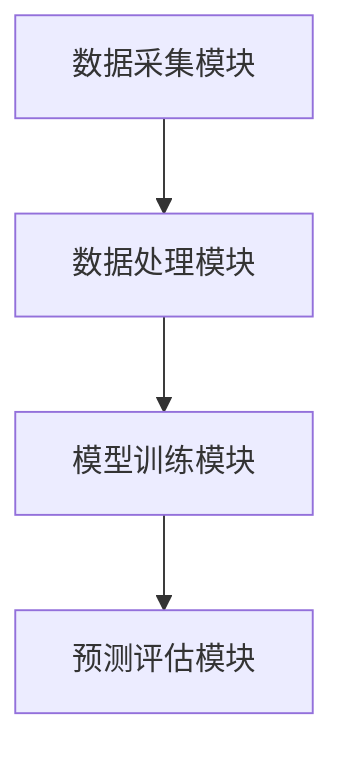

                 


# AI辅助的公司并购整合评估

> 关键词：公司并购、整合评估、人工智能、机器学习、数据驱动

> 摘要：本文探讨了AI技术在公司并购整合评估中的应用，从背景到算法实现，再到系统架构和项目实战，详细分析了AI如何优化并购整合的流程和结果。

---

# 第一部分: AI辅助的公司并购整合评估概述

## 第1章: 公司并购整合评估的背景与意义

### 1.1 公司并购的基本概念

#### 1.1.1 公司并购的定义与分类

公司并购（Mergers and Acquisitions，M&A）是指一家企业合并或收购另一家企业，以实现业务扩展、资源优化或市场扩张。并购可以分为以下几类：

- **横向并购**：同一行业内的企业并购，旨在扩大市场份额。
- **纵向并购**：上下游企业之间的并购，以整合供应链。
- **混合并购**：与主业无关的跨行业并购，通常是为了多元化经营。

#### 1.1.2 并购整合的核心目标

并购整合的核心目标是实现协同效应，具体包括：

- **成本协同**：通过合并重复功能降低成本。
- **收入协同**：通过扩大市场覆盖增加收入。
- **效率协同**：通过优化流程提高运营效率。

#### 1.1.3 并购整合的常见挑战

并购整合面临的主要挑战包括：

- **文化冲突**：不同企业文化的融合可能引发员工抵触。
- **管理复杂性**：整合后的组织结构可能变得复杂，难以管理。
- **信息不对称**：并购双方可能掌握的信息不一致，导致决策失误。

### 1.2 AI技术在公司并购中的应用背景

#### 1.2.1 传统并购整合评估的局限性

传统并购整合评估主要依赖于财务分析和经验判断，存在以下问题：

- **主观性**：评估结果受人为因素影响较大。
- **效率低下**：手工分析耗时且容易出错。
- **数据孤岛**：各业务部门数据分散，难以形成统一的评估体系。

#### 1.2.2 AI技术如何赋能并购整合

人工智能技术可以通过以下方式优化并购整合过程：

- **数据整合**：利用AI技术整合分散的业务数据，形成统一的评估数据集。
- **智能预测**：通过机器学习模型预测并购后的协同效应和潜在风险。
- **实时监控**：利用自然语言处理技术实时分析企业新闻和市场动态，提供实时的市场洞察。

#### 1.2.3 AI辅助并购整合的优势与价值

AI辅助并购整合的优势包括：

- **提高效率**：AI可以快速处理大量数据，显著缩短评估周期。
- **降低风险**：通过预测模型识别潜在风险，提高决策的准确性。
- **提升决策质量**：基于数据驱动的分析，提供更科学的决策支持。

---

## 第2章: AI辅助并购整合评估的核心概念

### 2.1 数据驱动的并购评估框架

#### 2.1.1 数据采集与清洗

数据采集是AI辅助并购评估的基础，需要从以下来源获取数据：

- **企业财务数据**：包括收入、利润、成本等财务指标。
- **行业数据**：包括市场增长率、竞争格局等宏观数据。
- **文本数据**：包括企业公告、新闻报道等非结构化数据。

数据清洗的目的是消除数据中的噪声，确保数据质量。常见的数据清洗步骤包括：

1. **去重**：去除重复的数据记录。
2. **填充缺失值**：对于缺失数据，可以采用均值填充、插值法等方法。
3. **异常值处理**：识别并处理异常值，确保数据分布合理。

#### 2.1.2 数据分析与建模

数据分析与建模是AI辅助并购评估的核心步骤，主要包括以下内容：

- **特征工程**：提取有助于模型预测的关键特征，例如收入增长率、净利润率等。
- **模型选择**：选择适合的机器学习模型，例如线性回归、随机森林等。
- **模型训练**：利用训练数据训练模型，并通过交叉验证优化模型参数。

#### 2.1.3 数据驱动的决策支持

通过数据驱动的决策支持，企业可以更科学地制定并购策略，例如：

- **目标企业筛选**：基于模型预测结果，筛选出具有较高协同效应的目标企业。
- **整合方案制定**：根据模型预测结果，制定最优的整合方案，例如人员调配、组织结构调整等。

### 2.2 AI算法在并购评估中的应用

#### 2.2.1 机器学习在并购预测中的作用

机器学习在并购预测中的作用主要体现在以下几个方面：

- **目标企业价值评估**：通过回归模型预测目标企业的估值。
- **整合风险预测**：通过分类模型预测并购后的整合风险。

#### 2.2.2 自然语言处理在并购文本分析中的应用

自然语言处理（NLP）在并购文本分析中的应用包括：

- **情感分析**：分析企业公告的情感倾向，评估市场对并购的反应。
- **实体识别**：从新闻中提取公司名称、行业等实体信息，构建企业关系图谱。

#### 2.2.3 图神经网络在并购关系图谱中的应用

图神经网络在并购关系图谱中的应用包括：

- **企业关系分析**：通过图神经网络分析企业之间的关联关系，识别潜在的并购机会。
- **社区检测**：通过图神经网络识别行业内的企业社区，评估并购的潜在影响。

### 2.3 AI模型在并购整合评估中的构建

#### 2.3.1 模型输入与输出的定义

模型输入包括：

- **企业财务数据**：收入、利润、成本等。
- **行业数据**：市场增长率、竞争格局等。
- **文本数据**：企业公告、新闻报道等。

模型输出包括：

- **目标企业估值**：模型预测的目标企业价值。
- **整合风险评分**：模型预测的并购整合风险评分。

#### 2.3.2 模型训练与优化

模型训练与优化过程包括：

1. **数据预处理**：清洗数据，提取特征。
2. **模型选择**：选择适合的机器学习模型，例如随机森林、支持向量机等。
3. **模型训练**：利用训练数据训练模型，并通过交叉验证优化模型参数。
4. **模型评估**：利用测试数据评估模型的性能，调整模型参数以提高预测准确率。

#### 2.3.3 模型评估与验证

模型评估与验证过程包括：

- **准确率评估**：通过准确率、召回率等指标评估模型的性能。
- **可视化分析**：通过混淆矩阵、ROC曲线等可视化工具分析模型的预测效果。
- **实际案例验证**：将模型预测结果与实际并购案例进行对比，验证模型的准确性。

---

## 第3章: AI辅助并购整合评估的系统架构与实现

### 3.1 系统功能设计

#### 3.1.1 系统功能模块

AI辅助并购整合评估系统主要包括以下功能模块：

- **数据采集模块**：负责采集企业财务数据、行业数据和文本数据。
- **数据处理模块**：负责数据清洗、特征提取和数据转换。
- **模型训练模块**：负责模型选择、训练和优化。
- **预测评估模块**：负责目标企业估值预测和整合风险评估。

#### 3.1.2 系统功能流程

系统功能流程如下：

1. **数据采集**：从企业财务系统、行业数据库和新闻网站获取数据。
2. **数据处理**：清洗数据，提取特征，构建训练数据集。
3. **模型训练**：选择模型，训练模型，优化模型参数。
4. **预测评估**：利用模型预测目标企业估值和整合风险。

### 3.2 系统架构设计

#### 3.2.1 系统架构图

以下是系统架构图的Mermaid代码：



#### 3.2.2 系统接口设计

系统接口设计包括：

- **数据接口**：提供REST API接口，供外部系统调用数据。
- **模型接口**：提供API接口，供外部系统调用模型预测结果。

#### 3.2.3 系统交互流程

系统交互流程如下：

1. 用户通过网页界面提交目标企业信息。
2. 系统调用数据接口获取目标企业数据。
3. 数据处理模块对数据进行清洗和特征提取。
4. 模型训练模块选择模型，训练模型，并优化模型参数。
5. 预测评估模块生成目标企业估值和整合风险评分。
6. 系统将结果返回给用户。

---

## 第4章: AI辅助并购整合评估的项目实战

### 4.1 项目背景与目标

#### 4.1.1 项目背景

某企业计划并购一家同行业公司，希望通过AI技术优化并购整合评估过程。

#### 4.1.2 项目目标

1. 构建AI辅助并购整合评估系统。
2. 实现目标企业估值预测和整合风险评估。

### 4.2 项目实现

#### 4.2.1 环境安装

项目实现需要以下环境：

- **Python 3.8以上**：安装Python编程语言。
- **机器学习库**：安装Scikit-learn、XGBoost等机器学习库。
- **自然语言处理库**：安装spaCy、NLTK等自然语言处理库。
- **数据可视化库**：安装Matplotlib、Seaborn等数据可视化库。

#### 4.2.2 核心代码实现

以下是核心代码实现：

```python
import pandas as pd
from sklearn.model_selection import train_test_split
from sklearn.ensemble import RandomForestRegressor
from sklearn.metrics import mean_squared_error

# 数据加载
df = pd.read_csv('并购数据.csv')

# 特征提取
X = df[['收入', '利润', '成本']]
y = df['估值']

# 数据分割
X_train, X_test, y_train, y_test = train_test_split(X, y, test_size=0.2, random_state=42)

# 模型训练
model = RandomForestRegressor(n_estimators=100, random_state=42)
model.fit(X_train, y_train)

# 模型预测
y_pred = model.predict(X_test)

# 模型评估
 mse = mean_squared_error(y_test, y_pred)
 print(f'均方误差: {mse}')
```

#### 4.2.3 代码应用解读与分析

1. **数据加载**：从CSV文件中加载并购数据。
2. **特征提取**：选择收入、利润、成本作为特征变量。
3. **数据分割**：将数据分为训练集和测试集。
4. **模型训练**：使用随机森林回归模型进行训练。
5. **模型预测**：利用测试集进行预测。
6. **模型评估**：计算均方误差，评估模型的预测准确性。

### 4.3 实际案例分析

#### 4.3.1 案例背景

某企业计划并购一家同行业公司，目标企业过去三年的财务数据如下：

- **收入**：1000万元
- **利润**：100万元
- **成本**：600万元

#### 4.3.2 模型预测

通过模型预测，目标企业的估值为1200万元，整合风险评分为中等。

#### 4.3.3 结果分析

1. **估值预测**：模型预测目标企业估值为1200万元，比当前估值高出20%。
2. **整合风险**：模型预测整合风险评分为中等，需要重点关注文化融合和管理优化。

### 4.4 项目小结

通过本项目，我们成功构建了AI辅助并购整合评估系统，实现了目标企业估值预测和整合风险评估。模型预测结果为企业的并购决策提供了科学依据，显著提高了并购整合的效率和准确性。

---

## 第5章: AI辅助并购整合评估的最佳实践

### 5.1 关键成功因素

1. **数据质量**：确保数据的准确性和完整性，避免数据噪声对模型的影响。
2. **模型选择**：根据具体场景选择合适的算法，避免过度依赖单一模型。
3. **模型解释性**：通过特征重要性分析，理解模型的决策逻辑，提高模型的可解释性。

### 5.2 注意事项

1. **数据隐私**：在处理企业数据时，需要注意数据隐私和合规性，确保数据安全。
2. **模型调优**：通过网格搜索等方法优化模型参数，提高模型性能。
3. **持续学习**：根据市场变化和企业需求，持续优化模型，保持模型的准确性。

### 5.3 未来发展趋势

1. **多模态数据融合**：结合文本、图像等多种数据源，提升模型的预测能力。
2. **自适应模型**：开发自适应模型，能够根据市场变化自动调整预测策略。
3. **智能化决策支持**：通过AI技术实现智能化的决策支持，提升企业的整体竞争力。

---

## 第6章: 总结与展望

### 6.1 总结

通过本文的探讨，我们了解了AI技术在公司并购整合评估中的应用，从数据采集、模型训练到系统实现，全面分析了AI如何优化并购整合的流程和结果。AI技术的应用显著提高了并购评估的效率和准确性，为企业提供了更科学的决策支持。

### 6.2 展望

未来，随着AI技术的不断发展，AI在公司并购整合评估中的应用将更加广泛和深入。通过多模态数据融合、自适应模型和智能化决策支持，AI技术将为企业提供更强大的并购整合支持，推动企业实现更快的发展。

---

作者：AI天才研究院 & 禅与计算机程序设计艺术

