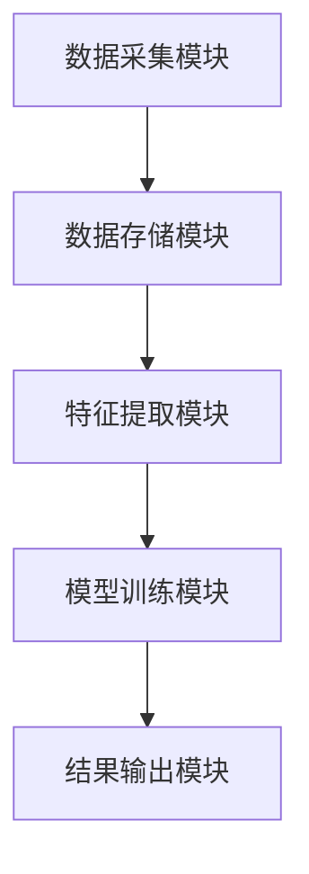
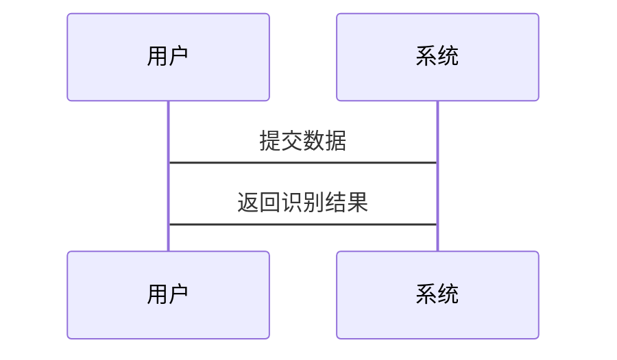

                 


# AI辅助的公司治理缺陷识别系统

## 关键词：AI, 公司治理, 缺陷识别, 监督学习, 无监督学习, 系统架构, 项目实战

## 摘要：  
本文探讨了AI技术在公司治理缺陷识别中的应用，从背景、概念、算法、系统架构到项目实战，详细阐述了如何利用AI技术提升公司治理的效率和准确性。文章通过具体案例分析和代码实现，深入探讨了AI辅助公司治理缺陷识别的核心技术和实践应用。

---

## 第1章: AI辅助公司治理缺陷识别系统概述

### 1.1 公司治理的基本概念  
#### 1.1.1 公司治理的定义  
公司治理是通过公司章程、董事会、管理层和股东之间的关系，确保公司高效运作和合规经营的过程。  

#### 1.1.2 公司治理的核心要素  
- **董事会结构**：董事会的组成和职责。  
- **股权结构**：股东的权益和控制权。  
- **内部控制**：公司内部的监督和风险管理机制。  
- **合规性**：公司是否遵守相关法律法规。  

#### 1.1.3 公司治理的常见问题  
- **信息披露不完整**：可能导致投资者决策失误。  
- **关联交易不透明**：可能损害公司利益。  
- **内部监督不足**：可能导致舞弊和管理混乱。  

### 1.2 AI在公司治理中的作用  
#### 1.2.1 AI技术在公司治理中的应用领域  
- **风险预警**：通过数据分析识别潜在风险。  
- **合规性检查**：自动检测公司是否符合相关法规。  
- **决策支持**：利用AI辅助董事会和管理层做出更明智的决策。  

#### 1.2.2 AI辅助公司治理的优势  
- **高效性**：AI能够快速处理大量数据，提高工作效率。  
- **准确性**：通过机器学习算法，AI能够识别复杂模式，提高判断的准确性。  
- **实时性**：AI系统可以实时监控公司运营状况，及时发现问题。  

#### 1.2.3 AI辅助公司治理的挑战  
- **数据隐私**：处理公司敏感数据时需要考虑隐私保护。  
- **算法解释性**：复杂的AI模型可能难以解释其决策过程。  
- **技术门槛**：需要专业团队开发和维护AI系统。  

### 1.3 公司治理缺陷识别系统的基本结构  
#### 1.3.1 系统的基本组成  
- **数据采集模块**：收集公司治理相关的数据。  
- **特征提取模块**：从数据中提取关键特征。  
- **模型训练模块**：利用机器学习算法训练缺陷识别模型。  
- **结果输出模块**：展示识别出的缺陷及其优先级。  

#### 1.3.2 系统的功能模块  
- **数据预处理**：清洗和标准化数据。  
- **模型选择**：根据具体问题选择合适的算法。  
- **模型评估**：通过测试数据评估模型的性能。  
- **结果可视化**：以图表形式展示识别出的缺陷。  

#### 1.3.3 系统的输入输出  
- **输入**：公司治理相关的数据，如财务报表、董事会决议、关联交易记录等。  
- **输出**：识别出的缺陷列表，包括缺陷类型、严重程度和建议的解决方案。  

### 1.4 本章小结  
本章介绍了公司治理的基本概念、AI在公司治理中的作用以及缺陷识别系统的结构。通过这些内容，读者可以理解AI辅助公司治理缺陷识别的背景和基本框架。

---

## 第2章: 缺陷识别的核心概念  

### 2.1 缺陷识别的基本原理  
#### 2.1.1 缺陷识别的定义  
缺陷识别是指通过分析数据，发现公司治理中的潜在问题或异常情况。  

#### 2.1.2 缺陷识别的关键技术  
- **数据挖掘**：从大量数据中提取有价值的信息。  
- **机器学习**：利用算法识别数据中的模式。  
- **自然语言处理**：分析文本数据，如董事会决议和财务报告。  

#### 2.1.3 缺陷识别的分类  
- **监督学习**：基于标注数据训练模型。  
- **无监督学习**：从无标签数据中发现异常。  
- **半监督学习**：结合监督和无监督学习的优点。  

### 2.2 AI在缺陷识别中的应用  
#### 2.2.1 监督学习在缺陷识别中的应用  
- **分类任务**：将公司治理问题分类为正常或异常。  
- **回归任务**：预测缺陷的严重程度。  

#### 2.2.2 无监督学习在缺陷识别中的应用  
- **聚类分析**：将相似的缺陷案例分组。  
- **异常检测**：识别数据中的异常值。  

#### 2.2.3 半监督学习在缺陷识别中的应用  
- **少标签数据**：利用少量标注数据和大量无标签数据进行训练。  

### 2.3 缺陷识别的核心算法  
#### 2.3.1 基于监督学习的缺陷识别算法  
- **逻辑回归**：用于分类任务，如判断关联交易是否合规。  
- **随机森林**：用于分类和回归任务，适合处理高维数据。  

#### 2.3.2 基于无监督学习的缺陷识别算法  
- **K-means**：用于聚类分析，发现相似的缺陷案例。  
- **Isolation Forest**：用于异常检测，识别数据中的异常值。  

#### 2.3.3 基于深度学习的缺陷识别算法  
- **神经网络**：用于复杂模式识别，如自然语言处理任务。  

### 2.4 缺陷识别的实体关系图  
#### 2.4.1 实体关系图的定义  
实体关系图（ER图）用于描述系统中的实体及其关系。  

#### 2.4.2 实体关系图的构建  
- **实体**：如公司、董事会成员、关联交易等。  
- **关系**：如“董事会成员参与关联交易”。  

#### 2.4.3 实体关系图的应用  
用于设计数据库结构，确保数据的一致性和完整性。  

### 2.5 本章小结  
本章详细讲解了缺陷识别的核心概念和相关算法，帮助读者理解AI在公司治理缺陷识别中的技术基础。

---

## 第3章: 缺陷识别的算法原理  

### 3.1 基于监督学习的缺陷识别  
#### 3.1.1 监督学习的基本原理  
监督学习通过训练数据学习输入与输出之间的关系。  

#### 3.1.2 基于监督学习的缺陷识别流程  
1. 数据预处理：清洗和标准化数据。  
2. 特征提取：从数据中提取关键特征。  
3. 模型训练：利用训练数据训练模型。  
4. 模型评估：通过测试数据评估模型性能。  
5. 模型部署：将模型应用于实际数据。  

#### 3.1.3 常见监督学习算法在缺陷识别中的应用  
- **逻辑回归**：用于分类任务。  
- **支持向量机（SVM）**：用于分类和回归任务。  
- **随机森林**：用于分类和回归任务。  

### 3.2 基于无监督学习的缺陷识别  
#### 3.2.1 无监督学习的基本原理  
无监督学习通过分析数据的内在结构发现模式。  

#### 3.2.2 基于无监督学习的缺陷识别流程  
1. 数据预处理：清洗和标准化数据。  
2. 特征提取：从数据中提取关键特征。  
3. 模型训练：利用无标签数据训练模型。  
4. 模型评估：通过测试数据评估模型性能。  
5. 模型部署：将模型应用于实际数据。  

#### 3.2.3 常见无监督学习算法在缺陷识别中的应用  
- **K-means**：用于聚类分析。  
- **DBSCAN**：用于聚类分析。  
- **Isolation Forest**：用于异常检测。  

### 3.3 缺陷识别的数学模型和公式  
#### 3.3.1 逻辑回归的数学模型  
$$ P(y=1|x) = \frac{e^{w^T x + b}}{1 + e^{w^T x + b}} $$  

#### 3.3.2 支持向量机的数学模型  
$$ \text{目标函数} = \frac{1}{2}||w||^2 + C \sum_{i=1}^n \xi_i $$  
$$ \text{约束条件} = y_i (w^T x_i + b) \geq 1 - \xi_i $$  

### 3.4 本章小结  
本章详细讲解了基于监督学习和无监督学习的缺陷识别算法，包括逻辑回归、随机森林、K-means和Isolation Forest等算法的原理和应用。

---

## 第4章: 公司治理缺陷识别系统的架构设计  

### 4.1 系统架构设计概述  
#### 4.1.1 系统架构的目标  
- **高可用性**：确保系统稳定运行。  
- **可扩展性**：支持未来业务扩展。  
- **安全性**：保护数据安全。  

#### 4.1.2 系统架构的组成  
- **数据层**：存储公司治理数据。  
- **服务层**：提供缺陷识别服务。  
- **用户层**：展示识别结果。  

### 4.2 系统功能设计  
#### 4.2.1 数据采集模块  
- **功能**：采集公司治理相关数据。  
- **流程**：数据预处理、数据清洗、数据存储。  

#### 4.2.2 特征提取模块  
- **功能**：从数据中提取关键特征。  
- **流程**：特征选择、特征工程、特征标准化。  

#### 4.2.3 模型训练模块  
- **功能**：训练缺陷识别模型。  
- **流程**：选择算法、训练模型、评估模型。  

#### 4.2.4 结果输出模块  
- **功能**：展示识别结果。  
- **流程**：结果可视化、结果导出、结果分析。  

### 4.3 系统架构图  


### 4.4 系统接口设计  
- **数据接口**：提供REST API，供其他系统调用。  
- **用户接口**：提供Web界面，供用户查看结果。  

### 4.5 系统交互流程图  


### 4.6 本章小结  
本章详细讲解了公司治理缺陷识别系统的架构设计，包括功能模块、架构图和接口设计。

---

## 第5章: 项目实战  

### 5.1 环境安装  
- **Python**：安装Python 3.8及以上版本。  
- **依赖库**：安装numpy、pandas、scikit-learn、matplotlib。  

### 5.2 核心代码实现  
```python
import pandas as pd
from sklearn.model import LogisticRegression
from sklearn.metrics import accuracy_score

# 数据加载
data = pd.read_csv('corporate_governance.csv')

# 特征提取
X = data[['revenue', 'profit', '关联交易']]

# 标签提取
y = data['缺陷类型']

# 模型训练
model = LogisticRegression()
model.fit(X, y)

# 模型预测
y_pred = model.predict(X)

# 模型评估
print('准确率:', accuracy_score(y, y_pred))
```

### 5.3 代码解读与分析  
- **数据加载**：使用pandas读取CSV文件。  
- **特征提取**：选择关键特征，如收入、利润和关联交易。  
- **模型训练**：使用逻辑回归算法训练模型。  
- **模型预测**：利用训练好的模型进行预测。  
- **模型评估**：计算准确率，评估模型性能。  

### 5.4 实际案例分析  
假设我们有一个公司治理数据集，包含以下信息：  
- 公司名称：Tech Corp  
- 收入：100 million  
- 利润：20 million  
- 关联交易：Yes  

通过模型预测，识别出Tech Corp存在关联交易不合规的问题。  

### 5.5 本章小结  
本章通过实际案例，详细讲解了如何安装环境、实现代码以及分析结果，帮助读者掌握AI辅助公司治理缺陷识别的实战技能。

---

## 第6章: 总结与扩展  

### 6.1 本章总结  
本文详细探讨了AI辅助公司治理缺陷识别系统的背景、核心概念、算法原理、系统架构和项目实战。通过这些内容，读者可以全面理解AI在公司治理中的应用。  

### 6.2 最佳实践 tips  
- **数据质量**：确保数据的准确性和完整性。  
- **模型解释性**：选择易于解释的模型，方便问题定位。  
- **系统安全性**：保护公司敏感数据，防止数据泄露。  

### 6.3 注意事项  
- **数据隐私**：遵守相关法律法规，保护数据隐私。  
- **算法选择**：根据具体问题选择合适的算法。  
- **模型维护**：定期更新模型，确保其性能。  

### 6.4 拓展阅读  
- **《机器学习实战》**：学习机器学习的基本原理和应用。  
- **《企业风险管理》**：了解企业风险管理的相关知识。  

### 6.5 本章小结  
本章总结了全文内容，并提出了最佳实践、注意事项和拓展阅读，帮助读者进一步提升AI辅助公司治理缺陷识别的能力。

---

## 作者：AI天才研究院/AI Genius Institute & 禅与计算机程序设计艺术/Zen And The Art of Computer Programming

---

以上是《AI辅助的公司治理缺陷识别系统》的技术博客文章，涵盖了从背景到实战的全过程，详细讲解了AI在公司治理缺陷识别中的应用和技术实现。希望对您有所帮助！

