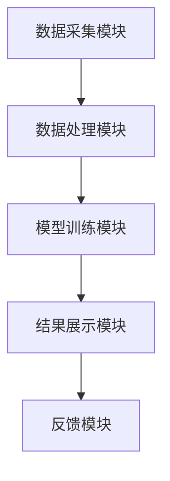
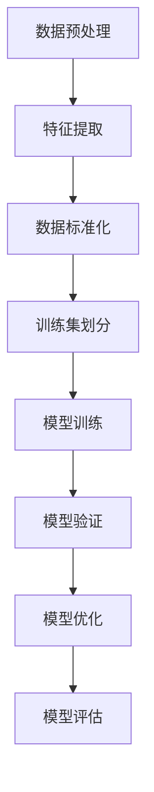
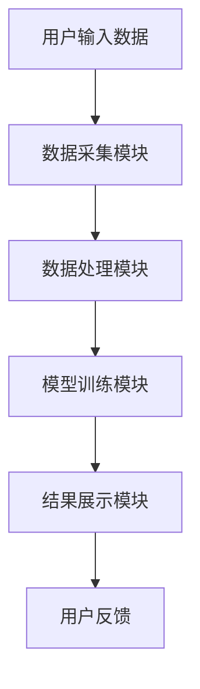

                 


# AI辅助的公司治理评估系统

> **关键词**: AI辅助，公司治理，评估系统，算法原理，系统架构，项目实战

> **摘要**: 本文详细探讨了AI辅助的公司治理评估系统的构建与实现。首先介绍了公司治理评估的基本概念与挑战，然后分析了AI技术在公司治理评估中的应用背景与优势。接着，从核心概念、算法原理、系统架构、项目实战四个方面详细阐述了AI辅助公司治理评估系统的实现过程。最后，通过实际案例分析，展示了系统的实际应用效果，并总结了未来的研究方向与优化建议。

---

## 第1章: 公司治理评估的背景与挑战

### 1.1 公司治理的基本概念

#### 1.1.1 公司治理的定义与核心要素

公司治理是指对公司决策、管理、监督和控制的制度安排。其核心要素包括：

1. **股权结构**: 股东的股权分配与权力划分。
2. **董事会结构**: 董事会的组成、职责与运作机制。
3. **高管团队**: 高管的职责、权限与激励机制。
4. **内部控制**: 公司的财务、运营和风险管理机制。
5. **透明度**: 公司信息披露的及时性、准确性和完整性。

#### 1.1.2 公司治理的重要性与作用

公司治理是企业长期稳定发展的基石。有效的公司治理能够：

- 提高公司决策的科学性和合理性。
- 优化资源配置，提升公司运营效率。
- 降低公司经营风险，增强抗风险能力。
- 提升公司透明度，增强投资者信心。

#### 1.1.3 公司治理评估的必要性

公司治理评估是衡量公司治理水平的重要手段。通过评估，可以发现公司治理中的不足，提出改进建议，为公司优化治理结构提供数据支持。

---

### 1.2 AI在公司治理中的应用背景

#### 1.2.1 AI技术的发展与公司治理的结合

随着AI技术的快速发展，其在公司治理中的应用逐渐增多。AI技术可以帮助公司治理评估实现自动化、智能化和高效化。

#### 1.2.2 当前公司治理评估的主要挑战

1. **数据量大**: 公司治理涉及多个维度的数据，数据量大且复杂。
2. **数据多样性**: 数据来源多样，包括文本、财务数据、市场数据等。
3. **模型复杂性**: 公司治理评估需要综合考虑多个因素，模型复杂性高。
4. **实时性要求**: 公司治理评估需要实时或定期进行，对系统效率要求高。

#### 1.2.3 AI辅助公司治理评估的优势与潜力

1. **自动化处理**: AI可以自动化处理大量复杂数据，提高评估效率。
2. **智能分析**: AI能够通过深度学习等技术，发现数据中的潜在规律和模式。
3. **实时反馈**: AI系统可以实时监控公司治理状况，提供及时反馈。

---

## 第2章: AI辅助公司治理评估的核心概念

### 2.1 公司治理评估的指标体系

#### 2.1.1 公司治理的主要评估维度

1. **董事会治理**: 董事会的独立性、专业性和运作效率。
2. **高管团队治理**: 高管的职责、权限与激励机制。
3. **股权结构治理**: 股东的权力分配与公司控制权。
4. **内部控制治理**: 公司的财务、运营和风险管理机制。
5. **透明度与披露**: 公司信息披露的及时性、准确性和完整性。

#### 2.1.2 各评估维度的具体指标

1. **董事会治理指标**:
   - 董事会独立性：董事会中独立董事的比例。
   - 董事会专业性：董事的专业背景与公司业务的匹配度。
   - 董事会运作效率：董事会会议的召开频率和决策效率。

2. **高管团队治理指标**:
   - 高管团队稳定性：高管团队的人员变动频率。
   - 高管团队激励机制：高管的薪酬结构与公司绩效的关联度。
   - 高管团队决策能力：高管在关键决策中的表现。

3. **股权结构治理指标**:
   - 股东结构：控股股东与小股东的持股比例。
   - 股权分散度：公司股权的分散程度。
   - 股权流动性：股东股权转让的难易程度。

4. **内部控制治理指标**:
   - 内部控制制度：公司内部审计、风险管理等制度的完善程度。
   - 内部控制执行情况：内部控制制度的实际执行效果。
   - 内部控制有效性：内部控制在风险防范和管理优化中的作用。

5. **透明度与披露指标**:
   - 信息披露及时性：公司定期报告的发布是否及时。
   - 信息披露准确性：公司信息披露的内容是否准确。
   - 信息披露完整性：公司信息披露的范围是否全面。

#### 2.1.3 指标权重的确定方法

指标权重的确定通常采用层次分析法（AHP）或熵值法。通过专家评分和数据分析，确定各评估指标的权重。

---

### 2.2 AI辅助评估的实现原理

#### 2.2.1 数据采集与处理

AI辅助公司治理评估系统需要采集公司治理相关的数据，包括：

1. **文本数据**: 公司公告、财务报告、新闻报道等。
2. **结构化数据**: 财务数据、股权结构数据等。
3. **非结构化数据**: 社会媒体上的评论、市场分析报告等。

数据采集后，需要进行清洗、转换和特征提取，为后续模型训练提供高质量数据。

#### 2.2.2 模型训练与优化

基于采集的数据，采用机器学习算法（如随机森林、支持向量机等）进行模型训练，并通过交叉验证优化模型参数，提高模型的准确性和稳定性。

#### 2.2.3 结果输出与反馈

模型训练完成后，系统可以对输入的公司治理数据进行评估，输出评估结果，并根据结果提供改进建议。

---

### 2.3 系统架构与功能模块

#### 2.3.1 系统整体架构设计



#### 2.3.2 数据采集模块的功能与实现

数据采集模块负责从多种数据源（如公司公告、财务数据、新闻报道等）获取数据，并进行初步清洗和转换。

#### 2.3.3 模型训练模块的功能与实现

模型训练模块负责对清洗后的数据进行特征提取、模型选择和训练，并通过交叉验证优化模型参数。

#### 2.3.4 结果展示模块的功能与实现

结果展示模块将模型输出的评估结果以可视化的方式呈现，并根据结果提供改进建议。

---

## 第3章: AI辅助公司治理评估的算法原理

### 3.1 算法选择与优化

#### 3.1.1 常见的公司治理评估算法

1. **线性回归模型**: 用于预测公司治理的量化指标。
2. **支持向量机（SVM）**: 用于分类公司治理的优劣等级。
3. **随机森林**: 用于处理高维数据和非线性关系。
4. **神经网络**: 用于复杂模式的识别和预测。

#### 3.1.2 基于机器学习的算法选择

根据数据特征和评估目标选择合适的算法。例如，对于分类问题，可以选择SVM或随机森林；对于回归问题，可以选择线性回归或神经网络。

#### 3.1.3 算法的优化与调参

通过网格搜索（Grid Search）等方法，找到最优的模型参数，提高模型的准确性和稳定性。

---

### 3.2 算法实现流程

#### 3.2.1 数据预处理与特征提取

1. **数据清洗**: 处理缺失值、异常值和重复数据。
2. **特征提取**: 从文本数据中提取关键词、主题等特征。
3. **数据标准化**: 对数值型数据进行标准化处理。

#### 3.2.2 模型训练与验证

1. **训练集与测试集划分**: 将数据划分为训练集和测试集。
2. **模型训练**: 在训练集上训练模型。
3. **模型验证**: 在测试集上验证模型的准确性和稳定性。

#### 3.2.3 模型评估与优化

1. **评估指标**: 使用准确率、召回率、F1值等指标评估模型性能。
2. **模型优化**: 通过调参和特征工程优化模型性能。

---

### 3.3 算法流程图



---

### 3.4 算法实现的数学模型

#### 3.4.1 线性回归模型

$$ y = \beta_0 + \beta_1x_1 + \beta_2x_2 + \ldots + \beta_nx_n + \epsilon $$

其中，$y$ 是目标变量，$x_i$ 是自变量，$\beta_i$ 是回归系数，$\epsilon$ 是误差项。

#### 3.4.2 支持向量机模型

$$ \text{ SVM的目标是最小化 } \frac{1}{2}\|w\|^2 + C \sum_{i=1}^{n} \xi_i $$
$$ \text{ subject to } y_i(w \cdot x_i + b) \geq 1 - \xi_i, \xi_i \geq 0 $$

其中，$w$ 是权重向量，$b$ 是偏置项，$\xi_i$ 是松弛变量。

#### 3.4.3 随机森林模型

随机森林通过集成学习（Bagging）和特征随机化（Feature Randomness）构建多个决策树，并通过投票或平均的方式进行预测。

---

## 第4章: 系统架构与设计

### 4.1 系统架构设计

#### 4.1.1 系统整体架构图


---

### 4.2 系统功能设计

#### 4.2.1 数据采集模块的功能设计

数据采集模块负责从多种数据源（如公司公告、财务数据、新闻报道等）获取数据，并进行初步清洗和转换。

#### 4.2.2 模型训练模块的功能设计

模型训练模块负责对清洗后的数据进行特征提取、模型选择和训练，并通过交叉验证优化模型参数。

#### 4.2.3 结果展示模块的功能设计

结果展示模块将模型输出的评估结果以可视化的方式呈现，并根据结果提供改进建议。

---

### 4.3 系统接口设计

#### 4.3.1 数据接口的设计与实现

数据接口负责与外部数据源（如数据库、API等）进行数据交互。

#### 4.3.2 模型接口的设计与实现

模型接口负责与模型训练模块进行数据交互，传递特征数据和模型参数。

#### 4.3.3 用户接口的设计与实现

用户接口负责与用户进行交互，展示评估结果和提供用户操作界面。

---

### 4.4 系统交互流程图



---

## 第5章: 项目实战

### 5.1 环境安装

需要安装以下工具和库：

1. **Python**: 3.8+
2. **机器学习库**: scikit-learn, xgboost, etc.
3. **数据处理库**: pandas, numpy, etc.
4. **可视化库**: matplotlib, seaborn, etc.
5. **Mermaid图表库**: 安装Mermaid CLI或使用在线工具。

### 5.2 系统核心实现源代码

以下是一个简单的公司治理评估系统的Python实现示例：

```python
import pandas as pd
from sklearn.model_selection import train_test_split
from sklearn.ensemble import RandomForestClassifier
from sklearn.metrics import accuracy_score, classification_report

# 数据加载
data = pd.read_csv('corporate_governance.csv')

# 数据清洗
data = data.dropna()
data = data.drop_duplicates()

# 特征提取
X = data.drop(columns=['governance_score'])
y = data['governance_score']

# 数据划分
X_train, X_test, y_train, y_test = train_test_split(X, y, test_size=0.2, random_state=42)

# 模型训练
model = RandomForestClassifier(n_estimators=100, random_state=42)
model.fit(X_train, y_train)

# 模型预测
y_pred = model.predict(X_test)

# 模型评估
print("Accuracy:", accuracy_score(y_test, y_pred))
print("Classification Report:", classification_report(y_test, y_pred))
```

---

### 5.3 代码应用解读与分析

1. **数据加载**: 从CSV文件中读取公司治理数据。
2. **数据清洗**: 处理缺失值和重复数据。
3. **特征提取**: 提取公司治理相关的特征变量。
4. **数据划分**: 将数据划分为训练集和测试集。
5. **模型训练**: 使用随机森林模型进行训练。
6. **模型预测**: 对测试数据进行预测。
7. **模型评估**: 评估模型的准确性和性能。

---

### 5.4 案例分析与详细讲解

假设我们有一个包含以下数据的公司治理数据集：

| 公司名称 | 股权结构 | 董事会独立性 | 高管团队稳定性 | 治理评分 |
|----------|----------|--------------|---------------|----------|
| 公司A    | 0.6      | 0.7          | 0.8           | 0.75     |
| 公司B    | 0.4      | 0.6          | 0.6           | 0.6      |
| 公司C    | 0.5      | 0.8          | 0.7           | 0.75     |

通过上述代码，我们可以训练模型并预测新的公司治理评分。

---

## 第6章: 总结与展望

### 6.1 本章总结

AI辅助的公司治理评估系统通过自动化数据采集、智能分析和实时反馈，为公司治理评估提供了高效、准确的解决方案。本文详细介绍了系统的背景、核心概念、算法原理、系统架构和项目实战。

### 6.2 未来展望

未来，随着AI技术的不断发展，公司治理评估系统将更加智能化和个性化。以下是未来可能的研究方向：

1. **多模态数据融合**: 结合文本、图像等多种数据源进行评估。
2. **强化学习应用**: 使用强化学习优化公司治理策略。
3. **实时监控与预警**: 实现对公司治理风险的实时监控和预警。

---

## 作者

作者：AI天才研究院 & 禅与计算机程序设计艺术

---

通过以上内容，我们可以看到，AI辅助的公司治理评估系统在理论和实践上都有广阔的应用前景。希望本文能够为相关领域的研究者和实践者提供有价值的参考和启发。

